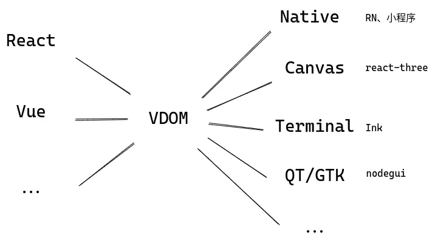
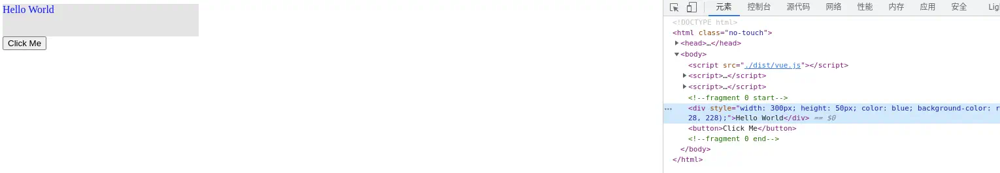
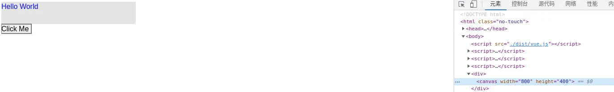

# 解构前端框架之Virtual DOM

软件领域貌似有一个段子：各种软件造来造去，最后发现其实都是在造编译器或者操作系统。软件领域还有一个段子，“All problems in computer science can be solved by another level of indirection”。这两个段子对前端框架也适用：把JSX、Vue或其他什么框架的模板语法看成是输入，HTML看成是输出，那么各种前端框架不就是一个编译器吗？而VDOM，显而易见的，和AST/IR等处在同一个位置，是“another level of indirection”，一种中间表示。中间表示最核心的优点是什么？提供一个抽象层，可以在其基础上做分析优化，可以实现为不同目标平台上的机器码。那么VDOM也类似，通过对VDOM树的分析操作可以避免每次重新构造整个组件树，通过不同的后端（这里指编译器后端）实现，可以输出到不同的渲染平台，如下图：



假如随着科技发展AR/VR或者其他什么渲染技术已经大行其道，成为前端展示层的主流，难道我们就会抛弃现有的前端框架了吗？很可能不会，React/Vue说到底只是一套设计和管理前端应用的方法，也许那时只要在现有的VDOM基础上缝缝补补就可以输出为AR/VR的渲染指令。受此启发，像VDOM这种中间表示，现有的前端框架基本都是某种求值器，求值过程为创建对应的HTML元素，但AST还可以编译为IR进一步编译为在CPU上执行的二进制指令，类比一下完全可以将VDOM编译为GPU渲染指令，并且将各种编译优化手段应用到这个过程中去。

基于这样的想法，我们可以站在编译器的角度去解构前端框架。当然，这里更关注上图右侧从VDOM树到最终展现在屏幕上的过程，对应编译器后端和运行时实现，而左侧从JSX或者模板语法经过词法分析语法分析翻译为构造VDOM树语句的编译器前端不是本文的重点，感兴趣的同学可以自行了解。

## 模式匹配与递归下降

首先要介绍一种常用于处理VDOM或者AST的编程思想：模式匹配和递归下降。

模式匹配的概念大家应该都很熟悉了，编程语言中的`switch/case`便是一种形式的“匹配-分派”过程。如果你仔细观察，会发现这个过程通常有两个特点：“<Notation type="box">从特殊到一般</Notation>”、“<Notation type="box">嵌套使用以简化代码逻辑</Notation>”。

### 从特殊到一般

“从特殊到一般”应该很好理解，因为一般的模式会覆盖特殊模式，如果特殊模式有自己独立的逻辑，当然要先处理它，再将一般模式作为兜底。举个例子，部分编程语言支持函数重载，假如我们定义了这样两个函数：

```cpp
class Base {};
class Derived extends Base {};

void foo(bar: Derived) {};
void foo(bar: Base) {};
```

当我们用派生类`Derived`的实例作为参数调用`foo`的时候，一个合格的语言是不是应该判断出`Derived`更“特殊”，优先使用它的重载版本？尽管语言底层实现不会直接这样写，但这里就隐藏着典型的“从特殊到一般”的思想：

```cpp
switch (instance) {
  case Derived:
    foo_Derived_override(instance);
    break;
  case Base:
    foo_Base_override(instance);
    break;
}
```

“从特殊到一般”还意味着通过消耗掉特殊的部分，将任务一步步划分并解决，而不是原地空转。也即“递归下降”中的“下降”。体现在编译领域，有点类似文法中终结符和非终结符的区别，不妨想想我们如何消除左递归：

```
A -> Aa | b
```

如果直接按递归下降的思路设计，显然程序会空转：

```js
function A() {
  if (A() && match a) return true;

  return match b;
}
```

文法匹配的是`baaaaa...` 这样的输入串，我们改写成终结符起头的等价文法：

```
A -> bA'
A' -> aA' | ε
```

再设计程序：

```js
function A() {
  if (match b) {
    return A_prime();
  }

  return false;
}

function A_prime() {
  if (match a) {
    return A_prime();
  }

  return true;
}
```

每次`A`或者`A_prime`执行，都会因为`match b`或者`match a`而“吃掉”输入中的一个字符，这使我们接下来要处理的问题变得更小，直至解决问题。

### 嵌套使用以简化逻辑

“嵌套使用以简化逻辑”出现在我们需要处理递归数据结构的时候。应该说，大多数时候我们遇到的都是这种数据结构：编程语言中函数体通常可以嵌套`if/else`这类控制块，控制块里面也可以再定义函数；VDOM上，`div`的子级依然可以是一个`div`，难道我们会针对每一层级独立写一个处理函数吗？不，我们只会这样做：

```js
function handleVNode(vnode) {
  switch (vnode.type) {
    case 'div':
      handleDiv(vnode);
    case 'span':
      handleSpan(vnode);
    case 'button':
      // ...
  }
}

function handleDiv(vnode) {
  // consume this vnode

  // 递归下降
  vnode.children.forEach(handleVNode);
}
```

此时，`vnode.type`就成了某种意义上的“终结符”，代表了一种特殊的模式，每次消耗掉一个VNode，问题不断缩小。再通过彼此之间嵌套递归调用，我们在VDOM树上一点点“下钻”并最终走到叶子节点，整棵树处理完毕。

现在，带着对模式匹配和递归下降的理解，我们来设计一套自己的VDOM和编译器后端。作为示例，我们的VDOM只有几个结点类型：

1.  `fragment`，类似React中的`<></>`，用于组织元素；
2.  `div`，作用和HTML的块级元素类似；
3.  `text`，代表纯文本；
4.  `button`，用于演示用户操作。支持的HTML属性也非常有限，只有少数`style`属性和`onclick`事件。

## 求值器

以`button`为例说明它们的接口定义和“求值”过程，完整代码见[这里](https://github.com/EverSeenTOTOTO/mini-framework/blob/main/src/vdom/target-web.ts)：

```ts
export type VNodeButton = {
  tag: 'button',        // HTML Tag
  attr?: {              // 结点属性
    style?: AttrStyle,
    onClick?: AttrEvent
  },
  children: VNode[],    // 子结点
};
```

“求值”其实就是根据VNode信息创建对应的DOM结点：

```ts
function evalButton(node: ts.VNodeButton): HTMLButtonElement {
  const btn = document.createElement('button');

  if (node.attr?.style) {
    bindStyle(btn, node.attr.style);
  }

  if (node.attr?.onClick) {
    btn.addEventListener('click', node.attr.onClick);
  }

  btn.append(...evalSeq(node.children)); // 递归下降

  return btn;
}

function evalSeq(nodes: VNode[]) {
  // 我们的实现中，如果遇到 Fragment，返回的是数组，所以需要打平
  return flatten(nodes.map(evalVNode));
}

export function evalVNode(node: VNode) {
  switch (node.tag) {
    case 'button':
      return evalButton(node);
    // ...
  }
}
```

为了方便构造VDOM树，可以编写一个工厂函数`createElement`，作用可类比React的`createElement`和Vue渲染函数中的`h`：

```ts
const createElement = <Tag extends VNodeTags>(tag: Tag) =>
  (children: (VNode | string)[], attr?: GetVNodeAttrType<Tag>) => ({
    tag,
    attr,
    children: children.map(mapVNode),
  } as GetVNodeType<Tag>);

export const fragment = createElement('fragment');
export const div = createElement('div');
export const button = createElement('button');
```

把其他几个VNode节点的求值方法也实现后，我们的框架后端（指编译器后端，在这里是VDOM求值器）就初步可用了。下面是一个简单的用例，`window.Demo`是为了方便，用UMD格式构建之后挂到`window`上的导出产物：

```html
<script>
  const {fragment, div, button, evalVNode} = window.Demo;

  const vdom = fragment([
    div(
      ['Hello World'],
      {
        style: {
          width: 300,
          height: 50,
          color: 'blue',
          bgColor: '#e4e4e4'
        },
      },
    ),
    button(
      ['Click Me'],
      {
        onClick: () => console.log('hello world'),
      },
    ),
  ]);

  document.body.append(...evalVNode(vdom));
</script>
```

渲染效果如下：



## 编译器

如前文所述，既然求值可行，那我们把同一套VDOM翻译成渲染指令（类比汇编代码）保存下来应该也是可行的。为此我们先设计几个简单的虚拟渲染指令：

1.  `moveTo x, y`: 移动指针到坐标`(x, y)`处；
2.  `fillStyle style`: 改变填充色；
3.  `strokeStyle style`: 改变描边色；
4.  `fontStyle family, size`: 改变字体样式；
5.  `fillRect x, y, w, h`: 填充矩形，左上角位置`(x, y)`，宽高为`(w, h)`；
6.  `strokeRect x, y, w, h`: 描边矩形，左上角位置`(x, y)`，宽高为`(w, h)`；
7.  `fillText text, x, y, maxw`: 在`(x, y)`处绘制文本，最大宽度`maxw`；
8.  `reset`: 重置笔刷状态为默认值，重置指针到`(0, 0)`；
9.  `save`: 保存笔刷状态（将颜色、字体大小等入栈）；
10. `restore`: 恢复笔刷状态（设置笔刷为栈顶状态，退栈）。

指令接口示例：

```ts
export type InstFillText = {
  name: 'fillText';
  text: string,
  x: number,
  y: number,
  maxw?: number
};
```

再次以`button`为例，对`button`的求值就是在屏幕上绘制一个矩形区域的过程，只不过我们并不立即绘制，而是生成一套绘制动作（指令），以后交给绘图引擎解读。完整代码在[这里](https://github.com/EverSeenTOTOTO/mini-framework/blob/main/src/vdom/target-canvas.ts)：

```ts
export function emitButton(node: ts.VNodeButton, ctx: Context): RenderInst[] {
  const insts: RenderInst[] = [];
  const style = {
    // default button style
    width: 67,
    height: 21,
    color: '#000',
    bgColor: 'buttonface',
    ...node.attr?.style,
  };

  // 暂存笔刷状态
  insts.push({ name: 'save' });

  // 开始绘制按钮
  insts.push(
    {
      name: 'fillStyle',
      style: style.bgColor,
    },
    { // 绘制按钮背景
      name: 'fillRect',
      x: ctx.x,
      y: ctx.y,
      w: style.width,
      h: style.height,
    },
    {
      name: 'strokeStyle',
      style: '#000', // TODO: borderColor
    },
    { // 绘制按钮边框
      name: 'strokeRect',
      x: ctx.x,
      y: ctx.y,
      w: style.width,
      h: style.height,
    },
  );

  if (style.color) {
    insts.push({
      name: 'fillStyle',
      style: style.color,
    });
  }

  // 递归下降绘制 children
  insts.push(...emitSeq(node.children, ctx));
  // 还原笔刷状态
  insts.push({ name: 'restore' });

  return insts;
}

function emitSeq(nodes: VNode[], ctx: Context) {
  return flatten(nodes.map((n) => emitVNode(n, ctx)));
}

function emitVNode(node: VNode, ctx: Context) {
  switch (node.tag) {
    case 'button':
      return emitButton(node, ctx);
    // ...
  }
}
```

还是前面用例中的`vdom`，编译后得到如下渲染指令：

```js
[
  { name: 'reset' },
  { name: 'moveTo', x: 0, y: 0 },
  { name: 'fontStyle', size: 16, family: 'sans-serif' },
  { name: 'comment', message: 'fragment 0 start' },
  { name: 'save' },
  { name: 'fillStyle', style: '#e4e4e4' },
  { name: 'fillRect', x: 0, y: 0, w: 300, h: 50 },
  { name: 'fillStyle', style: 'blue' },
  { name: 'fillText', text: 'Hello World', x: 0, y: 16 },
  { name: 'restore' },
  { name: 'moveTo', x: 0, y: 50 },
  { name: 'save' },
  { name: 'fillStyle', style: 'buttonface' },
  { name: 'fillRect', x: 0, y: 50, w: 67, h: 21 },
  { name: 'strokeStyle', style: '#000' },
  { name: 'strokeRect', x: 0, y: 50, w: 67, h: 21 },
  { name: 'fillStyle', style: '#000' },
  { name: 'fillText', text: 'Click Me', x: 0, y: 66 },
  { name: 'restore' },
  { name: 'moveTo', x: 67, y: 50 },
  { name: 'comment', message: 'fragment 0 end' },
],
```

指令实现用的Canvas API，<Notation type="del">其实设计也抄的Canvas API</Notation>。解读指令的过程不用说相信大家也能猜到，无非是又一个“匹配-分派”过程，根据指令的`name`，分派给不同的Canvas API。可以翻看[代码](https://github.com/EverSeenTOTOTO/mini-framework/blob/main/src/vdom/target-canvas.ts)中的`execInst`函数。

复用前面用例中的`vdom`，绘制的效果如下：

```html
<script>
  const {emitInsts, execInst} = window.Demo;
  const canvas = document.createElement('canvas');

  canvas.width = 800;
  canvas.height = 400;

  container.append(canvas);

  const ctx = canvas.getContext('2d');
  const insts = emitInsts(vdom);

  // 逐个解读指令
  insts.forEach(inst => execInst(inst, ctx));
</script>
```



假如`vdom`保持不变的话，下次可以直接执行编译出来的渲染指令`insts`，省去了整个编译过程，这也是AOT的优势所在。更进一步还可以联想到JIT，一部分VDOM实时编译为“Hot”指令，一部分编译为“Cold”指令并缓存，各种编程语言和编译原理的轮子都站在我们面前，能发挥到什么程度全看想象力。
