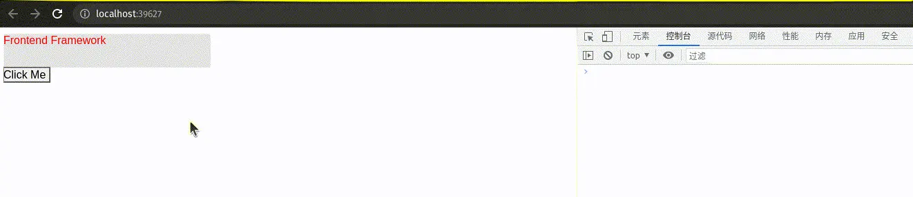

# 解构前端框架之Diff Patch

Diff Patch的概念相当普遍，当我们需要同步某类数据结构S为T时，一种做法是直接将S整个换成T，比如双缓冲模式，可能交换下两个缓冲区指针就行了。但很多时候这么简单粗暴的替换会导致所有在S上已经做的工作丢失了，产生重复劳动。比方说`npm install`生成`node_modules`的过程，如果无视本地已有的`node_modules`结构S，仅根据最新的依赖树结构T重新安装一遍，无疑会有很多不必要的下载、复制动作。对于Web框架，此处的“数据结构”即VDOM树，如果每次一点小更新都需要对整个VDOM树重新求值、创建DOM结点并替换原有的DOM结点，尽管表现出来的样式差异可能不大，却破坏了浏览器渲染引擎底层已经创建好的真实DOM树，渲染引擎需要重新计算布局、样式等信息，造成大范围的reflow，所有相关的JS代码也需要重新执行一遍，比如重新绑定事件回调，这个代价几乎是不可接受的。

怎么办呢？既然整个替换不行，那就比对S和T的差异（<Notation type="circle">Diff</Notation>），仅对差异的地方做調整（<Notation type="circle">Patch</Notation>），把影响最小化呗。某种意义上这也是一种编译器，输入是数据结构S和T，输出是一系列动作（指令），指示我们该如何一步步操作S，将S变为T。举例来说，假如S和T是两个数组：

```ts
S = [1,2,3,4];
T = [1,3,3,2,4];
```

从S得到T有很多种方式，我们设计一套单步只更改一个位置的指令，那么对S和T做Diff Patch就是一个典型的“最小编辑距离”问题，比对之后得到的指令序列可能如下：

```ts
[
  { type: 'change', index: 1, value: 3 },
  { type: 'change', index: 3, value: 2 },
  { type: 'append', value: 4 }
]
```

回到Web框架，从前面的求值器实现中我们知道一个VDOM结点可以和它所创建的真实DOM结点关联起来，那就可以用一些Diff算法来比对新旧两棵VDOM树，对于有变化的VDOM结点，生成一系列变更动作（指令），然后找到关联的真实DOM结点将变更动作应用到上面去就是了。这个比对并生成动作的过程即所谓的<Notation type="circle">diff</Notation>过程，应用变更的过程即所谓的<Notation type="circle">commit</Notation>过程。还是举例说明：

```ts
const S = div(
  [
    span(['Hello']),
    span(['World'])
  ],
  {
    style: {
      color: 'blue',
    },
  }
);

const T = div(
  [
    span(['Diff Patch'])
  ],
  {
    style: {
      color: 'red',
    },
  }
);
```

使用某种Diff Patch算法之后得到的指令序列可能像下面这样，这里用嵌套的`[]`来代表树操作的递归下降特性：

```ts
[
  [{ type: 'changeHTML', value: 'Diff Patch' }], // 第一个span
  [{ type: 'delete' }], // 第二个span
  { type: 'changeStyle', attr: 'color', value: 'red' } // div自身
]
```

React、Vue或者Preact的源码为什么难以读懂，很大程度上就是因为这些动作并没有显式、工整地出现在代码中，而是以各种标志位、属性值的方式存在。毫不客气地说，是缺少了对变更动作的抽象、用相当结构化的代码实现的。我们这个实验中的VDOM很简单，可以吸取它们的教训优化设计。

首先重写下`VNode`类型，添加一个字段`output`，用于关联该结点编译后的目标产物，例如求值创建的一个真实DOM结点，或者编译出的一组渲染指令：

```ts
interface VNodeBase<T, Tag extends string> { // [!code ++]
  tag: Tag, // [!code ++]
  output?: T // [!code ++]
} // [!code ++]

export type VNodeButton = { /* ... */ }; // [!code --]
export interface VNodeButton<T> extends VNodeBase<T, 'button'> { // [!code ++]
  attr?: {
    style?: AttrStyle,
    onClick?: AttrEvent
  },
  children: VNode<T>[],
}

export function evalButton(node: VNodeButton) {
  const btn = document.createElement('button');

  if (node.attr?.style) {
    bindStyle(btn, node.attr.style);
  }

  if (node.attr?.onClick) {
    btn.addEventListener('click', node.attr.onClick);
  }

  btn.append(...evalSeq(node.children));

  node.output = [btn]; // [!code ++]

  return btn;
}
```

对产物的变更动作我们简单抽象为“增、删、改”三种，“增（insert）”在指定位置插入结点，“删（delete）”删除当前结点，“改（change）”修改属性，包括文本内容、样式、事件句柄等。

下面以修改样式为例说明Patch动作的定义和具体实现，完整代码见[这里](https://github.com/EverSeenTOTOTO/mini-framework/blob/main/src/vdom/diff-patch-web.ts)：


```ts
export type ActionChangeDetail = 'text' | 'style' | 'event';

export type ActionChange<Detail extends ActionChangeDetail, T> = {
  type: 'change',
  detail: Detail,
  value: GetActionChangeValue<Detail>,
  target: T,
};

function doChangeStyle(action: ActionChangeStyle) {
  if (!(action.target instanceof HTMLElement)) throw new Error('Target is not an HTMLElement');

  for (const prop of Object.keys(action.value)) {
    const style = action.value[prop];

    if (style) {
      action.target.style.setProperty(prop, style);
    } else {
      action.target.style.removeProperty(prop);
    }
  }
}
```

接着设计一套很Naive的Diff Patch算法：

1.  假设旧VDOM结点为S，关联的真实DOM结点为R，新VDOM结点为T，比对它们的`tag`名称；
2.  如果S和T的`tag`不同：
    1.  删除R；
    2.  编译T，将得到的DOM结点插入到R原先所在位置；
3.  如果S和T的`tag`相同：
    1.  若S和T的`tag`名称为`text`，比对两者的文本内容，若有变化，修改R的文本内容为T的，跳转至步骤4；
    2.  比对S和T的`children`，即找出哪些结点需要新增，哪些结点需要删除，哪些结点`tag`没变只是索引变化：
        1.  对每个没变的子结点，假设在S和T中分别以N1和N2存在，对N1和N2重复调用此算法；
        2.  对每个待删除的子结点，从R中删除相关联的DOM结点；
        3.  对每个待新增的子结点，编译并将得到的DOM结点插入到R中；
    3.  比对S和T的`attr`，若有变化，修改R的属性为T的；
    4.  将R和T关联；
4.  以后将T作为新的S使用。

值得一提的是，具体实现中用`actions`保存了所有生成的动作，没有立即执行：

```ts
export function diffPatch(source: VNode, target: VNode) {
  if (source.tag !== target.tag) {
    return diffPatchReplace(source, target);
  }

  const actions: PatchAction[] = [];

  if (source.tag === 'text') {
    actions.push(...diffPatchText(source, target));
  } else {
    actions.push(...diffPatchChildren(source, target as VNodeWithChildren));

    if (source.tag !== 'fragment') {
      actions.push(...diffPatchAttributes(source, target as VNodeWithAttr));
    }
  }

  // actions operate on source.output, by setting target.output === source.output we reuse the DOM node
  target.output = source.output;

  return actions;
}
```

`diffPatchAttributes`大多数时候是比较两个对象的键值对；`diffPatchChildren`可以当作一个动态规划问题，我们限制一次只能做一件事，让算法输出三种编辑动作：

1.  `keep`：结点同时存在于S和T中，保留但需递归下降比对子结点和属性；
2.  `insert`：T中有新增的结点；
3.  `delete`：S中有待删除的结点。

这样所有动作的代价为1，通过比较序列的长度获取代价最小的编辑序列。算法的实现不是我们的重点，这里不再贴出。`最小编辑序列`执行后，输出一个待办列表`editions`，其中，`insert`和`delete`最终转为一个同名Patch动作：


```ts
export function diffPatchChildren(source: VNodeWrap, target: VNodeWrap) {
  const editions = minimalEditSequence(source.children, target.children, compareVNode);
  const actions: PatchAction[] = [];

  editions.forEach((e) => {
    switch (e.action) {
      case 'keep':
        actions.push(...diffPatch(e.source!, e.target!));
        break;
      case 'insert':
        evalVNode(e.target!); // 新结点需要编译
        actions.push({
          type: 'insert',
          index: e.index,
          target: source.tag === 'fragment' ? source.output![0].parentElement! : source.output![0],
          value: e.target!.output!,
        });
        break;
      case 'delete':
        actions.push({
          type: 'delete',
          target: e.source!.output!,
        });
        break;
      default:
        break;
    }
  });

  return actions;
}
```

现在可以实现我们自己的`render`函数了，用`old`保存旧的VDOM树，如果是`undefined`，说明是首次渲染，需要将渲染结果挂载到`container`上；如果已有`old`，则根据最新的`vdom`进行Diff Patch，逐个执行生成的动作。最后总是将`old`设置为最新的`vdom`：

```ts
let old: web.VNode | undefined;

export function render(vdom: web.VNode, container: HTMLElement) {
  if (old) {
    const actions = dp.diffPatch(old, vdom);

    actions.forEach((action) => dp.doAction(action));
  } else {
    web.evalVNode(vdom);
    container.append(...vdom.output!);
  }

  old = vdom;
}
```

修改一下前面的用例，用一个函数`component`包装生成VDOM树的过程，通过提供不同的外部状态`state`，我们可以复用这段逻辑，生成结构相近的VDOM树。<Notation>组件的概念就这样悄无声息地出现了</Notation>：

```html
<script>
  const {fragment, div, button} = window.Demo;

  const component = (state) => fragment([
    div(
      [state.text],
      {
        style: {
          width: 300,
          height: 50,
          color: state.color,
          bgColor: '#e4e4e4'
        },
      },
    ),
    button(
      ['Click Me'],
      {
        onClick: state.onClick,
      },
    ),
  ]);
</script>
<script>
  const {render} = window.Demo;

  let state = {
    text: "Hello World",
    color: 'blue',
  }

  render(component(state), document.body);

  state = {
    text: "Frontend Framework",
    color: 'red',
    onClick: () => console.log("clicked")
  }

  setTimeout(() => render(component(state), document.body), 4000);
</script>
```

渲染效果如下，可以观察到4s后仅`div`发生了变更，`button`结点不受影响，但成功绑定了`onClick`句柄：


顺便看看将VDOM编译为渲染指令的例子，道理不变，只是VDOM结点的产物变成了一组渲染指令，因此Diff Patch生成的动作要操作这些指令序列。简单起见，无论是增删还是改，我们都针对新的VDOM重新生成一组指令序列并替换掉原有的那组。每次渲染时，清空Canvas并将所有渲染指令从头到尾重新执行一遍。更复杂的做法是将图像分层，每次只重绘有变更的层，然后用合成器合成出最终的图像，这也是各种渲染引擎底层会做的事，对我们这个小实验来说就太复杂了。换个角度想，我们的所做所为也可以看成是重复造“浏览器渲染引擎”的轮子。



