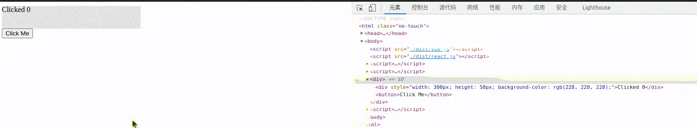

# 解构前端框架之组件

什么是组件，上一篇的最后，那个`component`函数已经提示了组件的概念。组件就是为了逻辑复用，逻辑复用最基础的方式就是抽象成函数，所以组件本质就是一个生成VDOM的函数。那为什么又有所谓的class组件和functional组件之分呢？这还得从FP和OOP思想的差异说起，我假设读者已经对FP的常见概念，如“纯函数”、“副作用”有所了解。

函数有其内部状态，每次执行时函数体内定义的变量分配在其栈上，每次执行完成都会随着函数栈帧的销毁回收。所以理论上只要参数不变函数的每次执行都应该得到相同的效果，但现实中对非纯函数式的语言，由于闭包捕获、获取时间戳、写入标准输出流等外部状态的变化，即使参数没变，函数在不同的时机执行也可能得到不同的效果。有时这会造成难以察觉的BUG，因此我们应该尽可能编写“纯”的、前后行为一致的函数。这样的函数对其使用者来说，只代表一段固定的逻辑，是个黑盒。那逻辑要操作的数据放在哪里呢？一种方法是用函数表达数据结构，这是可行的。而更符合人们直觉的是用`struct`之类的东西表达一个数据结构，因此理想的状态是：用对象表达一组数据，前端常称之为状态`state`，用一组纯函数表达操作这个对象的逻辑，比如`render`，只要提供的参数相同，函数的行为（输出的VDOM）始终相同：

```ts
const state = {
  width: 300,
  color: 'blue',
};

const render = (state) => { /* ... */ };
```

class组件只不过做得内聚一点，将一个状态和它相关的一组逻辑放在了一起，这更加符合人们对事物的直觉了，也是OOP理念获得成功的关键。但另一方面，假如class的内部状态不加以管理，外界可以绕过class提供的逻辑（类方法），直接操作其内部状态，这很可能破坏类设计者书写逻辑时的假设，也是React不断强调要用`setState`改变状态的浅层原因：

```ts
const o = {
  state: {
    width: 300
  },
  render() {
    const newWidth = this.width + 100;

    // ...
  }
};

o.state.width = "No, please no!";

o.render(); // !!! Oooops
```

函数可以嵌套组合所以组件可以嵌套组合，就像前面用例中那样，`fragment`、`div`、`button`算是一些内置组件，我们还需要给用户提供自定义组件的能力，并且框架要对这些组件一视同仁。很自然地想到，VDOM结点的抽象能够覆盖这一场景，我们新设计一种`VNode`子类型来代表组件，正如React文档中所说的：**An element describing a component is also an element, just like an element describing the DOM node. They can be nested and mixed with each other.**

```ts
export interface VNodeComponent<T> extends VNodeBase<T, 'component'> {
  vdom?: VNode<T>,
  component: (state?: unknown) => VNode<T>,
  state?: unknown
}
```

这里蕴含着“<Notation type="circle">惰性求值</Notation>”的思想，我们保存下了组件函数和执行所需的状态，而不是原地执行组件并保存得到的VDOM：

```ts
const Home = () => <Counter />; // 实际被编译为React.createElement(Counter)，框架内部可以自由控制Counter的执行时机
const Home = () => Counter();   // Home执行连带着执行Counter，无法中断
```

接着补充对`VNodeComponent`的求值和Diff Patch，在`evalComponent`中我们终于看到React那句著名宣言<Notation type="circle">UI=F(State)</Notation>的影子了：

```ts
export function evalComponent(node: VNodeComponent) {
  const vdom = node.component(node.state); // UI=F(State)

  evalVNode(vdom);
  node.output = vdom.output;
  node.vdom = vdom;

  return vdom.output!;
}

export function diffPatchComponent(source: VNodeComponent, target: VNodeComponent) {
  if (!source.vdom) throw new Error('source not initialized');

  const vdom = target.component(target.state);
  const actions = diffPatch(source.vdom, vdom);

  target.vdom = vdom;

  return actions;
}
```

来看看用例：

```html
<script>
  const {div, button, h, render} = window.Demo;

  const Counter = (state) => div([`Clicked ${state.count}`], {
    style: {
      width: 300,
      height: 50,
      color: state.color,
      bgColor: '#e4e4e4'
    },
  });

  const state = {count: 0};

  const App = () => div([
    h(Counter, state),
    button(
      ['Click Me'],
      {
        onClick: () => {
          state.count += 1;
          render(h(App), document.body); // 手动触发重绘
        },
      },
    ),
  ]);

  render(h(App), document.body);
</script>
```



留意`onClick`函数的注释，这为我们引出了响应式和状态管理的话题，将在下一篇讨论。
