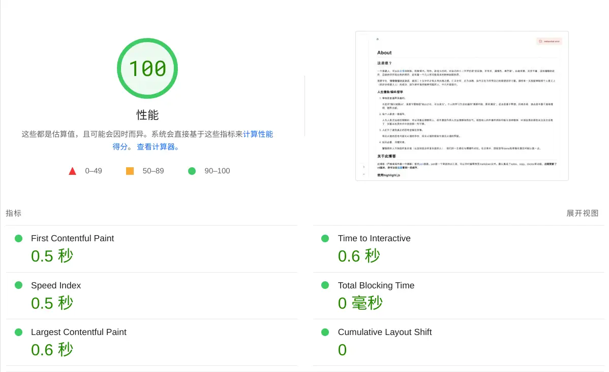

# 博客小工具开发实践

## 2023-10-28

抽空把小工具迁移到 Vitepress 了，自己造的轮子毕竟没有社区力量大……

## 2022-11-9

小工具陆陆续续迭代到5.4版本了，做了很多改进和优化。这里着重说一说其中比较值得记录的：

1.  记住客户端主题配置

    用`localStorage`是不对的，因为这意味着页面已加载在执行js了，而我们要的是服务端在响应html时就已经确定了客户端所要求的主题配置，因此这些信息需要在首个HTTP请求里面带上，简单点就用cookie了，如果你第二次刷新页面大约能在文档的请求头中看到这样的内容：

    ```http
    Cookie: themeMode=%22light%22; drawerVisible=true
    ```

2.  `sticky`标题头遮挡

    文档类型的网页通常都有目录定位的功能，假如使用`scrollIntoView`实现，如果页面刚好有一个`position: sticky`的标题头就会对滚上来的子标题形成遮挡，从《CSS世界》上学到了一种解决方案，利用内联元素不会加入行盒高度计算的特性，将原有的标题：

    ```html
    <h3>子标题内容</h3>
    ```

    修改为：

    ```html
    <h3><span>子标题内容</span><h3>
    ```

    然后给里面的`<span>`设置一个`padding-top`，这个`padding-top`不会破坏行盒高度而是会层叠渲染，可以撑起标题到顶部的一段距离。

3.  标题头锚点定位

    通常给子标题添加锚点定位的方案是在子标题旁边放一个鼠标悬浮才展示的图标，点击这个图标会改变页面hash为预先给该标题设置好的一个id值。但我打算做成直接点击子标题就可以改变hash的方式。这时和上面的方案有一点冲突，因为`padding-top`包括在鼠标点击热区内，于是标题上面被`padding-top`撑起来的一小块区域也可以响应鼠标事件，配合`pointer: cursor`就更奇怪了。因此想了下干脆在子标题里面加两个`<span>`，一个宽度为0，设置`padding-top`负责定位，另一个负责展示标题文字以及响应鼠标事件：

    ```html
    <h3><span id="hash anchor"></span><span>子标题内容</span></h3>
    ```

    ```scss
    /* anchor header */
    h1,
    h2,
    h3,
    h4,
    h5,
    h6 {
      & > span:last-child {
        cursor: pointer;
      }

      & > span[id^="H"] {
        padding-top: 64px;
      }
    }
    ```

    最后的效果貌似还挺不错的，就是元素有点多。

4.  优化服务端内存占用

    5.x最初的几个版本内存占用相当恐怖，足足200多MB，比我的IDE还要多。用`node --inspect-brk`在chrome调试工具里面看了下，发现模块缓存占了超过50%的比重，主要是MUI的各种组件，但实际上我用到的组件并不多，于是推测是构建工具的Tree Shaking没有做好。通过对构建出来的服务端代码的分析，发现了类似`var mui = require("mui/material")`这样的代码，因此手动修改了所有使用到MUI组件的地方，改为直接`import`对应的组件而非整个库：`import XXX from "@mui/material/XXX`；

    第二个优化点是`mobx`在服务端并不需要让它去建立响应性store，利用官方的API在服务端渲染时关掉就行了；

    第三个优化点是服务端渲染时，`useEffect`钩子并不会触发，因此有些只用于客户端的模块可以改写为在`useEffect`钩子内动态导入，比如`Clipboard.js`。

    这几个做完后效果立竿见影，常规内存占用直接减少到90MB以下，虽说还是很多……

## 2022-05-17

忙里偷闲，将博客[小工具](https://github.com/EverSeenTOTOTO/pen-middleware)整个重写了一遍，历时七天左右。简单记录下。

一张改造之后的PageSpeed评测图镇楼：



***

重构的动机是最近用vite做了一个[SSR项目模板](https://github.com/EverSeenTOTOTO/browser-app-boilerplate/tree/react-vite-ssr)，非常想用一个实际的项目来实践一下，刚好以前开发的这个小工具也很简陋，全是BUG，一直打算重构升级下，~~结果升级完了还是很简陋且一堆BUG~~。于是`git switch --orphan`拉了一个完全为空的分支开始开发。

小工具的核心功能是即时预览markdown，本质是利用fs watcher和websocket来监听和推送markdown文件的变化。但是后来又添加了监听目录并且能够进行文件导航的功能，使得实现变复杂了不少。在设计上，沿用了以前的思路，将整个小工具分为了watcher、socket、render和client四个模块，watcher负责监听文件（夹）变更，socket负责和客户端websocket进行通信，render渲染markdown，client则是一个纯粹的客户端应用。与旧版本不同的是，由于这次想新增SSR的功能，将render模块的功能改为了服务端渲染，新增remark模块负责markdown处理。

技术选型也有一些变化：

1.  淘汰了不太活跃的`markdown-it`生态，换成了`remark`和`rehype`来处理markdown和markdown转成的html。其实两个用起来体验都不太好，`markdown-it`的插件老旧，`remark`和`rehype`生态文档很多都是固定的模板，看似写了一堆，实际不能够解决问题，还是得看别人的源码。比如我想要的copy、highlightjs、toc等功能社区插件都不太行，干脆自己写了；
2.  websocket的实现前后端依然采用`socket.io`，省心，同时升级到了最新的版本；
3.  文件监听用了`chokidar`，这个库貌似比较活跃，vite底层也用的是它；
4.  前端依然是`react+react-router@6+mobx+mui@4`，原本想实践一下vue3，但为了尽可能复用以前的代码还是算了。~~顺便吐槽一下MUI虽然出了v5版本，官网文档里面的代码参考却完全没有更新，用起来全是报错，所以还是降到了我更熟悉的v4~~。Edit: 后面再看MUI的文档已经更新了，有时间再做一次migration吧；
5.  开发构建工具换成了vite，以前是webpack。虽然webpack确实慢但也不至于讨厌它，毕竟以前靠它吃过饭，这次换vite纯粹是想尝鲜。

另外有一些感悟，整个开发过程中最困难的watcher模块都没有让我打退堂鼓，在完成度80～90%的时候却非常想先这样用起来不肝了。我之惰性可见一斑。另外我总是不能以一种比较全面透彻的视角看待整个问题，频频掉入各种边界情况的陷阱中，产生了大量的重复劳动。我想应该是有一些方法论来改善这一情况的，还需要进一步学习和训练。

## 2021-11-07

:::info
我认为前端状态管理的一个趋势是“轻量的或无状态的渲染函数+基于模型定义并使用响应式库封装过的领域对象”
:::

抽时间用`mobx`重构了自己写的一个[小工具](https://github.com/EverSeenTOTOTO/pen-middleware)，颇有豁然开朗之感。结合了一点DDD的理念，原本散步在各处的业务逻辑在划分到几个领域状态里面之后出乎意料的简单。

“状态管理”这个概念在前端社区尤其是react社区一直也挺火的，经过这么长时间大约演进为两个方向：以hooks为核心思想的函数式设计和以observer模式为核心的面向对象式设计。

我还记得最早看Dan(react团队成员)在conf上介绍react
hooks的时候，原本是躺在床上看，看着看着就坐起来了:)，最后干脆坐到电脑前面接着看。现场的气氛也是非常激动，时不时就是一阵欢呼。后来正如react团队所说的，几乎所有可以被封装成hooks的东西都被做成了hooks，hooks理念对react社区乃至整个前端领域带来的改变可谓是革命性的。不过hooks让人诟病的地方也很明显，对开发者的心智要求挺高的。尤其是当你工作在一个技术氛围不那么浓郁的环境，又刚好需要做一些代码审核的工作时，面对着大把的使用vue/react编写jq式的代码，使用OOP书写过程化的逻辑的开发者，如何说服别人这个代码应该怎样写是很痛苦的，程序员相轻可能比文人还要严重。实际项目中还总是要考虑到排期的因素，导致“烂代码”一再堆积，积重难返。

hooks的设计内核是FP，函数式编程，这是和OOP面向对象非常不同的两种指导思想。函数式编程经常出现的两个词语是“副作用”和“纯函数”，react的想法可能很简单，组件是状态的函数，只要状态不变，只要这个函数是纯函数，我就不必重新计算函数，就不必重新渲染。早期的react函数式组件和vue里面标记为`functional`的组件一样，不能含有内部状态，因此只能简单的从外部拿值渲染组件。这时候还是class组件的天下，OOP里面的对象天生就含有自己的数据（内部状态）的概念，而且大多数人在学校期间也都接收过OOP的教育。这个时间主要的复用策略是mixin、HOC、render
props（vue的slots），但是它们各自的缺点也逐渐暴露：mixin很容易会遇到名字空间/作用域的问题，而且一个混入进来的东西我很难去追踪它的来源；HOC会导致嵌套层级较深，尤其是从三方包里面导进来的各种HOC嵌套在一起时，开发调试成了大难题。如果开发者未受训练，很容易将业务逻辑与UI状态写在一起，最终导致组件既难以维护也难以复用。

在这种情况下，富有创造力的react团队改造了以往的函数式组件，他们设法为函数式组件加上了缺失的内部状态，这段时间react的内部架构也迁移到了fiber的实现，由于函数式组件本身不存放状态，他们的状态存放在各自的fiber节点上：

*   `react-reconciler/src/ReactFiberHooks.new.js`

    ```ts
    const newHook: Hook = {
      memoizedState: currentHook.memoizedState,

      baseState: currentHook.baseState,
      baseQueue: currentHook.baseQueue,
      queue: currentHook.queue,

      next: null,
    };

    if (workInProgressHook === null) {
      // This is the first hook in the list.
      currentlyRenderingFiber.memoizedState = workInProgressHook = newHook;
    }
    ```

本文并不会详细讨论函数式组件的状态如何存放，而是是从使用者的角度去思考，hooks给逻辑复用带来了什么？以往需要HOC等手段才方便复用的组件现在可以通过组合hooks来实现，很多相关的逻辑可以借助hooks组合在一起，放置在不同的文件里面进行维护。组件内部的逻辑可以书写得非常简单，组件的层级也不会因为复用而变得复杂。

但是当hooks需要产生副作用时，事情变得不那么美妙了起来。我们知道需要通过`setState`改变状态，但我们何时知道需要调用`setState`改变状态，何时知道不需要呢？hooks的写法使得原本非常直观的“依赖某些状态的状态”（派生状态、computed值)变得不直观，同时react将确定副作用依赖的重担交给了开发者，这使得很多人在刚接触hooks的阶段频繁问出“它为什么更新了”和“它为什么又没有更新”这样的问题。

心智负担是人们通常对hooks会作出的批评，但过往的一些经历与这次对`mobx`的小小实践使得我愈发觉得hooks一个更重要的缺陷是它在模型设计方面的不足。**hooks长于逻辑封装，不适合现实抽象**。说到底，`vue`、`mobx`的底层原理非常符合人们的思维习惯，基于对象代理和观察者模式的实现使得开发者不再需要明确指定一段副作用应该在哪些依赖改变时被触发，而`computed`的概念更是水到渠成，框架底层帮我们实现了依赖侦听和数据绑定的过程。因此在设计阶段，我们像往常一样按照领域知识定义出一个个对象模型并省下在状态和展示层组件之间交互和同步的诸多心力，在向不了解技术知识的业务人员介绍这些模型并试图通过沟通和优化模型设计的时候，我们可以很明显感知到OOP的优势。向一位项目经理介绍“这是一个todo列表，我们通过一个在useEffect钩子中setTodoList来更新某些内容”，和“这是一个todo列表对象，它有一个行为我们叫做updateTodoList更新内容”是完全不同的两种体验。

因此，我认为前端状态管理的一个趋势是“**轻量的或无状态的渲染函数**+**基于模型定义并使用响应式库封装过的领域对象**”。我们并不会抛弃hooks，以函数式的思想进行逻辑解耦给错综复杂并对性能和低延迟有高要求的展示层带来的价值有目共睹，我们同时也不会抛弃OOP的思想，OOP在业务逻辑层面的抽象价值也是经受住了历史考验的。

看着下面这两段代码，你是否感觉到，一直以来所期望的某些统一很快就要发生了？`useLocalObservable`返回的对象完全可以是在别处定义的模型，按照`mobx`的理念，使用`action`改变数据，使用`reaction`产生副作用，以往我们的麻烦之处是我们抽象出来的模型的方法`increment`并不自动成为一个`action`，换句话说在方法中作出的数据改变不会通知到依赖模型对象的人，但是现在框架提供了这样的能力，我们要做的只是定义好模型与各种服务并用框架提供的方法封装（在`mobx`中，这个方法是`makeAutoObservable`，它作用在类上，使得类的属性成员天然具有响应性，get的值成为派生状态而成员函数成为`action`），最后在渲染函数（展示层组件）之中借助简单的hooks来使用这些模型与服务。

```ts
import { observer, useLocalObservable } from "mobx-react-lite"

export default observer(() => {
    const state = useLocalObservable(() => ({
      count: 0,
      get double() {
        return this.count * 2
      },
      increment() {
        this.count++
      }
    }))

    //...
})
```

```ts
import { ref, defineComponent } from 'vue'

const useState = () => {
  const count = ref(0);

  return {
    count,
    double() {
      count.vaue * 2;
    },
    increment() {
      count.value ++;
    }
  }
}

export default defineComponent({
    setup() {
      const state = useState();

      // ...
    }
})
```
