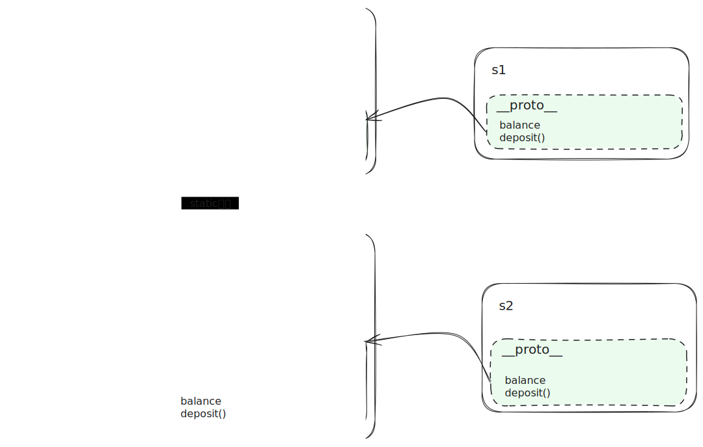

# Javascript和Lua中的原型

## JS的原型机制

`prototype`和`__proto__`傻傻分不清楚？MDN的[这篇文档](https://developer.mozilla.org/en-US/docs/Learn/JavaScript/Objects/Object_prototypes)有一些介绍。其实记住一句话就够用了：**派生类的`prototype`和父类的`prototype`相同，实例的`__proto__`和构造类的`prototype`相同**。不过，这里的“相同”隐含了可以沿着原型链追溯的意思，并不一定真的完全相等。因为如果我们用派生类的实例去`instanceof`基类，结果应当也是`true`。

:::info
由于`__proto__`是一个已经废弃的属性，下文我们使用官方推荐的API`Object.getPrototypeOf`和`Object.setPrototypeOf`来操作之。
:::

```js
function Base() {}

Base.prototype.sth = 42;

const foo = new Base();

console.log(foo.sth); // 42
```

完全可以把`new`看作是语法糖，自己实现“继承”：

```js
function Base() {}

Base.prototype.sth = 42;

const foo = {};

// foo.__proto__ = Base.prototype
Object.setPrototypeOf(foo, Base.prototype);

console.log(foo.sth); // 42
```

同样的，`class`语法也是语法糖。要实现派生，核心是让派生类的`prototype`上具有的属性与基类`prototype`上的相同，可以直接设置派生类的`prototype`等于基类的，但更好的方式是充分利用原型链机制，让派生类`Derived`的`prototype.__proto__`和基类`Base`的`prototype`相等。这样，在`Derived`的实例`bar`上查找属性时，首先会通过`bar.__proto__`找到`Derived.prototype`，进一步沿着链向上到`Base.prototype`中查找：

```js
class Derived extends Base {}

const bar = new Derived();

console.log(bar.sth); // 42
console.log(Object.getPrototypeOf(Derived.prototype) == Base.prototype); // true
```

Desugar:

```js
function Derived() {}

// 比 Derived.prototype = Base.prototype 更好
Object.setPrototypeOf(Derived.prototype, Base.prototype);

const bar = new Derived();

console.log(bar.sth); // 42
```

:::tip
某种意义上，我们可以将`Derived.prototype`看成是`Base`的实例，因为现在有如下等价关系：

```js
Derived.prototype.__proto__ === Base.prototype;
bar.__proto__ === Base.prototype;
```

对比下可以发现`Derived.prototype`和`bar`在地位上是相同的。因此，也可以这样实现继承：

```js
Derived.prototype = new Base();
```
:::


写这篇博客的起因是遇到了一个BUG，在试图修改并重用对象的`__proto__`时，不小心污染了`Function.prototype`。因此有这种需求的话要注意两点，一要避免丢失原型上本来有的东西，二要避免污染全局空间：

```js
// Base.__proto__不再是Function.prototype，意味着来自Function.prototype的bind、apply等方法都丢失了
Object.setPrototypeOf(Base, { x: 2 });

// Function.prototype.x = 2，污染了全局空间
Object.assign(Object.getPrototypeOf(Base), { x: 2 });
```

一种解决方法是先将对象的`__proto__`克隆一份，在克隆出来的原型上进行修改，最后再重设为对象的原型：

```js
const proto = Object.getPrototypeOf(Base);
const newProto = Object.assign(Object.create(proto), { x: 2 });

Object.setPrototypeOf(Base, newProto);
```

这里使用`Object.create`也是必要的，因为常见的对象拷贝的方法不会拷贝诸如`Function.prototype`上的`bind`等固有属性（可以使用`Object.getOwnPropertyNames`查看固有属性）：

```js
p = Object.getPrototypeOf(Base);
x = {...p};
y = Object.assign(Object.create(null), p);
z = Object.create(p);

p.bind; // ƒ bind() { [native code] }
x.bind; // undefined
y.bind; // undefined
z.bind; // ƒ bind() { [native code] }
```

## Lua中的对比

最近写了一点Lua，不妨做个类比。在Lua中有个与原型对象很相似的东西叫做元表（metatable），一个`table`有了元表，我们就可以通过在元表上定义一些元方法（metamethods）来控制`table`的行为。

这里的关键在于元表上的元方法，只有定义合适的元方法才能让元表起到和原型对象类似的作用。例如沿着原型链向上的查找机制，如果仅仅这样写是不够的：

```lua
local a = { x = 2 }
local b = {}
local c = {}

setmetatable(c, b)
setmetatable(b, a)

print(c.x) -- nil
```

在Lua中，get和set涉及到的元方法是`__index`和`__newindex`，在表上查找元素时，若没找到，会追溯到其元表，并根据元表的`__index`确定进一步查找的方式。`__index`的值可以是另一张表，此时会将该表作为新的查找对象。因此要让对`c.x`的访问能够向上查找到`a`，只需要给`b`和`a`添加`__index`方法并指向自身即可：

```lua
local a = { x = 2 }
local b = {}
local c = {}

setmetatable(c, b)
b.__index = b
setmetatable(b, a)
a.__index = a

print(c.x) -- 2
```

换句话说，上面先设置`metatable`再设置`__index`的过程与Javascript中的`setPrototype`异曲同工：

```Lua
local function setPrototype(t, p)
  setmetatable(t, p)
  p.__index = p
end
```

现在来看看如何实现继承，《Programming in Lua》在讲到[继承](https://www.lua.org/pil/16.2.html)的时候有这么一段代码：

```lua
Account = {balance = 0}

function Account:new (o)
  o = o or {}
  setmetatable(o, self)
  self.__index = self
  return o
end

function Account:deposit (v)
  self.balance = self.balance + v
end

SpecialAccount = Account:new()
s = SpecialAccount:new()

s.deposit(1)
```

这里用词`new`其实很迷惑，它的语义更像是派生，应该叫做`derive`、`extend`啥的，因为这里`SpecialAccount = Account:new()`的作用和`class SpecialAccount extends Account`差不多，而`balance`更像是一个静态属性。各实例在调用修改`self.balance`的时候能够互不干扰，完全是因为原型链的查找顺序是先从自己开始的，即首次访问`self.balance`的时候发现自己的`o`上没有，于是从metatable中拿到`Account`的`balance`，然后在赋值的时候在自己的`o`上创建了一个副本，以后`self.balance`操作的是自己的了。

将静态方法和实例方法混为一谈有点不符合我们对OOP的认知，我们更习惯的`new`方法类似这样：

```lua
SpecialAccount = Account:extend() -- 作用等同于 class SpecialAccount extends Account

s1 = Account:new()
s2 = SpecialAccount:new()

s1:deposit(1)
s2:deposit(2)

s1:new() -- error, no such method "new"
```

那么具体要怎么实现`new`方法和`extend`方法呢？可以从JS中受到启发，还是把握住“派生类的`prototype`和父类的`prototype`相同，实例的`__proto__`和构造类的`prototype`相同”这句话。

首先制作一个`prototype`，将类方法和实例方法区分开来。注意本文把`new`、`extend`这些类对象上具有的方法称为类方法，常规的成员方法称为实例方法：

```lua
Account.prototype = {balance = 0}

function Account.prototype:deposit(v)
  self.balance = self.balance + v
end
```

> 这里我们依然保留了利用原型链查找机制的静态默认值`{balance = 0}`，如果要更OOP一点的话，可以在下面的构造函数`new`中设置`o.balance = 0`。

创建实例的要点是让实例的`__proto__`等同于`Account.prototype`，并且能够向上在`__proto__`上查找属性：

```lua
function Account:new() -- 注意不是Account.prototype:new
  local o = {
    __proto__ = self.prototype
  }

  setPrototype(o, o.__proto__)

  return o
end
```

创建派生类的要点是让派生类的`prototype`和基类`prototype`一致，这里直接用`new`可能有点hack，参见前面的 tip。同时让派生类获取`Account`上面的方法：

```lua
function Account:extend()
  -- 让派生类的`prototype`和基类`prototype`一致
  local o = { prototype = self:new() }

  -- 获取Account上面的方法
  setPrototype(o, self)

  return o
end
```

完整的代码如下：

```lua
local function setPrototype(t, p)
  setmetatable(t, p)
  p.__index = p
end

Account = { prototype = { balance = 0 } }

function Account.prototype:deposit(v)
  self.balance = self.balance + v
  print(self.balance)
end

function Account:new() -- 注意不是Account.prototype:new
  local o = {
    __proto__ = self.prototype
  }

  setPrototype(o, o.__proto__)

  return o
end

function Account:extend()
  -- 让派生类的`prototype`和基类`prototype`一致
  local o = { prototype = self:new() }

  -- 获取Account上面的方法
  setPrototype(o, self)

  return o
end

local s1 = Account:new()

print(s1.__proto__ == Account.prototype) -- true

SpecialAccount = Account:extend() -- 作用等同于 class SpecialAccount extends Account

print(SpecialAccount.prototype.__proto__ == Account.prototype) -- true

local s2 = SpecialAccount:new()

s1:deposit(1) -- 1
s2:deposit(2) -- 2

-- s1:new() -- error: attempt to call method 'new' (a nil value)

Account.prototype.foo = function() print(42) end

s2:foo() -- 42
```



上述实现有个微妙的问题：实例方法中的`self`始终指向的是`Account.prototype`，没办法拿到类`Account`自己，这时，依然可以模仿JS，在`Account.prototype`上加一个属性`constructor`，让其指向类对象自身。

::: tip
[这里](https://github.com/EverSeenTOTOTO/eventloop-in-lua/blob/main/src/class.lua)有基于本文沉淀的一套原型链实现，支持`new`、`extend`、`isInstance`、`isDerived`等方法。
:::
