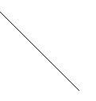
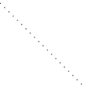
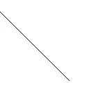
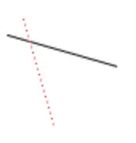
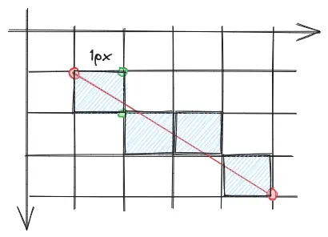
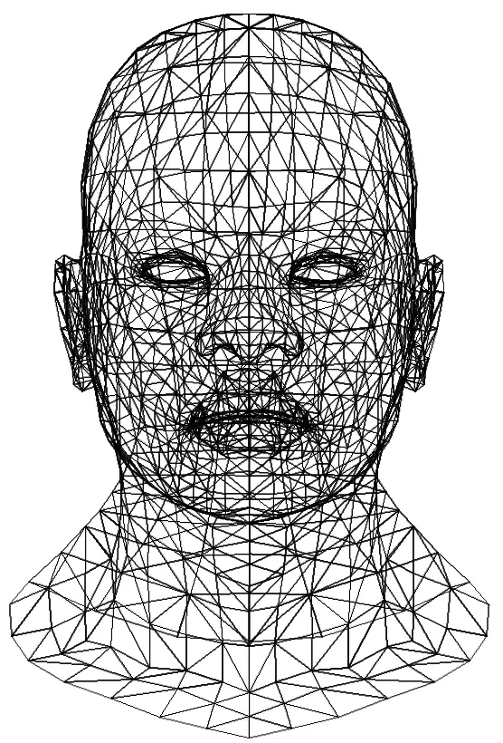

# Bresenham’s Line Drawing Algorithm

tinyrenderer [第一课](https://github.com/ssloy/tinyrenderer/wiki/Lesson-1:-Bresenham%E2%80%99s-Line-Drawing-Algorithm)，不过这里用的是 canvas API。

画一条直线，最直接的想法是选一个步长`t`，在源点和终点之间每隔这个步长就画一个像素点：

```ts
type Point = { x: number, y: number };

function P(x: number, y: number) {
  return { x, y };
}

function drawPoint(ctx: CanvasRenderingContext2D, p: Point, { color } = { color: 'black' }) {
  ctx.save();
  ctx.fillStyle = color;
  ctx.fillRect(p.x, p.y, 1, 1);
  ctx.restore();
}

function drawLine(ctx: CanvasRenderingContext2D, start: Point, end: Point, { color, step } = { color: 'black', step: 0.01 }) {
  for (let t = 0; t <= 1; t += step) {
    const x = start.x + (end.x - start.x) * t;
    const y = start.y + (end.y - start.y) * t;
    drawPoint(ctx, { x, y }, { color });
  }
}

const ctx = canvas.getContext("2d");

drawLine(ctx, P(0, 0), P(100, 100), { step: 0.01 });
```

<script>
function P(x, y) {
  return { x, y };
}

function drawPoint(ctx, p, { color = 'black' }) {
  ctx.save();
  ctx.fillStyle = color;
  ctx.fillRect(p.x, p.y, 1, 1);
  ctx.restore();
}

function drawLine(ctx, start, end, { color = 'black', step = 0.01 }) {
  for (let t = 0; t <= 1; t += step) {
    const x = start.x + (end.x - start.x) * t;
    const y = start.y + (end.y - start.y) * t;
    drawPoint(ctx, { x, y }, { color });
  }
}
</script>

得到如下图像：



这个实现有很大的问题，我们的初衷其实是“每次绘制像素点时，和上一个像素点在X轴方向上间隔1px”，但在上面的实现中，每次计算步长用的是`(end.x - start.x) * t`，如果这个乘积大于1，视觉效果就不是直线而是虚线了，下面是`step = 0.05`的结果：



因此要改变计算下一个像素点的方法，我们将迭代变量改为`x`，每次递增1，然后用比例算出当前`y`值：

```ts
function drawLine(ctx: CanvasRenderingContext2D, start: Point, end: Point, { color } = { color: 'black' }) {
  for (let { x } = start; x <= end.x; ++x) {
    const t = (x - start.x) / (end.x - start.x);
    const y = start.y * (1 - t) + end.y * t;
    drawPoint(ctx, P(x, y), { color });
  }
}
```



新的实现也有问题，绘制下面三条线，第二条线又成了虚线，因为虽然x方向是递增1px的，但按比例映射后的y值步长要大于1px；第三条线是第一条线的反向，原本应该覆盖第一条线，却因为算法没考虑`start.x > end.x`压根没画出来：

```ts
drawLine(ctx, P(10, 20), P(80, 40));
drawLine(ctx, P(20, 10), P(40, 80), { color: "red" });
drawLine(ctx, P(80, 40), P(10, 20), { color: "red" });
```



这两个问题都比较好修复，我们可以做个比较来确保起始点的坐标值总是小于终点，并根据斜率是否大于1判断将`x`作为迭代变量还是将`y`作为迭代变量，这样可以保证迭代变量变化1px时，按比例映射后的另一值步长只会更小：

```ts
function drawLine(ctx: CanvasRenderingContext2D, start: Point, end: Point, { color } = { color: 'black' }) {
  let transpose = false;
  let s = start;
  let e = end;

  if (Math.abs(start.x - end.x) < Math.abs(start.y - end.y)) { // 斜率大于1，delta y > delta x，转置
    s = P(start.y, start.x);
    e = P(end.y, end.x);
    transpose = true;
  }

  // 确保起始点总是小于终点
  if (s.x > e.x) {
    const temp = s;
    s = P(e.x, e.y);
    e = P(temp.x, temp.y);
  }

  const dx = e.x - s.x;
  for (let { x } = s; x <= e.x; ++x) {
    const t = (x - s.x) / dx;
    const y = s.y * (1 - t) + e.y * t;

    drawPoint(ctx, transpose ? P(y, x) : P(x, y), { color });
  }
}
```


该实现还可以进一步优化，核心的两行语句来自直线方程：$\frac{x-x_0}{x_1 - x_0} = \frac{y-y_0}{y_1-y_0} = t$，当前的做法是先求出`t`再去计算`y`，中途用到了很多乘除法。这个式子可以做一下变换，$y=\frac{y_1-y_0}{x_1-x_0}(x-x_0) + y_0$，其中很多常量迭代之前就可以求出来。若迭代变量是`x`，每步的步长固定是1px，则记下上一步的`y`值并增加$\Delta{y}=\frac{y_1-y_0}{x_1-x_0}\Delta{x}$即可。

```ts
function drawLine(ctx: CanvasRenderingContext2D, start: Point, end: Point, { color } = { color: 'black' }) {
  let transpose = false;
  let s = start;
  let e = end;

  if (Math.abs(start.x - end.x) < Math.abs(start.y - end.y)) { // 斜率大于1，delta y > delta x
    s = P(start.y, start.x);
    e = P(end.y, end.x);
    transpose = true;
  }

  if (s.x > e.x) {
    const temp = s;
    s = P(e.x, e.y);
    e = P(temp.x, temp.y);
  }

  const k = (e.y - s.y) / (e.x - s.x);
  let { y } = s;

  for (let { x } = s; x <= e.x; ++x) {
    drawPoint(ctx, transpose ? P(y, x) : P(x, y), { color });

    y += k;
  }
}
```

有没有办法完全规避昂贵的浮点数计算呢？这就是Bresenham算法取巧的地方了，该算法的核心思想是，我们没必要那么精确的去计算新的`y`值。如下图所示，当`x`变化1px时，`y`用不动或者增加1px去近似，默认保持`y`不动，`x`每走一格便累积一个误差$k=\frac{y_1-y_0}{x_1-x_0}$，当累积的误差$k>0.5$时，说明此时将`y`增加1px距离`y`方向上的中点更近，此时应增加`y`并减小误差：



```ts
drawPoint(ctx, transpose ? P(y, x) : P(x, y), { color });

error += k;
if (error > 0.5) {
  y += dy > 0 ? 1 : -1;
  error -= 1;
}
```

在此基础上，通过等比例缩放规避掉浮点数`k`和0.5，得到最终实现：

```ts
function drawLine(ctx: CanvasRenderingContext2D, start: Point, end: Point, { color } = { color: 'black' }) {
  let transpose = false;
  let s = start;
  let e = end;

  if (Math.abs(start.x - end.x) < Math.abs(start.y - end.y)) { // 斜率大于1，delta y > delta x
    s = P(start.y, start.x);
    e = P(end.y, end.x);
    transpose = true;
  }

  if (s.x > e.x) {
    const temp = s;
    s = P(e.x, e.y);
    e = P(temp.x, temp.y);
  }

  const dx = e.x - s.x;
  const dy = e.y - s.y;
  const dy2 = 2 * Math.abs(dy);
  const dx2 = 2 * dx;
  let { y } = s;
  let error = 0;

  for (let { x } = s; x <= e.x; ++x) {
    drawPoint(ctx, transpose ? P(y, x) : P(x, y), { color });

    error += dy2;
    if (error > dx) {
      y += dy > 0 ? 1 : -1;
      error -= dx2;
    }
  }
}
```

借助一个叫做`obj-file-parser`的npm包我们也可以绘制一下教程中的obj模型文件：

```ts
const objFile = new OBJFile(obj).parse();
const { faces, vertices } = objFile.models[0];

const width = 800;
const height = 800;

for (const record of faces) {
  for (let i = 0; i < 3; ++i) {
    // 连接三角形的三个顶点
    const v0 = vertices[record.vertices[i].vertexIndex - 1];
    const v1 = vertices[record.vertices[(i + 1) % 3].vertexIndex - 1];

    const x0 = ((v0.x + 1) * width) / 2;
    const y0 = ((v0.y + 1) * height) / 2;
    const x1 = ((v1.x + 1) * width) / 2;
    const y1 = ((v1.y + 1) * height) / 2;

    drawLine(ctx, P(x0, y0), P(x1, y1));
  }
}
```


