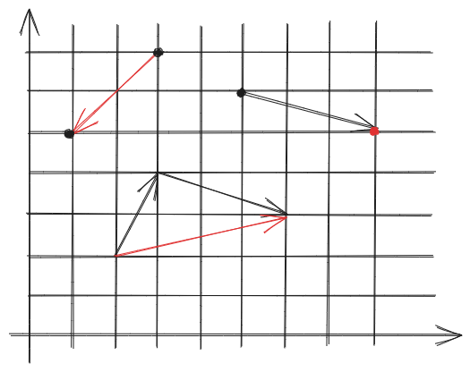

# 变换 <Badge type="warning" text="WIP" />

## 齐次坐标（Homogeneous coordinates）

如果只用2\*2矩阵，会发现无法表示二维平移这种基本变换，因此人们想到了引入一个额外的维度，约定：

1.  $\begin{bmatrix} x \\ y \\ 1 \end{bmatrix}$表示二维坐标点；
2.  $\begin{bmatrix} x \\ y \\ 0 \end{bmatrix}$表示二维向量。

这样平移变换可表示为：

$$
\begin{bmatrix}
x' \\ y' \\ z'
\end{bmatrix} = 
\begin{bmatrix}
1 & 0 & t_x \\ 
0 & 1 & t_y \\ 
0 & 0 & 1
\end{bmatrix}⋅
\begin{bmatrix}
x \\ y \\z 
\end{bmatrix}
$$

点和向量的加减产生了四种运算，进一步说明上面的“约定”不是空穴来风：

1.  点减去点，运算的结果是向量，含义就是从一个点（减数）指向另一个点（被减数）的向量，如下图左上角$\begin{bmatrix} 1 \\ 5 \\ 1 \end{bmatrix} - \begin{bmatrix} 3 \\ 7 \\ 1\end{bmatrix} = \begin{bmatrix} -2 \\ -2 \\ 0\end{bmatrix}$；
2.  点与向量运算，运算的结果是点，含义其实是从该点走向量到另一个端点，如下图右上角$\begin{bmatrix} 5 \\ 6 \\ 1 \end{bmatrix} + \begin{bmatrix} 3 \\ -1 \\ 0 \end{bmatrix} = \begin{bmatrix} 8 \\ 5 \\ 1 \end{bmatrix}$；
3.  向量与向量运算，运算的结果是向量，含义是将两向量首尾相连，没有连起的另一首和尾组成的新向量，如下图中部$\begin{bmatrix} 3 \\ -1 \\ 0 \end{bmatrix} + \begin{bmatrix} 1 \\ 2 \\ 0 \end{bmatrix}=\begin{bmatrix} 4 \\ 1 \\ 0 \end{bmatrix}$；
4.  点加上点？我们发现相加后额外的维度值变成了2，为了让额外的维度值保持为1，人为约定下，我们约定$\begin{bmatrix} x \\ y \\ w \end{bmatrix}$代表的是$\begin{bmatrix} x/w \\ y/w \\ 1 \end{bmatrix}$。根据这个约定，两点相加得到的是两者的中点。

有了齐次坐标，我们就可以把几个基本的变换都用一个矩阵表示：

+ 缩放 scale 矩阵：$S(s_x, s_y) = \begin{bmatrix} s_x & 0 & 0 \\ 0 & s_y & 0 \\ 0 & 0 & 1 \end{bmatrix}$；
+ （绕原点）旋转 rotate 矩阵：$R(α) = \begin{bmatrix} \cosα & -\sinα & 0 \\ \sinα & \cosα & 0 \\ 0 & 0 & 1 \end{bmatrix}$，一种简单的方法是代入特殊点推出矩阵各项的值；
+ 平移 translate 矩阵：$T(t_x, t_y)= \begin{bmatrix} 1 & 0 & t_x \\ 0 & 1 & t_y \\ 0 & 0 & 1 \end{bmatrix}$。

> 线性变换加上平移变换合称为仿射变换（affine transformation）。具体来说，线性变换使得我们能够计算类似的表达式：$x'=ax+by+cz$，仿射将其拓展至$x'=ax+by+cz+d$。

同时复杂的变换可以分解为若干小变换依次完成，问题规约为矩阵分解、求逆、乘法等。举个例子，绕点c旋转，可以先把对象平移到原点$T(-c)$，然后旋转$R(α)$，再还原回去$T(c)$，整个变换矩阵$E=T(c)R(α)T(-c)$。

## 三维变换

## 变换的分解和坐标系变换

## 视图变换

### 透视投影
