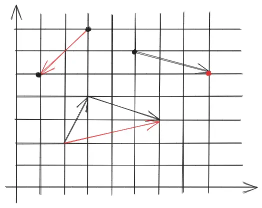
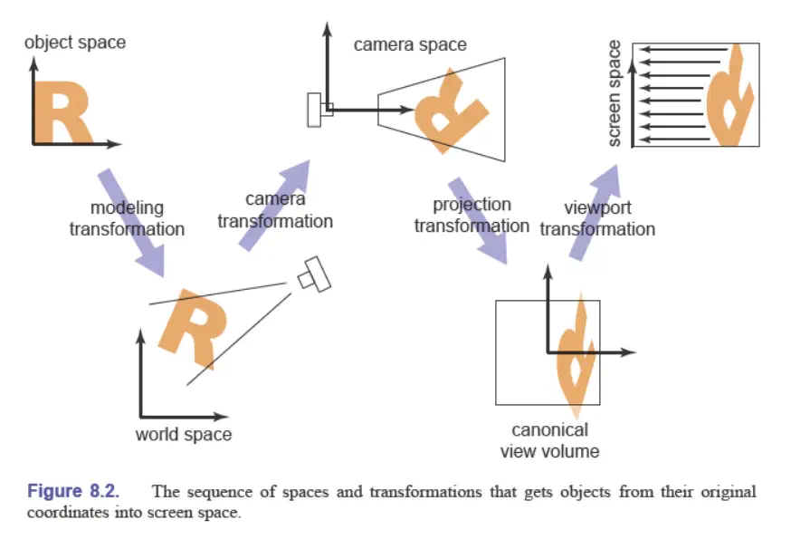
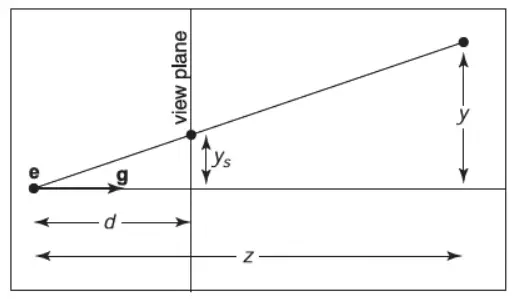

# 变换

## 齐次坐标（Homogeneous coordinates）

如果只用2\*2矩阵，会发现无法表示二维平移（move）这种基本变换。因此人们想到了引入一个额外的维度，约定：

1.  $\begin{bmatrix} x \\ y \\ 1 \end{bmatrix}$表示二维坐标点；
2.  $\begin{bmatrix} x \\ y \\ 0 \end{bmatrix}$表示二维向量。

这样平移变换可表示为：

$$
\begin{bmatrix}
x' \\ y' \\ z'
\end{bmatrix} = 
\begin{bmatrix}
1 & 0 & t_x \\ 
0 & 1 & t_y \\ 
0 & 0 & 1
\end{bmatrix}⋅
\begin{bmatrix}
x \\ y \\z 
\end{bmatrix}
$$

点和向量的加减产生了四种运算，进一步说明上面的“约定”不是空穴来风：

1.  点减去点，运算的结果是向量，含义就是从一个点（减数）指向另一个点（被减数）的向量，如下图左上角$\begin{bmatrix} 1 \\ 5 \\ 1 \end{bmatrix} - \begin{bmatrix} 3 \\ 7 \\ 1\end{bmatrix} = \begin{bmatrix} -2 \\ -2 \\ 0\end{bmatrix}$；
2.  点与向量运算，运算的结果是点，含义其实是从该点走向量到另一个端点，如下图右上角$\begin{bmatrix} 5 \\ 6 \\ 1 \end{bmatrix} + \begin{bmatrix} 3 \\ -1 \\ 0 \end{bmatrix} = \begin{bmatrix} 8 \\ 5 \\ 1 \end{bmatrix}$；
3.  向量与向量运算，运算的结果是向量，含义是将两向量首尾相连，没有连起的另一首和尾组成的新向量，如下图中部$\begin{bmatrix} 3 \\ -1 \\ 0 \end{bmatrix} + \begin{bmatrix} 1 \\ 2 \\ 0 \end{bmatrix}=\begin{bmatrix} 4 \\ 1 \\ 0 \end{bmatrix}$；
4.  点加上点？我们发现相加后额外的维度值变成了2，为了让额外的维度值保持为1，人为约定下，我们约定$\begin{bmatrix} x \\ y \\ w \end{bmatrix}$代表的是$\begin{bmatrix} x/w \\ y/w \\ 1 \end{bmatrix}$。根据这个约定，两点相加得到的是两者的中点。

有了齐次坐标，我们就可以把几个基本的变换都用一个矩阵表示：

+ **缩放 （Scale）** ：$S(s_x, s_y) = \begin{bmatrix} s_x & 0 & 0 \\ 0 & s_y & 0 \\ 0 & 0 & 1 \end{bmatrix}$；
+ （绕原点）**旋转 （Rotate）** ：$R(α) = \begin{bmatrix} \cosα & -\sinα & 0 \\ \sinα & \cosα & 0 \\ 0 & 0 & 1 \end{bmatrix}$，一种简单的方法是代入特殊点推出矩阵各项的值。另外，可以发现这是一个正交矩阵；
+ **平移 （Translate）** ：$T(t_x, t_y)= \begin{bmatrix} 1 & 0 & t_x \\ 0 & 1 & t_y \\ 0 & 0 & 1 \end{bmatrix}$。
+ **切变（Shear）**：$x$方向上为$\begin{bmatrix} 1 & k & 0 \\ 0 & 1 & 0 \\ 0 & 0 & 1 \end{bmatrix}$，$y$方向上为$\begin{bmatrix} 1 & 0 & 0 \\ k & 1 & 0 \\ 0 & 0 & 1 \end{bmatrix}$；
+ **镜像（Mirror）**：$x$方向上为$\begin{bmatrix} 1 & 0 & 0 \\ 0 & -1 & 0 \\ 0 & 0 & 1 \end{bmatrix}$，$y$方向上为$\begin{bmatrix} -1 & 0 & 0 \\ 0 & 1 & 0 \\ 0 & 0 & 1 \end{bmatrix}$。

> 线性变换加上平移变换合称为**仿射变换（affine transformation）**。具体来说，线性变换使得我们能够计算类似的表达式：$x'=ax+by+cz$，仿射将其拓展至$x'=ax+by+cz+d$。

同时复杂的变换可以分解为若干小变换依次完成，问题规约为矩阵分解、求逆、乘法等。举个例子，绕点c旋转，可以先把对象平移到原点$T(-c)$，然后旋转$R(α)$，再还原回去$T(c)$，整个变换矩阵$E=T(c)R(α)T(-c)$。

## 三维变换

Rodrigues' Rotation Formula：绕轴$n$旋转$α$角度：

$$
R(n,α) = cos(α)I + (1-cos(α))nn^T + sin(α)\begin{bmatrix}0 & -n_z & n_y \\ n_z & 0 & -n_x \\ -n_y & n_x & 0\end{bmatrix}
$$

## 坐标系变换

## 视图变换（View transformation）

可以类比拍照：

1. 找到一个好的位置放置目标：几何变换；
2. 找一个好的角度来放置相机：视图变换；
3. 拍照：投影变换。

### 视图变换（View/Camera transformation）

如何定义相机位置：

+ Position：$\overrightarrow{e}$；
+ Look at/gaze direction: $\mathbf{g}$；
+ Up direction：$\mathbf{t}$，可以想象手机横屏到竖屏的旋转，通过定义一个“向上”方向，消除这个角度的未知。

由于相机和物体一起运动，不会改变相机视角下的物体图像。因此不管相机怎么运动，总是可以通过移动物体得到相同的图像。为了简化表达，可以约定相机总是处于原点的位置，“up direction”向上的方向是 y，“look at”向右的方向 -z。

为了将相机移动到原点，我们需要做一个变换$\mathbf{M_{view}}$，囊括了：

1. 将$\overrightarrow{e}$移动到原点：$T_{view}=\begin{bmatrix} 1 & 0 & 0 & -x_e \\ 0 & 1 & 0 & -y_e \\ 0 & 0 & 1 & -z_e \\ 0 & 0 & 0 & 1 \end{bmatrix}$；
2. 将$\mathbf{g}$旋转为$-z$方向；
3. 将$\mathbf{t}$旋转为$y$方向；
4. 将$\mathbf{g} \times \mathbf{t}$旋转到$x$方向。

后三个存在技巧，我们要将任意向量旋转到x、y或z上并不容易，但是如果反过来，将x、y或z方向上的单位向量旋转到其他向量的矩阵很容易写出来（考虑谁乘上单位向量得到目标向量即可），而旋转矩阵是正交矩阵，有$R^{-1}=R^T$，因此：

$$
\begin{equation}
\begin{split}
R_{view}
&= (R_{view}^{-1})^T \\
&= \begin{bmatrix} x_{g \times t} & x_t & x_{-g} & 0 \\ y_{g \times t} & y_t & y_{-g} & 0 \\ z_{g \times t} & z_t & z_{-g} & 0 \\ 0 & 0 & 0 & 1 \end{bmatrix}^T \\
&= \begin{bmatrix} x_{g \times t} & y_{g \times t} & z_{g \times t} & 0 \\ x_t & y_t & z_t & 0 \\ x_{-g} & y_{-g} & z_{-g} & 0 \\ 0 & 0 & 0 & 1\end{bmatrix}
\end{split}
\end{equation}
$$

## 投影变换（Projection transformation）

### 正交投影（Orthographic projection）

想象平行光源，或者无穷远处的点光源

惯用的做法，考虑任意长方体（orthographic view volumn），将其变换到标准视图大小（canonical view volumn），先平移，后缩放：

$$
M_{ortho} = \begin{bmatrix} \frac{2}{r-l} & 0 & 0 & 0 \\ 0 & \frac{2}{t-b} & 0 & 0 \\ 0 & 0 & \frac{2}{n-f} & 0 \\ 0 & 0 & 0 & 1 \end{bmatrix}
\begin{bmatrix} 1 & 0 & 0 & -\frac{r+l}{2} \\ 0 & 1 & 0 & -\frac{t+b}{2} \\ 0 & 0 & 1 & -\frac{n+f}{2} \\ 0 & 0 & 0 & 1 \end{bmatrix}
$$

::: tip
这一步做完之后长方体会被拉伸，不过，最终会通过一次视口变换（viewport transformation）来还原物体的形状。更准确的说，视口变换将裁剪空间（三维归一化设备坐标空间，canonical）坐标转换为屏幕坐标，这一过程深度保持不彼岸，因为我们在应用视口变换之前，一般已经用透视投影处理过深度变化了：

$$
M_{vp} = \begin{bmatrix} \frac{n_x}{2} & 0 & 0 & \frac{n_x-1}{2} \\ 0 & \frac{n_x}{2} & 0 & \frac{n_y-1}{2} \\ 0 & 0 & 1 & 0 \\ 0 & 0 & 0 & 1 \end{bmatrix}
$$

其中，$n_x$和$n_y$分别是屏幕视口的宽高，这个矩阵也是平移+缩放的结果。
:::

### 透视投影（Perspective projection）

想象点光源

也可以分两步理解：保持near不变，先“挤压”视椎体成为立方体，再做一个透视投影：

根据相似三角形，$y_s = \frac{d}{z}y$，$x$方向也类似，从而这个变换应导致$\begin{pmatrix}x \\ y \\ z \\ 1 \end{pmatrix}$ 变为 $\begin{pmatrix}
dx/z \\ dy/z \\ \text{unknown} \\ 1\end{pmatrix}$ 也即 $\begin{pmatrix} dx \\ dy \\ \text{still unknown} \\ z \end{pmatrix}$，故

$$
M_{persp \rightarrow ortho} = \begin{bmatrix} d & 0 & 0 & 0 \\ 0 & d & 0 & 0 \\ ? & ? & ? & ? \\ 0 & 0 & 1 & 0 \end{bmatrix}
$$

未知的那行怎么求呢？观察整个挤压过程，有两个现象：

1. near平面上的点在变换前后始终不变 -> near上点的z坐标记作$n$，变换后为$\begin{pmatrix} nx \\ ny \\ n^2 \\ n \end{pmatrix}$，那么空行应该符合$\begin{pmatrix} 0 & 0 & A & B \end{pmatrix}$的形式，即有$An+B=n^2$；
2. far平面上的点，其$z$坐标在变换前后始终不变 -> 考虑far的中心点，它在挤压前后都不变。中心点的x和y坐标都是0，z坐标记作$f$，则有$Af+B=f^2$。

现在，可以解出A和B的值：

$$
M_{persp \rightarrow ortho} = \begin{bmatrix} d & 0 & 0 & 0 \\ 0 & d & 0 & 0 \\ 0 & 0 & n+f & -nf \\ 0 & 0 & 1 & 0 \end{bmatrix}
$$
