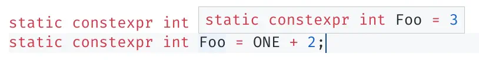
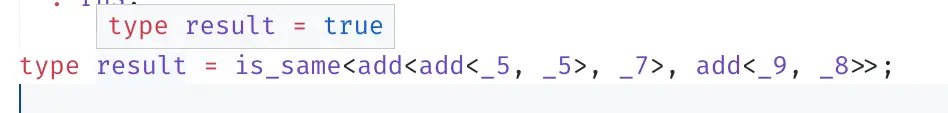

# Typescript 和 C++ 中的类型元编程示例

我对元编程的理解大致是在一门语言（一段程序）中构造 另一门语言的语义，但不是通过在宿主语言中完整地构造一个目标语言的编译器，
而是利用宿主语言的特性（比如模式匹配）来实现，c++的模板具备这样的能力，typescript的类型推导同样具备这样的能力。元编程如果运用得当，可以一定程度上改进宿主语言的语法，实现“领域特定的嵌入式语言”，减小运行期计算（通过将计算提前到编译期）等。这里整合了网上看来的一些例子作为参考。

### 数值和数值运算

首要的一个挑战是表示数值，在c++中可以简单地通过`constexpr`来表示一个**编译期**的值，但是在ts中却不适合通过`type One = 1`来表示数值，因为ts的数值类型不支持编译期运算。也就是说，下面的c++代码可以编译（更多时候，对于元编程的结果，在VS这些IDE中可以直接鼠标悬停查看，不需要实际编译运行）：

```cpp
static constexpr int ONE = 1;
static constexpr int Foo = ONE + 2;
```

鼠标悬停时的显示结果：



而这样的代码在ts中是不允许的：

```ts
type ONE = 1;
type Foo = ONE + 2; // Error
```

这迫使我们寻找其他的方式来表示数值，受到丘奇数和皮亚诺公理的启发，数字其实不必显式地表示为数值，常识中很多隐含了数值的概念都可以被用来表示数值，例如丘奇数便是使用函数的效应叠加次数来表示数字。

一种很好理解的在ts类型系统中表示数值的方法：

```ts
type is_same<lhs, rhs> = lhs extends rhs ? rhs extends lhs ? true : false : false;
type uint = { prev: uint };

type _0 = { prev: never };

type next<val extends uint> = { prev: val };
type prev<val extends uint> = is_same<val, _0> extends true ? never : val['prev'];

type _1 = next<_0>;
type _2 = next<_1>;
type _3 = next<_2>;
type _4 = next<_3>;
type _5 = next<_4>;
type _6 = next<_5>;
type _7 = next<_6>;
type _8 = next<_7>;
type _9 = next<_8>;
```

:::tip
留意`is_same`，利用了判断两个集合相等的手法。不过这个实现有个缺点是`is_same<boolean, boolean>`得到的不是`true`，而是`boolean`，根因是条件类型的Distributive特性。
:::

当然仅仅表示出来数字是远远不够的，重点在于这种表示要能够方便的进行数值运算。首先考虑加法，上面的表示法其实表现的是数字之间的位置，那么给定两个数`lhs`和`rhs`，加法可以表示为这两个数相对于`_0`的位置，计算方法是“此消彼长”，我们使`lhs`不断`prev`，同时`rhs`不断`next`，当`lhs`等于`_0`的时候`rhs`就演变成了结果。这个实现用到了递归的思想，这个ts是支持的：

```ts
// 加
type add<lhs extends uint, rhs extends uint> = is_same<lhs, _0> extends false
  ? add<prev<lhs>, next<rhs>>
  : rhs;
```

让我们来验证一下：



:::tip
你也许也注意到了，`add`的实现隐含了函数的概念，但这里的函数类型并不是`() => void`这类，后者是对运行时js函数的类型描述。而我们这里的函数是以泛型类型的形式出现的，泛型参数即函数参数，函数应用（apply）即类型推导，返回的结果依然是一个类型。在类型元编程的时候变量就是类型本身。
:::

有了加法的启发，减法和乘除法照葫芦画瓢，不过减法和除法不可避免会遇到负数和除0的问题，这里我们姑且忽略，以一个`never`来表示越界出错。既然Typescript的类型系统是图灵完备的，要表示数值只是麻烦的程度而已。

```ts
// 减
type sub<lhs extends uint, rhs extends uint> = is_same<rhs, _0> extends false
  ? sub<prev<lhs>, prev<rhs>>
  : lhs;

// 乘
type mul<lhs extends uint, rhs extends uint> = is_same<lhs, _1> extends false
  ? add<rhs, mul<prev<lhs>, rhs>>
  : rhs;
```

这样的乘法当然很低效，demo的意义居多。除法可以通过递减被除数或者累加除数来实现，这里使用前者，当被除数小于除数的时候就停止了。因此这里还需要先实现大于小于的逻辑关系。思路依然是“此消彼长”，不过这次是保持`rhs`不变，将`lhs`同时向两个方向拓展，看哪个方向先和`rhs`相遇，即可知大小关系：

```ts
// p: lhs 往前走, n: lhs 往后走
type ge_helper<p extends uint, n extends uint, rhs extends uint> = is_same<p, rhs> extends true
  ? true
  : is_same<n, rhs> extends true
    ? false
    : is_same<p, _0> extends true // 往前已经走到了0，往后还没到rhs
      ? false
      : ge_helper<prev<p>, next<n>, rhs>;

// >=
type ge<lhs extends uint, rhs extends uint> = ge_helper<lhs, lhs, rhs>;
// >
type gt<lhs extends uint, rhs extends uint> = is_same<lhs, rhs> extends true ? false : ge_helper<lhs, lhs, rhs>;
// <=
type le<lhs extends uint, rhs extends uint> = gt<lhs, rhs> extends true ? false : true;
// <
type lt<lhs extends uint, rhs extends uint> = ge<lhs, rhs> extends true ? false : true;
```

除法：

```ts
type div_helper<lhs extends uint, rhs extends uint, quotient extends uint> = is_same<rhs, _0> extends true // 除0
  ? never
  : lt<lhs, rhs> extends true
    ? [quotient, lhs] // [商, 余数]
    : div_helper<sub<lhs, rhs>, rhs, next<quotient>>;

// 除
type div<lhs extends uint, rhs extends uint> = div_helper<lhs, rhs, _0>[0];
type mod<lhs extends uint, rhs extends uint> = div_helper<lhs, rhs, _0>[1];
```

:::warning
如果用较大的数进行测试的话编译器可能无法给出结果，因为这些实现大量运用了递归。而ts类型编译器支持的递归深度是有限制的，据说早期是44层左右，现在是999层。
极端情况可能导致tsserver无响应。
:::

### 列表和列表操作

只有数值类型当然远远不够，现实世界的程序中我们经常要和各种复杂的数据结构打交道。而这其中最为基础的数据结构便是列表，甚至还出现了以列表操作为核心的Lisp（List Procedure）语言。在c++模板元编程中，比较典型的、常被用来做元编程示例的便是类型列表（TypeList），可以基于c++模板偏特化的特性实现，下面是一个例子：

```cpp
struct never {}; 

// 类型列表
template<typename ...T>
struct type_list;

template<typename First, typename ...T>
struct type_list<First, T...> {

  static constexpr size_t length = 1 + type_list<T...>::length;

  using type = type_list<First, T...>;
  using first = First;
  using rest = type_list<T...>;
};

template<>
struct type_list<> {
  static const size_t length = 0;

  using type = type_list<>;
  using first = never;
  using rest = type_list<>;
};
```

实现对这个列表的一些操作，会大量运用偏特化和此消彼长的技巧。不过下面的代码没有完整验证过，也许存在bug。重点是理解`concat`和`slice`的实现，不要被这大串的内容吓到了：

```cpp
// 连接两个列表
template<typename, typename>
struct concat;

template<template<typename...> typename L, typename... Args1, typename... Args2>
struct concat<L<Args1...>, L<Args2...>> {
  using type = L<Args1..., Args2...>;
};

// 切片，从位置0开始取length个元素
template<typename L, size_t length>
struct slice_helper;

template<template<typename...> typename L, size_t length, typename... Args>
struct slice_helper<L<Args...>, length>  {
  typedef L<Args...> List;
  using type = concat<
    typename std::conditional<
      std::is_same<typename List::first, never>::value, // type_list<>
      L<>,
      L<typename List::first>
    >::type,
    typename slice_helper<typename List::rest, length - 1>::type
  >::type;
};

template<template<typename...> typename L, typename... Args>
struct slice_helper<L<Args...>, 0> {
  using type = L<>;
};

// 切片，从start开始，取length个，方法是先取[start, ...（到list尾部）]再利用slice_helper取[start, ...（length个）]
template<typename L, size_t start, size_t length>
struct slice {
  using type = slice<typename L::rest, start - 1, length>::type;
};

template<typename L, size_t length>
struct slice<L, 0, length> {
  using type = slice_helper<L, length>::type;
};

// 根据索引取列表元素
template<typename L, size_t index>
struct at {
  using type = slice<L, index, 1>::type::first;
};
```

简单测试下：

```cpp
using L = type_list<int, char, uint>;
using T1 = at<L, 2>::type; // uint
```

在ts中，我们的conditional type（`extends ? :`语法）可以起到和偏特化等效的作用，ts中虽然没有`typename...`这样的语法，但我们可以借助元组类型和类型推断来达到类似目的。

```ts
type first<L> = L extends [infer First, ...infer _] ? First : never;
type rest<L> = L extends []
  ? []
  : L extends [infer _, ...infer Rest]
    ? Rest
    : never;
type len<L> = L extends []
  ? _0
  : L extends [infer _, ...infer Rest]
    ? add<_1, len<Rest>>
    : never;

type L = [string, number, boolean]; // [string, number, boolean]
type f = first<L>; // string
type r = rest<L>; // [number, boolean]
type l = len<L>; // _3
```

依旧照葫芦画瓢，实现若干列表操作函数：

```ts
type concat<lhs, rhs> = lhs extends [...infer Lhs]
  ? rhs extends [...infer Rhs]
    ? [...Lhs, ...Rhs]
    : never
  : never;

type slice_helper<L, length extends uint> = is_same<length, _0> extends true
  ? []
  : concat<first<L> extends never ? [] : [first<L>], slice_helper<rest<L>, sub<length, _1>>>;

type slice<L, start extends uint, length extends uint> = is_same<start, _0> extends true
  ? slice_helper<L, length>
  : slice<rest<L>, sub<start, _1>, length>;

type at<L, index extends uint> = ge<index, len<L>> extends true
  ? never
  : is_same<index, _0> extends true
    ? first<L>
    : at<rest<L>, sub<index, _1>>;
```

ts中有一个限制是<Notation type="underline">不支持将泛型类型作为泛型参数（放在c++里面就是“模板的模板”，`template<template<typename...> typename T>`）</Notation>，即下面的语法是不支持的：

```ts
type map<L, F> = L extends [...infer Ls]
  ? L extends []
    ? []
    : concat<
      [F<first<Ls>>], // Error, F is not a generic type
      map<rest<Ls>, F>
    >
  : never;
```

而在c++中是可以实现的：

```cpp
template<typename, typename>
struct map;

template<template<typename...> class L, template<typename> typename F, typename ...Args, typename _>
struct map<L<Args...>, F<_>> {
    using List = L<Args...>;
    using type = concat<
        L<typename F<typename List::first>::type>,
        typename map<typename List::rest, F<_>>::type
    >::type;
};

template<template<typename...> class L, template<typename> typename F, typename _>
struct map<L<>, F<_>> {
    using type = L<>;
};
```

我们写一个测试函数`foo`，作用是将列表中的`char`变为`int`：

```cpp
template<typename T>
struct foo {
    using type = std::conditional_t<
        std::is_same_v<T, char>,
        int,
        T
    >;
};

using L = type_list<char, char, int>;
using x = map<L, foo<void>>::type; // void并无实际作用，仅仅为了提取出函数名称foo

cout << is_same_v<x, type_list<int, int, int>> << endl; // true
```

### 插曲：惰性求值

你也许会觉得`map<L<>, F<_>>`的偏特化有些多余，尝试将`map`写成下面的格式，但无法通过编译。原因在于当前实现是立即求值的（把`typename X::type`理解为对`X`求值），当入参为`type_list<>`的时候即使处在`true`分支上，编译器仍然尝试推导出`typename map<typename List::rest, F<_>>::type`，形成无限嵌套，导致出错。如果想沿用下面的写法需要实现惰性求值，也即`concat`、`map`的实现需一直返回的是一个元函数类型，不到最后求`X::type`不要让编译器去推断结果。

```cpp
template<typename, typename>
struct map;

template<template<typename...> class L, template<typename> typename F, typename ...Args, typename _>
struct map<L<Args...>, F<_>> {
    using List = L<Args...>;
    using type = std::conditional<
      List::length == 0,
      List,
      concat<
        L<typename F<typename List::first>::type>,
        typename map<typename List::rest, F<_>>::type // error: invalid use of incomplete type ‘struct map<type_list<>, foo<void> >’
      >
    >;
};
```

:::tip
可以把`typename X::type`理解成函数调用`X()`，当前实现的`concat`只支持`concat<List, List>`作为入参，返回`List`，即`concat`的类型是`(List, List) -> List`，
应考虑设计为`(List, List) -> () -> List`甚至`(() -> List, () -> List) -> () -> List`，在使用者调用`using X = <balabala>`构造了复杂的类型之后，直到`X::type`才真正推导其类型，而过程中各种中间类型始终都保持为类似元函数的形式，包括`X`。这样也可以加快编译速度。

```cpp
// 最典型的元函数，熟悉函数式编程语言的朋友们应该不陌生
// identity: (T) -> T;
template<typename T>
struct identity {
    using type = T;
};
```
:::

让我们回到正题，既然泛型类型在元编程取代了函数的地位，那也就意味着在ts类型元编程里面函数不是“一等公民”，函数名不能作为参数传递，ts类型语言不是函数式语言。因此这里我们退而求其次，使用一个简单的模式匹配实现部分目标。下面的`match`接受一个类型入参`V`和一个待比对分派的模式列表`Patterns`，缺点是模式列表的todo（每项的第二个参数））不能是函数（不带参数的泛型类型名），但这已经足够我们写出很多程序了。

```ts
// 模式匹配
type match<V, Patterns> = Patterns extends [... infer _]
  ? Patterns extends []
    ? never
    : first<Patterns> extends [infer P, infer R]
      ? V extends P
        ? R
        : match<V, rest<Patterns>>
      : never
  : never;

// map
type map<L, Patterns> = L extends [... infer _]
  ? L extends []
    ? []
    : concat<[match<first<L>, Patterns>], map<rest<L>, Patterns>>
  : never;

// filter
type filter<L, Patterns> = L extends [... infer _]
  ? L extends []
    ? []
    : match<first<L>, Patterns> extends true
      ? concat<[first<L>], filter<rest<L>, Patterns>>
      : filter<rest<L>, Patterns>
  : never;
```

用例：

```ts
// void
type x = match<string, [
  [number, unknown], // 表示如果入参是number，则返回unknown
  [string, void],
  [undefined, boolean],
  [any, never],
]>;

// [unknown, boolean, void]
type y = map<[number, undefined, string], [
  [string, void],
  [number, unknown],
  [undefined, boolean],
  [any, never],
]>;

// [number, string]
type z = filter<[number, undefined, string], [
  [string, true],
  [number, true],
  [any, false],
]>;

// fibnacci
type fib<T extends uint> = match<T, [
  [_0, _0],
  [_1, _1],
  [any, add<fib<sub<T, _1>>, fib<sub<T, _2>>>],
]>;
```

下面通过两个我非常喜欢的例子来体会元编程的乐趣，第一个通过在c++中实现基本初等函数求导，展现了当跨越编译期和运行期的边界时元编程的强大能力，而且颇为优雅；第二个例子本不是当时写就，受到[此文](https://matt.might.net/articles/c++-template-meta-programming-with-lambda-calculus/)启发，因为已经用ts类型系统实现了一个语言模型，而后用这个新的语言模型又实现了另一个图灵完备的语言模型，可以说非常契合本文主题了。

## 实例：基本初等函数求导

### 占位符placeholder

在c++`functional`库中有个东西叫placeholder，利用它我们可以创建各种偏函数，例如：

```cpp
using namespace std::placeholders;

auto foo = [](int x, int y) { return x + y; };
auto bar = std::bind(foo, _1, 2);

std::cout << bar(2) << std::endl; // 4
```

在js中类似的：

```js
const foo = (x, y) => x + y;
const bar = _1 => foo.bind(null, _1, 2)();

console.log(bar(2));
```

占位符并不是什么神秘的东西，其本质是利用了惰性求值的思想，结合运算符重载（重载`+`、`()`等）将函数信息以数据结构的形式储存下来，直到提供了字面值才进行求值。下面的代码中我们实现了三个占位符`x`、`y`、`z`，
同时通过重载运算符`+`将加法运算保存为`add_expr`。简单起见，这里忽略了成员函数、cv qualifiers、值引用等一众比较麻烦的东西：

```cpp
struct expr{};

template<char Name>
struct placeholder: expr {
  static constexpr char name = Name;

  friend std::ostream& operator<<(std::ostream& out, placeholder<Name> const& ph) {
    return out << ph.name;
  }
};

static constexpr auto x = placeholder<'x'>{};
static constexpr auto y = placeholder<'y'>{};
static constexpr auto z = placeholder<'z'>{};

template<typename Lhs, typename Rhs>
struct add_expr: expr {
  explicit add_expr(Lhs lhs, Rhs rhs): lhs(lhs), rhs(rhs) {}

  Lhs lhs;
  Rhs rhs;

  friend std::ostream& operator<<(std::ostream& out, add_expr<Lhs, Rhs> const& expr) {
    return out << "(" << expr.lhs << " + " << expr.rhs << ")";
  }
};

template<typename Lhs, typename Rhs>
auto operator+(Lhs lhs, Rhs rhs) {
  return add_expr<Lhs, Rhs> {lhs, rhs};
}
```

一个小小的函数如下，这个函数还不能实际参与运算，稍后我们将为`add_expr`实现`operator()`。

```cpp
auto add = x + y + 2;

cout << add << endl; // ((x + y) + 2)
```

类似的再实现`sub_expr`、`mul_expr`、`pow_expr`等，其余的初等函数读者可以自行拓展。需要注意的是幂函数`pow_expr`，由于只讨论基本初等函数，要避免`x ^ x`的情况，可利用模板偏特化的一个常用技巧`enable_if`。在下面的实现中`pow_expr`有三个模板参数，第三个本身无实际意义，但是在重载运算符`^`的时候需要借助它来避免`Lhs`和`Rhs`都是`expr`的情况：

:::tip
和`enable_if`相似的技巧还有`tag dispatch`、`if constexpr`等。其本质是c++的[SFINAE](https://en.cppreference.com/w/cpp/language/sfinae)特性。
:::

```cpp
template<typename Lhs, typename Rhs, typename _ = void>
struct pow_expr: expr {
  explicit pow_expr(Lhs lhs, Rhs rhs): lhs(lhs), rhs(rhs) {}

  Lhs lhs;
  Rhs rhs;

  friend std::ostream& operator<<(std::ostream& out, pow_expr<Lhs, Rhs> const& expr) {
    return out << expr.lhs << " ^ " << expr.rhs;
  }
};

template<typename Lhs, typename Rhs>
auto operator^(Lhs lhs, Rhs rhs) {
  return pow_expr<
    Lhs,
    Rhs,
    std::enable_if_t<!(std::is_base_of_v<expr, Lhs> && std::is_base_of_v<expr, Rhs>)>
  > {lhs, rhs};
}

auto foo = x ^ 3;
auto foo = 3 ^ x;
auto foo = x ^ x; // error: no type named ‘type’ in ‘struct std::enable_if<false, void>’
```

:::tip
此外在使用`^`时要记得带上括号，因为c++中`^`默认不是power的语义，需要避免因运算符优先级导致的问题。
:::

### 跨越编译期和运行期的边界：求导

现在我们已经可以表示函数了，而基本初等函数的求导套路是固定的，因此利用好模板偏特化和求导公式就可以实现自动求导：

```cpp
// 求导函数
template<typename Expr, typename Var>
auto d(Expr expr, Var var) {
  return 0; // 常量求导为0，或者f(x)=x对y求导
}

template<char X>
auto d(placeholder<X> x, placeholder<X> y) {
  return 1; // f(x)=x对x求导，1
}

template<typename Lhs, typename Rhs, typename Var>
auto d(add_expr<Lhs, Rhs> add, Var var) {
  return d(add.lhs, var) + d(add.rhs, var); // d(f+g) = d(f) + d(g)
}

template<typename Lhs, typename Rhs, typename Var>
auto d(sub_expr<Lhs, Rhs> sub, Var var) {
  return d(sub.lhs, var) - d(sub.rhs, var); // d(f-g) = d(f) - d(g)
}

template<typename Lhs, typename Rhs, typename Var>
auto d(mul_expr<Lhs, Rhs> mul, Var var) {
  return d(mul.lhs, var) * mul.rhs + mul.lhs * d(mul.rhs, var); // d(f*g) = d(f)*g + f*d(g)
}

template<typename Lhs, typename Rhs, typename Var>
auto d(pow_expr<Lhs, Rhs, std::enable_if_t<std::is_base_of_v<expr, Lhs>>> pow, Var var) {
  return pow.rhs * (pow.lhs ^ (pow.rhs - 1)) * d(pow.lhs, var); // d(f^a) = a * (f^(a-1)) * d(f)
}

template<typename Lhs, typename Rhs, typename Var>
auto d(pow_expr<Lhs, Rhs, std::enable_if_t<std::is_base_of_v<expr, Rhs>>> pow, Var var) {
  return std::log(static_cast<double>(pow.lhs)) * pow * d(pow.rhs, var); // d(a^f) = ln(a) * (a^f) * d(f)
}

auto foo = (4^(3*x+2)) + y*(3-x);
auto bar = d(foo, x); // 对x求导
auto baz = d(foo, y); // 对y求导

// 很长很吓人的一串，稍后我们将用数值验算它是对的
cout << bar << endl;
cout << baz << endl;
```

### 跨越编译期和运行期的边界：运算

到目前为止还是有点空中楼阁。我们无疑希望上面的`foo`、`bar`能够像真正的函数一样进行调用`foo(x = 2, y = 3)`，这需要我们为各个`expr`实现`operator()`，同时通过重载placehoder的`operator=`实现具名参数。

先从`=`开始，我们添加一个`equation`结构体来存放placeholder的名字和要赋给它的值：

```cpp
template<char Name, typename Val>
struct equation: expr {
  explicit equation(Val val): val(val) {}

  Val val;

  friend std::ostream& operator<<(std::ostream& out, equation<Name, Val> const& eq) {
    return out << "(" << Name << " = " << eq.val << ")";
  }
};
```

在placeholder的实现中添加重载运算符`=`的代码：

```cpp
template<char Name>
struct placeholder: expr {
  static constexpr char name = Name;

  template<typename Val>                // [!code  ++]
  auto operator=(Val val) const {       // [!code  ++]
    return equation<Name, Val> { val }; // [!code  ++]
  }                                     // [!code  ++]

  friend std::ostream& operator<<(std::ostream& out, placeholder<Name> const& ph) {
    return out << ph.name;
  }
};
```

简单测试下：

```cpp
auto t = x = 2;
cout << t << endl; // (x = 2)
```

随后在所有的表达式中添加`operator()`的实现，我们模仿标准库，使用一个`std::invoke`来进行运算，而表达式里面的`operator()`只是简单调用下我们自制的`invoke`函数。以placeholder为例，单个的placeholder表达式等价于`f(x) = x`函数：

```cpp
template<char Name>
struct placeholder: expr {
  static constexpr char name = Name;

  template<typename Val>
  auto operator=(Val val) const {
    return equation<Name, Val> { val };
  }

  template<typename ...Args>            // [!code ++]
  auto operator()(Args... args) const { // [!code ++]
    return invoke(*this, args...);      // [!code ++]
  }                                     // [!code ++]

  friend std::ostream& operator<<(std::ostream& out, placeholder<Name> const& ph) {
    return out << ph.name;
  }
};
```

技巧主要体现在`invoke`函数对placeholder的处理，对于一个`f(x)=x`，我们无非要处理`f()`，`f(x = 2)`，`f(y = 2)`、`f(y = 1, x = 2, ...)`这几种情形。方法是利用偏特化，不断地提取出参数列表的第一个参数，看是不是给当前placeholder赋值的equation语句，如果是，返回`eq.val`，如果不是，
处理剩余的参数`Rest`，如果一直没找到对当前placeholder赋值的语句，说明这个placeholder还是自由变量，依然返回placeholder本身。

```cpp
template<typename T, typename ...Rest>
auto invoke(T keep, Rest... rest) {
  return keep; // 自由变元、常量、字面值等
}

// x(x = 1, ...)
template<char Name, typename Val, typename ...Rest>
auto invoke(placeholder<Name> const& ph, equation<Name, Val> const& eq, Rest... rest) {
  return eq.val;
}

// x(y = 1, ...)
template<char Name, char AnotherName, typename Val, typename ...Rest>
auto invoke(placeholder<Name> const& ph, equation<AnotherName, Val> const& eq, Rest... rest) {
  return invoke(ph, rest...);
}
```

测试下：

```cpp
auto f = x;

cout << f() << endl;        // x
cout << f(x = 1) << endl;   // 1
cout << f(y = 1) << endl;   // x
cout << f(y = 1, x = 2, x = 1) << endl; // 2
cout << f(x = y) << endl;   // y
```

剩下的对于各种表达式的处理就是“垃圾时间”了，“递归下降”即可。以`add_expr`和`pow_expr`为例。注意到在实现`pow_expr`之前有段额外的`pow_helper`代码，因为如果直接`std::pow(invoke(pow.lhs), invoke(pow.rhs))`，当`invoke`的结果依然是表达式而非字面值时会出错，`std::pow`没有相应的重载。有多种方式可以解决这个问题，这里采用了比较简单的一种，思路依然是偏特化，并且再次用上了`enable_if`的技巧：

```cpp
// add
template<typename Lhs, typename Rhs, typename ...Args>
auto invoke(add_expr<Lhs, Rhs> const& add, Args... args) {
  return invoke(add.lhs, args...) + invoke(add.rhs, args...);
}

// pow
template<typename Lhs, typename Rhs, typename = void>
struct pow_helper {
  pow_helper(Lhs lhs, Rhs rhs): lhs(lhs), rhs(rhs) {}

  Lhs lhs;
  Rhs rhs;

  auto operator()() {
    return std::pow(lhs, rhs);
  }
};

template<typename Lhs, typename Rhs>
struct pow_helper<Lhs, Rhs, std::enable_if_t<std::is_base_of_v<expr, Rhs> || std::is_base_of_v<expr, Lhs>>> {
  pow_helper(Lhs lhs, Rhs rhs): lhs(lhs), rhs(rhs) {}

  Lhs lhs;
  Rhs rhs;

  auto operator()() {
    return lhs ^ rhs;
  }
};

template<typename Lhs, typename Rhs, typename ...Args>
auto invoke(pow_expr<Lhs, Rhs, std::enable_if_t<!(std::is_base_of_v<expr, Lhs> && std::is_base_of_v<expr, Rhs>)>> const& pow, Args... args) {
  auto lhs = invoke(pow.lhs, args...);
  auto rhs = invoke(pow.rhs, args...);

  return pow_helper{lhs, rhs}();
}

auto f = x + 2;

cout << f() << endl;        // (x + 2)
cout << f(x = 2) << endl;   // 4

auto g = f(x = (y ^ 3));

cout << g(x = 2) << endl;   // ((y ^ 3) + 2)，因为g是对y的函数，与x无关
cout << g(y = 3) << endl;   // 29
```

最后把之前求得的导函数也拿来测试一下吧，一个轻量又很优雅的数学库的雏形就这样出现了。在ts中，虽然没有运算符重载，但可以通过函数调用模拟，因此应该也是能够实现等效功能的，只是我写到这里时已然神志不清，<Notation type="del">都是调试c++模板调的</Notation>，暂且不做展开了。

```cpp
auto foo = (4^(3*x+2)) + y*(3-x);
auto bar = d(foo, x); // 对x求偏导
auto baz = d(foo, y); // 对y求偏导

cout << bar << endl;
cout << baz << endl;

cout << baz(y = 2) << endl;

// 这可比我笔算要靠谱～
cout << bar(x = 2, y = 2) << endl; // 272554.5618
cout << baz(x = 2, y = 2) << endl; // 1
```

## 实例：实现微型lisp

第二个例子在之前的ts元编程语言中实现一个lisp的子集，进一步验证元编程的威力。实现的思路大同小异，无非是把c++模板偏特化换成了ts的条件类型。下面的代码中`placeholder`和上文`placeholder`性质上是一样的，比较值得注意的是`env_lookup`和`apply`的实现，`apply`负责创建变量作用域（更准确的说是`eval_lambda`在创建`closure`时就捕获了作用域），`env_lookup`比对当前要找的占位符名字，若恰在当前作用域则返回作用域内的值，若没有找到，则递归地前往上层作用域（`binding`的第三个参数）查找变量赋值。和上面c++例子中在具名参数列表中找到对应赋值语句有异曲同工之妙。

```ts
// 右侧并不重要，只是需要一个独一无二的类型
// literal
export type lit<Value extends uint> = { __lit__ : Value };
// placeholder, e.g. x
export type ph<Name extends string> = { __ph__ : Name };
// (lambda x.body)
export type lambda<Ph, Body> = { __lambda__ : [Ph, Body] };
// (func args)
export type app<Func, Args> = { __app__ : [Func, Args] };
// lambda with env
export type closure<Lambda, Env> = { __closure__ : [Lambda, Env] };
// env(key-value pair)
export type binding<Ph, Value, UpperEnv> = { __binding__ : [Ph, Value, UpperEnv] };
export type empty_env = { __empty_env__ : never };

// 查找变量
export type env_lookup<Ph, Env> = Env extends binding<Ph, infer Value, infer _>
  ? Value
  : Env extends binding<infer _, infer _, infer UpperEnv>
    ? env_lookup<Ph, UpperEnv>
    : never;

// 闭包调用
export type apply<Closure, Args> = Closure extends closure<lambda<infer Ph, infer Body>, infer Env>
  ? evaluate<Body, binding<Ph, Args, Env>>
  : never;

export type eval_lit<T> = T extends lit<infer Val>
  ? Val
  : never;

export type eval_ph<T, Env> = T extends ph<infer Name>
  ? env_lookup<ph<Name>, Env>
  : never;

export type eval_lambda<T, Env> = T extends lambda<infer Ph, infer Body>
  ? closure<lambda<Ph, Body>, Env>
  : never;

export type eval_app<T, Env> = T extends app<infer Func, infer Args>
  ? apply<evaluate<Func, Env>, evaluate<Args, Env>>
  : never;

export type evaluate<T, Env> = match<T, [
  [lit<any>, eval_lit<T>],
  [ph<any>, eval_ph<T, Env>],
  [lambda<any, any>, eval_lambda<T, Env>],
  [app<any, any>, eval_app<T, Env>],
  [any, never],
]>;

// placeholder
export type x = { __ph__: 'x' };
export type y = { __ph__: 'y' };

// ((x) => x)(2)
// ((lambda (x) x) 2)
type foo = evaluate<app<lambda<x, x>, lit<_2>>, empty_env>;
```

让我们拓展`evaluate`，在新的语言中再次实现加法，可以联动先前的加法与现在的加法（以及上文c++例子中的加法），并应注意到新的语言（lambda演算）是支持函数作为一等公民的：

```cpp
// (+ Lhs Rhs)
export type add_expr<Lhs, Rhs> = { __add_expr__ : [Lhs, Rhs] }; // [!code ++]

export type eval_add<T, Env> = T extends add_expr<infer TL, infer TR> // [!code ++]
  ? evaluate<TL, Env> extends infer Lhs // [!code ++]
    ? evaluate<TR, Env> extends infer Rhs // [!code ++]
      ? Lhs extends uint // [!code ++]
        ? Rhs extends uint // [!code ++]
          ? is_same<Lhs, never> extends false // [!code ++]
            ? is_same<Rhs, never> extends false // [!code ++]
              ? add<Lhs, Rhs> // [!code ++]
              : never // [!code ++]
            : never // [!code ++]
          : never // [!code ++]
        : never // [!code ++]
      : never // [!code ++]
    : never // [!code ++]
  : never; // [!code ++]

export type evaluate<T, Env> = match<T, [
  [lit<any>, eval_lit<T>],
  [ph<any>, eval_ph<T, Env>],
  [lambda<any, any>, eval_lambda<T, Env>],
  [app<any, any>, eval_app<T, Env>],
  [add_expr<any, any>, eval_add<T, Env>], // [!code ++]
  [any, never],
]>;
```

用法：

```ts
// ((x) => (y) => x + y)(1)(2)
// ((lambda (x) (lambda (y) (+ x y))) 1) 2)
type bar = evaluate<app<app<lambda<x, lambda<y, add_expr<x, y>>>, lit<_1>>, lit<_2>>, empty_env>;
```

还可以参考《SICP》第四章为`evaluate`添加更多的功能，但本文的目的已经达到，不再展开。

## 小结

最后，引用在知乎上看到的一句针对c++模板元编程的玩笑：“年轻人不要玩这东西😄”。c++模板和ts类型元编程还有很多奇技淫巧，本文充其量只提到其冰山一角，结合运算符重载等语言特性在c++中可以实现各种花里胡哨的DSL，但是这些并没有让c++ 广受赞誉，反而招致了更多的批评。元编程确实强大又有趣，深刻体现了编程语言与计算的本质，但也因为其编码和调试的困难饱受诟病，作为个人学习的工具还很不错，作为生产应用的代码还需要慎之又慎。
