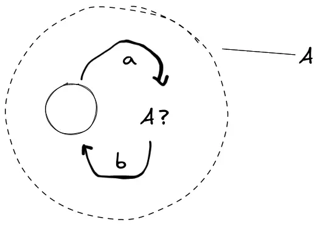

# 自动机

自动机理论[^l1][^l2][^l3]有关书籍的阅读笔记。

[^l1]: 《计算理论导引（第三版）》\[美] Michael Sipser

[^l2]: 《计算的本质：深入剖析程序和计算机》\[英] Tom Stuart

[^l3]: 《编译原理》\[美] Alfred V. Aho, Monica S.Lam 等

## NFA、DFA和RegExp

### 1. NFA转DFA（子集构造法）

NFA转DFA的核心思想是用NFA的小状态集合（下面称为一个大状态）表示此刻NFA所**可能**处于的多种状态。
在这个大状态的基础上读一个输入，其中的小状态纷纷转换为新的小状态，产生的结果收集在一起又是一个“可能”。
只要其中一种可能包含了NFA的结束状态，说明DFA能够接受输入串（将该“可能”标记为DFA的结束状态）。

算法描述如下：

1.  从NFA的起始状态$q_0$开始，将$q_0$经过$\epsilon$能到达的所有状态放在一起（形成一个集合，即龙书所说的$\epsilon-closure(q_0)$），看成一个大的状态$Q_0$，即DFA中的起始状态；
2.  从$Q_0$开始，对于每个输入$i_x$，将$Q_0$中的每个小状态经过$i_x$所能到达的状态和这些状态经过$\epsilon$所能到达的状态放在一起（形成闭包$\epsilon-closure(move(Q_0, i_x))$），成为一个新的大状态$Q_x$，并得到DFA中的一条转换$Q_0 + i_x \to Q_x$；
3.  以得到的$Q_x$重复步骤2，直到没有新的大状态出现；
4.  对于每一个含有NFA的终止状态的大状态，标记为DFA的终止状态。

因为大状态的数量是有限的，假设NFA有$n$个状态，最坏情况生成的DFA的大状态数是NFA小状态的全部子集个数$2^n$，算法一定会停止。当然，有点“状态爆炸”。

实际应用中，经常不需要完整构建这个DFA，而是采取“On The Fly”的策略，根据输入串边构造子集边进行匹配。算法描述如下：

1.  求NFA起始状态$q_0$的$\epsilon-closure(q_0)$，记为$Q_0$；
2.  从输入串s的第一个字符c开始，求$\epsilon-closure(move(Q_0, c))$；
3.  重复这个步骤直到读完输入串。如果最后得到的那个大状态包含NFA的结束状态，则匹配成功。

#### 疑问

1.  “能够接受”不是“只能接受”，只要大状态包含NFA的结束状态就标记为DFA的结束状态，
    会不会出现原本不能识别的串现在错误地被识别了？比如某串原本使NFA抵达状态$q_m$，并非NFA的终止状态$q_t$，
    而新机器存在这样一个终止状态$Q_t = {q_m, q_t}$，这个串会不会使新机器错误地到达了$Q_t$？

    **答**：不会出现这种情况，该串永远不会使新机器到达$Q_t$。$Q_t = {q_m, q_t}$
    的存在说明系统经过了一定输入步骤之后，剩下两条分支，一条分支停留在$q_m$，另一条分支停留在$q_t$。
    而该串使NFA到达$q_m$却不能到达$q_t$，那么经过该串所代表的步数之后系统只可能处在包含$q_m$却不包含$q_t$所组成的大状态上$Q={q_m, ...|q \ne q_t}$。

         |- q0
             |- ...
                 |- qm
             |- ...
                 |- ...
                     |- ...
                         |- qt
                 |- 
                 ^ 该串使系统可能出现的状态集合（竖着的这一列）中不会出现qt，
                   在新机器中也就无法进入同时包含qm, qt的大状态

2.  NFA“接受”一个字符串s的定义是“存在”一条从起始状态到接受状态的路径即可。推导中允许存在其他未能到达接受状态的分支这很好理解，不过是否允许对s存在两条正确的路径呢？

    **答**：当然可以。可以构造两个正则表达式，它们之间有交集的部分，然后把它们并起来。其所对应的NFA，处理交集部分所代表的字符串时就可以走两条路径，且都是正确的。

### 2. NFA连接NFA

算法描述如下，假设要运算的两个NFA是N1和N2：

1.  新的NFA的起始状态是N1的起始状态，结束状态是N2的结束状态；
2.  新的NFA的转换表是N1和N2的转换表的并集，并且还要给N1的每个结束状态加上经过$\epsilon$到达N2的起始状态的转换。

### 3. NFA并NFA

算法描述如下，假设要运算的两个NFA是N1和N2：

1.  添加一个新的起始状态作为新机器的起始状态，并添加该状态经过$\epsilon$到N1和N2的起始状态的转换；
2.  新机器的结束状态集是N1和N2的结束状态的并集；
3.  新机器的转换表还要并上N1和N2的转换表。

### 4. NFA星号运算

算法描述如下，假设要运算的NFA是N：

1.  添加一个新的起始状态作为新机器的起始状态，并添加该状态经过$\epsilon$到N的起始状态的转换；
2.  新机器的结束状态集是旧机器的结束状态与新起始状态的并集（即新的起始状态也是结束状态）；
3.  对于每一个旧机器的结束状态，在新机器的转换表中添加从该状态经过$\epsilon$到**旧**起始状态的转换；
4.  新机器的转换表还要并上N的转换表。

### 5. RegExp转DFA

RegExp可以先转NFA再转DFA。

### 6. DFA状态最小化

可以论证任何正则语言都有一个唯一的（不计同构）状态数目最少的DFA。而且，从任意一个接受相同语言的DFA除法，通过分组合并等价的状态，我们总是可以得到这个状态数最少的DFA。这给了我们证明正则表达式等价的有力方式。

DFA的状态最小化《计算的本质》和龙书分别给出了不同的算法。《计算的本质》给出的叫做Brzozowski算法，理解起来比较容易：

1.  反转DFA的所有规则；
2.  交换起始状态和终止状态的角色，如果原本有多个终止状态，反转后需要设置一个新的起始状态，然后通过$\epsilon$将其连到这些状态上；
3.  将这个反转的NFA再转换为DFA，这时得到一个只能接受原始DFA所识别字符串的颠倒版本的DFA；
4.  从这个反转的DFA开始再次执行整个过程，得到的DFA可以保证是最小的。

龙书中给出的算法首先需明确一个“可区分”的概念：如果给定一个串$s$，分别从两个不同的状态$p$和$q$出发只有一个能得到接受状态，则成串$s$区分状态$p$和$q$。对任意两个状态只要存在能够区分它们的串，就说这两个状态是可区分的。该状态最小化算法的原理是将一个DFA的状态集合分划为多个组，每个组中的各个状态之间不可区分，而来自不同组之间的任意两个状态是可区分的。

1.  首先将DFA的状态划分成初始状态和终止状态两组，将这个划分记作$\prod$；
2.  对于$\prod$中的每个组，尝试将它们划分成更小的组：小组中的任意两个状态对任何输入符号都转换到$\prod$中的同一组。这个过程和子集构造法有相似之处；
3.  重复步骤2直到$\prod$不再出现更多的组。

### 7. DFA转GNFA

DFA转RegExp，借助一种叫做GNFA的特殊NFA。

算法描述如下：

1.  添加一个新的起始状态，经过$\epsilon$到达DFA的起始状态；
2.  添加一个新的结束状态，对DFA的每一个结束状态，添加经过$\epsilon$到达新结束状态的转换；
3.  对于任意两个状态，如果它们之间有同向箭头，将这些箭头合并，箭头上的输入现在变为原先输入的并。

### 8. GNFA转RegExp

算法描述如下：

1.  选择一个不是起始状态和结束状态的$q_x$；
2.  对于任意其他状态$q_1$和$q_2$，若：

    1.  $q_1 \to q_x = R_1$;
    2.  $q_x \to q_2 = R_2$;
    3.  $q_x \to q_x = R_3$;
    4.  $q_1 \to q_2 = R_4$。

    则去掉$q_x$之后$q_1$和$q_2$之间箭头上的串变为$(R_1 R_3* R_2)|R4$。
3.  重复上述步骤直到只剩下两个状态（起始和结束）。这时两个状态之间的箭头上的串就是结果。

## CFG和PDA

CFG和非确定性的PDA等价。本文中CFG和PDA都表示非确定型的，确定型的用DCFG和DPDA指代。

### 1. CFG转乔姆斯基范式

如果一个CFG具有如下形式：

$$
A\to BC\\
A\to \alpha
$$

则称为乔姆斯基范式。可以证明，从乔姆斯基范式派生出任何句子$w$都恰好需要$2n-1$步，其中$n$是$w$的长度。因此PDA识别字符串的问题也是可判定的。

乔姆斯基范式没法产生$S\to\epsilon$，因此有些书上作为特例，有些则说只允许起始变元到$\epsilon$的转换。

### 2. 消除左递归

对$A\to A\alpha|\beta$消除左递归，注意到这个式子无限展开为$\beta\alpha\alpha ...$的形式，特殊情况为$\beta$，因此可写为$A\to \beta A', A'\to\alpha A'|\epsilon$，或者直白点$A\to \beta\alpha*$。消除左递归可以避免自顶向下的语法分析中程序进入无限循环。

### 3. CFG构造PDA

先反过来想如何利用PDA来识别这个CFG的语句的，我们要设法将CFG“放在”PDA里面，然后拿输入和栈顶进行配对，如果配对成功就将输入指针右移，同时弹栈顶字符继续下一个配对。由于最终配对的是终结符，因此栈顶如果是非终结符我们需要通过弹栈再入栈，将非终结符替换为其右侧的一条规则，这模拟了人脑的一次推导过程。如果该规则失败，还需要再次弹栈入栈替换规则（回溯）。初始将起始变元S入栈。

现假设PDA转换表中一条记录的表示形式为`qi + [a,r->s] = qj`，表示系统由状态$q_i$，读取一个输入字符a，将栈顶由r替换为s，并将系统状态转为$q_j$。特别的，如果a等于$\epsilon$，
表示不读取输入（不动输入头）；如果r为$\epsilon$，表示只压入s不弹栈；如果s为$\epsilon$，表示只弹栈顶的r，无入栈。

> 吐槽一下书上的$\delta$表示法看起来很累。

为了方便，记录`qi + [a,r->xyz] = qj`表示系统由状态$q_i$，读取输入字符a，在弹出栈顶的r后依次将x、y、z入栈，最终系统的状态落到$q_j$。它实际上是`qi + [a,r->x] = qx`、`qx + [ϵ,ϵ->y] = qy`、`qy + [ϵ,ϵ->z] = qj`三步简写，$q_x$、$q_y$是两个中间状态。

现在可以粗略描述CFG构造PDA的算法了：

1.  在系统中添加$q_{start}$、$q_{loop}$、$q_{accept}$三个状态，$q_{start}$为起始状态，$q_{accept}$为接受状态。除起始变元外，中途机器的各种入栈出栈都是从$q_{loop}$出发，最终还回到$q_{loop}$上，而$q_{start}$和$q_{accept}$代表了开始和结束栈中干干净净空空如也的状态；
2.  将入$、入起始变元S添加到转换表中：`qstart + [ϵ,ϵ->$S] = qloop\`；
3.  将末了弹$添加到转换表中：`qloop + [ϵ,$->ϵ] = qaccept\`；
4.  对于所有非终结符A，非确定地选定一条规则，添加一条“替换A为该规则”的记录。例如对于规则$S\to aTb$，需添加`qloop + [ϵ,S->bTa] = qloop`，注意匹配时从a到T再到b，所以入栈时反之。重复直到T右侧的规则都添加完成；
5.  对于所有终结符a，添加一条“匹配a”的记录即可：`qloop + [a,a->ϵ] = qloop`。

回想验证一下，还是拿$S\to aTb$为例：

1.  系统处于$q_{loop}$上，栈中为`[$, S]`，走`qloop + [ϵ,S->bTa] = qloop`规则，栈变为`[$, b, T, a]`，系统状态仍在$q_{loop}$；
2.  走`qloop + [a,a->ϵ] = qloop`规则，匹配输入串的一个a，输入头往右走一格，栈变为`[$, b, T]`，系统状态仍在$q_{loop}$；
3.  匹配T是一个递归的过程，不表，若T匹配成功栈变为`[$, b]`且状态仍在$q_{loop}$；
4.  匹配一个`b`，栈变为`[$]`，状态$q_{loop}$；
5.  若输入串刚好到达末尾，走`qloop + [ϵ,$->ϵ] = qaccept`，表示接受这个字符串。

### 4. PDA转CFG

PDA转CFG的核心思想是“质本洁来还洁去”，把握住栈从空到空的特点。在做PDA转CFG的改变之前，首先要对PDA做一些修改，使PDA转换表中的每一步骤要么弹栈要么入栈，但不同时做这两个动作，也不能两个都不做。因此对于上文形如`qi + [a,r->s] = qj`的替换规则，可以分解为`qi + [a,r->ϵ] = qt`、`qt + [ϵ,ϵ->s] = qj`两步，$q_t$是中间状态；对于上文形如`qi + [a,ϵ->ϵ] = qj`的只读规则，可以看成先弹入任意一个栈符号，再弹出来：`qi + [a,ϵ->s] = qt`、`qt + [ϵ,s->ϵ] = qj`，$q_t$为中间状态。

有了这个前提，我们知道栈的每一步必定是弹栈或入栈。结合$\bold{A_{pq}}$**产生x等价于输入x能把PDA从p和空栈带到q和空栈**的证明，那么对于最先入栈的字符和最后出栈的字符，有两种可能性：

1.  除了开始和结束，栈一直没空过，那么最先入栈的字符等于最后入栈的字符，设为x。假设开始和结束的状态分别为p和q，入x时读取的输入是a，弹x时读取的输入是b，紧跟在p之后的状态（也即读a之后所处的状态）为r，在q之前的状态为s（即读b之前的状态），用记录表示下是`p + [a,ϵ->x] = r`、`s + [b,x->ϵ] = q`。可以用$A_{pq}\to aA_{rs}b$来表示这个过程；

2.  在中间的某个时间点，栈变为空了，假设此时系统所处的状态为r。可以用$A_{pq}\to A_{pr}A_{rq}$来表示这个过程。

3.  $A_{rs}、A_{pr}、A_{rq}$的处理是一个递归运用规则1和2的过程，边界情况是p、q相遇，为同一个状态，处在入栈/出栈操作序列的中间点，此时$A_{pp}\to\epsilon$。

### 一些理解、疑惑与吐槽

1.  《计算理论导引》第二章讲CFG的时候上来就是BNF范式，而第一章状态机理论又一字未提BNF范式。使得读者在理解上有些跳跃。实际上从正规文法到上下文无关文法这个限制是放宽的$L_3 \sub L_2$，正规文法也可以用BNF表达。关键在于意识到正规文法的定义$A\to
    \alpha B，A\to\alpha$和上下文无关文法定义$A\to\beta$（详细定义见底部表格）的核心差别。

    这种差别有点“只可意会，不可言传”的感觉，但可以通过尝试构造状态转换图体现出来，考虑这样两个文法：$A\to \alpha A|\epsilon、A\to \alpha A\beta
    |\epsilon$。用状态转换图表达第一个文法的时候很简单，我们只需要一个状态，即是起始也是结束，再添加一条代表输入$\alpha$的边指向自己即可，但在表示第二个文法的时候便会遇到困难，我们无法为自己到自己添加两条不同输入的边，这样体现不出先$\alpha$后$\beta$的顺序关系，那么在$\alpha$和$\beta$之间添加一个中间状态是否可行呢？但是这个中间状态分明就是整个状态图自身！不知读者能否在这里体会到一点有关维度的悖论。

    图，状态机循环引用自身：

    

    第一个文法对应的语言是$L={a^n|n\ge 0}$，第二个是$L={a^n b^n|n\ge 0}$，后者经常以匹配任意嵌套的括号的形式给出，以此说明DFA能力的局限性。但在这种嵌套引用的启发下，有些正则表达式引擎对正则表达式的能力进行了拓展，支持匹配子表达式和反引用，从而让匹配任意深度的成对嵌套成为可能。

2.  状态机的很多算法其实都是在处理“回溯”的问题。一般来说，“非确定性”意味着回溯，因为同一条件可以到达两条或多条分支，如果其中一条失败还需要回来考虑其他的。
    在定义机器状态转换表的时候我们可以直接罗列所有分支，但是在将机器实际应用的时候就必须要考虑了。有趣的是NFA的不确定性却是可以绕过、回避的，就像NFA转DFA的算法所描述的那样，将同一条件产生的各种可能性综合到一起考虑，作为新机器的一个大状态，新机器的状态个数始终是有限的。如果我们选择不绕过，那么势必需要一个辅助记忆设备来记下以前分岔的时候所处于的状态，以便未来某一时刻回到那里，于是我们就从DFA来到了PDA的领域，这个记忆设备就是PDA的栈。

3.  为什么是栈？栈里面为什么存放的不是过往的状态而是模式串（文法）信息？

    提到栈就应该想起递归，提起递归就应该想到栈。栈其实是上下文无关文法中“递归定义”特征的体现。它可以忠实的记录推导过程中的层级关系。以$S\to aTb$来说，将栈顶的$S$替换成$b、T、a$就模拟了人脑的一次推导，对于栈顶的非终结符$a$来说，假使和输入字符相同，消去$a$就完成了一次成功的匹配，之后到$T$的时候又开始“推导（入非终结符$T$右侧规则）”、“匹配（弹终结符）”……如此往复直到空栈，中途可以实现回溯，即发现入的某一规则不对，换成该非终结符的另一条规则。

    从这个计算方式来说，栈中存放模式串（文法）似乎是天经地义的事情，但是有没有可能用栈来存放状态呢？像上面PDA转CFG，其中的栈就没有用来存放文法，而是存放了一些指示状态转移的标记。另一个直观的想法是当系统在状态$q_1$对某输入有多个非确定性状态$q_2$、$q_3$、$q_4$、...时，能否将符号$...、q_4、q_3$依次入栈，然后走$q_2$分支，$q_2$成功万事大吉，失败了读取栈顶的$q_3$符号，将系统“无条件”切换到$q_3$，确定性地走$q_3$分支，若$q_3$也失败了还有$q_4$...直到栈为空？

    > 后来想了一下，栈中放模式串通过入栈退栈回溯状态是用时间线上的继起克服了同一时间只能做一件事情的困难。上面这种直观的想法也许能实现，但估计很复杂，还是用四个平行时空代表$q_1$、$q_2$、...及它们的衍生，一条分支失败时换个时空更好理解。

4.  受到NFA转DFA的启发，有没有可能将PDA匹配过程中的非确定性分支综合在一起看成一条大分支、大状态，从而不用产生回溯？书上说PDA和DPDA是不等价的，所以这个想法一定是不可行的，其不可行在哪里？是什么本质原因导致了这一不可行？

    问题出在栈这里。下推自动机比起有限状态机多了栈设备，对于NPDA来说，它的非确定性相当于同时在多个时空对该时空的栈进行弹出和推入，并且需要知道所有出现在这些栈顶的字符。我们可以把多个可能出于的状态合并为一个大状态，却无法将多个栈设备合并成一个栈设备，毕竟栈是线性的，而栈顶只有一个。

    有限自动机的一个状态能表示许多状态的组合，图灵机的一条纸带能存储许多纸带的内容（并通过广度优先搜索非确定性的各种可能），但一个下推自动机的栈无法同时表示多个可能的栈。

5.  栈没有完全解决非确定型PDA回溯的问题，它只是提供了回溯的操作，并没有方式指明要回溯到什么程度，还是$S\to
    aTb$的例子，假如在处理$T$的时候有两条规则，第一条规则替换栈顶的$T$之后失败了，我怎么知道要弹栈到什么程度，再把$T$的另一条规则入栈呢？我作为旁观者知道要弹栈直到只剩下一个$b$为止，但是机器不知道，而且机器中的栈是有限制的，只提供了对栈顶的访问能力，没有“栈高度”之类的信息。

    并且，“读取输入”说得轻巧，要实现这个操作输入串上应该有个指针指向当前读到的位置的，如果发生了回溯，如何表明输入串上的指针应该移动到哪里？$S\to aTb, T\to ac|ab$，假如输入串是$aabb$，$T$的第一条规则$ac$势必会失败，此时栈应该是`[bc]`（过程`[bTa] -> [bT] -> [bca] -> [bc]`），输入串应该是`aa[b]b`，应该回溯到`[bba]`和`a[a]bb`的场景。But How To?

    “非确定型”其实是并发模型，平行时空，因此遇到分支时，系统其实是“分裂”出对应数目的完全相同的机器去走不同的分支，错误的分支不必回溯，只要有一个分支能匹配成功系统就接受这个输入。

6.  可以把栈换成其他信息更多的数据结构吗？对计算能力有什么改变，能否让算法设计变得简单？

    图灵机正是将只能FILO的栈设备换成了更灵活的一维纸带作为存储设备（同时也作为输入设备），提高了计算能力。

## DCFG和DPDA

这一段看《计算的本质》更好一些。书中是先介绍DPDA再引出的NPDA，通过一个识别回文串的例子。为了找到回文串的中间，使用DPDA我们只能通过一种“逃避”的手段，在字符串中间放一个特殊字符，这是因为在输入读完之前我们不知道输入串的长度。为了避免这种自欺欺人，可以像DFA到NFA一样放松确定性约束。

:::error
TODO
:::

## 附录

### 名词解释

1.  DFA: 确定型有穷自动机
2.  NFA: 非确定型有穷自动机
3.  RegExp: 正则表达式
4.  GNFA: 广义非确定型有穷自动机，其输入是RegExp
5.  CFG: 上下文无关文法（Context Free Grammer，不是Control Flow Graph🍵）
6.  PDA: 下推自动机
7.  DCFG: 确定型上下文无关文法
8.  DPDA: 确定型下推自动机
9.  DTM: 确定型图灵机

### 改自Wiki上的一个表格

> $V_N$表示非终结符集合，$V_T$表示终结符集合。

| 乔姆斯基语法分类 | 语言模型                            | 自动机模型                                                        | 语法规则                                                                                                                                                                     | Example        |                                              |
| -------- | ------------------------------- | ------------------------------------------------------------ | ------------------------------------------------------------------------------------------------------------------------------------------------------------------------ | -------------- | -------------------------------------------- |
| L(0)     | 递归可枚举（Recursively Enumerable）语言 | 图灵机（Turing Machine）                                          | $\alpha \to \beta$，其中$\alpha\in(V_N \cup V_T)^*$且至少含一个非终结符，$\beta\in(V_N \cup V_T)^*$。即$\alpha$和$\beta$都是符号串，允许$\beta$为空。                                                | \$L={\omega    | \omega\ \text{describes a terminating TM}}\$ |
| L(1)     | 上下文有关（Context Sensitive）语言      | 线性有界非确定型图灵机（Linear-bounded non-deterministic Turing Machine） | $\alpha A\beta \to \alpha\gamma\beta$，其中$A\in V_N$，$\alpha,\beta\in(V_N \cup V_T)^*$，$\gamma\in(V_N \cup V_T)^+$。即$A$只能在$\alpha$和$\beta$这样的上下文环境才可以替换为$\gamma$，且不允许替换为空。 | \$L={a^nb^nc^n | n>0}\$                                       |
| L(2)     | 上下文无关（Context Free）语言           | 非确定型下推自动机（Non-deterministic pushdown automata）               | $A\to\beta$，其中$A\in V_N$，$\beta\in(V_N \cup V_T)^*$。                                                                                                                     | \$L={a^nb^n    | n>0}\$                                       |
| L(3)     | 正规（Regular）语言                   | 有限状态自动机（Finite State Automaton）                              | （左线性定义）$A\to\alpha B$, $A\to\alpha$ （右线性定义）$A\to B\alpha$, $A\to\alpha$，其中$A,B\in V_N，\alpha\in V^*_T$。                                                              | \$L={a^n       | n\ge0}\$                                     |
