# 计组

南京大学计算机组成原理[^link1][^link2]课程笔记，符合我对该课程的所有想象。

[^link1]: <https://www.bilibili.com/video/BV1kE411X7S5>

[^link2]: <https://www.bilibili.com/video/BV1rJ411U7EC>

## 数据的表示

根据小数点位置固不固定可以将计算机中数的表示分为“定点数”和“浮点数”。而任意实数都可以表示成$X=(-1)^S × M × R^E$的格式，S用于决定X的符号，M是二进制定点小数，称为X的尾数；E是二进制定点整数，称为X的阶或者指数；R是基数（radix、base），一般为2、4、16等。因此用两个定点数编码就能表示一个浮点数。

### 原码

原码比较好理解，就是在数的前面加上一位表示符号，`1`表示负数。其缺点有很多，例如有正负零不方便编程，数学计算不方便设计电子电路等。

### 移码

移码主要用于表示定点数的指数（阶），其核心用途是把负数变成正的便于比较阶的大小，方法是给待比较的数都加上一个偏移量（偏置常数Excess/bias）。通常当编码位数为$n$是，bias取$2^n-1$或$2^{n-1}-1$。例如$-8$和$7$，$n=4，2^{n-1}=8$，两数分别加上$8$成为$0000B$和$1111B$。

### 补码

补码本质是模运算的思想。以现实中的时间系统（模12系统为例），时针指向10点要拨向6点，可以倒拨4格，也可以顺拨8格，其实是$10-4=10+8 (mod 12)$。称$-4$的模12补码为$8$，从中可以发现两个特点：

1.  一个负数的补码等于模直接加上该数，对于正数，模加上该数再取模还是该数取模，因此任何数的补码都可以用该数加上模再取模来计算；
2.  对于一个确定的模，某数减去小于模的另一数，总可以用该数加上减数相反数的补码来代替。

在n位二进制运算器中，由于位数有限，溢出会丢弃，因此运算器本质是一个模$2^n$的系统，真值的范围是$-2^{n-1} \le X < 2^{n-1}$。在这样的系统中补码可以形式化地定义为$[X]*{补} = 2^n + X (mod\ 2^n)$，这里的${X}$即真值，$[X]*{补}$为机器数。

:::info
快速记住补码真值的范围：一共有$2^n$位，在原码中有正负两个零，补码解决了这个问题，从而省下一位，可以多表示一个数，而补码的正数部分和原码是一样的，于是多出来一个负数，实际上正是$-2^{n-1}$，假设$n=8$，即$1000\ 0000$，原来的“负零”。
:::

以求$-123$的补码表示为例，$-123=-(127-4)=-(0111\ 1111B - 0100B)=-0111\ 1011B$：

$$
\begin{split}
[-0111\ 1011]_{补} &= 2^8 - 0111\ 1011\\
&= 1\ 0000\ 0000 - 0111\ 1011\\
&= \textbf{1111\ 1111 - 0111\ 1011 + 1}\\
&= \textbf{1000\ 0100 + 1}\\
&= 1000\ 0101
\end{split}
$$

式子中加粗的两处其实就是常见口诀“按位取反，尾数加1”和“从右向左第一个1前面的数取反“的体现。

### 浮点数

浮点数的机器数表示思想和十进制科学计数法一致，只不过基换成了2，前面的数也变成了2进制表示的。例如$1.101_{two}×2^{-10}$。由于左边的$1.101$也可以换成$11.01$、$0.1101$等，在科学计数法里一般把整数部分只保留一个非0数的称为规格化数。

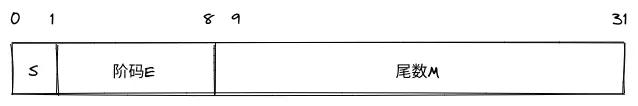

图中第0位表示**符号S（sign）**，第1～8位为8位**移码**表示的**阶码E（exponent）**（偏置常数为128）；第9～31位为24位二进制**原码**小数表示的**尾数M（significand）**。

由于原码表示关于原点对称，故其表示范围关于原点对称。可以看出这种机器表示不能完整地表示全部浮点数（~~本来也不可能用有限的数位表示无限的数~~），实际表示的是原点左右不与原点相邻的两个区间，存在“负上溢”、“负下溢”等等。另一方面，**用来表示浮点数的位数个数和定点数是一样的，因此所能表示的浮点数的个数也没变多。但是能表示的范围却变大了，数的分布变稀疏了**。

#### IEEE754标准

##### 标准格式

The set of finite floating-point numbers representable within a particular format is determined by the following integer parameters:

*   $b$ = the radix, 2 or 10
*   $p$ = the number of digits in the significand (precision)
*   $emax$ = the maximum exponent $e$
*   $emin$ = the minimum exponent $e$

    $emin$ shall be $1−emax$ for all formats.

Within each format, the following floating-point data shall be represented:

*   Signed zero and non-zero floating-point numbers of the form $(-1)^s×b^e×m$, where $s$ is $0$ or $1$.
*   $e$ is any integer $emin\le e\le emax$.
*   $m$ is a number represented by a digit string of the form $d_0d_1d_2…d_{p−1}$ where $d_i$ is an integer digit $0\le d_i\le b$ (therefore $0\le m<b$).
*   Two infinities, $+\infty$ and $-\infty$.
*   Two NaNs, qNaN (quiet) and sNaN (signaling).

These are the only floating-point data represented.

##### 补充格式

In the foregoing description, the significand m is viewed in a scientific form, with the radix point immediately following the first digit. It is also convenient for some purposes to view the significand as an integer; in which case the finite floating-point numbers are described thus:

*   Signed zero and non-zero floating-point numbers of the form $(-1)^s×b^q×c$, where
    *   $s$ is $0$ or $1$.
    *   $q$ is any integer $emin\le q+p-1\le emax$.
    *   $c$ is a number represented by a digit string of the form $d_0d_1d_2…d_{p−1}$ where $d_i$ is an integer digit $0\le d_i<b$ ($c$ is therefore an integer with $0\le c<b^p$).

This view of the significand as an integer $c$, with its corresponding exponent $q$, describes exactly the same set of zero and non-zero floating-point.

意指有效数字用来表示一个整数。原本含小数点左边的$1$一共有$p$位有效数字，这种表示相当于左移了$p-1$位。左移之后有效数字为$c$，对应的阶为$q$，则有$q=e-(p-1)$，$c=m×b^{p-1}$。

##### 规格化和非规格化数的范围

The smallest positive **normal** floating-point number is $b^{emin}$ and the largest is $b^{emax}×(b−b^{1−p}$). The non-zero floating-point numbers for a format with magnitude less than bemin are called **subnormal** because their magnitudes lie between zero and the smallest normal magnitude. They always have fewer than $p$ significant digits. Every finite floating-point number is an integral multiple of the smallest subnormal magnitude $b^{emin}×b^{1−p}$.

规格化数小数点左边总是有个隐含的$1$。最小数小数部分全为$0$，因此为$b^{emin}$；最大数小数部分全$1$，有$p-1$个，$m=1+b^{-1}+b^{-2}+...+b^{-(p-1)}=\frac{1-b^{-p}}{b^{-1}}=b-b^{1-p}$，因此最大数的值为$b^{emax}×(b-b^{1-p})$。若阶全$0$，小数部分不全为$0$，标准约定将其用于表示小数点左边为$0$的数，称为非规格化数，则最小的非规格化数小数点最右边有一个$1$，其他有效数字都是$0$，值为$b^{emin}×b^{-(p-1)}$，可以发现每个浮点数都是这个数的整数倍。

##### NaN和无穷

上文已经提到，标准将全$0$阶码，非全$0$的尾数作为非规格化数。这是一种“reserved”的情况，在阶码这里有更多说明：

The range of the encoding’s biased exponent $E$ shall include:

*   every integer between $1$ and $2^{w−2}$, inclusive, to encode normal numbers
*   the reserved value $0$ to encode $\pm 0$ and subnormal numbers
*   the reserved value $2^{w−1}$ to encode $\pm\infty$ and NaNs.

更详细的，总结一表如下：

| 阶码                  | 尾数        | 表示的数               |
| ------------------- | --------- | ------------------ |
| $E=2^w-1$（全$1$）     | $T\ne 0$  | NaN                |
| $E=2^w-1$（全$1$）     | $T=0$     | 根据符号位表示$\pm\infty$ |
| $1\le E\le 2^{w-1}$ |           | 规格化数               |
| $E=0$               | $T \ne 0$ | 非规格化数              |
| $E=0$               | $T=0$     | 根据符号位表示$\pm 0$     |

~~吐槽一下~~各种字母：

1.  $b$：指数的基数；
2.  $p$：有效数字的位数，包括小数点左边的$1$；
3.  $emax$：阶的最大值；
4.  $emin$：阶的最小值；
5.  $e$：阶的值；
6.  $s$：符号位；
7.  $m$：有效数字的值，包括小数点左边的$1$；
8.  $k$：二进制编码的位数，标准规定$k=32、64$或其他$32$的大于等于$128$的倍数；
9.  $t$：有效数字不算小数点左边$1$的位数，即二进制表示中尾数的位数，有$t=p-1$；
10. $T$：有效数字不算小数点左边$1$的二进制编码值；
11. $bias$：阶的偏移量；
12. $w$：阶的移码二进制位数；
13. $E$：阶的移码二进制编码值，$E=e+bias$；

有如下恒等式成立：

1.  $k=1+w+t=w+p$，总长等于一个符号位，加上阶的长度，加上尾数的长度。对32位浮点数实现来说，$k=1+8+23=32$，对于64位浮点数，$k=1+11+52=64$；
2.  $emax=bias=2^{w-1}-1$。对32位浮点数实现来说$emax=2^7-1=127$，移码后$E=emax+bias=254=11111110B$，全$1$另做它用；
3.  $emin=1-emax=2-2^{w-1}$。对32位浮点数实现来说$emin=2-2^7=-126$，移码后$E=emin+bias=00000001$，全$0$另做它用。

##### 实例

以`[1|011 1110 1|110 0000 0000 0000 0000 0000]`为例，符号位说明是负数，阶码的值为$125-127=-2$，尾数部分的值是$1 + 1×2^{-1}+ 1×2^{-2}=1.75$，这个数实际为$-1.75×2^{-2}$。

反之，对于一个数$-12.75=-1100.11B=-1.10011×2^{3}$，则符号位为1，阶码为$3+127=128+2=1000\ 0010$，尾数部分省略小数点左边的1，最终有`[1|100 0001 0|100 1100 0000 0000 0000 0000]`，用16进制表示即C14C0000H。

以及一张很nice的图，可以比较清晰地看出浮点数的稠密关系，在$2^{-126}\sim2^{-125}$和$2^{-125}\sim2^{-124}$这两个区间内，能表示的数的个数都是固定的，因为尾数的位数有限，但是区间的总长度却不一样（一个是$2^{-126}$，一个是$2^{-125}$），因此每个数之间的距离也不一样，是两倍的关系（每个右边区间内相邻数的距离总比左边一个区间的相邻数距离大一倍）：

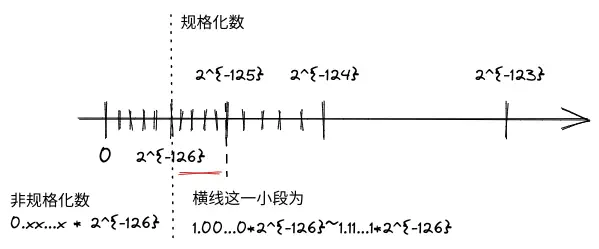

### C中的浮点数类型

在int32、float和double等类型数据之间进行强制类型转换时，需要注意：

1.  从int32转为float，不会发生溢出，但有效数字可能被舍去；
2.  从double转为float，因为float表示范围更小，故可能发生溢出，此外，由于有效位数变少，也可能发生舍入；
3.  从float或double转为int时，因为int没有小数部分，所以数据可能会向0方向被截断。此外，因为int的表示范围更小，故可能发生溢出。

例如$(d+f)-d=f$对double类型$d$和float类型$f$不一定总是成立，$d+f$过程中$f$需要向$d$对阶，类似逐级下溢，对阶后$f$的尾数有效数位可能被舍去变为0。

### C中的移位运算

| 数据类型     | 移位类型 | 如何操作          | 溢出判断               |
| -------- | ---- | ------------- | ------------------ |
| unsigned | 逻辑左移 | 高位移出，低位补0     | 如果高位移出的不是0,则发生溢出   |
| unsigned | 逻辑右移 | 低位移出，高位补0     | 可能发生有效数据丢失         |
| signed   | 算术左移 | 高位移出，低位补0     | 如果移出的位不等于新的符号位，则溢出 |
| signed   | 算术右移 | 低位移出，高位补**符** | 可能发生有效数据丢失         |

对于一个n（n>=8）位的变量x，可以借助位运算实现：

1.  x的最高有效字节不变，其余各位全变位0：`x >> (n-8) << (n-8)`

2.  x的最低有效字节不变，其余各位全变位0：`x & 0xff`

3.  x的最低有效字节全变位0，其余各位取反：`(((x ^ ~0xff) >> 8) << 8)`

    :::info
    与1异或可以实现取反操作，这里的`0xff`取反之后前面的是1，后8位全0。因此与之异或再移位可实现高位按位取反操作。话说为啥不直接对x取反。
    :::

4.  x的最低有效字节全变1,其余各位不变：`x | 0xff`

### 整数加减

根据求一个数相反数的补码“按位取反，尾数加1”的特点，$[-y]_{补}=\overline{y}+1$，可以用一套电路来完成加或减运算，只需要在电路里集成一个二路选择器，当标志位为0时做加法，$y$不变；当标志位为1时做减法，对$y$按位取反尾数加1得$y'$再与$x$进行加运算，而标识位可充当这个要加上的1。

因此无论是带符号整数还是无符号整数，都是补码进行**加法**运算，只是最终的机器数按照不同的概念解释。也因此各种加减公式根本不需要记，牢记对$2^n$取模就行。对于$x=166=A6H$，$y=255=FFH$，$x+y=165(mod\ 256)$，$x-y=167(mod\ 256)$，因此如果它们是无符号整数，结果就是$165$和$167$，如果是带符号整数，结果就是$-91$和$-89$（此时$x=-90$，$y=-1$）。

#### 四个标识位

| 标志位 | 名称   | 说明                                                                                                                                                   |
| --- | ---- | ---------------------------------------------------------------------------------------------------------------------------------------------------- |
| ZF  | 零标志  | 表示结果为0。当结果所有位为0时ZF置1。                                                                                                                                |
| OF  | 溢出标志 | 表示两个带符号数的加减运算发生溢出。根据$y'$和$x$最高位相同且不同于结果的最高位时，OF置1，否则OF置0。另一种思路是$OF=C_n⊕C_{n-1}$，溢不溢出看最后一位，对最后一位的进位输出（即$C_n$看成$Cout$）来说$C_{n-1}$就是它的$Cin$，和下面CF的讨论相同。 |
| SF  | 符号标志 | 表示带符号数结果的符号位，即结果最高位。                                                                                                                                 |
| CF  | 借位标志 | 表示无符号数加减运算时的进位或借位。加法时，若CF为1表示结果进位；减法时，若CF为1表示不够减。加法时CF就是进位输出Cout，减法时应该将Cout取反来作为借位标志。结合Cout的真值表，有$CF=Cout⊕Cin$。                                      |

:::info
借位标志的本质也是加法溢出。假如加法器只有一位，OF和CF是等价的。前4行（二路选择信号Cin为0）是加法，后4行是减法，先根据A、B、Cin算出Cout，再根据计算过程中是否有进位或借位确定CF，最后得到CF的真值表：

| A | B | Cin | Cout | CF |
| - | - | --- | ---- | -- |
| 0 | 0 | 0   | 0    | 0  |
| 0 | 1 | 0   | 0    | 0  |
| 1 | 0 | 0   | 0    | 0  |
| 1 | 1 | 0   | 1    | 1  |
| 0 | 0 | 1   | 1    | 0  |
| 0 | 1 | 1   | 0    | 1  |
| 1 | 0 | 1   | 1    | 0  |
| 1 | 1 | 1   | 1    | 0  |

用整体的视角看，如果加法器是多位，对于加法，溢出后Cout为1，而Cin为0；对于减法$x-y=x+[-y]*{补}=x+\overline{y}+1=x+2^n - 1 - y + 1=x-y+2^n$，所以如果结果溢出（$\ge 2^n$）反而说明$x\ge y$，够减，Cout为0的时候才说明不够减。综合可得异或关系。这里的$x, y$都是无符号整数因此$x=[x]*{补}$，所以我没写下标。
:::

### 整数乘除

两个n位二进制数相乘，由$(2^{n-1}+2^{n-2}+...+1)(2^{n-1}+2^{n-2}+...+1)<2^{2n}$，结果一定可以用2n位二进制表示。在n位系统中，会直接舍去高n位，所以还是模$2^n$运算。根据乘法器的实现，无符号整数和带符号整数乘出来的高n位不同，仅低n位相同，因此对于带符号数不能简单地根据高n位来判断是否发生了溢出。这时可以通过对结果与原数的运算来判断。

有些处理器会使用专门的补码乘法器来进行带符号整数乘法运算，如（改进的）Booth Algorithm。这种乘法带符号数相乘之后，若不发生溢出，则高n位与符号相同，因此如果与低n位的最高位相同则不发生溢出。

#### 常量乘除的优化

由于整数乘法比移位或加法等耗时更多，因此编译器在处理常量与变量相乘时，经常会利用移位、加减运算来代替乘法运算：

1.  不管是算术左移还是逻辑左移，即使产生溢出，得到的结果和直接相乘都是一样的，或者说相应的直接相乘也会发生溢出，取模后的结果相同；
2.  无符号相除逻辑右移，带符号相除算术右移，算术右移高位补符；
3.  在不能整除的时候，采取“朝0舍入”的方式：

    1.  对于无符号整数，右移总是变小，因此是朝0方向的，不管能否整除（整除意味着移出去的全为0，不发生有效位丢失）结果都和直接相除得到的商一样；
    2.  对于带符号数，如果符号为0与无符号数一致，但当符号为1时，移出一个非0数相当于舍去商小数点后面的数，比起精确解（当然也是负数）会更小一点，并且这个量小于$1$。因此，为了使带符号负数也能朝$0$方向舍入，可以先加上一个偏移量$2^k-1$再右移$k$位。

    :::info
    如何理解这里的偏移量$2^k-1$：假设补码表示的负数$x$右移$k$位得到$y$，余数为$r$，也就是被移出去的数为$r$，显然$r< 2^k$，有$x=y*2^k+r$，$y=\frac{x-r}{2^k}$。而$y$又是某一负数$z$的补码表示，有$z=2^n-y=2^n-\frac{x-r}{2^k}$，如果直接忽略掉移出去的$r$相当于将$z$减小了$\frac{r}{2^k}$。为了保持向$0$方向舍入，注意到$\frac{r}{2^k}<1$，我们可以将$z$加上$1$，这样就越过了$z$来到了$z$的右边（下图的$z'$），从而$z'=2^n-\frac{x-r-2^k}{2^k}$，还原回去有$x'=x+2^k$。但如果$r=0$呢，这时相当于我们直接纠正了整整一个单位长度（下图中两虚线之间的距离，右移把数轴压缩了$2^k$，一个单位长度对应原来的$2^k$），我们希望把$-1.1、-1.5、-1.99...$（直接舍入为$-2$）纠正为$-1$，但不应该把$-2$也纠正为$-1$，因此还要减去一个较小的数，使得$z'$接近于右侧虚线但永远不会达到。$1$无疑是合适的人选，因此最终的偏移量（图中问号部分）为$\frac{2^k-1}{2^k}$，有$z'=2^n-\frac{x-r-(2^k-1)}{2^k}$，从而$x'=x+2^k-1$。
    :::

     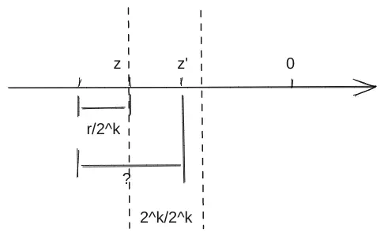

### 浮点数运算

和十进制科学计数法基本一致，分为如下步骤：

1.  对阶

    对阶的原则是，小阶向大阶看齐，也即如果两阶差值的绝对值为$\Delta E$，小阶尾数右移动$\Delta E$位，阶增加$\Delta E$。以IEEE754来说，右移时别忘了把小数点左边隐含的1加上。

2.  尾数相减

    就是定点原码小数加减运算。

3.  尾数规格化

    右规即尾数右移，阶码加1，最后一位移出时需考虑舍入；左规即尾数左移，阶码减1，直到小数点左边有个1为止。

4.  尾数舍入处理

    在对阶和尾数右规时，为保证运算精度，一般将低位移出的位保留下来，并让其参与中间过程的运算，最后再将结果进行舍入。（和我们进行十进制运算保留两位小数类似，一般运算过程中都是更精确的3～4位小数，最后才约简。）

    Each of the computational operations that return a numeric result specified by this standard shall be performed as if it first produced an intermediate result correct to infinite precision and with unbounded range, and then rounded that intermediate result, if necessary, to fit in the destination’s format.

5.  阶码溢出判断

    即阶码全1或全0。从浮点数相加、减运算过程可以看出，浮点数的溢出并不以尾数溢出来判断，尾数的溢出可以通过右规操作纠正。因此结果是否溢出通过阶是否上溢来确定。

#### IEEE754尾数舍入

1.  保留多少附加位才能保证运算的精度？

    IEEE754规定所有浮点数运算的中间结果右边都必须至少保留两位附加位。这两位附加位中，紧跟尾数右边的那一位叫做**保护位**或**警戒位**（guard），随后一位是**舍入位**（round）。为了更进一步提高精度，在保护位和舍入位后面还加上了一位**粘滞位**（sticky）。只要舍入位右边有任何非0数字，粘滞位就置1，否则置0。

2.  最终如何对附加位进行舍入？

    IEEE754规定了四种可选的模式，默认就近舍入：

    | 舍入模式           | 说明                                                                                                                                                                                                                                                                         |
    | -------------- | -------------------------------------------------------------------------------------------------------------------------------------------------------------------------------------------------------------------------------------------------------------------------- |
    | 就近舍入（中间值舍入到偶数） | the floating-point number nearest to the infinitely precise result shall be delivered; if the two nearest floating-point numbers bracketing an unrepresentable infinitely precise result are equally near, the one with an even least significant digit shall be delivered |
    | 朝$+\infty$舍入   | the result shall be the format’s floating-point number (possibly $+\infty$) closest to and no less than the infinitely precise result                                                                                                                                      |
    | 朝$-\infty$舍入   | the result shall be the format’s floating-point number (possibly $-\infty$) closest to and no greater than the infinitely precise result                                                                                                                                   |
    | 朝$0$舍入         | the result shall be the format’s floating-point number closest to and no greater in magnitude than the infinitely precise result                                                                                                                                           |

:::warning
对阶和舍入操作使得浮点数运算通常不满足加法和乘法结合律。“Consequently certain properties of real arithmetic, such as associativity of addition, do not always hold for floating-point arithmetic.”
:::

### 数据校验码

为了判断码制的冗余程度，并评估其查错何纠错能力而引入码距的概念。由若干位代码组成的一个字叫**码字**，将两个码字逐位比较，具有不同代码的位的个数叫做这两个码字间的距离，也成为汉明距离（海明距离）。一种码制可能有若干个码字，各码字间的**最小距离**称为**码距**。

#### 奇偶校验码

偶校验位即将数据的各位相异或的结果作为校验码，奇校验位则在其基础上额外再与1异或。在接收端，重新计算一遍$P'$，同时与收到的$P''$进行比对（$P'⊕ P''$），如果结果为1，说明有奇数位错，如果为0，说明无错或有偶数位错。由于两位同时出错的概率较小，故奇偶校验码校验一字节长的数据还是有效的。如果两个数据有奇数位不同，则它们的校验码也不同，如果有偶数位不同，则更是至少有两位数据不同，因此码距为$2$。

#### 汉明码

汉明码即分组的奇偶校验码。通过对数据按某种规律进行分组，对每组进行奇偶校验，以提供多位校验信息，从而可以对错误信息进行定位何纠正。

假定被校验数据的位数为$n$，校验位为$k$位，则故障字（最终比较时按位异或的结果）的位数也为$k$位，其所能表示的状态最多是$2^k$种。对于最多只有一位错的情况，其结果可能是无错，或者$n$位数据中某一位出错，或者$k$位校验码中某一位出错。因此共需表示$1+n+k$种状态，得到一个约束：$2^k\ge 1+n+k$。对于8位数据，$4$位的校验位足够了。

分组的基本思想是让码字的每一位出错位置与故障字的数值建立关系，这样可以很快确定是哪一位出错了，从而取反纠正。通常采用如下规则：

1.  如果故障字全$0$，则表示没有发生错误；
2.  如果故障字有且仅有一位是$1$，则表示校验位相应位置的出错；
3.  如果故障字中多位为$1$，则表示有一个数据位出错，故障字的值说明了出错的位置。

假定一个$8$位数据$M=M_8M_7M_6M_5M_4M_3M_2M_1$，校验位为$P=P_4P_3P_2P_1$。故障字$0000$表示无错，没有对应出错位置，因此位置号从$0001$开始。$0001, 0010, 0100, 1000$表示校验位出错，故校验位对应码字中的位置就是$1, 2, 4, 8$，即$M_8M_7M_6M_5P_4M_4M_3M_2P_3M_1P_2P_1$。应注意这只是一个逻辑上的表示，实际并不需要将数据拆分。

现在，可以得到一个出错位置与故障字的关系表，例如如果$M_1$出错，$M_1$的实际位置是$3$即$0011$，因此故障字的值就是$0011$：

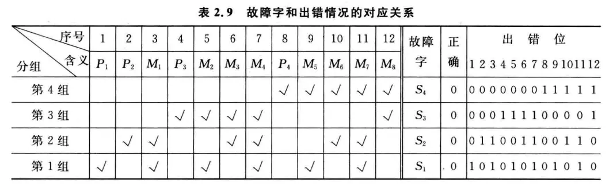

另一方面，故障字$0011$意味着第一组和第二组奇偶性发生了变化，因此$M_1$应该被分配在第一组和第二组（这样它的改变能造成奇偶性变化），类似地$M_2$应该被分配在第一、第三组……我们综合各组的成员，即可得到由各组校验位的计算方式，如采用偶校验位，有$P_1=M_1⊕M_2⊕M_4⊕M_5⊕M_7$。在图表中，这体现在每个$P_i$所处行打钩的数据位。

假设原始数据是$M=01101010$，收到的数据$M'=01111010$，$P'=0011$。我们将$M‘$按照分组计算出$P''=1010$，与$P'$按位异或得$1001$，说明第$5$位出错。纠正后就是$M$。由于每一数据位至少参与两个校验位的生成，因此至少会引起两个校验位的不同，加上数据位本身的不同，因此码距为$3$。

另一方面，我们注意到如果$M_2$和$M_5$、$M_3$和$M_6$或$M_4$和$M_7$同时出错，和$M_8$单位出错的纠错码是一样的。究其原因，是同时出错时存在奇偶性变化”抵消“的情况，使得纠错码中只有两个$1$，而$M_8$仅出现在两组中，如果出错也是两个$1$。如果我们新增一个$P_5$等于除$M_4$和$M_7$外其他数据位之异或，则每个数据位都参与了三个组，码距为$4$。此时两位出错与一位出错影响到的纠错码个数不同（前者为$2$，后者为$3$），因此码制同时具有了发现两位错与纠正一位错并且区分是两位还是一位错的能力，称为“纠一检二码”（SEC-DED码）。

## 编译与链接

一个典型的c语言源程序编译为可执行文件的过程：

### 预处理

首先进行预处理阶段，该过程主要处理文件中以`#`开头的预编译指令。包括：

1.  删除`#define`并展开所定义的宏；
2.  处理所有条件预处理指令，如`#if`；
3.  插入头文件到`#include`处，可以递归处理；
4.  删除所有的注释；
5.  添加行号和文件名标识，以便编译时编译器产生调试用的行号信息；
6.  保留所有`#pragma`编译指令（编译器需要）。

预处理命令可以使用`gcc -E`或者`cpp`，`gcc`不过是`cpp`等具体命令的一个封装。预处理之后得到的是预处理文件`hello.i`，它依然是一个可读的文本文件，但不包含任何宏定义。

### 编译

编译过程就是将预处理文件`hello.i`进行编译并优化，输出汇编代码文件，常用`.s`后缀。编译命令可以使用`gcc -S`或者`cc1`。

### 汇编

这一阶段将上面编译阶段生成的汇编代码文件称为“汇编语言源程序”，输出可重定位目标文件`hello.o`。实现这一过程的叫做汇编器，汇编指令和机器指令一一对应，最终生成的`hello.o`文件中都是二进制机器指令序列。汇编命令可用`gcc -c`或者`as`。由于生成的结果都是二进制格式，一般会使用`objdump`等工具来查看其内容。

### 链接

上面的三个步骤都是针对一个模块（一个`.c`文件）进行处理，得到一个`.o`文件，而链接过程将多个可重定位目标文件合并以生成可执行目标文件，常见的的如ELF文件等。链接命令为`gcc -static`或`ld -static`，这里`-static`表示的是静态链接。如果生成的是ELF文件，可以使用`readelf`工具查看其内容。

从根本上说，链接是因为模块化的需要。不同的模块之间存在相互引用，而编译阶段又是分开进行的，因此各模块先从虚地址0开始组织自己的指令，最终由链接器统筹合并，链接的本质是合并各个模块中相同的节，如`.text`、`.data`等。合并后模块内指令的地址当然都变了，因此像`call`这类指令跳转的目标地址就需要重定位。由于链接时我们也不知道程序最终运行时会装入内存中何处，因此合并是合并到虚拟地址空间里，

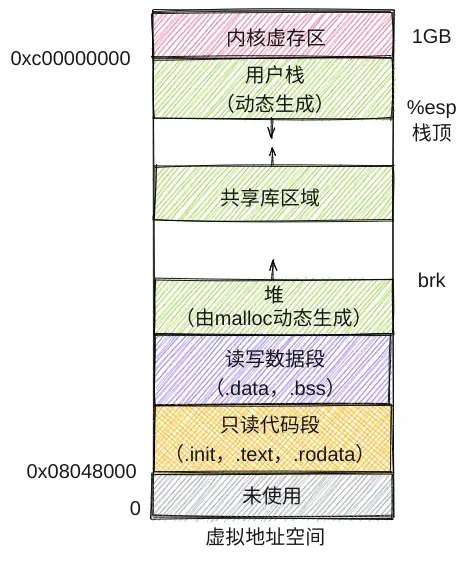

链接通常有如下步骤：

1.  确定符号引用关系；
2.  合并相关`.o`文件；
3.  确定每个符号的地址；
4.  在指令中填入新地址。

其中第1个步骤称为**符号解析**，后面三个步骤都属于**重定位**步骤。

下面是两段示例代码，我们将围绕这两段代码学习链接的过程：

*   main.c

```c
int buf[2] = {1, 2};

void swap();

int main() {
  swap();
  return 0;
}
```

*   swap.c

```c
extern int buf[];

int*        bufp0 = &buf[0];
static int* bufp1;

void swap() {
  int temp;
  bufp1  = &buf[1];
  temp   = *bufp0;
  *bufp0 = *bufp1;
  *bufp1 = temp;
}
```

#### 符号解析

##### 链接符号的类型

每个可重定位目标模块都有一个符号表，它包含了在模块中定义的符号。分三种：

*   Global symbols（模块内部定义的**全局符号**）

    由模块定义并且能被其他模块引用的符号。例如非`static`C函数和非`static`的全局变量。如上述代码`main.c`中的`main`函数、`buf`变量；`swap.c`中的`swap`函数，`bufp0`。

*   External symbols（外部定义的**外部符号**）

    由其他模块定义并被模块引用的全局符号。如上述代码`main.c`中的`swap`，`swap.c`中的`buf`。

*   Local symbols（本模块定义并引用的**局部符号**）

    仅由模块定义和引用的本地符号。例如模块中带`static`的C函数和变量。如上述代码`swap.c`中的`bufp1`。

:::info
局部变量分配在栈中，不会在过程（函数）外被引用，因此不算符号定义。
:::

符号解析的目的是解决符号定义与符号引用的关联关系，每个符号定义在代码段或数据段中都被分配了存储空间，因此将引用符号和定义符号建立关联后，就可在重定位阶段将引用符号的地址重定位为相关联的定义符号的地址。所谓“符号定义”，指得就是分配了存储空间，对于函数名就是指其代码所在区；对于变量名即指其所占的静态数据区。所有定义符号的值就是其首地址。

本地的局部符号因为只在本模块内引用，因此解析比较简单，只要和定义处相关联即可。可能在其他模块定义或引用的全局符号则比较复杂。

##### 全局符号的强弱性质

函数名和已初始化的全境变量名是强符号，其他未初始化的全局变量名是弱符号。在上述代码`main.c`中，`buf`和`main`是强符号；在`swap.c`中，`bufp0`和`swap`是强符号。相应的`main.c`中的`swap`声明是弱符号，`swap.c`中的`buf`声明也是弱符号。而`swap.c`中的`bufp1`属于本地局部变量，既不是强符号也不是弱符号。

##### 符号解析规则

1.  强符号不能多次定义，否则链接报错；

2.  若一个符号被定义为一次强符号和多次弱符号，则以强定义为准；换句话说对弱符号的引用始终被解析为其强定义符号；

3.  若有多个弱符号定义，则任选其中一个。

:::warning
有时这会带来问题，可以使用`gcc`的`-fno-common`命令进行链接，链接器将在遇到多个弱定义符号时给出一条警告信息。
:::

以下面这段程序为例来看看多重符号定义可能导致的问题：

*   muldef.c

```c
#include <stdio.h>

int d = 100;
int x = 200;

void p1(void);

int main() {
  p1();
  printf("d=%d,x=%d\n", d, x);

  return 0;
}
```

*   p1.c

```c
double d;

void p1() {
  d = 1.0;
}
```

下面是实际运行的结果，如果不了解链接的细节，非常出人意料：

```bash
gcc  -c -o muldef.o muldef.c
gcc  -c -o p1.o p1.c
gcc  -Xlinker --allow-multiple-definition -o muldef.out muldef.o p1.o
./muldef.out
d=0,x=1072693248
```

编译的时候是一个模块一个模块进行的，所以`p1.c`编译的时候它只认自己的`double d`，因此生成的指令也是将其按照`double`类型来处理。对于`muldef.c`来说，它给`d`分配的是`int`的4个字节。在`muldef.c`中执行了`p1()`之后，要赋给`d`的值`1.0`按照二进制解释，符号为是$0$，阶码是$0+1023=1111111111B$，尾数全$0$，`[0|01111111111|0...0]`，即`0x3ff0 0000 0000 0000`，我的机器是小端方式，故此时在读写数据段`x`和`d`的分布如下（从下往上为低地址到高地址），不仅$d$的值不是我们想要的结果，$x$的值也被冲掉了，$x$的值为`0x3ff00000`即$1072693248$。

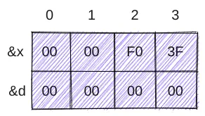

#### 重定位

重定位通常分三步：

1.  合并相同的节；

    将所有链接到可执行文件中的目标模块中相同的节合并成新节。

2.  对所有定义符号进行重定位（确定地址）

    确定新节中所有定义符号在虚拟地址空间中的地址。这一步之后每个指令和变量的地址都可确定。

3.  对引用符号进行重定位

    修改`.text`、`.data`节中对每个符号的引用（地址）。

重定位信息由汇编器生成，汇编器在遇到引用时，会提一个初始值，同时生成一个重定位条目来告诉未来的链接器，这个地方需要重定位。数据引用的重定位条目放在`.rel.data`节，指令中引用的重定位条目放在`.rel.text`节。

##### PC相对地址重定位

在我的x86-64机器上，使用`gcc -m32 -fno-pic -c -o main.o main.c`编译`main.c`后，`objdump -S main.o`输出如下。

:::info
这里的`-m32`生成32位目标文件，`-fno-pic`禁止`gcc`默认生成位置无关代码（PIC，Position Independent Code）的行为。PIC属于动态链接的范畴，将会在后面讲到。
:::

```asm
main.o:     file format elf32-i386

Disassembly of section .text:

00000000 <main>:
   0:   55                      push   %ebp
   1:   89 e5                   mov    %esp,%ebp
   3:   83 e4 f0                and    $0xfffffff0,%esp
   6:   e8 fc ff ff ff          call   7 <main+0x7>
   b:   b8 00 00 00 00          mov    $0x0,%eax
  10:   c9                      leave
  11:   c3                      ret
```

主要关注第6行，利用`readelf -r`可以知道这里是调用`swap`的地方，采用PC相对地址重定位方式：

```bash
❯ readelf -r main.o

Relocation section '.rel.text' at offset 0x128 contains 1 entry:
 Offset     Info    Type            Sym.Value  Sym. Name
00000007  00000502 R_386_PC32        00000000   swap
```

`main`函数在`.text`偏移为0处，占0x12字节，换算成10进制就是18字节。在`0x6`处有`call`指令对应的机器码`e8`，需要重定位的起始位置从`0x7`开始，当然也正是上面`swap`的Offset。

`call`后面填入的初始值是`0xfffffffc`，后面我们会看到为什么是这个奇怪的值，现在只要算出来它按照补码表示解释是$\text{0xfffffffc}-2^{32}=-4$即可。

使用`objdump`提取出`.data`区域的信息，这里存放的是`buf`数组，它有两个元素`1`和`2`，按照小端放置，因此得到下面内容：

```bash
❯ objdump -s -j .data main.o

main.o:     file format elf32-i386

Contents of section .data:
 0000 01000000 02000000                    ........
```

`-s`输出完整内容，`-j`选择要输出哪个section。这和我们从`readelf -s`中得到符号表中的信息是一致的，`buf`占了8B，不过我这里的输出没有`Of`偏移量这一列：

```bash
❯ readelf -s main.o

Symbol table '.symtab' contains 6 entries:
   Num:    Value  Size Type    Bind   Vis      Ndx Name
     0: 00000000     0 NOTYPE  LOCAL  DEFAULT  UND
     1: 00000000     0 FILE    LOCAL  DEFAULT  ABS main.c
     2: 00000000     0 SECTION LOCAL  DEFAULT    1 .text
     3: 00000000     8 OBJECT  GLOBAL DEFAULT    3 buf
     4: 00000000    18 FUNC    GLOBAL DEFAULT    1 main
     5: 00000000     0 NOTYPE  GLOBAL DEFAULT  UND swap
```

现在将`main.o`和`swap.o`链接成可执行文件，`main`函数的地址是`0x8049000`，而`swap`紧跟在`main`后面，因此`swap`的地址是`0x8049012`，注意其机器代码首地址会按照4字节边界对齐，这里的`0x8049012`是符合条件的：

```bash
❯ gcc -m32 -no-pie -nostdlib main.o swap.o -o main.out
/usr/bin/ld: warning: cannot find entry symbol _start; defaulting to 0000000008049000

❯ objdump -d main.out

main.out:     file format elf32-i386


Disassembly of section .text:

08049000 <main>:
 8049000:       55                      push   %ebp
 8049001:       89 e5                   mov    %esp,%ebp
 8049003:       83 e4 f0                and    $0xfffffff0,%esp
 8049006:       e8 07 00 00 00          call   8049012 <swap>
 804900b:       b8 00 00 00 00          mov    $0x0,%eax
 8049010:       c9                      leave
 8049011:       c3                      ret

08049012 <swap>:
    ...
```

重点来了，重定位之后`main`函数那个`call`指令后填入的机器码我们看到是`0x00000007`，这是怎么来的？`call`指令的作用是将自身下面一行的指令压栈，然后跳转到`call`的转移目标地址去执行，在这里，转移目标地址当然就是`swap`所在处的首地址，也就是`0x8049012`。但`call`后面填入的不是这个数，实际填入的是一个偏移量。有公式：偏移量=目标地址-PC。因此我们要算出当前PC，而PC总是指向当前指令的下一条指令，那么此时PC应该指向`0x804900b`，`0x12`等于18，`0xb`为11，$18-11=7$，最终填入的偏移量是`0x8049012-0x804900b`，按小端填入`0x00000007`。

:::info
总结：这个“偏移量”是**相对PC位置的偏移**，在上图中PC指向`0x804900b`那一行，我们从PC往后数7个字节就是`swap`的所在处。
:::

另有一个公式来计算PC：PC=`.text`节首地址+待重定位位置相对`.text`节偏移量-初始值。这里的`.text`节起始处就是`main`，待重定位位置就是`e8`后面那个地方，为`0x8049006+1=0x8049007`，而初始值正是前文述及的，在`main.o`中`call`指令后面预先填入的`0xfffffffc`也即$-4$。我们带入验算一下显然式子成立。下一条指令（PC）与当前`call`指令（`e8`）之间差了4个字节，所以才预先填入的$-4$。

##### 绝对地址重定位

下面将目光转向`swap.o`，通过`objdump`可以看到，`swap.o`的`bufp0`由于依赖外部的`buf`变量，初始值预先填入的是0，通过`readelf`可以看到`swap.o`中的`buf`是绝对地址重定位方式：

```bash
❯ readelf -r swap.o

Relocation section '.rel.text' at offset 0x170 contains 6 entries:
 Offset     Info    Type            Sym.Value  Sym. Name
00000008  00000301 R_386_32          00000000   .bss
0000000c  00000601 R_386_32          00000000   buf
00000011  00000501 R_386_32          00000000   bufp0
0000001c  00000301 R_386_32          00000000   .bss
00000021  00000501 R_386_32          00000000   bufp0
0000002a  00000301 R_386_32          00000000   .bss

Relocation section '.rel.data' at offset 0x1a0 contains 1 entry:
 Offset     Info    Type            Sym.Value  Sym. Name
00000000  00000601 R_386_32          00000000   buf
```

我们再看看可执行文件`main.out`中的`.data`域，这里存放了`buf`和`bufp0`，由于`bufp0`的值是`&buf[0]`，也就是`buf`所在的地址，所以`bufp0`的值是`0x804c000`，故按照小端方式排布`00c00408`：

```bash
❯ objdump -s -j .data main.out

main.out:     file format elf32-i386

Contents of section .data:
 804c000 01000000 02000000 00c00408           ............
```

我们对比一下`swap.o`和`main.out`的机器代码

```bash
❯ objdump -d swap.o

swap.o:     file format elf32-i386

Disassembly of section .text:

00000000 <swap>:
  0:   55                      push   %ebp
  1:   89 e5                   mov    %esp,%ebp
  3:   83 ec 10                sub    $0x10,%esp

 # 下面这两行对应代码：bufp1 = &buf[1]，int类型占4个字节，所以bufp1 = buf + 4，也就是说这个0x00000004来自索引[1]
 # 位置0x8后面是预先填入的0，需要重定位
 # 查看上面readelf -r swap.o的结果可知这里将要填入的是合并后.bss节的首地址，因为本地局部变量bufp1放置在.bss节
 # 利用readelf查看main.out里面.bss的地址得到0x0804c00c
 # 故这里重定位之后应填入0c c0 04 08，检查下面main.out里swap的机器码得到验证
 # 并且可以看到重定位之后0x4也改写成了真正的buf[1]元素地址0x0804c004

  6:   c7 05 00 00 00 00    movl   $0x4,0x0
  c:   04 00 00 00

 # 下面四行对应代码：temp = *bufp0，类似的在位置0x11后面需要重定位，待填入bufp0的地址
 # bufp0放置在合并后的.data节，位置在buf的后面8个字节处（因为buf有两个int元素），地址为0x0804c008，值就是buf的地址，为0x0804c000
 # 故重定位之后应该填入08 c0 04 08

 10:   a1 00 00 00 00          mov    0x0,%eax
 15:   8b 00                   mov    (%eax),%eax
 17:   89 45 fc                mov    %eax,-0x4(%ebp)

 # 0x1c这里需要重定位，填入合并.bss节首地址，同上

 1a:   8b 15 00 00 00 00       mov    0x0,%edx

 # 下面三行对应代码：*bufp0 = *bufp1，0x21这里需重定位，填入bufp0地址，同上

 20:   a1 00 00 00 00          mov    0x0,%eax
 25:   8b 12                   mov    (%edx),%edx
 27:   89 10                   mov    %edx,(%eax)

 # 下面三行对应代码：*bufp1 = temp，0x2a这里需重定位，填入.bss首地址，同上

 29:   a1 00 00 00 00          mov    0x0,%eax
 2e:   8b 55 fc                mov    -0x4(%ebp),%edx
 31:   89 10                   mov    %edx,(%eax)
 33:   90                      nop
 34:   c9                      leave
 35:   c3                      ret

❯ objdump -d main.out

main.out:     file format elf32-i386

Disassembly of section .text:

08049000 <main>:
8049000:       55                      push   %ebp
8049001:       89 e5                   mov    %esp,%ebp
8049003:       83 e4 f0                and    $0xfffffff0,%esp
8049006:       c7 05 0c c0 04 08 03    movl   $0x3,0x804c00c
804900d:       00 00 00
8049010:       e8 07 00 00 00          call   804901c <swap>
8049015:       b8 00 00 00 00          mov    $0x0,%eax
804901a:       c9                      leave
804901b:       c3                      ret

0804901c <swap>:
804901c:       55                      push   %ebp
804901d:       89 e5                   mov    %esp,%ebp
804901f:       83 ec 10                sub    $0x10,%esp
8049022:       c7 05 10 c0 04 08       movl   $0x804c004,0x804c010
8049028:       04 c0 04 08
804902c:       a1 08 c0 04 08          mov    0x804c008,%eax
8049031:       8b 00                   mov    (%eax),%eax
8049033:       89 45 fc                mov    %eax,-0x4(%ebp)
8049036:       8b 15 10 c0 04 08       mov    0x804c010,%edx
804903c:       a1 08 c0 04 08          mov    0x804c008,%eax
8049041:       8b 12                   mov    (%edx),%edx
8049043:       89 10                   mov    %edx,(%eax)
8049045:       a1 10 c0 04 08          mov    0x804c010,%eax
804904a:       8b 55 fc                mov    -0x4(%ebp),%edx
804904d:       89 10                   mov    %edx,(%eax)
804904f:       90                      nop
8049050:       c9                      leave
8049051:       c3                      ret
```

#### 静态链接库

有时为了方便复用，可以将公共的模块打包成静态链接库文件，在linux上即常见的`.a`文件。在构建可执行文件时，只需指定库文件名，链接器会自动到库中寻找那些应用程序用到的目标模块，并且只会将用到的模块从库中拷贝出来，链接到可执行文件中。

创建静态库通常使用`ar`工具。常见的如C标准库`libc.a`、C数学库`libm.a`等。

#### 动态链接库

静态链接库将库函数提取打包到可执行文件的特点可以看作是一种“硬编码”，不仅造成了空间上的浪费，在需要热更新、分发软件的场景，如果一个组成模块更新了就要对整个可执行文件进行重新编译链接也是非常不方便的一件事，因此出现了动态链接库，顾名思义，就是在程序加载或运行过程中动态地加载进来并链接的库文件，在Linux常见于`.so`文件，在Windows上常见的`.dll`文件。动态链接库在内存和磁盘都可以只有一个备份，节省了内存和磁盘空间。

通常使用`gcc -shared -PIC`命令生成动态链接库，这里的`-PIC`要求生成位置无关代码。

根据动态链接时机的不同，有两种方式：

1.  在程序首次加载时进行（load-time linking）

    在linux中，通常由动态链接器ld-linux.so自动处理（`.interp`段指明动态链接器名），标准C库libc.so通常按照这种方式动态被链接。

2.  在程序已经开始运行后进行（run-time linking）

    在linux中，通过调用`dlopen()`等接口来实现。

##### PIC

显然要实现动态链接，首先要考虑引用和重定位的问题，由此引出了PIC的概念，也就是位置无关代码。PIC使得：

1.  共享库代码被加载的位置可以是不确定的；
2.  即使共享库代码的长度发生变化，也不影响调用它的程序。

根据引用与跳转的不同，有如下四种场景：

*   模块内部函数调用或跳转

    由于调用与跳转目标都在一个模块，相对位置固定，只要用相对偏移寻址即可。不需要重定位。

*   模块内数据引用

    模块内部的数据引用，引用处在`.text`节，数据放置在`.data`节，那么引用处与`.data`和`.data`到数据的偏移都是固定的，因此也不需要重定位，只是这时需要多几条指令把这个固定的偏移计算出来，而静态链接在重定位阶段做好了计算，这里只需要一条`mov`指令。

    `[.text ... 引用 ...][.data ... 数据 ...]`

*   模块外数据引用

    由于引用其他模块的全局变量，无法确定相对距离。这时可以在`.data`首地址处设置一个指针数组（**全局偏移表，GOT**），表中的指针指向一个全局变量，模块中的引用都指向GOT中的项。这样GOT与`.text`中的引用处的相对距离是固定的。汇编器会为GOT中的每一项生成一个重定位项放置在`.rel.data`节。最终由动态链接器在加载时对GOT中的各项进行重定位，填入所引用数据的真实地址。这个过程相比静态链接需要多几条指令外，间接寻址方式也使得需要多一个寄存器。

    `[.text ... 引用 ...][.data GOT ...]`

*   模块间调用跳转

    模块间调用跳转，除了也可以借助GOT作为跳板来实现之外，还有一种懒加载的技术称为“延迟绑定（lazy binding）“，也就是不在加载时重定位，推迟到第一次函数调用时。下面以这段示例代码来说明延迟绑定的细节：

    ```c
    extern void ext();

    void foo() {
        bar();
        ext();
    }
    ```

    在lazy binding机制中，GOT开始的三项固定，含义如下：

    1.  GOT\[0]为`.dynamic`节首地址，该节包含动态链接器所需要的基本信息，如符号表信息、重定位表位置等；
    2.  GOT\[1]为动态链接器的标识信息；
    3.  GOT\[2]为动态链接器延迟绑定代码的入口地址；
    4.  从GOT\[3]开始都是被调用函数的GOT项，和上面的情形一样，本例中`GOT[3]`对应`ext`。

    PLT是`.text`节的一部分，是一个结构数组，每项16B，除PLT\[0]外，其余项各对应一个共享库函数，本例中PLT\[1]对应`ext`。
    PLT\[0]存放的是两段固定代码：

    ```asm
    PLT[0]:
    0804833c: ff 35 88 95 04 08     pushl 0x08049588
    08048342: ff 25 8c 95 04 08     jmp *0x0804958c
    PLT[1] <ext>: # 用ID=0标识ext函数
    0804834c: ff 25 90 95 04 08     jmp *0x08049590
    08048352: 68 00 00 00 00        pushl $0x0 
    08048357: e9 e0 ff ff ff        jmp 0x0804833c
    ```

      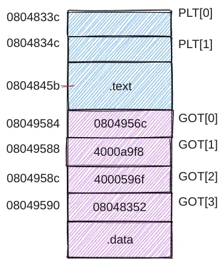

    假设`ext`的调用在`.text`中`0x0804845b`处：

    ```asm
    0x0804845b: e8 ec fe ff ff      call 0x0804834c
    ```

    首先理解这里`e8`后面的偏移量，它由跳转目标与PC的差而来，当执行到这里时，PC处于下一条指令的位置即`0x0804845b+0x5=0x08048460`，跳转目标为PLT\[1]首地址，故偏移量为`0x0804834c-0x08048460=-276=0xfffffeec`，所以按照小端填入`ec fe ff ff`。这里不论是PLT还是调用位置都是模块内的，因此无需动态链接早早就可以确定。

    现在我们转到了`0x0804834c`，这里是一条`jmp`指令，并且后面是间接地址，也就是要跳转到`0x080489590`处值所代表的地址，在图中我们看到GOT\[3]处值为`0x08048352`，它是`jmp`的下一条指令，这条指令将用来标识函数的一个值压入栈中，这里使用`ID=0`来标识`ext`函数，所以压入的是`0x0`。

    继续执行，下面又有一条`jmp`指令，跳转到`0x0804833c`，也就是PLT\[0]首地址。PLT\[0]这里的`pushl`将GOT\[1]的内容压栈，也就是将动态链接器的标识信息压栈。压完栈之后又是一条`jmp`指令，后面是间接地址，故跳转到`0x0804958c`里面值所代表的地址`0x4000596f`，也就是转到了动态链接器延迟绑定代码去执行。

    **延迟绑定代码可以根据栈中的GOT\[1]和ID=0来确定`ext`地址并重写GOT\[3]**，并转`ext`执行，从这之后如果再调用`ext`，只需要一条`jmp`指令取GOT\[3]里`ext`的真实地址就行了。从而延迟绑定技术减少了后续执行的指令数目，但是首次执行的代价比较大，跳来跳去的。

## 指令系统

假设A=地址字段值，R=寄存器编号，EA=有效地址，(X)=X中的内容：

| 方式    | 算法         | 主要优点      | 主要缺点     |
| ----- | ---------- | --------- | -------- |
| 立即    | 操作数=A      | 指令执行速度快   | 操作数幅值有限  |
| 直接    | EA=A       | 有效地址计算简单  | 地址范围有限   |
| 间接    | EA=(A)     | 有效地址范围大   | 多次存储器访问  |
| 寄存器   | 操作数=(R)    | 指令执行快，指令短 | 地址范围有限   |
| 寄存器间接 | 操作数=EA=(R) | 地址范围大     | 额外的存储器访问 |
| 偏移    | EA=A+(R)   | 灵活        | 复杂       |
| 堆栈    | EA=栈顶      | 指令短       | 应用有限     |

偏移寻址方式，可以把(R)看成是一个区域的首地址，A则是相对该地址的偏移量。R可以明显给出，也可以隐式给出；R可以为PC、基址寄存器B、变址寄存器。因此可细分：

| 名称   | 算法        | 说明                                    |
| ---- | --------- | ------------------------------------- |
| 相对寻址 | EA=A+(PC) | 相对于当前指令处偏移量为A的单元，也可能相对下条指令，具体看什么时间做取址 |
| 基址寻址 | EA=A+(B)  | 相对于基址(B)处位移量为A的单元                     |
| 变址寻址 | EA=A+(I)  | 相对于首地址A处位移量为(I)的单元，常用于循环访问数组元素        |

## 中央处理器

你已经学会了二进制数和指令系统了，那么运用这些技术造一个CPU吧——开玩笑的😅，在学习CPU部分之前，推荐首先学习数字逻辑（数电）课程。写这段话主要为批评我手边的一本华科数电教材，突出一个令读者知其然不知其所以然。很多逻辑电路上来就给出电路图、波形图，对该类电路是如何衍生发展的含糊其辞，内容割裂毫无组织性，与其说是教材不如说是工具书。甚至不如在网上找到的[一篇不错的博客](https://zhuanlan.zhihu.com/p/140024459)。印象中华科电子专业还是很强的，不知道他们用不用自己的教材。

计算机性能（程序执行快慢）主要由三个关键因素决定：指令数目、CPI和时钟周期。指令数目由编译器和ISA决定，时钟周期和CPI由CPU的实现来决定。

不管CPU多复杂，都可以看成是由数据通路和控制部件两大部分组成。数据通路指指令执行过程中数据所经过的路径，包括路径上的部件。通常会把其中专门进行数据运算的部件称为执行部件或功能部件。控制部件根据每条指令功能的不同生成对数据通路的信号，比如指令译码，控制ALU运算等，控制指令执行的流程。

通常的设计过程如下：

1.  分析每条指令的功能；
2.  根据指令的功能给出所需的元件，并考虑如何将它们互连；
3.  确定每个元件所需控制信号的值；
4.  汇总所有指令涉及的控制信号，生成反映指令与控制信号之间的关系表。

### 单周期处理器

#### 数据通路设计

课程以MIPS为原型机，主要以几条典型指令的实现来说明CPU的设计过程。

单周期即在一个时钟周期内完成一条指令执行的所有操作，CPI恒为1，时钟周期应为所需时间最长指令的耗时。

##### 取指令部件

执行每条指令的第一步都是完成取指令并计算下一条指令地址，可以设计一个专门的部件来完成此功能。“下地址逻辑”即计算下条指令地址的逻辑，因为是单指令周期，每来一个时钟PC更新一次，所以无需使能信号控制PC写入。不过需要区分是顺序执行还是转移执行，如果是顺序执行则PC+4,否则要根据当前指令来计算转移目标地址。

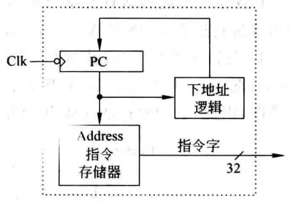

##### ALU

用作示例的几条指令有一些常见算术逻辑运算，如带有溢出判断的加减、带符号数的大小比较、布尔逻辑运算等，通常将这些运算整合在一个ALU里：

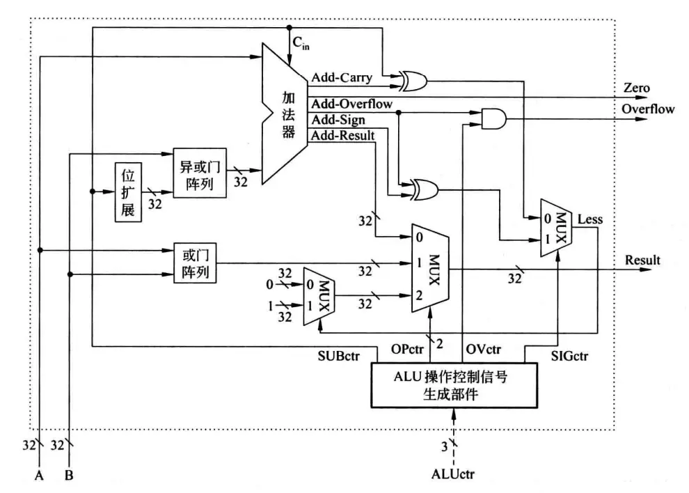

看着很复杂，其实只不过是几种元件的汇总。操作数通过A和B输入，由ALUctr提供控制信号来控制要进行什么运算，ALUctr进一步输出4个控制信号：

*   SUBctr连接到加法器的Cin上，可知SUBctr为0时做加法，为1时做减法（再次回忆$[-x]_{补}=\overline{x}+1$）；
*   OPctr连接到一个多路选择器MUX，而这个MUX的输入是各个独立的计算部件，可知OPctr是用来控制哪个部件的结果作为输出的；
*   OVctr与加法器的Add-Overflow标志相与之后输出溢出标志Overflow，可知OVctr用来指示是否进行溢出判断，当OVctr为0时，即使发生溢出，Add-Overflow为1，ALU的Overflow也为0；
*   SIGctr信号控制ALU执行带符号整数比较小于置1还是无符号数比较小于置1功能，SIGctr为0时执行后者。SIGctr为0时，Less等于Cin和进位标志Add-Carry异或；当SIGctr为1时，Less等于符号标志Add-Sign与溢出标志Add-Overflow异或，？？？。

##### R-Type指令

先从比较简单的R-Type指令开始，以`add rd, rs, rt`为例，指令功能`R[rd] = R[rd] + R[rt]`，涉及两个控制信号：写使能信号RegWr（Register Write Enable）和ALUctr（ALU Conctrl）。只有RegWr为1时才可以写入。此时ALUctr为add，RegWr为1因为这条指令会写结果，将busW的内容写入Rd中。比较值得注意的是Overflow信号会和RegWr相与再决定是否写入，这样如果发生溢出，即使RegWr为1也不会写入错误的值。

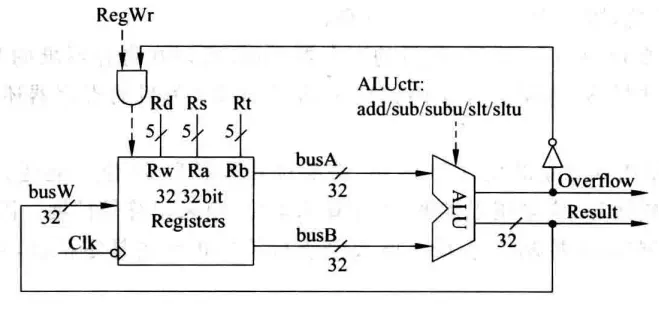

##### I-Type指令

立即数类型的指令以`ori rt, rs, imm16`为例，指令功能`R[rt] = R[rs] | ZeroExt(imm16)`。首先由于要写入的寄存器是Rt而不止R-Type的Rd，需要一个多路选择器及一个控制信号RegDst（Register Destination）来选择写入目标。其次需要对16位立即数做扩展故添加了一个扩展器，同时为了区分到底是进行符号扩展还是零扩展，需要一个ExtOp（Extend Operation）信号。这时候ALU的第二个输入来源就有两种可能了，一种是busB来的一种是扩展器来的，所以也需要一个多路选择器以及一个控制信号ALUSrc（ALU Source）来指示采用哪个输入。

根据下图，在该指令执行过程中，RegDst=1，RegWr=1，ALUctr=or，ALUSrc=1。

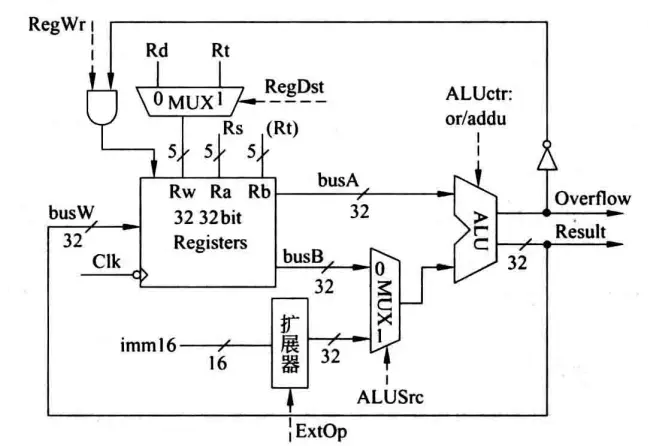

##### Load/Store指令

Load/Store类型的指令，涉及存储器操作，因此在图中新增了存储器。这一改动使寄存器组的数据来源不止ALU的结果了，也可能来自存储器，因此在ALU和存储器之后新增一个多路选择器，来选择要传送到busW的数据来源，由MemtoReg信号控制。同时，从寄存器组到存储器的数据通路DataIn也需要画上，存储器的写入信号由MemWr控制。

在Load指令`lw rt, rs, imm16`执行过程中，根据指令功能`Addr = R[rs] + SignExt(imm16); R[rt] = M[Addr]`：RegDst=1，RegWr=1，ALUctr=add, MemtoReg=1, ALUSrc=1, ExtOp=1, MemWr=0。

在Store指令`sw rt, rs, imm16`执行过程中，根据指令功能`Addr = R[rs] + SignExt(imm16); M[Addr] = R[rt]`：RegDst=X，RegWr=0，ALUctr=add，MemtoReg=X，ALUSrc=1，ExtOp=1，MemWr=1。这里X表示不关心。

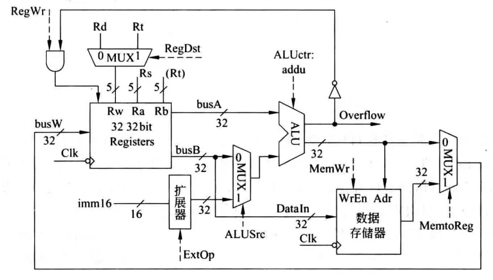

##### Branch分支指令

跳转指令涉及到PC修改，因此把取指令部件画了进来。以相等转移指令`beq rs, rt, imm16`为例，指令功能为：

    if (R[rs] - R[rt] == 0) // R[rs] == R[rt]
        PC = PC + (SignExt(imm16)) × 4)
    else 
        PC = PC + 4

转移目标地址计算在下地址逻辑中实现，ALU中进行的是不判溢出的减法操作`subu`，得到一个相等标志Zero。控制信号Branch表示当前指令是否时分支指令，以决定是否按分支指令方式计算下一条指令地址。

在该指令执行过程中，RegDst=X，RegWr=0，ALUctr=sub，ExtOp=X，ALUSrc=0，MemWr=0，MemtoReg=X，Branch=1。ExtOp为X是因为计算PC的任务落在下地址逻辑部件上，故ALUSrc=0。

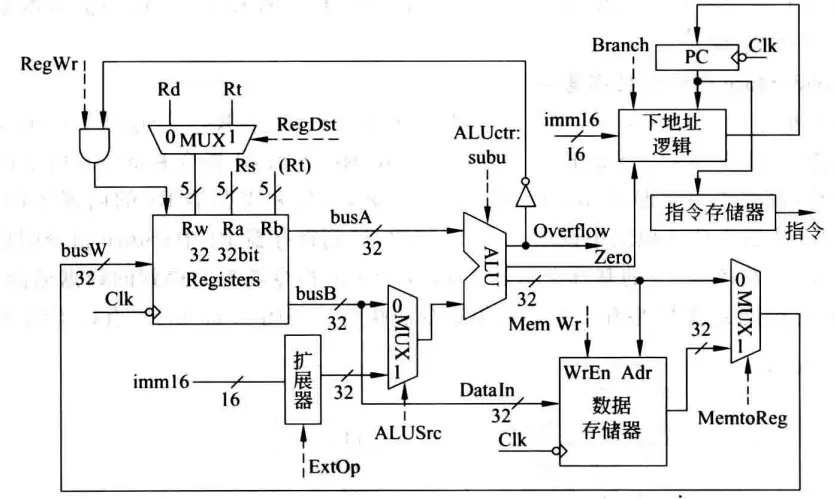

##### J-Type无条件转移指令

`j target`指令最为简单，`PC<31, 2> = PC<31, 28> || target<25, 0>`，MIPS该类型指令中目标地址占26位，完整跳转地址的高4位始终与当前PC的高4位相同，因此跳转目标的范围是有限制的，假如当前PC是`AXXX XXXXH`，跳转目标的范围就是`A000 0000H`至`AFFF FFFFH`。26+4=30，还有2位则是指令地址末尾默认省略的两个0，因为MISP指令总是32位即4个字节，所有指令地址都是4的倍数，故后面两个0在指令中默认省略。根据这些逻辑可设计下地址逻辑部件。

`j`指令执行只要保证RegWr和MemWr信号为0就行，其他的都不关心。下地址逻辑部件所接的Clk保证了只有时钟到来的时候才发生PC写入：每个时钟周期计算出PC地址送到PC输入端，下一周期写入PC并作为指令地址取指令，同时开始计算下一周期取指的地址。应该说**所有指令执行的结果都是在这一周期计算好，在下个时钟到来时开始保存在寄存器、存储器或PC中。**

完整的单周期数据通路如下：

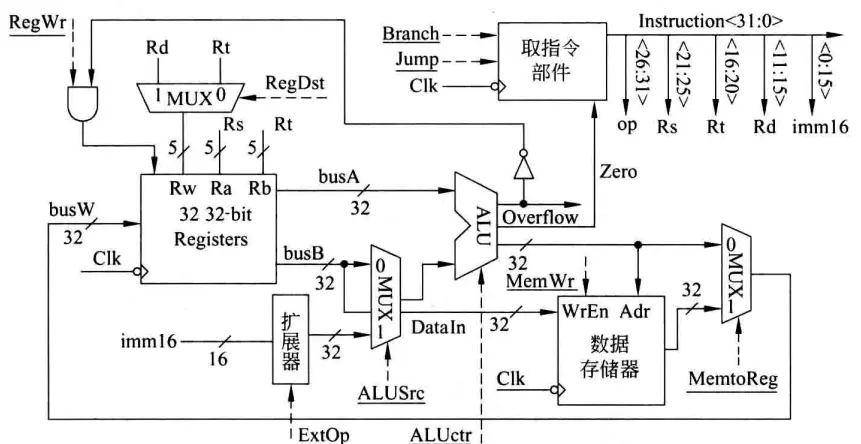

#### 控制器设计

在上述基础上，可以得出控制信号相对指令的真值表，从而可以设计出控制部件。控制器可以分为两个部分，主控和ALU控制器，主控以当前指令（的操作码op）为输入，输出各种控制信号，同时根据该指令所需的ALU操作输出ALUop，ALU控制器以ALUop和MIPS指令中的func字段作为输入，输出ALU控制信号。

### 多周期处理器

单周期的浪费非常明显，较简单的指令根本不用那么长的时钟周期。多周期处理器的基本思想是将每条指令分为大致相等的几个阶段，每个阶段在一个时钟周期内完成。这样时钟周期的宽度以最复杂阶段的耗时为准，通常是一次访存的时间。规定在一个阶段内最多完成一次访存、一次寄存器读写或一次ALU操作（否则中间结果没有相应的时钟信号控制写入状态单元），各个阶段的执行结果在下一个时钟到来时保存到相应存储单元或稳定地保持在组合电路中。

多周期的CPI虽然变大了，但是时钟周期缩短了，不同指令所占的时钟周期数不同。同时多周期允许功能部件在一条指令的执行过程中（在不同周期之间）复用，节省了元件。

下为多周期处理器数据通路完整图，与单周期相比，添加了如指令寄存器IR（IR出来还有MAR，主存出来还有MDR，图中未画出）等若干个寄存器；不再需要下地址逻辑部件，因为可以复用ALU来计算指令地址了；指令存储器和数据存储器也合并为主存；图中的分支目标地址BranchTarget是一个临时寄存器：

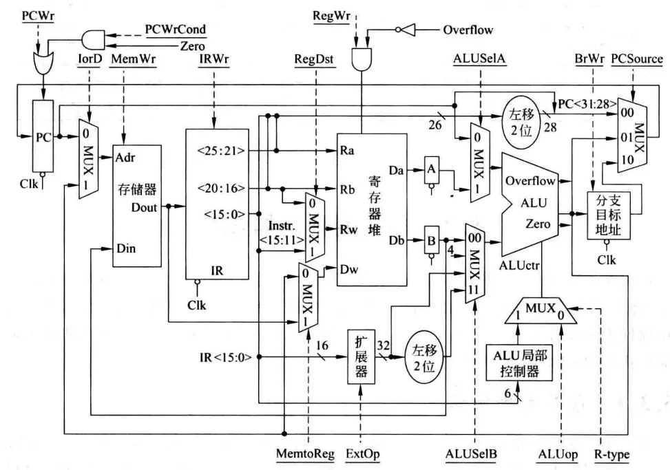

#### 竞争问题

单周期处理器设计其实是一个理想的情况，即假定每次写操作都由时钟控制，并且在时钟信号到来之前，地址、数据与信号都已经稳定一段时间。实际上存储元件的写操作不是由时钟边沿触发，而是一个组合逻辑电路。只要写使能信号有效且写入数据和地址已稳定，则经过一个写操作时间后状态就被写入。这里的约束”地址和数据在写使能信号有效前已经稳定在各自输入端“在现实中不能保证，因此地址、数据和写使能信号之间存在先来后到的竞争问题。

单周期处理器在没有时钟同步的情况下无法保证可靠工作，因为不能保证写使能信号，比如RegWr=1的时候，相应的输入比如busW信号已经稳定，这时就可能写入错误数据，而真正的数据到来时RegWr已失效。多周期处理器没有时钟同步，在一个周期内也有同样的问题，但多周期处理器可以利用周期次序，比如让busW在第n周期稳定，在第n+1周期时RegWr有效从而正确写入。

#### 数据通路设计

以比较复杂的`load`指令为例，`load`指令可分为如下阶段：

*   取指

    *   执行一次存储器读操作
    *   读出的内容（指令）保存到IR
    *   IR的内容现在不是每个时钟周期都更新，所以需要一个写使能信号控制
    *   在取指阶段结束时，ALU的输出为PC+4，并送到PC的输入端，但因为也不再是每个时钟周期都更新，也需要写使能信号控制

    这一周期内控制信号PCWr=1，MemWr=0，IRWr=1，ALUop=add，IorD表示选择指令还是数据，此处为0，类似的ALUSelA、PCSource都是0，BrWr为0因为不涉及写分支目标地址寄存器，ALUSelB为01因为要选择4这个数字参与指令地址运算。

*   指令译码/寄存器取数

    *   经过一段控制逻辑延迟之后，各控制信号更新为新值
    *   执行一次寄存器读操作
    *   读出的内容（操作数）保存到临时寄存器A和B中
    *   每个时钟到来时，A和B中的值都要更新，所以不需写使能信号控制
    *   对16位立即数进行符号扩张后，送到ALU B处的多路选择器

    指令译码和寄存器取数因为相互独立，可以放在同一个周期内进行。这一阶段不涉及ALU操作，因此ALUop=X，ALUSelA=X，ALUSelB=X。PCSource=0因为PCWr=0，PCWrCond=0因为Zero可能为1，IorD=X因为MemWr=0，IRWr=0，RegDat=X因为RegWr=0。

    在本周期开始时上一周期计算出来的PC+4被写入PC了，但由于相关的Wr信号都是0，不用担心对本条指令执行造成影响。

    鉴于ALU是空闲的，可以让ALU进行一个“投机”运算，这样假如译码出来要进行的恰好是我们投机的运算，就可减少一个周期。

*   ALU运算

    *   ALU A和B处的多路选择器在相应控制信号控制下选择操作数进行加法运算，输出结果在下个时钟到达时，保存到临时寄存器分支目标地址（ALUout）中

    前两个周期的信号每个指令都一样，是公共的，但从本周期开始控制信号就要根据指令译码结果而确定了。

*   读存储器

    *   由ALUout作为地址访问存储器，读出数据，保存在临时寄存器MDR中

*   写寄存器

    *   写MDR的内容到寄存器堆中

按照类似的方式对每个周期内各个指令的控制信号进行分析。对于单周期，系统在某一时钟周期的状态就是真值表中的一行，下一个时钟周期因为执行的指令变了，系统的状态变为另一行。对于多周期，每条指令自成一表，但是这些表中又有共同的行（比如取指），因此不方便用表格刻画这种次序关系。更适合使用有限状态机：

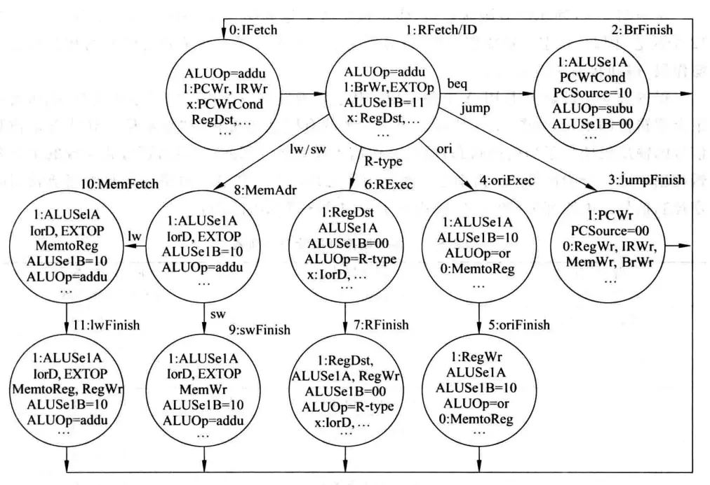

#### 控制器设计

显然如果这个指令集的指令很多很复杂，用PLA来实现控制器将很难维护也不便拓展。这种情况可以考虑软件实现，由此引出了**微程序控制器**的话题。

微程序控制器的设计就是状态机控制器的设计，只要能完成状态转换，在切换到相应状态是发出相关的信号即可。其输入是指令的op字段和状态机的当前状态编码，输出是各种控制信号。将状态图的一个结点对应一条微指令，则若干个微指令构成一条指令执行的全过程。由于微程序相对固定，且通常不放在主存里，故有可能利用工作速度较高的ROM存放，这个ROM称为控存（控制存储器，Control Storage）。这是一种固化了的微程序，所以也被称为**固件（firmware）**。

### 异常和中断处理

*   内部异常（exception）：由处理器内部异常所引起的意外事件。根据发生的原因又可分为硬故障和软中断，前者如电源掉电等，后者常见于指令执行异常如除0、溢出等。

    | 类型        | 说明                                                            |
    | --------- | ------------------------------------------------------------- |
    | 故障（fault） | 在引起故障的指令启动后，执行结束之前被检测到的一类异常事件。例如缺页、除0、保护错等，根据错误的不同处理方式有区别。    |
    | 陷阱（trap）  | 预先安排的一种“异常”事件，一旦某条指令的执行发生了预设的条件，CPU就调出特定的程序进行处理。常见于系统调用等。     |
    | 终止（abort） | 硬故障，程序无法继续执行，需要调出中断处理程序来重启系统。如掉电等，这种异常是随机产生的，与特定指令无关，优先级往往最高。 |

*   外部中断（interrupt）：通常由外部I/O发出，要求CPU转到相应的中断服务程序执行。

异常与中断处理需要注意避免死锁，即在处理执行异常处理程序的同时又产生了新的异常，通常都需要“关中断”来实现。

### 指令流水线

了解了单周期和多周期处理器，再来看流水线就比较自然了。将一条指令的各执行阶段看成相应的流水段，则指令的执行过程就构成了一条指令流水线。例如，假定一条指令流水线由如下5个流水段组成：

1.  取指令（IF）：从cache或主存取指令；
2.  指令译码（ID）：产生指令执行所需的控制信号；
3.  取操作数（OF）：读取存储器操作数或寄存器操作数；
4.  执行（EX）：对操作数完成指定操作；
5.  写回（WB）：将操作数写回存储器或寄存器。

理想情况下，每个时钟周期都有一条指令进入流水线，每个时钟周期都有一条指令完成，故CPI为1。（不考虑开头几条指令）。指令流水段个数应以最复杂指令所需的功能段个数为准；流水段的长度以最复杂的操作所花时间为准。假设这个时间为$T$，则一条指令需$5×T$，串行方式$N$条指令需要$5N×T$，而流水线方式只需要$(4+N)×T$，对于较大的$N$，快了接近$4$倍。注意此处隐含了每个指令都是$5×T$，实际单周期或多周期串行因为简单指令可能小于$5×T$，耗时少一些。

要求每个指令都是$5×T$有实际工程上的考虑，如果有的指令长有的短，有可能产生一个时间段内不同指令想要使用相同器件的情况，即产生**结构冒险**。结构冒险一种简单的解决方式就是添加气泡，具体实现上，如果让处理器在执行指令时动态判断什么时候该加气泡会很复杂，所以通常都在指令的执行阶段上加气泡，并做一些约定，后面还有更详细的关于冒险的介绍：

1.  每个功能部件每条指令只能用一次；
2.  每个功能部件必须在相同的阶段被使用。

#### 数据通路和控制器设计

各流水段部件在一个时钟周期内完成某条指令的某个阶段的工作。在下个时钟到达时，把执行结果以及前面传递来的后面各阶段要用到的所有数据（如：指令、立即数、目的寄存器等）和控制信号保存到流水线寄存器中。在取指和译码阶段，因为每条指令相同，所以不需要控制信号，只有译码之后才确定这条指令所需的控制信号，并将这个信号保存在流水段寄存器传递下去。对比串行方式，因为流水线处理器中控制信号一旦在ID段由控制器生成就不会改变，故可以沿用单周期处理器控制器的设计思路。

#### 竞争问题

在流水线中同样存在地址和写使能之间的竞争问题，例如从流水段寄存器出来的信号和数据，不能保证按照要求的顺序到达元件。在多周期中，我们利用指令执行阶段的先后顺序可以解决问题，但是在流水线方式中却不能这样解决。因为流水线方式中每个流水段内都可能需要写入，即别的指令刚好处在写入阶段，因此不能通过在第$N$周期设置写使能为0，在第$N+1$周期再允许写入的方式解决问题。这时的解决方案是，**将写使能信号与时钟周期相与**，这样时钟下降沿到来之后，写使能信号和地址数据都开始传播，但由于时钟处于低电平，使得写入仅发生在下一次的时钟信号上升沿到来之后，只要时钟周期长度够，可以保证这时信号都已经稳定在输入端，因此写入的是正确的数据。当然这需要电路设计者合理设计时钟，使得：

1.  Addr、Data和WrEn信号必须在时钟边沿到来后至少稳定一个setup时间；
2.  Clk高电平时间大于写入时间。

这种情况下等价于拥有了单周期里面的理想时钟同步。

此外，在一个流水段中寄存器组可能既有写入也有读出，如何实现呢？同样可以利用时钟的上升沿和下降沿，使得前半周期写，后半周期读。这时可以把寄存器的读口和写口看成是两个独立的元件。

#### 冒险

##### 结构冒险

同一个部件同时被不同指令所使用。

1.  一个部件每条指令只能使用1次，且只能在特定周期使用；
2.  设置多个部件，以避免冲突。如指令存储器IM和数据存储器DM分开。

##### 数据冒险

后面指令用到前面指令结果数据时，前面指令的结果还没产生。

1.  硬件阻塞（stall）；

    就是检测然后等待，控制比较复杂，需要修改数据通路；指令被延迟三个时钟执行。

2.  软件（通常是编译器）插入`nop`；

    简单，不用修改数据通路，但是浪费三条指令的空间和时间。

3.  合理实现寄存器堆的读/写操作（不能解决所有数据冒险）；

    即前面提到的让寄存器堆读口和写口是相互独立的部件，先写后读。但只能解决一部分的数据冒险问题。

4.  转发（Forwarding或Bypass旁路）技术；

    经过观察可以发现后面指令所需的指令可能恨早就已经存在于流水段寄存器里面，因此可以使用一个旁路把数据“截”过来，直接放到ALU输入端。

    1.  相关数据是ALU结果可以使用；
    2.  若相关数据是上条指令DM读出内容，则不能通过转发解决，随后指令需被阻塞一个时钟，或加`nop`，称为Load-use数据冒险。以下面三条指令为例，指令的流水段与前文稍有不同，为IF（取址）、ID（译码/取数，因为互不影响可以同时进行）、Ex（执行）、Mem（`lw`取数、`sw`存数、`j`更新PC，因为到这时才算出地址）、Wr（写回）：

        ```asm
        lw r3 100(r1)
        or r6 r3, r1
        sub r5, r3, r4 
        ```

    `lw`取出数据放到`r3`的时候，自身处在Mem阶段，随后`lw`这阶段结束，将数据放到流水段寄存器，那么它的下一条指令到了Mem阶段，已经过了使用ALU的Exec阶段，所以转发可以解决`lw`和其下下条指令的数据冒险，但不能解决`lw`和下一条指令的数据冒险问题。这时必须借助阻塞。

5.  编译优化：调整指令顺序（不能解决所有数据冒险）。

##### 控制冒险

主要由控制转移指令改变了程序执行流，而转移确认的时候不该执行的指令已经在执行了引起。

一种解决方法被称为简单（静态）分支预测，即始终假设`true`或`false`分支是跳转目标。以`beq`为例，`beq`需要到Mem阶段才可以确认跳转目标，因此如果预测失败，需要“冲洗”不该执行而执行的指令，会浪费三个时钟（延迟损失时间片）。存在一些缩短分支延迟、减少错误预测代价的方式：

1.  可以将“转移地址计算”和“分支条件判断”提前到ID阶段来缩短延迟，因为在IF/ID阶段流水段寄存器中已经有PC的值和立即数了；
2.  可以将“判0”操作从EX阶段移到ID阶段，用一些逻辑运算直接比较Rs和Rt的值。

静态预测的问题很明显，比较死板，50%的成功率。因此就有相应的动态预测技术，将转移发生的历史情况记录在一个形如`[分支指令地址|预测位|转移目标地址]`的表中，根据这个表来做后续的预测。

异常和中断当然也可能导致冒险。其中特别需要注意的一点是，如果前面的指令在Mem阶段发生异常，而后面的指令在IF阶段就发生了异常，如果优先处理后面的指令异常显然是不合适的。因此对于这种同时发生多个异常和中断的情况，需要确定处理的优先级。一般排在前面的指令优先级更高，外部中断最后相应。即对同时在5个指令流水段中发生的异常（它们都发生在同一时钟周期内）进行排序时，其顺序为Wr>Mem>Ex>ID>IF。

## 存储器系统

### 主存

先了解主存对理解构成主存的DRAM有一定帮助，这里有一些概念：

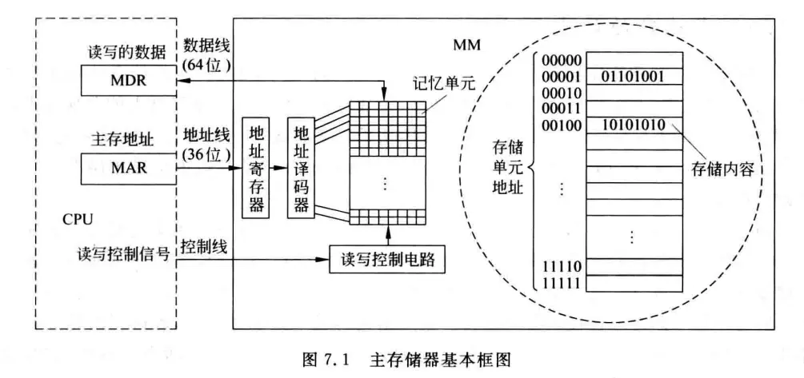

1.  记忆单元（存储元、位元）：指图中的一个小方格，它是具有两种稳态的能表示二进制0和1的物理器件。

2.  存储阵列（存储体、存储矩阵）：就是所有记忆单元组成的一个物理器件。

3.  编址单位：为了存取存储体中的信息，必须对存储单元进行编号，所编号码就是地址。编址单位就是具有相同地址的那些位元，在图中表现为右侧的一行。

4.  编码方式：对存储单元编码的方式，也就是究竟多少位元作为一个存储单元，称为编码方式，可以按字节编址，也可以按字编址等。现在大多采用按字节编址的方式，也就是一个编址单位有8个位元。

5.  主存地址寄存器（Memory Addresse Register，MAR）：指令执行过程中需要访问主存时，CPU首先把被访问单元的地址放到MAR，然后通过地址线将地址送到主存中的地址寄存器，以便地址译码器进行译码并选中相应单元。同时将读写信号通过控制线送到主存的控制电路。**地址线的宽度与MAR的宽度相同。**

6.  主存数据寄存器（Memory Data/Buffer Register，MDR/MBR）：如果是写操作，CPU同时会将要写的信息送到MDR，在读写控制电路的控制下，经数据线写入选中的单元；如果是读操作，从主存相应单元读出来的数据先送数据线，随后也会放入到MDR中。**数据线的宽度与MDR的宽度相同。**

图中采用64位数据线，所以在按字节编址（一个单元8bit）方式下，每次最多可存取64bit/8=8byte也就是8个单位的内容。**地址线的位数决定了主存地址空间的最大可寻址范围**，例如，图中36根地址线的最大寻址范围为$0$～$2^{36}-1$（地址从0开始编号）。但是并不意味者就等于主存容量，因为我们可能因为贫穷没有将内存条插满……

### 半导体RAM

内存由半导体存储器芯片组成，芯片有多种类型，如RAM类别下的SRAM、DRAM，ROM类别下的不可在线更改ROM、闪存Flash ROM等。

#### 基本存储元件

基本存储元件用来存储一位二进制信息，是组成存储器的最基本的电路。常见的有组成SRAM的六管静态MOS管存储元件和组成DRAM的单管动态MOS管存储元件两种，S代表Static，D代表Dynamic。

| 类别   | 原理    | 优点                                                    | 缺点                                              | 用途          |
| ---- | ----- | ----------------------------------------------------- | ----------------------------------------------- | ----------- |
| SRAM | 触发器读写 | 速度快；只要电源一直加在电路上就可以保持状态不变，也不会因为读操作而改变状态（不需要读后再生）；不需要刷新 | 元件多；功耗大；占硅片面积大；集成度低                             | 高速缓存（cache） |
| DRAM | 电容充放电 | 元件少；功耗小；占硅片面积小；集成度高                                   | 速度慢；读操作会导致电容放电，因此需要读后再生；同时电容会随着时间的流逝失去电荷，需要定时刷新 | 主存          |

#### SRAM芯片和DRAM芯片

##### 芯片内部结构

存储器芯片由存储体、I/O读写电路、地址译码器和控制电路等部分组成。地址译码有一维译码和二维译码两种方式。

###### 单译码方式

在单译码方式下，只有一个行译码器，同一行中所有存储单元的字线连在一起，接到地址译码器的输出端，这样，**一次读出一条字线上的所有位**。这种结构的存储器芯片被称为**字片式芯片**。假定进来的地址线有n位（也意味着MAR有n位），可以表示$2^n$个地址，则地址译码器出去的字线有$2^n$行。可以发现当地址位数较多时，地址译码器输出线太多。比如下图地址线是12位，要求译码器有4096根输出线（字选择线），因此，一般SRAM为字片式芯片，大容量的DRAM芯片不适合单译码方式。

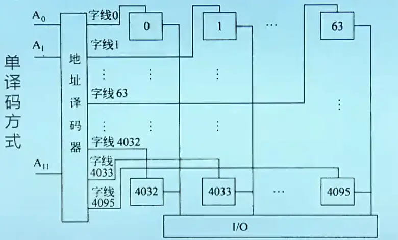

###### 双译码方式

双译码结构存储阵列组织如下图：

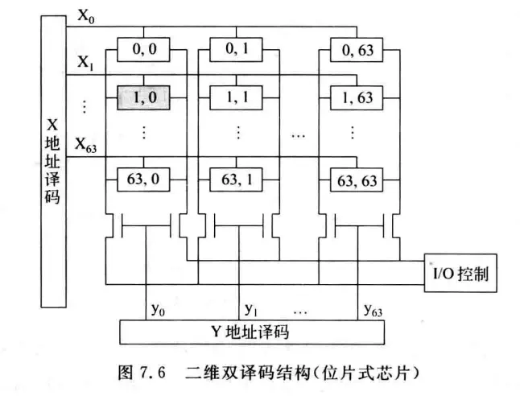

它由行选择线和列选择线唯一确定一个单元进行读写，如果一个单元只有一位，采用这种结构的存储器芯片相应的被称为**位片式芯片**。图中一共有$64*64=4096$个单元，每个单元只有一位，通常表示成4K×1位。有些芯片的存储阵列采用三维结构，用多个**位平面**构成存储阵列，不同位平面在同一行和列交叉点上的一个单元在一起构成一个存储字，被同时读出或写入。假如一个单元有8位，有8个位平面，则一次性最多可以读出64位数据。用后面的话说就是一个主存块有8个字节，主存中的信息以8字节为单位传送到cache中。

假定地址是n位，现在有一半地址送到X译码器，另一半送到Y译码器。在上图中，地址译码器的输出有$64=2^6$条选择线，可知地址位数是$6+6=12$，地址线前6条接X，另外6条接Y。我们可以采用**地址引脚复用技术**，即地址只用6条地址线分两次输入，这样就减少了一半的引脚。

##### 芯片的扩展

由若干个存储器芯片可以构成一个内存条，此时，通常需要在字方向和位方向上进行扩展。

###### 字扩展

字扩展是容量的扩充，位数不变。通过增加小容量芯片数量，然后依据芯片外的地址译码器的输入信号以及控制信号来产生片选信号，以选中要访问的存储字所在芯片。

假定一个芯片是1K×1位的，即一个芯片里面有1024个单位，每个单位存储1位数据。假如要得到一个4K字×1位的内存条，字方向上需要扩展4倍。扩展后MAR的地址应该有12位，因为字扩展了4倍，需要2位控制信号选片，这2位由外部地址译码器生成。而单个芯片是$1024=32×32=2^5×2^5$即10位片内地址，需10根地址线，总计是12根地址线。

高位选片还是低位选片也有影响。高位选片即用来选片的那两位放在地址的高位，此时一个芯片内部各单元的编址方式是**连续编址**，因为此时第一个芯片内每个单元依次是`000000000000`、`000000000001`、……，第二个芯片内每个单元依次是`010000000000`、`010000000001`、……即开头的两位代表芯片号，第一个芯片里面有第0～1023个单元，地址范围000～3FFH，第二个芯片里面有第1024～2047个单元，地址范围400～7FFH……。反之低位选片则对应**交叉编址**，第一个芯片内各单元依次是`000000000000`、`000000000100`、……第二个是`000000000001`、`000000000101`、……末尾的两位代表芯片号，此时第一个芯片里面有第0、4、8……个单元，第二个芯片里面有第1、5、9……个单元。芯片内地址是不连续的，地址在芯片间连续，因此**可以同时读取所有芯片来访问一块连续的地址**。而数据通常都放置在连续的地址上，故交叉编址方式应用更广。

:::info
由交叉编址也可以理解为什么规定数据对齐，同样的道理：用16M×8位的存储芯片字扩展成128MB内存条，则字扩展了8倍。现采取交叉编址方式，假如一个32位整型数存放在8、9、10、11单元（对齐方式），则它们刚好放置在连续的4个芯片里，只需要一次访存。如果放置在6、7、8、9单元（非对齐方式），则需要两次访存，第一次读64位（0～7单元），得第6、7单元，第二次读64位（8～15单元），得第8、9单元。
:::

> 课程中这个例子放在位扩展后面，容易让人误解。

###### 位扩展

用若干片位数较少的存储器芯片构成给定字长的内存条时，需要进行位扩展。位扩展是芯片位平面层数的扩展，也需要多个芯片，每个芯片构成一个位平面。

假如将1K×1位扩展为1K×8位存储芯片，则位方向上需扩展8位，需要8个芯片。这些芯片构成8个位平面，每个芯片内相同X、Y处单元的地址相同，或者说位扩展不改变地址范围，改变的是同一个地址处一次性可以读出的数据长度。

对于一个采用了引脚复用技术的4M×4位DRAM芯片，$4M=2^{22}$，则地址线有22位，地址引脚有11个。每次读4位（4个位平面），知数据引脚有4个。已知对存储阵列的刷新是按行刷新的，一共要刷新11行，则刷新计数器的位数也是11，一次刷新可以理解为对一行中的数据进行读再生操作。

### Cache

#### 映射方式

##### 直接映射

即按照一次传送的最大能力将主存分块，然后把每一块映射到固定的一个cache行中，也称为**模映射**。cache行号=主存块号 mod cache行数。

假定数据在主存和cache之间的传送单位为512B，cache有16行，则cache的大小为16×512B=8KB。若主存共有1024KB，则应划分为1024KB/512=2048块，第0、16、32、……块映射至cache的第0行，第1、17、33、……块映射至cache的第1行，……

反过来，既然每连续16个块一定映射到不同的行，在某一行有映射时，为了说明该行存放的来自主存的哪一块，可以将主存的2048块除以16得到128个块群编号，使用7位二进制数来表示。而cache行号16可以用4位表示，512B可以用9位来表示块内地址（块内存储单元地址，前面已提到一个存储单元是1B），因此可以设计主存的地址格式为`[7位主存块群标记|4位cache行号|9位块内地址]`，后面的13位也被称为cache地址。另一方面也可以注意到，主存1024KB是$2^{20}B=2^9B×2^4×2^7$，总字节数=128个块群×每16块一个块群×每块512字节。

假设给定地址022CH，即`0000 001|0 001|0 0000 1100`，说明是第1块群中第1块的第12个单元，即第17块的第12个单元。在cache中，先用中间的`0001`找到相应的cache行，若恰好存放了该块群的数据（比较高7位tag）则cache行内容应该是`[0000 001|512B的Data]`。为了区分cache信息是否有效，还会在左边加上一个有效位。

如果给定一个64行块大小16B的cache，问我们1200B地址处映射到cache的行号是多少，除了利用1200/16得到总块数再mod 64之外，可以把1200写成2进制`0...01|00 1011| 0000`，中间6位就是cache行号。

再有一个例子，cache数据区总大小为64KB，主存块大小16B，主存地址为32位，按字节编址，要求给出主存地址的划分。主存块大小即cache行大小，因此cache一共有64KB/16B=4K行即12位的cache行号，而块内地址是16B即4位，因此还剩下32-12-4=16位可做为主存块群号，即高位标记部分。主存地址格式为`[16位主存块群号|12位cache行号|4位块内地址]`。如果cache每行左边都有一个有效位，则cache总容量是(1+16+16×8)×4K=580Kbit，1是有效位，16是指明来自主存哪个块的块群号，16\*8是块大小（单行数据区大小），共4K行。

直接映射的优点是实现简单，命中时间短，且无需考虑淘汰问题，如果取模得到的行号相同直接替换。缺点是利用率不高，假如上面的例子以0、16、0、16的方式访问，即使其他cache行都是空的，还是会频繁的发生换入换出。

##### 全相联

全相联即每个cache行都可能存放来自主存的任意块。这时前面的标记位是11位（2048块需要11位表示）。查找的时候，由于不知道放在哪一行，只能逐个比对高11位。因此缺点也很明显，比较时间长，比较器比起直接映射多了4位。如果32位内存地址，块大小32bit，剩下27位都是比较位。

##### 组相联

组相联是对上面两者的折衷，先对cache分组，每组有若干cache行，然后在组内可以任意存放。即组间模映射，组内全映射。cache组号=主存块号 mod cache组数。

还是前面的例子，假如16个cache行每两行一组，共8组，主存2048块/8=256个组群，那么此时主存地址就是`[8位主存组群标记|3位cache组号|9位块内地址]`。通常每组有N行就称为N路-组相联映射。

#### 写策略（Cache一致性问题）

因为处理Cache读比Cache写更容易，故指令Cache比数据Cache容易设计。

对于写命中，有两种处理方式：

1.  Write Through（通过式写、写直达、直写）

    即同时写Cache和主存单元，由于写主存很慢，会显著增加CPI。因此通常会设置多级写缓冲Write Buffer，CPU写到Buffer里面后，由存控负责写入主存，CPU做别的事情。

2.  Write Back（一次写，写回、回写）

    只写cache不写主存，缺失时一次写回，每行有一个dirty-bit，只对脏数据写回。优点是降低了主存带宽需求，缺点是控制复杂。

对于写不命中，有两种处理方式：

1.  Write Allocate（写分配）

    就是先搬主存块到cache再写，试图利用局部性。

2.  Not Write Allocate（非写分配）

    直接写主存单元，不把主存块装入cache。

#### 多Cache系统

同时使用多级Cache，越靠近CPU的cache速度越快，通常容量也越小。例如Intel Core i7每个核都有两个L1 Cache分别是数据cache和指令cache，它们共用一个L2联合cache，在所有核之外还有一级L3联合cache。访问L1约4个时钟周期，访问L2约11个时钟周期，访问L3约30～40个时钟周期，而访问主存要上百个时钟周期。

1.  一般L1 Cache都是分立cache（指指令和数据分开存放在独立的cache中），为什么？

    因为要流水线并发，使得两个指令一个取指一个取数不会冲突。

2.  L1 Cache的命中时间比命中率更重要，为什么？

    因为后面还有多级Cache兜着，L1 cache提高速度就好了。

3.  一般L2乃至后续cache都是联合cache，为什么？

    为了提高cache利用率和命中率。

4.  L2 Cache乃至后续Cache的命中率比命中时间更重要，为什么？

    因为缺失时需从主存取数，并且要送前面的cache，损失大。

### 虚存

“主存-磁盘”与“Cache-主存”对比：

1.  页大小（2KB～64KB）比Cache中的Block大得多，采用全相联映射，Why？

    因为缺页的开销比Cache缺失的开销大很多。缺页时访问磁盘需要几百万个时钟周期，因此页命中率很重要，“大页面”和“全相联”可以提高命中率。

2.  缺页处理通常使用软件方式实现，Why？

    因为访问磁盘是个很慢很复杂的过程，硬件方式，单个指令难以实现。其中的地址转换可以采用硬件实现（MMU）。

3.  采用Write Back写策略，Why？

    Write Back在这里即只写主存不写磁盘，原因也是因为访问磁盘太慢了。

理论上页表项数由虚拟地址空间大小决定，每个进程有相同虚拟空间，故理论上一样。实际大小看具体实现方式。如果一个页表项4B，有$2^{20}$个页表项，那么整个页表有4MB，因此页表自身也要分页。

#### 地址转换

虚拟地址可以类比全相联映射主存地址，高位是块号，低位是块内（偏移）地址。在这里高位就是虚页号，低位是页内（偏移）地址。主存物理地址也分为两个字段，高位为物理页号，低位为页内（偏移）地址。

转换过程如下：首先根据页表基址寄存器的内容，找到主存中对应的页表起始位置，然后以虚拟地址高位字段的虚拟页号做为索引，找到对应的页表项。若装入位为1，则取出物理页号，并与虚拟地址中的页内地址拼接，形成访问主存时的实际物理地址`[物理页号|页内地址]`；若装入位为0说明缺页。

#### 访存过程

为了减少访存次数，往往把页表中最活跃的几个页表项复制到高速缓存中，这种在高速缓存中的页表称为TLB（Translation Lookaside Buffer），通常称为**快表**，相应地称主存中的页表为**慢表**。TLB可以是全相联或组相联方式，和cache相似。

如图是一个具有TLB和cache的典型多级层次化存储系统，其中TLB和cache都采用组相联映射方式：

CPU首先给出的是一个32位的虚拟地址，MMU执行虚拟地址到物理地址的转换，随后由cache相关硬件根据物理地址进行存储访问。

MMU在对TLB查表时，20位的虚拟页号被分成标记（tag）和组索引两部分，首先由组索引确定在TLB的哪一组，然后将标记部分与TLB该组中每条记录的高位标记字段进行比较，若相等且有效位V等于1,则TLB命中，此时可直接根据该记录拿到物理地址完成地址转换；否则TLB缺失，那么就需要访问主存中的慢表。图中所示的是**两级页表方式**，虚拟页号被分成**页目录索引**和**页表索引**两部分，根据这两部分可得到对应的页表项，从而进行地址转换，并将对应页表项的内容缓存到TLB中方便后续访问。若TLB已满，还要进行TLB替换，为降低替换算法开销，TLB常采用随机替换策略。

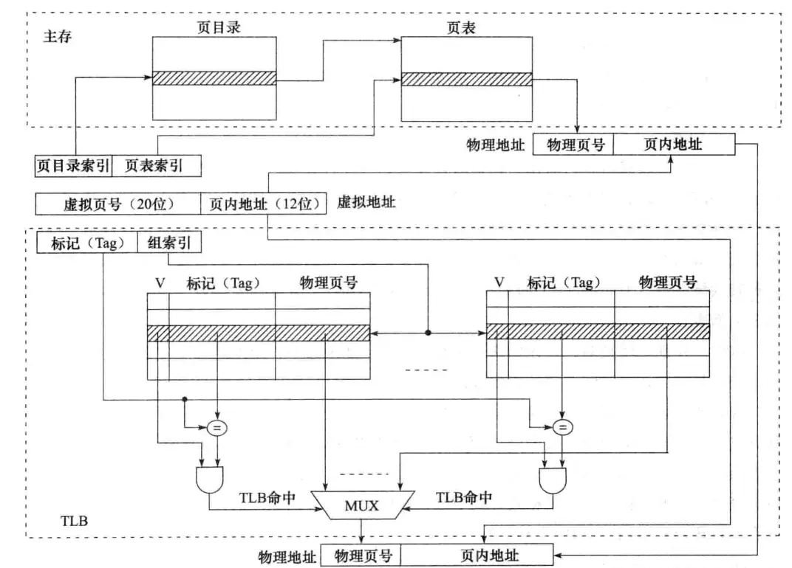

在MMU完成地址转换后，cache硬件根据映射方式将转换得到的主存物理地址划分成几个部分，然后根据中间的cache组索引，找到对应的cache组，并将组内各cache行中的标记与物理地址中的高位地址（Tag）进行比较，若相等且有效位为1，则cache命中，此时，根据块内地址取出对应的字，需要的话，再根据字节偏移量从字中取出相应字节送CPU。

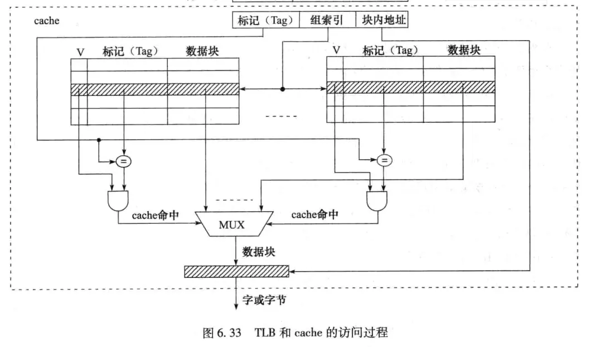

完整的流程图：

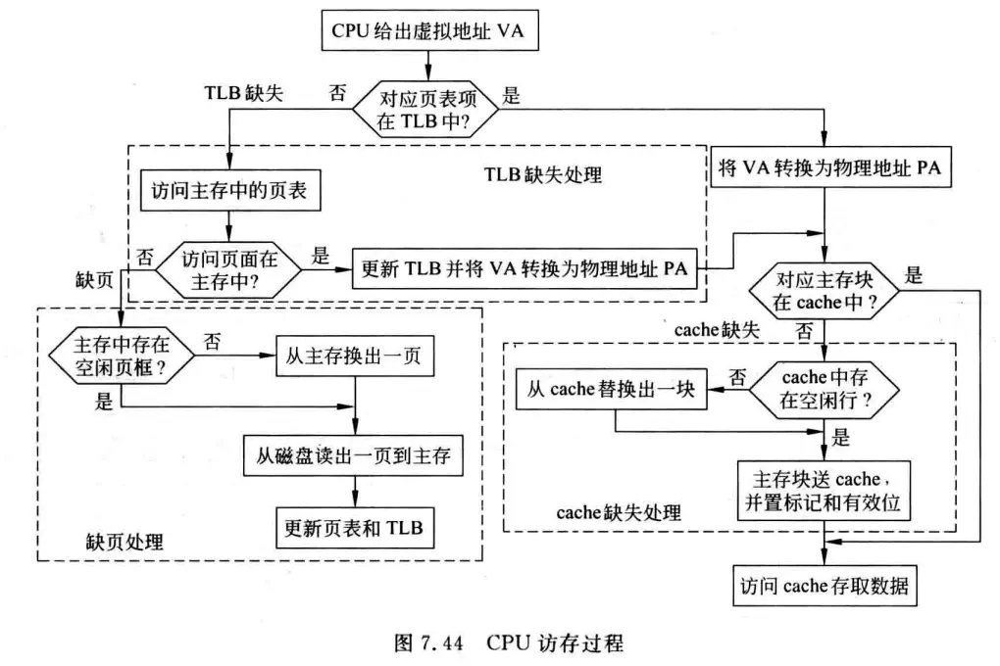

## 系统总线

### 总线裁决

#### 集中式

即有一个专门的总线控制器或总线裁决器，通过将所有的总线请求集中起来利用一个特定的裁决算法进行裁决。

1.  菊花链方式（击鼓传花）：授权信号Grant从最高优先级的设备依次向低优先级的设备串行相连，如果一个设备有总线请求，则Grant信号不再往下传递（通过将总线请求信号取反，再与Grant信号相与传递给下一级），该设备获得总线使用权。

    *   优点：简单，只需要几根线就能按照一定优先次序实现总线裁决；易于扩充设备。
    *   缺点：不够灵活，低优先级的设备可能长时间无法获得总线；串行相连使得对电路故障敏感，也限制了总线速度。

2.  计数器定时查询（点名报到）：由控制器主动计数，每次计数加1并询问相应编号的设备是否需要使用总线，若设备需要使用总线，则置总线忙信号，获得总线使用权。

    *   优点：灵活，可以通过设置不同的计数初始值来改变设备优先级，例如将初始值始终设置为上一次使用过的设备号，实现平等循环优先级；对电路故障也不像菊花链那样敏感；
    *   缺点：需要增加一组设备线以便控制器通知到设备（如8个设备，需3位的设备线）；总线控制器的逻辑也更复杂（需要对设备号进行译码等）。

3.  集中并行（领导说了算）：每个设备都有一对总线请求线和总线授权线Grant直接与控制器相连，当设备要使用总线时，就通过请求线通知到控制器，由控制器根据裁决算法（如先来先服务、最近最少用算法等）进行授权。裁决器可以给各请求线设固定的优先级，也可以编程设置。

    *   优点：响应速度快；若可编程，则保证灵活性；
    *   缺点：控制逻辑复杂，控制线多。

#### 分布式

没有专门的总线控制器，其控制逻辑分散在各个部件或设备中。

1.  自举式：优先级固定，低优先级设备与所有优先级高于它的设备的请求线连接，以便它在请求前可以拿到比自己优先级高的请求线上的信号进行分析，没有更高的才设置总线忙信号并使用总线。显然最低优先级设备不需要请求线，因为没人“在乎”它是否要使用总线。

    *   缺点：需要较多的连线用于请求信号，许多总线将数据线复用为总线请求线。

2.  冲突检测：设备在使用总线前先检测总线忙不忙，不忙就设置总线忙并使用总线。当然这时会出现两个设备同时检测到总线空闲，然后使用总线造成碰撞的情况。因此需要设备在使用总线时具有检测到碰撞的能力，若检测到碰撞，就退避一段随机时间后再使用总线。见共享总线式以太网的CSMA/CD协议。

## 输入输出组织

### I/O数据传送控制方式

#### 程序直接控制I/O方式

1.  无条件传送（同步传送）：通过控制程序定时，以同步方式传送数据，适合于各类巡回采样检测或过程控制。

2.  条件传送方式（异步传送，程序查询方式）：在查询程序中安排相应的I/O指令，由这些指令从I/O接口中先获得外设和接口的状态，根据这些状态来控制外设和主机的信息交换。

    *   定时查询：周期性地查询接口状态；
    *   独占查询：CPU被独占用于设备I/O，如果设备未就绪，CPU会一直忙等待。

    假设查询程序中所有操作所用的时钟周期至少是400个，处理器的频率是500MHz。假定设备一直持续工作，采用定时查询方式，则以下3种情况下，CPU用于I/O的时间占整个CPU时间的百分比是多少？

    1.  软盘以16bit为单位进行数据传送，数据传输速率为50kBps，要求没有任何数据传送被错过；
    2.  硬盘以16bit为单位进行数据传送，数据传输速率为4MBps，要求没有任何数据传送被错过；

    考察的其实是“能否跟上speed”的问题，程序必须在单位时间内进行足够次的查询，才能跟上设备传送数据的速度，从而保证传送的数据不被错过。对于软盘，每次传送2个字节，因此每秒至少需进行50kBps/2B=25k次才能保证没有数据传送丢失。25k次查询共耗时25k×400个时钟周期，占比25k×400/500M=2%；对于硬盘，相同的计算得到20%占比，即CPU五分之一的时间被用于查询硬盘，故对硬盘采用查询方式是不可取的。

#### 程序中断I/O方式

需要进行I/O操作的进程P1会被挂起，处于就绪队列中的其他进程P2将被调度给CPU执行，CPU与外设并行工作。一旦外设完成任务，就会向CPU发送中断请求。CPU收到请求后，开始一个“中断服务程序”，打断P2的执行并启动随后数据的I/O传送任务。执行完成时将P1调度到就绪队列中，中断返回时返回到P2打断处。

假定一个字长为32位的CPU的主频为500MHz，硬盘采用中断I/O方式进行数据传送，其传输速率为4MBps，每次传输16字节的数据，要求没有任何数据传送被错过。每次中断的开销是500个时钟周期。如果硬盘仅有5%的时间进行数据传送，那么CPU用于硬盘数据传送的时间占整个CPU时间的百分比是多少？

类似的，CPU每秒至少要处理4MBps/16B=250k次中断才能保证不错过数据，因而花费的时钟周期占比=250k×500/500M=25%。从另一个角度理解，硬盘准备16字节数据的时间是16B/4MB=4μs，即每隔4μs发起一次中断，而CPU用于一次中断的时间是500/500M=1μs，说明CPU花在硬盘数据传送的时间占比是25%（不是20%，因为外设准备数据和CPU是并行的）。若硬盘仅有5%的时间进行数据传送，则CPU用于硬盘数据传送占整个CPU时间的占比是5%×25%=1.25%。

#### DMA方式

高速外设的中断频率高，导致CPU被频繁打断，因此，保存断点和现场、开/关中断、设置中断屏蔽字等的开销非常大，故通常采用DMA方式。DMA（Direct Memory Access）方式即直接存储器存取，使用专门的DMA接口硬件（DMA控制器）来控制外设与主存之间的直接数据交换，数据不通过CPU。DMA主要用于磁盘等高速、成批数据交换方式的外设。

DMA和中断一样，也采用“请求-响应”的模式，不过中断方式请求的是CPU时钟，而DMA方式请求的是总线控制权。由于DMA控制器和CPU共享主存，因此存在竞争现象，为此，有如下三种数据传送方式：

1.  CPU停止：DMA传输时，由DMA控制器发一个控制信号给CPU，使CPU脱离总线，停止访问主存，直到DMA传送一块数据结束；
2.  周期挪用：DMA传输时，CPU让出一个总线事务周期，由DMA控制器挪用一个主存周期来访问主存，传送完一个数据后立即释放总线；
3.  交替分时访问：每个存储周期分成两个时间片，一个给CPU，一个给DMA控制器。这样，在每个存储周期内，CPU和DMA控制器都能访问主存。

假定一个字长为32位的CPU的主频为500MHz，硬盘采用DMA方式进行数据传送，其传输速率为4MBps，每次传输8KB的数据，要求没有任何数据传送被错过。每次CPU在DMA初始化设置和启动硬盘操作等方面花费1000个时钟周期，并且在DMA完成后的中断处理需要500个周期，则在硬盘100%工作的情况下，CPU花在硬盘I/O上的时间百分比大约是多少？

和前面一样，CPU每秒需进行4MBps/8KB=500次DMA传送才能保证不错过数据，耗时占比500×(1000+500)/500M=0.15%。即使硬盘100%工作，在DMA传送时也不消耗CPU时钟周期，所以CPU花费在硬盘操作上的时间只有0.15%。

DMA与存储器系统结合时也会带来一些问题。例如DMA方式若采用物理地址应跨页的问题；DMA方式会带来cache一致性的问题等等。
