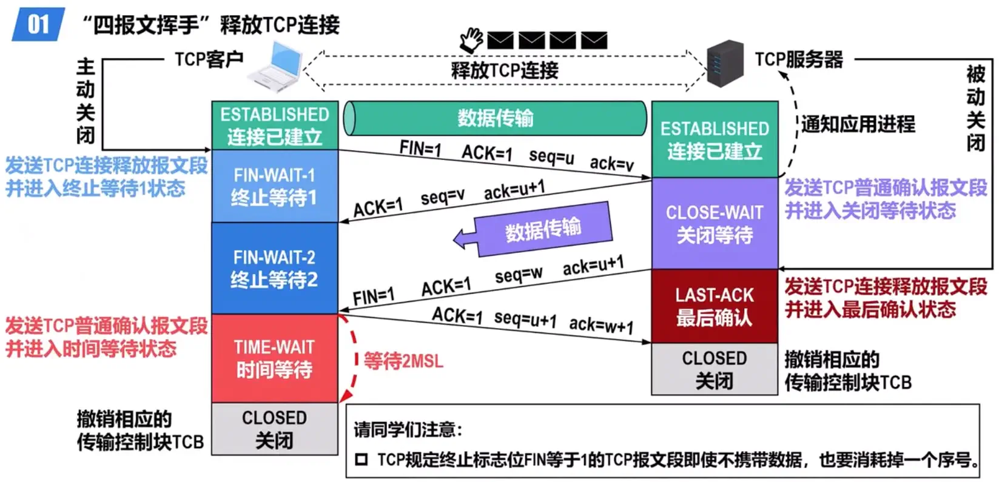

# 计算机网络

湖科大老师的《深入浅出计算机网络》课程[^l1]的笔记，丰富的图例我爱了，知识点也整理得很适合复习观看。

[^l1]: <https://www.bilibili.com/video/BV1pN4y1V7er/?spm_id_from=333.788&vd_source=9cb893257863b1257fecee6fa664edd8>

## 性能指标

1.  速率：数据的传送速度，即每秒传送多少个比特。需要注意kbps、Mbps等单位的基数都是10；

2.  带宽：在模拟信号系统中，带宽指某个信号所包含的各种不同频率成分所占的频率范围，单位Hz。在计算机网络中，则用于表示通信线路所能传送数据的能力，即在单位时间内从网络中的某一点到另一点所能通过的最高数据传送速率，单位和速率一样，一般是主机接口速率、线路带宽、交换机或路由器的接口速率三者中的最小值（瓶颈）；

3.  吞吐量：在单位时间内通过某个网络或接口的实际数据量。显然吞吐量受到带宽限制。

4.  时延：数据从网络的一段传送到另一端所耗费的时间，也称为延迟；

     

    不考虑排队时延的情况下，三个分组：

     

    一个例题：H1经过两次路由器存储转发发送到H2，所有链路的数据传输速率为100Mbps，分组大小为1000B，其中分组头大小为20B。若主机H1向主机H2发送一个大小为980000B的文件，问不考虑分组拆装时间和传播延迟的情况下，从H1发送开始到H2接收完为止，需要的时间？

    首先算出单个分组的发送时延=1000B/100Mbps，画图易知一共有980000B/(1000B-20B)+2个分组的发送时延，两者相乘可得共80.16ms。这题需注意的点是计算分组数量时去掉分组头的部分，分组交换头是额外附加的，接收方最终会去掉头将分组内容拼接起来。

5.  时延带宽积：传播时延和带宽的乘积，数据量单位，可以形象地理解为滞留在管道中的数据量。

6.  往返时间（RTT）：指从发送端发送数据分组开始，到发送端收到接收端发来的相应确认分组为止，总共耗费的时间。

7.  链路利用率：某条链路有百分之几的时间是被利用的（即有数据通过）。网络利用率：网络中所有链路利用率的加权平均。根据排队论，当某链路的利用率增大时，该链路引起的时延就会迅速增加。一个简单的理想模型是：

    $$
    D=\frac{D_0}{1-U}
    $$

    其中，$D$指网络当前时延，$D_0$指网络空闲时延，$U$指网络利用率。结合图像，网络利用率过高会导致时延较高，过低会浪费资源，因此一些大型ISP会动态控制$U$在50%左右。

8.  丢包率：在一定时间范围内，传输过程中丢失的分组数量与总分组数量的比率。

## 体系结构

这个图很nice：

### 分层的必要性

物理层考虑的问题：

1.  采用什么传输媒介？
2.  采用什么物理接口？
3.  采用什么信号表示比特0和1？

数据链路层考虑的问题：

1.  标识网络中各主机（主机编址）；
2.  从比特流中区分出地址和数据（数据封装格式）；
3.  协调各主机争用总线（媒体接入控制）；
4.  以太网交换机的实现（自学习和转发帧）；
5.  检测数据是否误码（差错检测）；
6.  出现传输差错如何处理（可靠传输和不可靠传输）；
7.  接收方控制发送方注入网络的数据量（流量控制）。

网络层考虑的问题：

1.  标识网络和网络中的各主机（网络和主机共同编址，例如IP地址）；
2.  路由器转发分组（路由选择协议、路由表和转发表）。

运输层考虑的问题：

1.  进程之间基于网络的通信（进程的标识，例如端口号）；
2.  出现传输差错如何处理（可靠传输和不可靠传输）。

应用层考虑的问题：

1.  通过应用进程间的交互来完成特定的网络应用；
2.  进行会话管理和数据表示。

| 原理体系结构 | 主要解决的问题               |
| ------ | --------------------- |
| 应用层    | 通过应用进程的交互来实现特定网络应用的问题 |
| 运输层    | 进程之间基于网络的通信问题         |
| 网络层    | 数据包在多个网络之间传输和路由的问题    |
| 数据链路层  | 数据包在一个网络或一段链路上传输的问题   |
| 物理层    | 使用何种信号来表示比特0和1的问题     |

### 重要术语解释

1.  实体：任何可发送或接收信息的硬件和软件进程；**对等实体**是指通信双方相同层次中的实体；

2.  协议：控制两个对等实体在“**水平方向**”进行**逻辑通信**的规则的集合。之所以称为“逻辑通信”，是因为实际是通过下层服务完成的通信。

    1.  语法：定义所交换信息的格式；
    2.  语义：定义通信双方所要完成的操作；
    3.  同步：定义通信双方的时序关系；

3.  服务：在协议控制下，两个对等实体在水平方向的逻辑通信使得本层能够向上一层提供服务。换言之，协议是“水平”的，服务是“垂直”的；

    1.  服务访问点：在同一系统中相邻两层的实体交换信息的逻辑接口，用于区分不同的服务类型，例如帧的“类型”字段、IP数据报的“协议”字段、TCP或UDP的“端口号”字段；
    2.  服务原语：上层使用下层所提供的服务所需与之交换的命令；

4.  **协议数据单元**：对等层次之间传送的数据包称为该层的协议数据单元PDU。

    | 层     | PDU示例                          |
    | ----- | ------------------------------ |
    | 应用层   | 应用报文（message）                  |
    | 运输层   | TCP报文段（segment），UDP报文段（packet） |
    | 网络层   | IP数据报（packet）                  |
    | 数据链路层 | 帧（frame）                       |
    | 物理层   | 比特流（bit stream）                |

5.  服务数据单元：同一系统内层与层之间交换的数据包称为服务数据单元SDU。

## 物理层

| 物理层接口特性 | 主要内容                                 |
| ------- | ------------------------------------ |
| 机械特性    | 1. 形状和尺寸；2.引脚数目和排列；3. 固定和锁定装置        |
| 电气特性    | 1. 信号电压范围；2. 阻抗匹配的情况；3. 传输速率；4. 距离限制 |
| 功能特性    | 1. 规定接口电缆的各条信号线的作用                   |
| 过程特性    | 1. 规定在信号线上传输比特流的一组操作过程，包括各信号间的时序关系   |

### 传输方式

#### 同步传输

以bit为传输单位，数据块以bit stream的形式传输，字节之间没有间隔，也没有标识每个字节的起始位和终止位。接收方在bit信号的中间时刻进行采样，以判别收到的是0还是1，这要求收发双方对标识bit的信号的时间长度达成一致。然而在现实中收发双方的时钟频率无法达到严格同步，接收方对信号采样时刻的误差会不断积累，造成采样时刻的严重偏移。为此可以采用一些使收发双方时钟同步的方法：

1.  外同步：在收发双方之间增加一条时钟线；
2.  内同步：发送端将时钟信号编码到发送数据中一起发送。

#### 异步传输

以字节为传输单位，但字节之间的时间间隔并不固定，接收端只在每个字节的起始处，对字节内的bit实现同步。为此，一般要给每个字节添加起始位和结束位。

### 编码和调制

在使用时间域的波形表示信号时，代表不同离散数值的基本波形称为码元。

#### 常用编码方式

1.  双极性不归零编码：即整个码元期间电平保持不变，高电平代表1，低电平代表0的编码，为区分码元，采用外同步时钟线。编码效率高，但额外的时钟线很浪费；

2.  双极性归零编码：在每个码元的中间时刻都会回归到零电平，接收方只要在归零后采样即可。归零编码相当于将时钟信号用“归零”方式编码在了数据之内，这称为“自同步信号”。然而，归零编码中的大部分带宽都浪费在了传输“归零”上了；

3.  曼切斯特编码：在每个码元的中间电平都会跳变，从而既可用作时钟信号，也表示数据。时钟上升沿和下降沿的具体含义可以自行定义，10MB/s以太网即使用这种编码；

4.  差分曼切斯特编码：在曼切斯特编码的基础上，码元中间的电平跳变仅表示时钟信号，而不表示数据；数据的表示在于每个码元开始处是否有电平跳变，无跳变表示1，有跳变表示0。这是因为现实环境存在噪声干扰，通常检测有无跳变比检测跳变方向更不容易出错，在传输大量连续的0或1的情况下，差分曼切斯特编码的跳变更少，因此更易于检测。即使传输介质接线错误导致高低电平翻转，差分曼切斯特编码依然有效。如图，第一个码元因为不知道前面的情况，不能判断起始处是否有电平跳变：

     

#### 基本带通调制方法和混合调制方法

上图中一个码元仅携带一位bit信息，是否可以让一个码元携带更多信息呢？答案是肯定的，其中，因为载波的频率和相位是相关的（频率是相位随时间的变化率），所以频率和相位不能混合调制，但载波的相位和振幅可以混合起来一起调制，例如 *正交振幅调制QAM* ，有12种相位，每种相位有1或2种振幅可选，一共可调制出16种码元（波形），单种码元可对应4个bit（16种状态需用4bit表示）。

### 信道

信道上传输的数字信号，可以看做是多个频率的模拟信号进行多次叠加后形成的方波。如果数字信号中的高频分量在传输时受到衰减甚至不能通过信道，则接收方接收到的波形前沿和后沿就变得不那么陡峭，每一个码元所占的时间界限也不再明确。这样，在接收端收到的信号波形就失去了码元之间的清晰界限，这种现象称为**码间串扰**。

如果信道的频带越宽，则能够通过的信号的高频分量就越多，那么码元的传输速率就可以更高，而不会导致码间串扰。但信道的频率带宽是有上限的，故码元的传输速率也有上限。

#### 奈氏准则

理想低通信道的最高码元传输速率= 2W Baud = 2W 码元/秒，其中W为信道的频率带宽（单位Hz），Baud为波特率，即码元传输速率，有时也称为调制速率、波形速率或符号速率。显然码元传输速率与比特传输速率成比例关系，比值为一个码元携带的bit信息量。

#### 香农公式

在奈氏准则对最高码元传输速率的限制下，我们也许会想，如果采用技术更复杂的信号调制方法，让单个码元可以携带更多的比特，岂不是可以无限制地提高信息的传输速率？然而实际由于噪声的存在，会影响接收端对码元的识别，并且噪声功率相对于信号功率越大，影响就越大。香农根据信息理论推导出了**带宽受限且有高斯白噪声干扰的信道的极限信息传输速率**：

$$
C=W \log_2(1+\frac{S}{N})
$$

式中，C是信道的极限信息传输速率（单位bps），W是信道的频率带宽（单位Hz），S是信道内所传信号的平均功率，N是信道内的高斯噪声功率，S/N即常说的信噪比，有时用分贝（dB）表示，与无量纲值S/N的换算关系是$dB=10 \log_{10}(\frac{S}{N})$。

从香农公式可以看出，信道的频率带宽W或信道中的信噪比S/N越大，信道的极限信息传输速率C就越高。实际信道不可能无限制地提高频率带宽W或信道中的信噪比。

来看一些例子：

1.  在无噪声情况下，若某通信链路的带宽为3kHz，采用4个相位，每个相位具有4种振幅的QAM调制技术，则该通信链路的最大数据传输速率是多少？

    4个相位4种振幅的QAM调制技术共16种码元，对应16种状态，共需4个bit位表示。则单个码元的信息量为4bit。根据奈氏准则，该链路的最高码元传输速率为3kHz×2=6kHz。于是计算出最大数据传输速率为6kHz（码元/秒）×4（比特/码元）=24kbps。

2.  若某通信链路的数据传输速率为2400bps，采用4相位调制，则该链路的波特率（码元传输速率）是多少？

    4相位共4种码元，则单个码元的信息量为2，码元传输速率为2400bps/2=1200码元/秒。

3.  若某链路的频率带宽为8kHz，信噪比为30dB，该链路实际数据传输速率约为理论最大数据传输速率的50%，则该链路的实际数据传输速率约是多少？

    W是8kHz，将30dB转化为无量纲的比值$30dB=10⋅\log_{10}(\frac{S}{N})$得到信噪比S/N为1000，带入香农公式得到理论最大传输速率$C=8kHz⋅\log_2(1+1000)\approx 80kbps$，由题设知实际数据传输速率为40kbps。

#### 信道复用技术

##### 频分复用FDM

将传输媒体的总频带花费成多个子频带（子信道），子频带之间还需要隔离频带以避免干扰。

##### 时分复用TDM

将时间划分成多个时隙，每个用户轮流占用一个时隙，则各用户时隙周期性出现，其周期长度就是一个TDM帧大小。

##### 波分复用WDM

即光的频分复用，在一根光纤上同时传输多个频率（波长）相近的光载波信号。

##### 码分复用CDM

也称码分多址（Code Division Multiple Access，CDMA）。CDMA将每个bit时间进一步划分为m个更短的时间片，成为**码片（Chip）**。m的取值通常为64或128，为了简单起见，这里以8举例：

CDMA的每个站点都被指派一个唯一的m位比特序列，如果某个站点要发送比特1，则发送它自己的m比特序列；如果要发送0，则发送序列的反码。作为接收方是也一样。将序列中的$0$记作$-1$，$1$记作$+1$，可写出相应的**码片向量**。

如果有多个站同时发送数据，则信道中的信号就是这些站各自所发送码片向量的叠加。为了从信道中分离出每个站的信号，需要使各个站点的序列各不相同，且对应的码片向量构成标准正交基。

假如基站要给A发送1，给B发送0，则应发送的向量是$A+\overline{B}$，A收到时，由$(A+\overline{B})^TA=A^TA+\overline{B}A=1+0=1$得知收到的是1，B由$(A+\overline{B})^TB=A^TB + \overline{B}^TB=0+(-1)=-1$得知收到的是0，假如还有第三方C，由$(A+\overline{B})^TC=0$得知没有收到信息。

## 数据链路层

*   链路：一个节点到相邻节点的一段物理线路（有线或无线），而中间没有任何其他的交换节点；

*   数据链路：当在一条链路上传送数据时，除需要链路本身，还需要一些必要的通信协议来控制这些数据的传输，把实现这些协议的硬件和软件加到链路上，就构成了数据链路；

计算机中的网络适配器（俗称网卡）和其相应的软件驱动程序就实现了这些协议。一般的网络适配器都包含了物理层和数据链路层这两层的功能。

*   帧：数据链路层对等实体之间在水平方向进行逻辑通信的协议数据单元PDU。

### 三个重要问题

1.  透明传输：接收方依照帧首部和帧尾部来判断帧的范围，但如果中间的数据载荷中有和帧尾部一样的数据，就会出现问题。换句话说PDU中不能包含帧定界符，这样的数据链路层不能满足实际的需要。如果能够采取措施，使得数据链路层对上层交付的PDU没有任何限制，就好像数据链路层不存在一样，就称其为透明传输。

2.  差错检测：基本就是奇偶校验、汉明码、CRC这些。

3.  可靠传输：即设法使无论发送方发送什么接收方都能够正确收到。例如若出现差错误码的帧，接收方可能要求重传等。

### 帧封装和透明传输

**封装成帧**指数据链路层给上层交付下来的协议数据单元PDU添加一个首部和一个尾部，使之成为帧。帧的首部和尾部中包含有一些重要的控制信息，同时也可以起到帧定界的作用，毕竟物理层看到的都只是一串bit流。

:::info
并不是所有数据链路层协议帧都有帧定界标志，例如以太网V2的MAC帧，它的帧定界通过物理层附加在头部的8位前导码以及标准约定的帧间间隔来实现。
:::

考虑到对缓存空间的需求以及差错控制等因素，每一种数据链路层协议都规定了帧的数据载荷的长度上限，称为**最大传送单元（MTU）**。例如，以太网的MTU为1500个字节。

对于面向字节的数据链路层协议，透明传输面临的问题和字符串中换行符等遇到的问题类似，可以通过转义字符（字节填充法）的机制实现。而对于面向比特的数据链路协议，可以采用比特填充法，例如HDLC协议，其帧定界符为0111110，采用“零比特填充法”，约定在数据载荷中每遇到5个连续的1就插入一个0。

### 可靠传输

常见的传输差错：误码（比特差错）、分组丢失、分组失序、分组重复（通常由超时重发导致）。实现可靠传输并不局限于数据链路层。

#### 停止-等待（Stop-and-Wait）协议

发送方在发送一个数据分组后并不立即从缓存中删除，因为可能要重传，只有收到对方的确认分组后才发送下一个分组。在接收方，收到后会检验数据分组的正确性，并回馈确认或否认分组。如果分组丢失（无论是发送分组还是确认分组），发送方都会一直等待接收方的响应。因此可利用**超时重传**机制加以解决，一般将超时重传时间RTO设置为略大于往返时延RTT。

如果确认分组丢失，在有超时重传机制的情况下，又可能导致发送方发送重复分组。为此需要对发送分组进行编号，由于每发送一个分组就停止等待，只要保证每次新发送的分组编号与上一个不一样即可，因此一个比特位就够了。接收方在收到相同编号的发送分组后，就知道之前的确认分组丢失了，为此需丢弃这个发送分组，然后重新发送一个确认分组。

既然发送分组需要编号，确认分组是否也需要编号呢？答案是肯定的，由于传输时延，可能一个确认分组在传输过程中，发送方已经超时重传了，之后确认分组到达发送方会被认为是重传的确认分组，于是继续发送下一个，而接收方收到重传的分组后丢弃并重新确认，这个确认分组又被当做是最新发送的分组的确认，形成错位，为此确认分组也需要编号。确认分组的编号与发送分组相同即可。

停止-等待协议属于自动请求重传（ARQ）协议，即重传的请求是发送方自动进行的，而不是接收方发送明确报文指明要重传哪个分组的。

##### 信道利用率

信道利用率是针对发送方来说的，指发送方处在发送工作中的时间占比。如果出现超时重传，则出现空置信道利用率进一步降低。因此，只有在RTT远小于TD的时候，比如无线局域网中，才适用停止-等待协议。

#### 回退N帧（Go-back-N）协议

推荐看原视频，有动画演示，这里只有简述。

停止等待使发送方浪费了大量的时间在等待上，因此信道利用率低。为此，可以使用流水线传输的策略，但又不能让发送方无限制地连续发送，因为可能导致网络中的路由器或接收方来不及接收，进而造成丢失，这同样是对网络资源的浪费。因此需要**发送窗口**来限制发送方的连续发送，称为**连续ARQ协议**。当出现差错时，发送方需要将发送窗口开始处已经发送过的数据重新发送一遍，因此被称为回退N帧协议。在回退N帧协议工作的过程中，发送方的发送窗口和接收方的接收窗口按上述规则不断向前滑动。因此，这类协议又称为**滑动窗口协议**。

发送方维护一个发送窗口WT，在未收到接收方确认的情况下，可以将序号落在WT内的所有数据分组发送出去。若采用$n$个bit给分组编号，则WT的取值范围是$1<W_T\le 2^n-1$，（等于1就是停止等待协议）。

接收方维护一个接收窗口WR，只有正确到达且序号落在WR内的数据包才被接收方接收。WR的宽度固定为1。

在信道质量较差，容易出现误码的情况下，一个数据分组的差错就可能引起大量分组重传，这时候回退N帧协议的信道利用率并不比停止等待协议高。

回退N帧协议采用累积确认方式，即接收方不必对每一个数据分组都发送确认分组，而是在收到几个连续的数据分组后，对按序到达的最后一个数据分组发送确认分组，表示前面所有的分组均接收成功。这样在某些情况下，即使确认分组丢失，也可能不必重传（比如ACK1丢失，但很快ACK4到达，使发送方知道1号分组接收成功了），一定程度上减少了向网络中注入确认分组的数量。

#### 选择重传（Selective Repeat）协议

回退N帧协议的设定使得一个分组出错就可能造成大量分组重传，即使这些分组已经正确到达接收方。为了进一步提高效率，应设法只重传出错的分组。为此，需要调整接收窗口WR的尺寸大于1，以便先收下失序但正确到达的“超前”分组。这种情况下，一般有$1<W_R\le W_T$，同时还要满足$W_T+W_R\le 2^n$，这是为了确保接收窗口滑动后，落入新窗口内的新序号与之前的旧序号没有重叠，避免无法分辨新旧数据分组（见视频演示）。

为了使发送方仅重传出现差错的数据分组，接收方不再采用累积确认，而需要对每一个正确接收的数据分组进行确认。

### 以太网

#### 共享总线以太网

多个站点使用一条总线连接。

##### CSMA/CD协议

当某个站点在总线上发送帧时，总线资源应被该站点独占。此时，如果其他站点也要在总线上发送帧，就会产生信号碰撞。因此共享式总线以太网的一个重要问题就是**如何协调总线上的各站点争用总线**。共享总线使用了一种专用媒体接入控制协议**CSMA/CD**，全称为**载波监听多址接入/碰撞检测（Carrier Sense Multiple Access Collision Detection）**。

*   多址接入MA：多个站点连接在一条总线上，竞争使用。

*   载波监听CS：每个站点在发送帧之前，先要检测一下总线是否被其他站点占用。

    1.  若检测到总线空闲超过96bit时间（发送96bit所需要的时间，也称为帧间最小间隔），则发送；
    2.  若检测到总线忙，则继续检测直到情况1出现。

*   碰撞检测CD：每个正在发送帧的站点边发送边检测碰撞。一旦在发送时检测到碰撞，立即停止发送，退避一段随机时间。

*   强化碰撞：发送帧的站点一旦检测到碰撞，除了立即停止发送帧外，还要再继续发送32bit或48bit的人为干扰信号，以便有足够多的碰撞信号供站点检测。

使用CSMA/CD协议时，由于正在发送帧的站点必须“边发送帧边检测碰撞”，因此站点不可能同时进行发送和接收，故不能进行**全双工通信**，而只能进行**半双工通信（双向交替通信）**。

##### 争用期与最大、最小帧长

令单程端到端传播时延为$\tau$，一个问题是某站点从发送帧开始，最长经过多长时间，才能检测出自己发送的帧与其他站点发送的帧产生了碰撞。当己方发送的帧无限接近（还没到达）对方时，对方的检测误以为总线空闲而发送帧产生碰撞，此时碰撞再传播回去需要一个链路的耗时，因此总共是$2\tau$。

共享总线以太网的端到端往返时间$2\tau$被称为**争用期（Contention Period）**或者**碰撞窗口（Collision Window）**。如果**站点从发送帧经过$2\tau$开始还没有检测到碰撞，就可以认为此次发送不会产生碰撞**。10Mbps共享以太网规定，争用期$2\tau$的值为512bit的发送时间，即$51.2\mu s$。假设信号传播速率为$2×10^8$m/s，可计算出总线长度为$2×10^8m/s×51.2\mu s\div 2=5120m$。由于还要考虑到转发延时以及人为干扰信号的持续时间等，因此$\tau$的可能值要小于$25.6\mu s$，在实际应用中共享总线以太网规定：总线长度不能超过2500m。

现在还没有完全解决碰撞的问题，存在这样的情况：一方发送一个很短的帧，因此很快发送完毕并且过程中没检测到碰撞。但是该帧在传播途中可能与其他误认为总线空闲端的帧形成碰撞，并被丢弃。然而此时发送端已经停止了检测，无从知晓这一情况。由于站点只在要发送时刻和发送过程中检测碰撞，故要使每一个站点在发送一个完整的帧之前都能检测到碰撞，需使发送耗时不小于$2\tau$，即保证第一个bit已经到达接收方，结合发送速率，可以得到一个**最小帧长**。对于10Mbps以太网，可以得到最小帧长为$10Mbps×51.2\mu s=512b=64B$。对于发送方，如果发送帧的前64B过程中没有产生碰撞，可以认为后续部分也不会产生碰撞。在接收方，由于一旦检测到碰撞就停止发送，因此如果收到小于64B的帧，可以认定是一个因碰撞提前中止的帧，直接丢弃即可。

理论上，应使帧数据载荷的长度远大于帧首尾部的总长度，以便提高效率。但太长的帧可能导致一个端点长时间占用总线，并延长了处理帧定界符的过程，这同样带来问题。故也应该设置一个**最大帧长**。

一个例子，在某个采用CSMA/CD协议的网络中，传输介质是一根完整的电缆，传输速率为1Gbps，电缆中的信号传播速率是200000km/s。若最小数据帧长度减少800bit，则最后的两个站点之间的距离至少该做如何变动？

已知最小帧长=数据传输速率×争用期$2\tau$，帧数据传输速率不变的情况下，减少最小帧长就要减少争用期，也就是减少链路中最远两个端点之间的距离，或者说减少总线的长度。令总线长度为$d$，最小帧长为$l$，有$l=1Gbps×2×(\frac{d}{200000×10^3})$，得$l=10d$，若$l$减少800bit，则$d$应减少80m。

##### 退避算法和信道利用率

共享总线以太网中的各站点采用 **截断二进制指数退避（Truncated Binary Exponential Backoff）** 算法来选择退避的随机时间。

如果多次发生碰撞，说明可能有较多的站点要使用信道。使用上述算法可使重传需要推迟的平均时间逐次增大，进而减小碰撞概率。当重传16次仍不能成功时，就表明同时打算发送的站点太多，此时应放弃重传并向上层报告。

在理想情况下，总线一旦空闲就刚好有个站点发送帧，且各站点发送帧都不会产生碰撞，因此红色部分的耗时不考虑。发送一帧占用总线的时间为$T_0+\tau$，而帧本身的发送时间是$T_0$，得极限信道利用率$S_{max}=\frac{T_0}{T_0+\tau}=\frac{1}{1+\frac{\tau}{T_0}}$，显然$\frac{\tau}{T_0}$的数值应尽量小，以提高信道利用率，意味着总线长度应尽可能短，帧长度应尽可能大。

##### 共享总线以太网的拓展

在早期使用粗/细同轴电缆的共享总线以太网之后，发展出来了一种使用大规模集成电路来替代总线、并使用可靠性更高的设备，叫作**集线器**。站点连接到集线器的传输媒体也转而使用更便宜、更灵活的**双绞线电缆**。

###### 物理层拓展

集线器只工作在物理层，可以用于拓展两个子网。它的每个接口仅简单地转发比特，并不进行碰撞检测。碰撞检测的任务由各站点的网卡负责。但集线器也有少量的容错能力和网络管理功能，例如假如某个站点因网卡故障不断向网络中发送帧，集线器可以检测出该问题，并断开与该站点的连接，以保证整个以太网能够正常工作。

IEEE于1990年制定了**10BASE-T星型**以太网的标准802.3i，为以太网在局域网的统治地位奠定了基础。其中的10表示传输速率为10Mbps，BASE表示采用基带信号进行传输，T代表使用双绞线作为传输媒介。除此之外还可以使用光纤，对应的标准是10BASE-F。

###### 数据链路层拓展

使用**网桥**拓展以太网，网桥工作在数据链路层，因此比集线器“懂得多”。例如网桥可以识别帧的结构，可以根据帧首部的目的MAC地址和网桥自身的帧转发表来转发或丢弃所收到的帧。

网桥的转发表是空的，通过“自学习”算法来建立起转发表。大致的规则如下：

1.  网桥收到帧后进行登记（自学习），登记的内容为帧的源MAC地址和进入网桥的端口号；

2.  网桥根据帧目的MAC地址和转发表进行转发，有：

    1.  明确转发：表中已有记录，网桥知道从哪个接口转发帧；
    2.  盲目转发：网桥不知道应当从哪个接口转发，在记录来源的同时转发给除来源接口外的所有接口；
    3.  丢弃：网桥知道不应该转发帧，例如来源和目的在同一个网络段（对网桥来说就是要转发到和来源相同的接口），将其丢弃；
    4.  误码：直接丢弃；
    5.  广播帧：转发给除来源接口外的所有接口。

3.  转发表中的每条记录都有其有效时间，到期自动删除。这是因为各站点的MAC地址与网桥接口的对应关系并不是永久的。

为了以太网的可靠性，有时需要在两个以太网之间使用多个透明网桥来提供冗余线路。但是冗余线路又会造成环路，对于广播帧或者盲目转发，将造成帧在网络中的永久循环。为此网桥之间会通过 **生成树协议（STP）** 来建立一个无环的的转发链路。在网络故障破坏树结构的时候，还会自动重新建树。

#### 交换式以太网

使用网桥将两个共享式以太网连接起来，原本的两个网络成了这个更大网络中的网段，其中用于连接的多端口网桥被称为**以太网交换机**。不使用集线器的网络就称为**交换式以太网**，其中的网桥可以起到隔离碰撞域的作用。

:::info
共享式网络中的集线器工作在物理层，它不能识别MAC地址，因为MAC地址是数据链路层的内容。集线器的作用仅仅是将收到的比特从其他所有接口转发出去。因此不具有隔离碰撞域的功能，换句话说，使用集线器扩展共享式以太网，既扩大了广播域，也扩大了碰撞域。而如果使用交换机扩展共享式以太网，则会形成一个更大广播域，两个独立碰撞域的网络。
:::

#### VLAN

过大的广播域会造成“广播风暴”，而隔离广播域如果全部使用路由器（工作在网络层）代价较大，为此在局域网中，可以通过划分逻辑组（虚拟局域网，VLAN）来隔离广播域。VLAN并不是一种新型网络，它只是局域网能够提供给用户的一种服务。通常由交换机实现。

### 无线局域网802.11

无线局域网使用CSMA/CA（载波监听多址接入/碰撞避免，Carrier Sense Multiple Access/Collision Avoidance）协议的原因：

1.  无线信道的传输环境复杂且信号强度的动态范围非常大，在802.11无线网卡上接收到的信号强度一般都远远小于发送信号的强度，信号强度甚至相差百万倍。因此，如果要实现碰撞检测，对硬件的要求非常高；

2.  即使能在硬件上实现碰撞检测，但由于无线电波传播的特殊性（存在隐蔽站问题，如下图），还会出现无法检测到碰撞的情况。

     

因此无线局域网不能直接照搬共享总线以太网的CSMA/CD协议，而是尽可能提供避免碰撞CA的功能。

#### CSMA/CA的基本工作原理

1.  假设信道是空闲的，源站要发送它的第1个数据帧，在检测空闲之后，先等待DIFS间隔后才能发送。这个等待是考虑到可能其他的站有更高优先级的帧要发送；

    :::info
    **DCF帧间间隔DIFS**的长度为128$\mu s$，在DCF方式中，DIFS用来发送和管理帧。
    DCF是分布式协调功能（Distributed Coordination Function）的缩写。在DCF方式下，没有中心控制站点，每个站点使用CSMA/CA方式争用信道发送权。DCF方式是802.11协议定义的默认方式，即必须实现的机制。
    :::

2.  若没有其他站要发送更高优先级的帧，则源站发送第1个数据帧，帧首部的“持续时间”字段指出了源站要占用信道的时间（包括目的站发回确认帧所需的时间）；

3.  目的站若正确收到该帧，则经过SIFS间隔后，向源站发送确认帧ACK。如果源站在重传计时器设定的超时时间内没有收到确认帧，则必须重传直到收到确认帧或者失败太多次为止；

    :::info
    **短帧间间隔（Short Interframe Space，SIFS）** 的长度为28$\mu s$，它是最短的帧间间隔，用来分隔属于一次对话的各帧。一个站点应当能够帧这段时间内从发送方式切换到接收方式。使用SIFS的帧类型有ACK、CTS帧（见下文）等。
    :::

    目的站发送确认帧的原因是：由于无线信道的误码率较高，故CSMA/CA协议使用停止-等待机制来确保可靠传输。

4.  对于其他站，当检测到正在信道中传送的帧首部中的“持续时间”字段时，就调整自己的网络分配向量（Network Allocation Vector，NAV）。NAV指出了完成这次帧的传送且信道转入空闲所需的时间。这就是所谓的虚拟载波监听机制。

5.  对于其他站，在NAV这段时间结束之后，先经过一个DIFS间隔，然后还要退避一段随机时间，才能发送帧。还要退避随机时间的目的是防止正在等待的其他站一下子同时开始发送，造成碰撞。因此所有要发送帧的站在检测到信道空闲之后，都要执行退避算法。这样不仅可以减少碰撞的概率，还可避免某个站长时间饥饿。

    当某个站要发送帧时，仅在这种情况下才可以不使用退避算法：检测到信道空闲，并且该数据帧不是成功发送完上一个数据帧之后立即连续发送的数据帧。其他几种情况都必须使用退避算法：

    1.  在发送帧之前检测到信道处于忙碌状态（自身正等待NAV间隔结束）；
    2.  每一次重传帧前；
    3.  每一次成功发送要连续发送下一帧前。

全流程示意图：

#### CSMA/CA的退避算法

在执行退避时，站点为退避计时器设置一个随机的退避时间：

*   当退避计时器的时间减小到0时，就开始发送数据；
*   当退避计时器的时间未减小到0而信道又转变为忙状态，这时就冻结退避计时器的数值，重新等待信道变为空闲，再经过帧间间隔DIFS之后，继续启动退避计时器。

和CSMA/CD类似，在进行第i次退避时，退避时间在时隙编号$0, 1, ..., 2^{2+i}-1$中随机选择一个，然后乘上基本退避时间（一个时隙的长度）就是要退避的随机时间。当时隙编号达到255时，对应第6次发送，就不再增加了。

#### 信道预约

为了进一步降低发生碰撞的概率，802.11无线局域网允许对信道进行预约。

1.  若检测到信道空闲，源站在等待一个DIFS时间后，先发送一个 **RTS（Request to Send）** 帧，RTS帧是一个很短的控制帧，指明了源地址、目的地址和本次通信（包括目的站发回确认帧所需的时间）的持续时间；

2.  若目的站正确收到RTS帧，在检测到信道空闲，且经过一个帧间间隔SIFS后，就向源站发送一个 **CTS（Clear to Send）** 帧作为响应；

3.  源站在正确收到CTS帧之后，等待一个SIFS帧之后就可以发送第1个帧了。除源站和目的站之外的其他站点，在收到CTS或数据帧之后就推迟访问信道。

虽然看起来RTS和CTS除了带来额外的开销没什么作用，但由于RTS和CTS帧都很短，发生碰撞的概率、碰撞产生的开销以及帧本身的开销都很小。对于一般的数据帧，其发送时延往往远大于传播时延（因为是局域网），故发生碰撞的概率很大，而一旦因碰撞导致重发，则浪费的资源更多。因此使用短控制帧预约信道是值得的。不过是否使用RTS和CTS帧在802.11中是可选的，用户也可以在数据帧的长度超过某个阈值时才使用RTS帧和CTS帧。

RTS和CTS帧都会携带通信所需要的持续时间，也属于虚拟载波监听机制。利用该机制，站点只需要监听到数据帧、RTS帧或CTS帧之中的任意一个，就知道信道将被占用的时间，而不需要监听到真正的信号，因此可以减少隐蔽站带来的碰撞问题。例如之前的隐蔽站示意图中，若B监听到了AP给A的CTS，则可以知道信道正在被占用。

#### MAC帧格式

802.11帧格式与以太网中有明确区别的一点是，802.11帧中必须携带AP的MAC地址，而以太网中却不需要。在以太网中，AP与透明网桥一样，对各站点是透明的。而在802.11无线局域网中，在站点的信号覆盖范围内，可能会有多个AP共享同一个物理信道，但站点只能与其中一个AP建立关联。因此，802.11中就必须指明转发该帧的AP。

下表中DS表示转发系统。只要牢记地址1代表直接目的，地址2代表直接来源即可：

## 网络层

理论上，网络层可以向上层提供两种服务，一种是面向连接的虚电路服务，核心思想是**可靠通信应由网络自身来保证**，因此通信双方必须首先建立起网络层连接——虚电路然后再进行通信，虚电路是一种稳定的逻辑电路，分组的首部仅在连接建立阶段使用完整的目的主机地址，之后的每个分组的首部只需要携带一条虚电路编号即可。这种通信方式如果再使用可靠传输协议，就可以使所发送的分组最终正确到达接收方；而另一种服务则是无连接的数据报服务，其核心思想是**可靠通信应由用户主机来保证**，因此不需要建立网络层连接。由于每个分组可走不同的路径，故每个分组的首部都必须携带目的主机的完整地址。这种通信方式所传输的分组会出现误码、丢失、重复和失序等差错。后者将相对简单的尽最大努力（意味着不可靠）的分组交付功能置于因特网核心，将复杂的网络处理功能置于因特网的边缘（即用户主机及其内部的运输层），其便利和灵活性成就了当今规模的因特网。

### 网际协议IPv4

#### IPv4编址方法

IPv4给因特网上的每一个主机（或路由器）的每一个接口分配一个在全球范围内唯一的32位标识符。其编址方法经历了分类编址——划分子网——无分类编址三个阶段，虽然前两者已被淘汰，但由于大量的历史遗留，我们还是需要学习一下。

##### 分类编址

1.  A类地址：`[0|7位网络号|24位主机号]`，其中最小网络号0表示本网络，不能指派；最大网络号127作为本地网络环回测试地址，不能指派，因此A类网络段数量是$2^7-2=126$个。主机段数量是$2^{24}-2$个，主机段也要减去2是因为全0要用作本网络地址，全1表示广播地址。

2.  B类地址：`[10|14位网络号|16位主机号]`

3.  C类地址：`[110|21位网络号|8位主机号]`

4.  D类地址：`[1110|多播地址]`

5.  E类地址：`[1111|保留地址]`

##### 划分子网

分类编址的浪费十分明显，一个255主机的小网络却需要一个B类网络，导致地址利用率低。一种改进思路是划分子网，借助子网掩码，在主机号开始部分借用若干位用来代表子网。将划分子网的IPv4地址与相应的子网掩码进行逐比特的逻辑与运算，就可以得到该IPv4地址所在子网的网络地址。易知A类网络的默认子网掩码是255.0.0.0，B类地址的默认子网掩码是255.255.0.0，C类地址的默认子网掩码是255.255.255.0。

一图流：

##### 无分类编址（CIDR）

相当于延续了子网掩码的设计，但去掉了分类的概念，依然用掩码中左起的连续1作为网络号，剩余的连续0作为主机号。

###### 网络聚合

将多个网络按照公共前缀聚合成一个网络，这个前缀及后续全部置0组成的地址称为主网号。对于路由来说可以一定程度上减少路由表的大小。显然网络前缀越长，可容纳的主机数就越小，路由就越具体。于是在有多个路由表项匹配目标地址时，应当选择前最最长的条目，称为**最长前缀匹配**原则，因为这样的路由更具体。

来看一个我感觉挺阴间的题目（2021年408真题）：将一个IP网络划分为3个子网，若其中一个子网是192.168.9.128/26，则下列网络中，不可能是另外两个子网之一的是？

*   A. 192.168.9.0/25
*   B. 192.168.9.0/26
*   C. 192.168.9.192/26
*   D. 192.168.9.192/27

这题的要点在于意识到各个子网里面主机数量不一定要相同（对应的子网掩码不同），以C类网络的视角来看，192.168.9.0/24，则剩下两位用于划分子网，可以是4个x/26子网（选项B，它和题目中的子网对应了00和10两种情况，公共前缀是24位，还剩下01和11两种计4个子网，故选择B），2个x/25子网或2个x/26子网与1个x/25子网等（选项A，C，D）。实际做的时候看各选项与题目中子网的公共前缀，然后判断聚合之后的子网数量即可。

#### 地址解析协议ARP

为什么在有MAC地址的情况下，还要使用IP地址？最主要的原因在于缩减路由表的大小。但这又带来了新的问题，即路由器只知道下一跳的IP而不知道其MAC地址，为此引出了ARP的话题。

ARP的机制并不复杂，每个主机都有自己的一个ARP高速缓存表，当要发送给另一个主机或路由器时，首先在缓存表中查找其IP地址和MAC地址的对应关系，如果没有，则发送一个MAC地址为广播（FF-FF-FF-FF-FF-FF）的报文到网络中，同时带上自己的MAC地址，这样对方接受到之后就可以进行单播响应，发送方在拿到响应报文中的目的MAC地址之后可以缓存下来。

ARP缓存表中的记录可以分为动态和静态两种，上述过程保存下来的是动态记录，默认生命周期2分钟，管理员也可以配置一些静态的记录，使机器重启后记录依然有效等等。此外ARP一个注意点是仅在局域网中使用，跨网络还是需要逐网络的应用ARP。

#### IPv4报文首部

只记录了一些注意点：

1.  首部长度字段以4字节为单位，这也要求首部若除了20字节的固定部分之外还有变长的可变部分导致总长度不为4的倍数时，需要进行补0按4字节对齐；

2.  片偏移以8字节为单位，因此每个分片数据报的数据载荷的长度需要按8字节对齐。MF标志用来表示该分片是否是最后一个，DF标志表示是否可以进一步细分；

3.  8位的TTL早期以秒为单位，因此最长生命周期为255秒。后来改为用跳数表示，每经过一跳TTL就减1，也因此需要重新计算头部的校验和。TTL可以避免在路由回路中无限循环。

### 路由选择协议

仅摘录了一些介绍。

#### 内部网关协议IGP

自治系统（AS）内部子网之间路由选择用到的协议类族统称，之所以用“网关”而不是“路由器”是因为早期标准的文档中都使用“网关”这个名字。

1.  路由选择协议RIP：使用UDP封装，属于应用层，主要考察跳数，直连网络定义为1，超过16跳认为不可达。

2.  开放最短路径有限协议OSPF：直接使用IP数据报封装，属于网络层，主要使用Dikjstra算法在带权图上获得无环路的单源点最短路径。

#### 外部网关协议EGP

由于各个AS内部路由选择的基准不同，还要考虑政治、经济等因素，通常没法使用仅考察单个因素的内部网关协议进行处理。

1.  边界网关协议BGP：需要双方先建立TCP链接的AS间路由选择协议，属于应用层。

### 网际控制报文协议ICMP

为了更有效地转发IP数据报以及提高IP数据报交付成功的机会，TCP/IP体系结构的网际层使用了ICMP（封装在IP数据报中），主机或路由器使用ICMP来发送差错报告报文和询问报文。我们熟知的`ping`和`traceroute`便是基于ICMP的。

### 虚拟专用网VPN

利用公用的因特网作为本机构各专用网之间的通信载体，这个大家应该都很熟悉了:)。

以下三个地址块中的地址作为专用地址：

*   `10.0.0.0~10.255.255.255`（CIDR地址块10/8）

*   `172.16.0.0~172.31.255.255`（CIDR地址块172.16/12）

*   `192.168.0.0~192.168.255.255`（CIDR地址块192.168/16）

### 网络地址转换NAT

在专用网络连接到因特网的路由器上安装NAT软件，装有NAT软件的路由器称为NAT路由器，它至少要有一个有效的外部全球地址。这样，所有使用内部专用地址的主机在和外部因特网通信时，都要在NAT路由器上将其内部专用地址转换成该外部全球地址。

现在通常将NAT转换和运输层端口号结合使用，即NAPT。

NAT（和NAPT）的一个重要特点是通信必须由专用网内部发起，因此拥有内部专用地址的主机不能直接充当因特网中的服务器。对于P2P这类需要外网主机主动与内网主机进行通信的网络应用，在通过NAT时会遇到问题，需要网络应用自身使用一些特殊的NAT穿透技术来解决。

### IP多播技术

多播（Multicast，也称为组播）是一种一对多通信的技术，在因特网上进行的多播称为IP多播。

在IPv4中，D类地址（左起固定`1110`）被作为多播地址（`224.0.0.0~224.239.255.255`）。应注意多播地址只能用作目的地址，而不能用作源地址。

#### 局域网硬件多播

因特网号码指派管理局IANA，将自己从IEEE注册管理机构申请到的以太网MAC地址块中从`01-00-5E-00-00-00`到`01-00-5E-7F-FF-FF`的多播MAC地址用于映射IPv4多播地址。这些地址左起25位都是相同的，只有低23位可变化。

D类多播地址有28个自由位，而MAC多播地址只有23个，映射时直接映射低23位，而IP多播地址中间的5位被忽视，因此存在多个IP多播组映射到相同的硬件多播组的情况，这时需要在网际层利用软件进行过滤。

#### 因特网IP多播

不同局域网中的主机可以自由地加入或离开一个多播组，那么路由器如何知道自己各接口所在局域网中是否有某个多播组的成员呢？这就需要网际组管理协议和多播路由选择协议的协助。

### IPv6

#### IPv6数据报

40字节的基本首部，在有效载荷中放入了扩展首部。多了一个20位的流标号字段，所有属于同一个流的IPv6数据报都具有同样的流标号。换句话说，流标号用于资源分配。原IPv4的TTL字段更名为更准确的跳数限制字段。和IPv4类似，有16位的有效载荷字段负责指明基本首部后面的有效载荷的长度。比较特殊的是8位的“下一个首部”字段，当IPv6数据报没有扩展首部时，该字段的作用与IPv4的协议字段作用一致；当有扩展首部时，则指明后面第一个扩展首部的类型，同时每个拓展首部也都有一个这样的字段指明下一个扩展首部的类型。

#### IPv6地址

128位的地址，按照每16位进行冒号十六进制表示，可以进行左侧零省略和一次连续零省略。

### 软件定义网络SDN

*   SDN控制器：

      

## 运输层

好图，盗了：

### UDP和TCP的对比

| 用户数据报协议UDP                  | 传输控制协议TCP                          |
| --------------------------- | ---------------------------------- |
| 无连接                         | 面向连接                               |
| 支持“一对一”、“一对多”、“多对一”和“多对多”通信 | 每条TCP连接只能有两个端点EP，只能是一对一通信。         |
| 面向应用报文（不会拆分应用层报文，仅添加UDP报文头） | 面向字节流（将应用层报文存储在发送缓存中，根据发送策略可能分组发送） |
| 尽最大努力交付，不可靠；无流量控制和拥塞控制      | 可靠传输；使用流量控制和拥塞控制                   |
| 首部开销小，仅8字节                  | 首部最小20字节，最大60字节                    |

### TCP

#### 首部格式

摘录一些要点：

1.  序号：占4字节，用来指出本TCP报文段数据载荷的第一个字节的序号；

2.  确认号：占4字节，用来指明期望收到对方下一个TCP报文段的数据载荷的第一个字节的序号，同时也是对之前收到的所有数据的确认；

3.  确认标志位ACK：只有当ACK取值为1时，确认号字段才有效。TCP规定在连接建立后，所有传送的TCP报文段都必须把ACK置1；

4.  窗口大小：占2字节，指出接收方接收窗口的大小，即接收缓存的可用空间大小，这用来表征接收方的接收能力；

5.  同步标志位SYN：用于三次握手建立连接。当SYN为1且ACK=0时，表明这是一个TCP连接请求报文。对方若同意建立连接，则应在响应的TCP报文段的首部中使SYN=1且ACK=1；

6.  终止标志位FIN：用于四次挥手释放连接；

7.  复位标志RST：用于复位TCP连接。当RST=1时，表明TCP连接出现严重差错，必须释放连接并重新建立。还可以用来拒绝一个非法的TCP报文段或拒绝打开一个TCP连接；

8.  推送标志位PSH：发送方将PSH置1，并立即创建一个TCP报文段发送出去，而不需要积累到足够多的数据再发送；接收方受到PSH为1的TCP报文段，就尽快交付给上层应用，而不再等到接收到足够多的数据才向上交付；

9.  紧急标志位URG：当URG=1时，2字节的紧急指针字段有效，紧急指针字段用来指明本报文数据载荷部分包含了多长的紧急数据，紧急数据之后是普通数据；接收方收到紧急标志为1的TCP报文段，会按照紧急指针字段的值从报文段数据载荷中取出紧急数据并直接上交应用进程，而不必在接收缓存中排队。

#### “三次握手”

根本目的是协商一些参数，并对运输实体资源进行分配和初始化。x和y分别为收发双方各自选定的一个序号，对方收到后会反馈ack=x+1或ack=y+1来表明已正确收到了之前序号的报文，现在申请下一个。

:::info
采用三报文握手而不是两报文握手，是为了防止已失效的TCP连接请求报文段突然又传送到了TCP服务器进程，因而导致错误。典型场景是超时重传之前发送的一个建立连接请求报文，在整个TCP连接都已经关闭了才姗姗来迟，会导致接收端误认为是新的建立连接请求而浪费服务器资源。
:::

#### “四次挥手”

挥手也是由客户端发起的，服务端在收到关闭TCP连接请求报文后，会立即发送响应表示知道，但这时服务端并不会立即关闭连接，因为可能还存在要发送的数据。在这些数据发送完毕之后，服务器会主动发起一个通知，而客户端收到这个通知后也需要发送响应才能让服务器真正关闭。客户端最后还要等2MSL时间的原因有二：一是可以避免最后客户端发送的确认响应未正常到达服务器，于是服务器超时重传而客户端却过早关闭导致收不到；二是可以用这个时长确保本次连接持续时间内所产生的所有报文都从网络中消失，这样下一个新的TCP连接中不会出现旧连接的报文段。

#### 流量控制

流量控制的主要任务是解决因发送方发送数据太快而来不及接收，导致接收方缓存溢出的问题。其基本方法是接收方根据自己的接收能力（接收缓存的可用空间大小），动态控制发送方的发送速度。实现方式是滑动窗口。

实践中若有零窗口通知报文，后续存在死锁的情形，即发送方一直在等待接收方的非零窗口通知，而接收方发出去的非零窗口通知报文丢失了，接收方自己也在无限等待对方的数据报文。为此，TCP给每一个连接都设置有一个持续计时器，持续计时器在受到对方的零窗口通知报文后启动，每次计时器超时就发送一个1字节的零窗口探测报文。另外， 虽然对方零窗口表示没空间了，但标准规定还是要接收这类零窗口探测报文、确认报文和携带有紧急数据的报文的。零窗口探测报文自身有重传计时器，所以不必担心它们也丢失了。

#### 拥塞控制

拥塞控制的主要任务是防止过多的数据注入到网络中，使网络能够承受现有的负荷。相比起流量控制是只针对点对点的收发双方的，拥塞控制由源点综合各方面因素，根据拥塞控制算法自行控制发送速率，这一过程涉及网络中所有的主机、路由器等。从方法论上来讲，可以有两种思路：

根据反馈形式，还可以划分：

讨论拥塞控制的过程中我们通常会假设接收方有无限的缓存，即控制变量，不考虑流量控制的问题。具体的拥塞控制算法有慢开始、拥塞避免、快重传和快恢复，建议看原视频，时长近50分钟是最长的一课，说明确实挺复杂的。假定发送窗口swnd、接收窗口rwnd、拥塞窗口cwnd、慢开始门限ssthresh。我们维护cwnd的原则是在网络没有出现拥塞的情况下尽可能大，但出现拥塞的情况下应减小：

1.  慢开始：当cwnd<=ssthresh时采用，例如初始的swnd=cwnd=1而ssthresh=16，那么慢开始的过程中每次将cwnd翻倍，直到到达门限；

2.  拥塞避免：当cwnd>=ssthresh时，改用拥塞避免，从这时候开始每次只能将cwnd+1，直到发生了拥塞出现重传，选择此时的cwnd（假定累加到24时出现拥塞），将ssthresh设置为cwnd/2，而cwnd重置为1。之后重新采用慢开始算法；

3.  快重传：在某些不是由拥塞导致的丢包场景下，拥塞避免错误地将cwnd陡然降低到1会极大降低传输效率。采用快重传可以让发送方尽早知道发生了个别TCP报文段的丢失，而不必等到重传计时器超时。这要求接收方不要等待自己发送数据时才进行**捎带确认**，而是立即发送确认，即使收到失序报文段也要立即对已收到报文段进行**重复确认**，尽管自己可能后面才拼接好完整的报文交付给上层；发送方这一边，一旦收到3个连续的重复确认，就将相应的报文段立即重传。例如发送M1、M2、M3……的过程中M3丢包，则接收方收到M4、M5、M6时都会重复确认M2，在发送方这一边，收到3个连续的对M2的重复确认后，将立即重传M3。这样个别丢包不会导致发送方出现超时重传，也就不会误认为网络拥塞。实践证明，快重传可以使整个网络的吞吐率增加20%；

4.  快恢复：与快重传配合使用，发送方一旦收到3个重复确认，就知道现在只是丢失了个别的报文段，于是不启动慢开始，改为执行快恢复算法。发送方将cwnd和ssthresh的值都设置为当前cwnd值的一半，并直接进入拥塞避免。

:::info
考虑流量控制，则swnd应等于cwnd和rwnd的最小值。
:::

#### 可靠传输的补充说明

1.  虽然发送方的发送窗口是根据接收方的接收窗口设置的，但显然在同一时刻，发送方的发送窗口并不总是和接收方的接收窗口一样大；

2.  对于不按序到达的数据应如何处理，TCP并未明确规定。常见的实现是先放在缓存中等收到字节流缺少的数据之后再交付上层；

3.  TCP要求接收方必须有**累积确认**和**捎带确认**机制。为了避免发送方不必要的超时重传，接收方不应该将确认推迟地太晚；

4.  TCP的通信是全双工通信，通信双方都有自己的发送窗口和接收窗口；

5.  TCP也可以使用选择确认。

## 应用层

前端人还是比较熟悉这一层的，略了很多。

### 动态主机配置协议DHCP

*   提供即插即用连网机制，允许一台计算机加入新网络时可自动获取IP地址等网络配置信息而不用手工参与。

*   使用以下报文来实现功能：

    *   DHCP DISCOVER: 发现报文
    *   DHCP OFFER: 提供报文
    *   DHCP REQUEST: 请求报文
    *   DHCP ACK: 确认报文
    *   DHCP NACK: 否认报文
    *   DHCP RELEASE: 释放报文

*   使用UDP协议，客户端端口68，服务器端口69。

*   客户端在位获取到IP地址时使用地址0.0.0.0。

### 域名系统DNS

*   域名服务器可以划分为以下四种不同的类型：

    *   根域名服务器
    *   顶级域名服务器
    *   权限域名服务器
    *   本地域名服务器

*   递归查询和迭代查询方式：

      

*   使用UDP协议，端口号53。

## 网络安全

之前看过一本《密码学与网络安全》，这块不少内容都有所了解，因此也没有过多摘录。其实老师讲得非常好。

### 网络各层采取的安全机制

| 层级    | 安全机制                               |
| ----- | ---------------------------------- |
| 物理层   | 信道加密                               |
| 数据链路层 | 802.11：SSID匹配、MAC过滤、WEP->WPA->WPA2 |
| 网络层   | IPSec                              |
| 运输层   | SSL/TLS（更准确来说，运行在应用层和运输层之间）        |

摘录比较重要的SSL过程：

### 常见的网络攻击

#### 网络扫描

1.  主机发现：主要通过ICMP协议来获知主机状态；

2.  端口扫描：借助`netcat`等工具，扫描特定端口；

3.  操作系统检测

    1.  根据服务器可能返回的特定欢迎信息；
    2.  根据操作系统默认开启的一些端口与网络服务；
    3.  根据各操作系统网络协议的具体实现差异等。

4.  漏洞扫描

#### 网络监听

1.  分组嗅探

    对于共享式以太网，将网络适配器（网卡）设置为混杂模式，使其可以接收所有进入自己接口的MAC帧，而不管这些帧的目的MAC地址是否是自己。

2.  交换机毒化

    对于交换式以太网，在交换机完成自学习后可以避免将包发往不必要的主机，这时可以通过大量伪造不同源MAC地址的帧并发给交换机，使交换机转发表被快速填满，不得不进行洪泛。

3.  ARP欺骗

    一种利用ARP的典型中间人攻击。

#### 拒绝服务攻击

拒绝服务攻击Dos是最容易实现却又最难防范的攻击手段。

1.  基于漏洞的Dos攻击

2.  基于资源消耗的Dos攻击

3.  分布式Dos攻击
