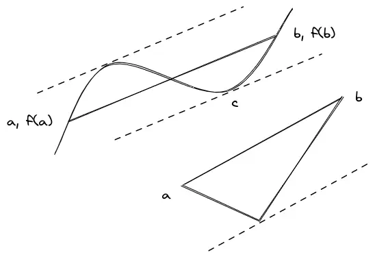
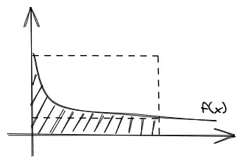
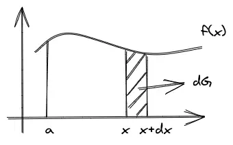
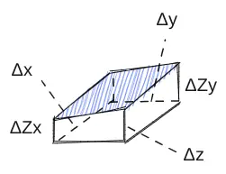
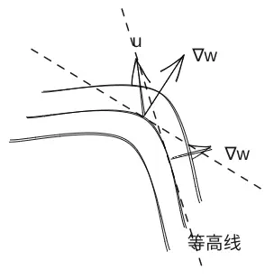
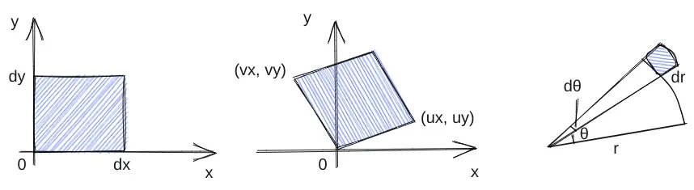

# 微积分

MIT微积分公开课[^link1][^link2]学习笔记，课程总体偏向于应用，对理论部分没有太多深入。而且很多是高中内容，可适度跳着看。

[^link1]: <https://www.bilibili.com/video/av34481507>

[^link2]: <https://www.bilibili.com/video/BV1nt411d7bu>

## 导数

### 基本初等函数的导数

比较精彩的是指数函数和对数函数的部分。

$$
\frac{da^x}{dx} = \lim\limits_{\Delta x\to 0}\frac{a^{x+\Delta x} - a^x}{\Delta x} = a^x\lim\limits_{\Delta x\to 0}\frac{a^{\Delta x} -1}{\Delta x}
$$

令$M(a) = \lim\limits_{\Delta x\to 0}\frac{a^{\Delta x} -1}{\Delta x}$，则$\frac{da^x}{dx}=M(a)a^x$。

:::Info
当$x=0, \frac{da^x}{dx}=M(a)$，知$M(a)$是$y=a^x$在$x=0$点的斜率。
:::

令$e$是使$M(e)=1$的数，即$\lim\limits_{x\to 0}\frac{e^x-1}{x}=1$，围绕$e$有如下发现：

1.  $y=e^x$的导数仍为$y=e^x$。

2.  定义新函数对数函数$f(x)=log(x)$，若$e^y=x$，则$y=log(x)$。此时所有$y=a^x$可以表示为$y=e^{log(a)x}$（$a^x=(e^t)^x，a=e^t，则t=log(a)$）。
    因此可以利用链式法则求$y=a^x$的导数：

    $$
    y=a^x，y'=e^{log(a)x}log(a)=a^xlog(a)
    $$

    而$y=log(x)$则可以利用隐函数求导：

    $$
    e^y=x，e^ydy=dx，y'=\frac{1}{e^y}=\frac{1}{x}
    $$

3.  欲求$y=f^g$，其中$f$和$g$均是关于$x$的基本初等函数，利用隐函数求导法则：

    $y=f^g$, 两边取对数$log(y)=glog(f)$，此时左右两边都是基本初等函数，有$\frac{y'}{y}=g'log(f) + \frac{g}{f}，y'=f^g(g'log(f) + \frac{g}{f})$，当$f(x)=g(x)=x$时，即$x^x$，其导函数为$x^x(log(x) + 1)$。

4.  欲求$\lim\limits_{x\to \infty}(1+\frac{1}{n})^n$，令$\Delta x=\frac{1}{n}$，有：

    $$
    \begin{split}
    \lim\limits_{\Delta x\to 0}(1 + \Delta x)^{\frac{1}{\Delta x}} &= \lim\limits_{\Delta x\to 0}e^{log((1 + \Delta x)^{\frac{1}{\Delta x}})} \\
    &= e^{\lim\limits_{\Delta x\to 0}log((1 + \Delta x)^{\frac{1}{\Delta x}})} \\
    &= e^{\lim\limits_{\Delta x\to 0}\frac{1}{\Delta x}log(1 + \Delta x)} \\
    &= e^{\lim\limits_{\Delta x\to 0}\frac{1}{\Delta x}(log(1 + \Delta x) - log(1))} \text{(注意指数部分表示的是log(x)在x=1处的导数值)} \\
    &= e^1 \\
    &= e
    \end{split}
    $$

    如此提供了一种近似计算$e$的值的方法。

:::info
GS老爷子的微积分先导课程提到另一种定义指数函数的方法：

微积分本质是一种研究两个函数关系的科学。有这样一组关系$\frac{dy}{dx}=y$，假设我们已知$y$在$x=0$时等于$1$，则可以定义满足这个微分方程的函数$y=e^x$。并且从这个方程可以推出$e^x$的“表达式”：

从$x=0$时$y=1$得到$\frac{dy}{dx}=1$，为使$y$求导得到$1$，我们要在$y$中添加一个$x$得到$y=1+x$，于是$\frac{dy}{dx}=1+x$，为了得到这个$x$，我们又要在$y$中添加一个$\frac{1}{2}x^2$，于是$y=1+x+\frac{1}{2}x^2$，为了得到这个$\frac{1}{2}x^2$，我们又要在$y$中添加$\frac{1}{6}x^3$……如此得到一个无限的式子，其第$n$项为$\frac{1}{n!}x^n$。

利用$e^x$的展开式还可以得到$e^xe^y=e^{x+y}$的性质，相乘观察相同次数的项即可。
:::

### 线性近似

导数的定义，$f'(x_0) = \lim\limits_{\Delta x\to 0}\frac{\Delta f}{\Delta x}$，知$\Delta x\to 0时可以有f'(x_0) \approx \frac{\Delta f}{\Delta x}$。利用切线值近似函数的值，在$x_0$处的切线为$y-x_0=k(x-x_0)$，即$f(x) \approx f(x_0) + f'(x_0)(x - x_0)$，若$x_0=0$，则$x\to 0$，有$f(x) \approx f(0) + f'(0)x$。可以用来在现实中快速计算一些$f(x)$的值。例如：

| $f(x)$    | $f'(x)$      | $f(0)$ | $f'(0)$ | $f(x)\approx$ |
| --------- | ------------ | ------ | ------- | ------------- |
| $sin(x)$  | $cos(x)$     | $0$    | $1$     | $x$           |
| $e^x$     | $e^x$        | $1$    | $1$     | $1 + x$       |
| $ln(x+1)$ | $(x+1)^{-1}$ | $0$    | $1$     | $x$           |

由第三个式子可以进一步推出令$u=x+1, x=u-1$, 则当$u\to 1$时，$ln(u) \approx u - 1$。和我们将$u_0=1$带入$f(u)\approx f(u_0) + f'(u_0)(u-u_0)$得到的结果是一致的。

一个计算$y=(1+\frac{1}{x})^x$的例子，其中$x\to\infty$。两边取对数，$log(y)=xlog(1+\frac{1}{x})=\frac{1}{k}log(1+k)\approx \frac{1}{k}k =1$，知当$x\to \infty$时，$y$近似等于$e$。

有些时候，可能需要计算二阶近似来获得更接近的值，$f(x) \approx f(x_0) + f'(x_0)(x-x_0) + \frac{f''(x_0)}{2}(x-x_0)^2$。例如$cos(x)$，由$f(0)=1，f'(0)=0$发现一阶线性近似为$1$，但更多时候我们还是希望保留小角度$x$，于是有二阶近似$cos(x)\approx 1-\frac{1}{2}x^2$。更高阶的近似即更高阶的泰勒展开式。

:::info
二阶近似也可以给我们另一种视角来看待最大最小值问题（与导数、导数变化率的视角相对），$\Delta{f}\approx f'(a)\Delta{x}+\frac{1}{2}f''(a)\Delta{x}^2$，当切线水平时$f'(a)=0$，而$\Delta{x}^2\ge 0$，于是$\Delta{f}$的变化完全由$f''(a)$决定。
:::

### 牛顿法

欲求$x^2=5$，可以令$y=x^2-5$，即求$y=0$。思路是将曲线看成是线性的，选取一个离目标较近的点，求出曲线在该点切线与x轴的交点，即为下一步的选择，重复这个过程可以得到一个比较接近的解。
由$y-f(x_0)=m(x-x_0)$，选取点$x_n$，有$0-f(x_n)=m(x-x_n)$，则下一个选点$x_{n+1}=x_n-\frac{f(x_n)}{f'(x_0)}$（或者直接利用线性近似理解$x-a\approx -\frac{f(a)}{f'(a)}$，$a$即上一个选取的$x_n$）。在这个具体的例子中，若初始选择的点为2，下一个点为2.25，再一个约为2.23611，而$\sqrt 5$实约为2.23606，已经非常接近了。

### MVT

若$f(x)$在$a<x<b$上可导并且在$a\le x \le b$上连续，则$a\sim b$上必存在一点$c$使得$f(c)=\frac{f(b)-f(a)}{b-a}$。可导意味着图像平滑没有尖角，否则就会像图中第二条曲线那样，找不到满足条件的$c$点了。

### 洛必达法则

对于$f(a)=g(a)=0$型的极限，有$lim_{x\to a}\frac{f(x)}{g(x)}=\lim_{x\to a}\frac{f(x)/(x-a)}{g(x)/(x-a)}=\lim_{x\to a}\frac{\frac{f(x)-f(a)}{x-a}}{\frac{g(x)-g(a)}{x-a}}=\frac{f'(a)}{g'(a)}$，要求右侧极限存在且$g'(a)\ne 0$。洛必达法则对于$a=\pm\infty$、$f(a)、g(a)=\pm\infty$、右侧极限为$\pm\infty$的场景也成立。本质上讲洛必达法则刻画的是函数变化的速度。

## 积分

### FTC1

根据FTC1，若$F'=f$，有$\int_a^b f(x)dx=F(b)-F(a)$，即$\Delta F=\int_a^b f(x)dx$，两边同时除以$\Delta x$，有$\frac{\Delta F}{\Delta x}=\frac{1}{\Delta x}\int_a^b f(x)dx=\frac{1}{b-a}\int_a^b f(x)dx$，右边表示的是$f$的平均值。$\Delta F=Avg(F')\Delta x$，可想而知它大于$F'_{min}\Delta x$，小于$F'_{max}\Delta x$（在$a<x<b$上）。

举例来说，$F'(x)=\frac{1}{1+x}，F(0)=1$，利用MVT我们可以判断出$A<F(4)<B$的$A、B$值：$F(4)-F(0)=F'(c)(4-0)=\frac{1}{1+c}4$，其大于$\frac{1}{1+0}4$，小于$\frac{1}{1+4}4$，利用这里的思想，$F(4)-F(0)=\int_0^4\frac{dx}{1+x}$，其大于$\int_0^4\frac{1}{5}dx=\frac{4}{5}$，小于$\int_0^4\frac{1}{1+0}dx=4$。两者表述的意思是等价的，这种表述的几何意义，是积分区域的面积小于大矩形的面积，大于小矩形的面积：

### FTC2

如果$f$连续，可以基于$f$定义新的函数$G(x)=\int_a^xf(t)dt$，其中$a$是常量，并且有$G'(x)=f(x)$。注意这里的积分是针对$t$来积的，$x$不过是其积分上限，也就是说积分时将$x$视为常量对$t$积分后得到一个式子，用$x$带入计算得到关于$x$的表达式。

:::info
FTC2还可以这样理解：$G(x)$是微分方程$\begin{cases}y'=f\\ y(a)=0\end{cases}$的解。
:::

看图像理解证明比较简单，$\Delta G\approx\Delta x f(x)$，若$f$连续，有$\lim_{\Delta x\to0}\frac{\Delta G}{\Delta x}=f(x)$。证明了FTC2进一步可证明FTC1，不妨设$f(x)$的原函数是$F(x)$，由$G'(x)=F'(x)$，有$G(x)=F(x)+c$，则$F(b)-F(a)=(G(b) + c)-(G(a) + c)=G(b)-G(a)=\int_a^bf(x)dx$。

FTC2使得我们拥有了一种新的定义函数的手段，例如定义函数$L(x)$满足：$L'(x)=\frac{1}{x}，L(1)=0$，我们完全可以将这个作为对数函数的定义。甚至是一些无法用基本初等函数表达的函数（transendental function），例如若某函数$G(x)$满足$G'(x)=e^{-x^2}，G(0)=0$，这个导数是积不出来的，现在我们都知道该导数其实就是正态分布密度函数的原型。$G(x)$正无穷方向的渐近线是$y=\frac{\sqrt{\pi}}{2}$。

暂时忘掉以前学的对数函数的定义，利用这里定义的对数函数$L(x)$我们也可以总结出$L(x)$的一些性质，例如$L(ab)=L(a)+L(b)$，即$\int_1^{ab}\frac{dt}{t}=\int_1^a\frac{dt}{t} + \int_a^{ab}\frac{dt}{t}$，显然这里的重点在于证明$L(b)=\int_1^b\frac{dt}{t}=\int_a^{ab}\frac{dt}{t}$，可以利用换元的思想得到：设$u=at$，则$du=adt$，当$t=1$时，$u=a$，当$t=b$时，$u=ab$，从而$\int_{1}^{b}\frac{dt}{t}=\int_{a}^{ab}\frac{du}{u}$。

另外一些积不出来但可以利用这种思想定义的函数如$C(x)=\int_0^xcos(t^2)dt$、$S(x)=\int_0^x sin(t^2)dt$、$H(x)=\int_0^x\frac{sin(t)}{t}dt$等。以及著名的黎曼函数$Li(x)=\int_2^x \frac{dt}{ln(t)}$，可以用来估计小于$x$的质数个数。

### 分部积分法

由$(uv)'=u'v+v'u$，有$\int{uv'}dx=uv-\int{u'v}dx$。例如对$lnx$的积分，可以选取$u=lnx，v=x$，则$\int{lnxdx}=xlnx - \int{\frac{1}{x}xdx}=xlnx - x + C$。

### 反常积分

$\int^{\infty}_a f(a)dx=\lim_{N\to \infty}\int^N_a f(x)dx$。若极限存在，积分结果收敛，或者说积分的面积有限。

有时不好判断积分结果是否收敛，这时可以利用从洛必达法则中带来的思想，如果在$x\to \infty$处$f(x)/g(x)\to 1$，那么$\int_{a}^{\infty}f(x)dx$和$\int_{a}^{\infty}g(x)dx$（对于一个足够大的$a$）要么都收敛，要么都发散。

## 直线与平面

对非零点$N=\begin{bmatrix} a\\b\\c\end{bmatrix}$与原点构成的向量，可以唯一确定一个平面，使得$N$与该平面垂直，从而平面上的任意一点与原点构成的向量$P=\begin{bmatrix} x\\y\\z\end{bmatrix}$与$N$垂直，有$P^TN=0$，得到平面的方程$ax+by+cz=0$。如果平面不是过原点而是过另一不与$N$相同的点$P_0=\begin{bmatrix} x_0\\y_0\\z_0\end{bmatrix}$，则平面上的向量可以表示为$P-P_0$，有$(P-P_0)^TN=0$，得平面方程$ax+by+cz=d$，其中$d$是关于$x_0、y_0、z_0$的常量。观察这两个平面，$d$可以被看作是将第一个平面平移距离的度量，类比二维的情形，其实就是“截距”。如果要判断某点在平面哪一侧，可以将该点带入平面方程左侧，得到的“截距”与$d$相比较即可。

直线除了可以看作是两个平面方程的交集之外，还可以用参数方程的方式定义：给定两个点$Q_0=\begin{bmatrix}x_0\\y_0\\z_0\end{bmatrix}，Q_1=\begin{bmatrix}x_1\\y_1\\z_1\end{bmatrix}$，一个点$Q_0$确定位置，一个向量$\overrightarrow{Q_0Q_1}$确定方向，从而直线上任一点与$Q_0$组成的向量都可以看作是该向量的倍数。有$\overrightarrow{Q_0Q(t)}=t\overrightarrow{Q_0Q_1}$：

$$
\begin{bmatrix}x-x_0\\y-y_0\\z-z_0\end{bmatrix}=t\begin{bmatrix}x_1-x_0\\y_1-y_0\\z_1-z_0\end{bmatrix}
$$

写成$Q(t)=Q_0+t\overrightarrow{Q_0Q_1}$的形式：

$$
\begin{gather}
x(t)=x_0+t(x_0-x_1)\\
y(t)=y_0+t(y_0-y_1)\\
z(t)=z_0+t(z_0-z_1)
\end{gather}
$$

:::info
对于以两平面交线方式给出的方程如$L=\begin{cases} x+2y+3z=4\\x+3y+3z=5 \end{cases}$，如何将其与参数方程的形式关联起来呢？通过线代课程的学习我们可以求出方程系数矩阵$A$的零空间向量$x_n=\begin{bmatrix} -3\\0\\1 \end{bmatrix}$和一个特解$x_p=\begin{bmatrix} 2\\1\\0\end{bmatrix}$，从而得到解的一般形式$x=x_p + tx_n$，这正是直线的参数方程，零空间向量即上面的向量$\overrightarrow{Q_0Q(t)}$，特解即上面的$Q_0$。（$Ax_n=0$其实就是$x_n$与两平面法向量垂直，无数可选的$Q_0$点对应了无数的特解）。这里的例子是一个行满秩列不满秩矩阵，如果两个平面平行，则它们的法向量平行，则$A$各行线性相关，行不满秩，从而方程有$0$解（平行且不重合）或无数解。

对于常见的$3×3$矩阵，若$Ax=0$只有零解即矩阵可逆，说明找不到一个向量同时与三个平面的法向量垂直，此时三个平面的交集只有一点，或者说三个法向量不在一个平面上，可以正交化为三个标准基向量，而反之的情况就比较多了。
:::

假设两不重合直线交于一点$O=\begin{bmatrix} x_0\\y_0\\z_0\end{bmatrix}$，可以唯一确定一个平面（切平面）使得它们都在平面上。这时可分别取两直线上与$O$不同的一点$A$、$B$，利用平面上任意点与其法向量垂直，$\overrightarrow{OP}⋅(\overrightarrow{OA}×\overrightarrow{OB})=0$解出平面方程。例如若$O$在$z=f(x,y)$上，如果有$\frac{\partial{f}}{\partial{x}}(x_0, y_0)=a$，$\frac{\partial{f}}{\partial{y}}(x_0, y_0)=b$，即在固定$x_0$或$y_0$的情况下给出了相应切线的斜率，从而确定了两条切线的方程$L_1=\begin{cases}z=z_0+a(x-x_0)\\y=y_0\end{cases}$，$L_2=\begin{cases}z=z_0+b(y-y_0)\\x=x_0\end{cases}$，为了计算的方便可取$L_1$上的点$A=\begin{bmatrix}0\\y_0\\z_0-ax_0\end{bmatrix}$和$L_2$上的点$B=\begin{bmatrix}x_0\\0\\z_0-by_0\end{bmatrix}$，解出切平面的方程$z-z_0=a(x-x_0)+b(y-y_0)$，或者理解成线性近似$\Delta{z}=f_x(x_0,y_0)\Delta{x}+f_y(x_0,y_0)\Delta{y}$。

:::info
如图，二元用切平面近似曲面，解出切平面方程可得$\Delta z=z_x\Delta x+z_y\Delta y$。我们将$\Delta z$方向上的变化解耦成了两个相互正交的分量$\Delta x$和$\Delta y$上的变化的组合。
:::

:::

## 开普勒第二定律

相同时间内行星扫过的面积相同，设半径为$\overrightarrow{r}$，有$S=\frac{1}{2}|\overrightarrow{r}×\overrightarrow{\Delta{r}}|=\frac{1}{2}|\overrightarrow{r}×\overrightarrow{v}|\Delta{t}$。也就是说$\overrightarrow{r}×\overrightarrow{v}$与$t$无关，$\frac{d}{dt}(\overrightarrow{r}×\overrightarrow{v})=0$，而$\frac{d}{dt}(\overrightarrow{r}×\overrightarrow{v})=\frac{d\overrightarrow{r}}{dt}×\overrightarrow{v}+\overrightarrow{r}×\frac{d\overrightarrow{v}}{dt}=\overrightarrow{v}×\overrightarrow{v}+\overrightarrow{r}×\overrightarrow{a}=0$。所以这个表述等价于说$\overrightarrow{r}×\overrightarrow{a}=0$，即$\overrightarrow{a}$与$\overrightarrow{r}$平行，而行星受到的引力也确实总是径向的。

## Critical Points

由上面对切平面的讨论，如果$f_x=f_y=0$切平面变为水平，但这时还不足以判断切点是最大值、最小值还是鞍点。与单变量的方法类似，这时需要借助二阶导数$f_{xx}$、$f_{xy}(=f_{yx})$和$f_{yy}$，判别式$f_{xx}f_{yy}-f_{xy}f_{yx}$：

1.  若$f_{xx}f_{yy}-f_{xy}f_{yx}>0$，则：
    *   若$f_{xx}>0（或f_{yy})$，则取得局部最大值；
    *   若$f_{xx}<0$取得局部最小值；
2.  若$f_{xx}f_{yy}-f_{xy}f_{yx}<0$，鞍点；
3.  若$f_{xx}f_{yy}-f_{xy}f_{yx}=0$无法判断，可以代值进去。

同样可以利用线性近似的方法理解这个判别式，利用泰勒展开时，注意一阶线性近似由于$f_x=f_y=0$为$0$，因此需要二阶近似，$\Delta{f}\approx f_x\Delta{x}+f_y\Delta{y}+\frac{1}{2}f_{xx}\Delta{x}^2+f_{xy}\Delta{x}\Delta{y}+\frac{1}{2}f_{yy}\Delta{y}^2$，通过配方可以得到相同的结果（其实就是根的判别式）。

## 梯度向量

将$\frac{dw}{dt}=w_x\frac{dx}{dt}+w_y\frac{dy}{dt}+w_z\frac{dz}{dt}$理解为两个向量相乘$\nabla=\begin{bmatrix}w_x&w_y&w_z\end{bmatrix}$，$\overrightarrow{v}=\frac{\overrightarrow{dr}}{dt}=\begin{bmatrix}\frac{dx}{dt}\\ \frac{dy}{dt}\\ \frac{dz}{dt}\end{bmatrix}$，这个$\nabla$就称为**梯度向量**。

由于$\overrightarrow{v}$在曲面上该点的切平面内，而$\nabla\perp\overrightarrow{v}$对任意的$\overrightarrow{v}$都成立，故$\nabla$与该点的切平面垂直。对于平面方程$w(x,y,z)=ax+by+cz=d$，显然$\nabla=\begin{bmatrix} a\\b\\c \end{bmatrix}$，正是我们用来定义平面的法向量$N$。对于二元的情况如$f(x,y)=x^2+y^2$，等高线$f(x,y)=c$是以原点为圆心的圆，而$\nabla=\begin{bmatrix} 2x\\2y\end{bmatrix}$，即半径所在的直线。

:::warn
一直二维三维傻傻分不清楚的我：为什么$f(x,y)$的图像画成三维曲面，但梯度向量却不是该图像的切平面法向量而是水平的，而$w(x,y,z)$经常画出来的图像也是三维的（其实是取了$w=c$），其梯度向量又是切平面法向量了☕。
:::

### 应用：求曲面上任一点的切平面

对于曲面方程$x^2+y^2-z^2=4$，欲求其在点$P=\begin{bmatrix}2\\1\\1\end{bmatrix}$处的方程，一种方式我们可以利用线性近似$\Delta{w}\approx f_x\Delta{x}+f_y\Delta{y}+f_z\Delta{z}$，当趋近于$P$时$\Delta{w}\to 0$，有$0=4(x-2)+2(y-1)-2(z-1)$；另一种方式利用$\nabla$，在$P$处的$\nabla=\begin{bmatrix} 4\\2\\-2 \end{bmatrix}$，这是切平面的法向量，可立即得到平面方程$4(x-2)+2(y-1)-2(z-1)=0$。

### 方向导数

用力的分解也许好理解一点。梯度给了我们对该点处曲线有多陡的直观感受，如果沿着梯度的方向，无论施加的力多大都无法实现在曲面上（等高线上）的移动（因为梯度向量与该处切平面垂直），而如果我们偏离一个角度，从而这个力在梯度方向上的分力不产生位移，带来加速度的是与梯度方向垂直方向的分力。用一个单位向量$\overrightarrow{u}$表示力的方向，方向导数$\frac{dw}{ds}_{|\overrightarrow{u}}=\nabla{w}\overrightarrow{u}=|\nabla{w}|cos(\theta)$表示的是力在梯度方向上的分解，当垂直的时候方向导数为$0$而沿着等高线切线方向的分力最大。

### 拉格朗日数乘法

在某些问题中，要求$f(x,y,z)$在一个约束条件$g(x,y,z)=c$下的最大最小值。如果画出两曲面的等高线图会发现在取得极值处两等高线相切，或者这样理解：类比无约束情况下取极值处有$df=0$，这里只有在沿着$g=c$等高线的方向上$df=0=\frac{df}{ds}_{|\overrightarrow{u}}=\nabla{f}\overrightarrow{u}$（“沿着”的意思是相切，即等高线的切线方向），同时$dg=dc=0=\frac{dg}{ds}=\frac{dg}{ds}_{|\overrightarrow{u}}=\nabla{g}\overrightarrow{u}$。从而有$\nabla{f}=\lambda\nabla{g}$，联立方程$\begin{cases} f_x=\lambda{g_x}\\f_y=\lambda{g_y}\\f_z=\lambda{g_z}\\g(x,y,z)=c\end{cases}$可解。

### 非独立变量

另一种方法看待有$g(x,y,z)=c$约束的极值问题，$g$可以变型为$z=z(x,y)$。在固定$y$的情况下解出$(\frac{\partial{f}}{\partial{z}})_y$：

1.  利用微分：

    $df=f_xdx+f_ydy+f_zdz=f_xdx+f_zdz$，为了消去$dx$，利用约束条件$dg=g_xdx+g_ydy+g_zdz=0$，有$dx=-\frac{g_x}{g_z}dz$，从而$df=(-f_x\frac{g_z}{g_x}+g_z)dz$，括号中的部分即$(\frac{\partial{f}}{\partial{z}})_y=-f_x\frac{g_z}{g_x}+g_z$。

2.  利用链式法则：

    $(\frac{\partial{f}}{\partial{z}})_y=\frac{\partial{f}}{\partial{x}}(\frac{\partial{x}}{\partial{z}})_y+\frac{\partial{f}}{\partial{y}}(\frac{\partial{y}}{\partial{z}})_y+\frac{\partial{f}}{\partial{z}}(\frac{\partial{z}}{\partial{z}})_y=\frac{\partial{f}}{\partial{x}}(\frac{\partial{x}}{\partial{z}})_y + 0 + \frac{\partial{f}}{\partial{z}}⋅1=f_x(\frac{\partial{x}}{\partial{z}})_y+g_z$，同理由$(\frac{\partial{g}}{\partial{z}})_y=0$可解出$(\frac{\partial{x}}{\partial{z}})_y=-\frac{g_z}{g_x}$，带入第一个式子得到与微分法相同的结果。

:::warn
$f(x,y)=x+y$，有$\frac{\partial{f}}{\partial{x}}=1$，如果换元$x=u, y=u+v$得到$\frac{\partial{f}}{\partial{u}}=2\ne \frac{\partial{f}}{\partial{x}}$。为什么$x=u$但偏微分项不等？这是因为保持不变的量不一样：$(\frac{\partial{f}}{\partial{x}})_v\ne(\frac{\partial{f}}{\partial{x}})_y$。
:::

## 二重积分

### 雅可比矩阵

二重积分$dV=\iint_Rf(x,y)dA$可以看成是求$z=f(x,y)$与其正下方平面区域$R$的体积。$dA=dxdy$，如果将$x、y$换元为$u=u(x,y)$，$v=v(x,y)$，那么新的$dA'$需要确定。

依然利用微分：

$du=u_xdx+u_ydy$、$dv=v_xdx+v_ydy$，如图所示，知$dudv=det(\begin{bmatrix} u_x & v_x\\u_y & v_y\end{bmatrix})dxdy=(|\begin{bmatrix} u_x\\u_y\end{bmatrix}×\begin{bmatrix} v_x\\v_y\end{bmatrix}|)dxdy$。这里得到的矩阵即**雅可比矩阵**。

以极坐标系$x=rcos\theta$，$y=rsin\theta$为例，$dx=x_rdr+x_{\theta}d\theta=cos\theta dr+r(-sin\theta)d\theta$，$dy=y_rdr+y_{\theta}d\theta=sin\theta dr+rcos\theta d\theta$，知$dA'=(rcos^2\theta +rsin^2\theta)drd\theta=rdrd\theta$，和我们从图形中得到的结果是一致的。

### 向量场

$\overrightarrow{F}=M\overrightarrow{i}+N\overrightarrow{j}$，其中$M=M(x,y), N=N(x, y)$，即在平面的每一处我们有一个与位置有关的力$\overrightarrow{F}$。

#### 做功与曲线积分

对一个小方向上的位移$\Delta\overrightarrow{r}$，$W=(\text{force})⋅(\text{distance})=\overrightarrow{F}\Delta\overrightarrow{r}$。从而全过程的做功通过将全轨迹累加得到，这是一种“line integral”：

$$
W=\int_C\overrightarrow{F}d\overrightarrow{r}(=\lim_{\Delta{\overrightarrow{r}}\to 0}\sum_i\overrightarrow{F}⋅\Delta\overrightarrow{r_i})
$$

:::info
力只有在位移的方向上才有功，所以是一个内积的关系。想想也是，如果力与位移方向垂直，这个力不做功。
:::

为了求解，注意$C$是关于时间$t$的参数方程，有$\int_C\overrightarrow{F}⋅d\overrightarrow{r}=\int_{t_1}^{t_2}(\overrightarrow{F}⋅\frac{d\overrightarrow{r}}{dt})dt$。实际上我们选择的参数化方式对积分结果没有影响，参数化只是一种解释问题的视角。

由$\overrightarrow{F}=\begin{bmatrix} M\\N\end{bmatrix}$，$d\overrightarrow{r}=\begin{bmatrix}dx\\dy\end{bmatrix}$，有$\int_C\overrightarrow{F}⋅d\overrightarrow{r}=\int_CMdx+Ndy$。

#### Gradient Field

如果$Mdx+Ndy$恰好是一种全微分形式，从而$M$和$N$是某一**隐函数**$f$的偏微分，$M=M(x,y)=f_x(x,y), N=N(x,y)=f_y(x,y)$。这时$\overrightarrow{F}$就成了该函数的梯度向量$\overrightarrow{F}=\nabla{f}=\begin{bmatrix} f_x\\f_y\end{bmatrix}$。

:::info
由$M=f_x$，$N=f_y$，有$M_y=N_x=f_{xy}$，利用这个性质可以判断是不是gradient field。但是要求$\overrightarrow{F}$在平面上每一点处都可微，或者在一个单连通区域内部。
:::

在gradient field中，有对应的FTC：

当力使物体从$P_0$运动到$P_1$时，$\int_C\nabla{f}⋅d\overrightarrow{r}=f(P_1)-f(P_0)$。由$\int_C\nabla{f}⋅d\overrightarrow{r}=\int_{t_0}^{t_1}(f_x\frac{dx}{dt}+f_y\frac{dy}{dt})dt=\int_{t_0}^{t_1}\frac{df}{dt}dt=[f(x(t),y(t))]_{t_0}^{t_1}$可证。$f$就是功的计量，这个积分可以被理解为物体从$P_0$移动到$P_1$力所做的功等于力使物体从另外某处$P$移动到$P_1$，减去从$P$移动到$P_0$所作功的差值。

进一步推出有关gradient field的两个特性：

1.  路径无关性：如果轨迹$C_1$、$C_2$具有相同的起点和终点，从而积分结果相同（做功相同）；
2.  保守性：如果是闭合轨迹，则积分结果为$0$（先做正功，再做负功，或者反过来，总之最后啥也没干）。

#### 物理意义

If the force field $\overrightarrow{F}$ is the gradient of a potential $f$, then work of $\overrightarrow{F}$ = change in value of potential.

如果向量场$\overrightarrow{F}$是势$f$的梯度，则保守力$\overrightarrow{F}$的做功等于势能的变化。没有额外的能量能够从闭合的轨迹上被”释放“。

Conservativeness means that energy comes from change in potential f, so no energy can be
extracted from motion along a closed trajectory (conservativeness = conservation of energy: the
change in kinetic energy equals the work of the force equals the change in potential energy).

**仅对gradient field**有四个等价的表述：

1.  如果对任意闭合轨迹$C$有$\int_C\overrightarrow{F}⋅d\overrightarrow{r}=0$，则$\overrightarrow{F}$是保守的；
2.  $\int F⋅d\overrightarrow{r}$是路径无关的（相同的终点相同做功，与路径无关）；
3.  $\overrightarrow{F}$是一个gradient field有$\overrightarrow{F}=\nabla{f}=f_x\overrightarrow{i}+f_y\overrightarrow{j}$；
4.  $Mdx+Ndy(=f_xdx+f_ydy=df)$是一个全微分（exact differential）形式。

通过令$C_1=C_2，C=C_1-C_2=0$可知(1)和(2)是等价的。(3)利用FTC可推出(2)，同时也是寻找隐函数的一种方式：如果具备路径无关性质，可以通过$\int_{(0,0)}^{(x,y)}\overrightarrow{F}⋅d\overrightarrow{r}$求$f(x,y)$，一般利用相互正交的两段轨迹$dx=0$，$dy=0$简化计算。另一种求隐函数的方式是由$f_x$得到$f(x,y)=\int f_xdx+g(y)$，然后利用$f_y$来求$g(y)$。(3)和(4)只不过是同一种说法的不同表现形式。

#### 旋度和散度

旋度$curl(\overrightarrow{F})=N_x-M_y$，旋度是力所带来扭矩（torque）的度量，可以类比速度：

*   在平移运动中，$\frac{\text{Force}}{\text{Mass}}=\text{acceleration}=\frac{d}{dt}(\text{velocity})$；
*   在旋转变换中，$\frac{\text{Torque}}{\text{Moment of inetia}}=\text{angular acceleration}=\frac{d}{dt}(\text{angular velocity})$。

散度$div(\overrightarrow{F})=P_x+Q_y$，应用格林公式并替换$M=-Q$和$N=P$可证$\oint_C\overrightarrow{F}⋅\overrightarrow{n}ds=\iint_R div(\overrightarrow{F})dA$，$\overrightarrow{n}$是$f(x,y)$法向量。散度是发散度的度量，可以描述一个向量场的点是汇聚点还是发散点。

:::info
一些个人理解：

如图，$z=f(x,y)$是对势能的刻画，$\overrightarrow{F'}$如果不是$z$的梯度向量（注意$\overrightarrow{F}$不是图中三维曲面的梯度向量，而是一个固定的势$z$平面与该曲面相截所得二维曲面的梯度向量。假定物体初始动能为0，这个势$z$是系统的初始能量），那么会存在一个额外的分量（图中红色向量$\overrightarrow{N}$）。这时即使物体在闭合回路上走了一遭回到了起点，势能不变，$\overrightarrow{N}$所做的功却不为0，它实际上改变了物体的动能，使物体产生角速度。用物理学的话说，物体所受的合力$\overrightarrow{F'}$可以被分解为保守力$\overrightarrow{F}$和非保守力$\overrightarrow{N}$，保守力做功带来势能变化，非保守力带来动能变化。

> 在三维情况下，势$w=w(x,y,z)$其实是一个“等势体”了。

从可汗学院盗的图：

$dr=dx\overrightarrow{i}+dy\overrightarrow{j}$，为了得到法向量$\overrightarrow{n}$可以进行顺时针旋转，注意$\overrightarrow{n}$要取成单位向量，有$\overrightarrow{n}=\frac{dy\overrightarrow{i}-dx\overrightarrow{j}}{|dr|}$，而$|dr|=ds$，因此有$\overrightarrow{F}⋅\overrightarrow{n}ds=\overrightarrow{F}⋅(dy\overrightarrow{i}-dx\overrightarrow{j})$。因此点乘的结果为$Pdy-Qdx$，由格林公式，（旋转后的$\overrightarrow{n}ds$就相当于$\overrightarrow{r}$，旋转使得$\overrightarrow{F}=N\overrightarrow{i}-M\overrightarrow{j}=P\overrightarrow{i}+Q\overrightarrow{j}$），有$\oint_C Pdy-Qdx=\iint_R \frac{\partial P}{\partial x}- (-\frac{\partial Q}{\partial y})dA==\iint_R div(\overrightarrow{F})dA$。此处格林公式说明了通过区域边界的量与区域内部散度的关系。
:::

### 格林公式

如果$R$是被一个正向（使得所包围区域总是在自己左侧的方向）闭合曲线$C$包裹起来的区域，有：

$$
\oint_C\overrightarrow{F}⋅d\overrightarrow{r}=\iint_R curl(\overrightarrow{F})dA
$$

或者写成：

$$
\oint_C Mdx+Ndy=\iint_R(N_x-M_y)dA 
$$

可以用来将复杂的曲线积分简化为简单的二重积分或反之。例如拿它来证明gradient field的性质：

定理：如果$\overrightarrow{F}=M\overrightarrow{i}+N\overrightarrow{j}$在平面上处处连续且可微，那么$N_x=M_y$可推出$\overrightarrow{F}$是保守的，也即$\overrightarrow{F}$是一个gradient field.

由$N_x=M_y$，$\oint_C\overrightarrow{F}⋅d\overrightarrow{r}=\iint_R curl(\overrightarrow{F})dA=\iint_R0dA=0$，得证。

#### 证明

1.  定理其实可以分成两个部分$\oint_C Mdx=-\iint_R M_ydA$和$\oint_C Ndy=\iint_R N_xdA$；
2.  首先观察到如下事实，如右上角图所示，如果将$R$划分成$R_1, R_2, R=R_1\cup R_2$两个部分，两个部分的包裹曲线分别为$C_1$和$C_2$，有$\oint_C=\oint C_1+\oint C_2$，这是因为中间的那段各自方向相反，相互抵消了。

从而我们可以在$R$中划出图中阴影区域，这个区域外围的轨迹可以分为四个部分$C_1, C_2, C_3, C_4$，其中$C_2, C_4$由于$dx=0$，有$\int_{C_2}Mdx=\int_{C_4}Mdx=0$，有：

$$
\text{LHS: }\oint_C=\int_{C_1}+\int_{C_3}=\int_a^bM(x, f_0(x))dx-\int_a^bM(x, f_1(x))dx
$$

式中$f_0(x)$和$f_1(x)$即沿着$C_1$和$C_3$的两条曲线，课程notes上写成了$C_1$和$C_2$应该是不对的。同时注意到沿着$C_3$时$x$是从$b$到$a$的，所以要负号。有：

$$
\text{RHS: }-\iint_R M_ydA=-\int_a^b\int_{f_0(x)}^{f_1(x)}M_ydydx=-\int_a^b(M(x, f_1(x))-M(x,f_0(x))dx=\text{LHS}
$$

由于所有的区域都可以被划分为这样一个个小的区域，将它们相加在一起后，左边就是外围曲线$C$的积分，右边则是整个区域$R$的积分，$\oint_C Mdx=-\iint_R M_ydA$。同理用水平的方式去划分区域，可以证明$\oint_C Ndy=\iint_R N_xdA$，从而证明了格林公式。

除了告诉我们曲线积分可以转化为曲面积分，反过来格林公式也告诉我们区域面积可以用曲线积分求得$\oint_Cxdy=\iint_R1dA$。

### 单连通区域

讨论来源于对$\overrightarrow{F}=\frac{-y\overrightarrow{i}+x\overrightarrow{j}}{x^2+y^2}$的计算，$C$是一个逆时针的单位圆，可以算出$\oint_C\overrightarrow{F}⋅d\overrightarrow{r}=2\pi$，而$\iint_R curl(\overrightarrow{F})dA=0$，不满足格林公式。原因在于区域内包含了$0$点，而在这一点上$\overrightarrow{F}$是无定义的。

但也不是完全没有办法，我们可以把没有定义的这块挖掉，如下图，则有$\oint_C\overrightarrow{F}d\overrightarrow{r}-\oint_{C'}\overrightarrow{F}d\overrightarrow{r}=\iint_{R'} curl(\overrightarrow{F})dA$：

直观点说单连通区域就是个中间没有洞的区域，上面的图像看起来中间有个大洞，但如果将轨迹作为区域边界的话，它无疑是没有洞的。

## 三重积分

和二重积分基本类似，$∇$算子可以只当作是一个辅助记忆的符号。

