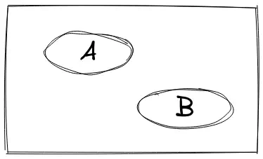
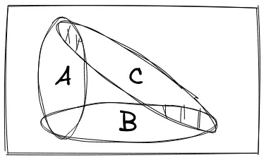
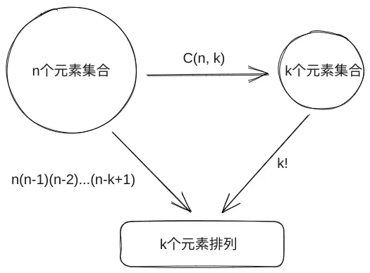
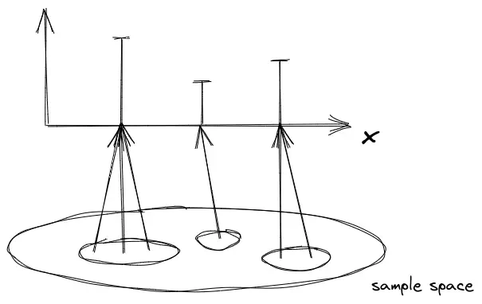
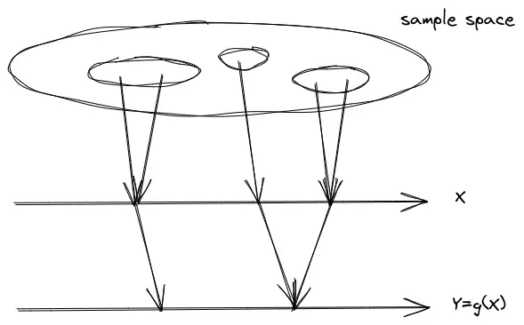
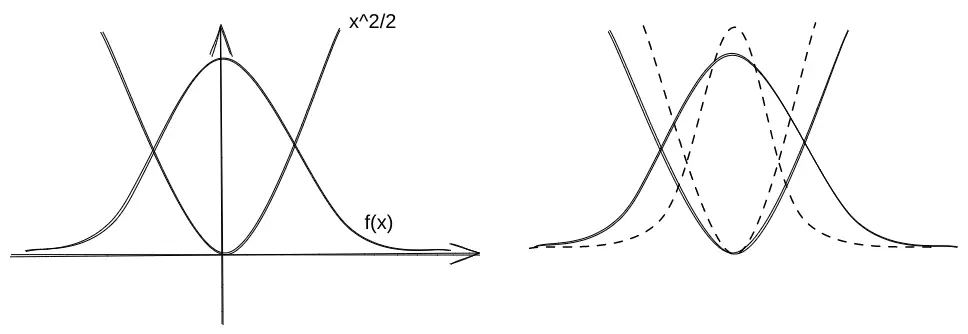
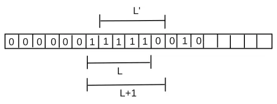

# 概率统计 <Badge type="warning" text="施工中" />

[MIT概率统计公开课](https://www.bilibili.com/video/BV1Wb411N7rb?)学习笔记。

## 独立性

事件独立性向来是大众智商检验机，其中有不少乍看起来反常识的地方。

1.  两事件A和B独立，等价于$P(A\cap B)=P(A)P(B)$. 两事件独立的根本含义是给定其中一方发生或不发生的信息，不能对我们推断另一事件起到任何帮助，只是我们定义事件独立时不写成$P(A|B)=P(A)$或者$P(B|A)=P(B)$（因为前者囊括了$P(B)=0$的情况，这时$P(A|B)$是无定义的）。

2.  一个常见的误解就是混淆独立事件和不相容事件，如下图，事件A和B是不相容的，但不是相互独立的。因为给定了其中一方发生的前提，我们就可以断言另一方没有发生，
    即一方提供的信息改变了我们对另一方的看法。假设A的概率是$1/3$，B的概率是$1/4$，$P(A)P(B)=1/12\ne P(A\cap B)=0$.

     

3.  即使两事件A和B独立，在给定了一些信息的情况下也会改变我们对两事件发生的看法。由此引出了**条件独立**的概念：$P(A\cap B|C)=P(A|C)P(B|C)$。
    这幅图比较形象，现给定前提A和B是独立的，但在C发生的条件下（在C发生的宇宙里），A和B之间就不再是独立的了，因为若$A$发生（AC阴影部分），我们可以断言$B$没有发生（BC阴影部分）。

     

    这告诉我们在常规概率模型中存在独立性并不意味着在条件概率模型中也具备独立性。教授又给了一个例子：假设有两枚不公平的硬币A和B，A正面向上的概率是0.9，B是0.1，等可能的概率选择一个硬币进行实验，考察如下几个问题：

    1.  如果明确正在使用的是硬币A，每次抛掷该硬币是独立的吗？显然是的，在确定了硬币的情况下，每次抛掷硬币正面向上的概率都和这个硬币的属性有关，不受前一次抛掷的影响。
    2.  在不知道抛掷的硬币是哪一个的情况下，第11次抛掷正面向上的概率是多少？$P(\text{toss}\ 11 = H) = 1/2 *P(H|A) + 1/2* P(H|B) = 1/2$。
    3.  在已知前10次抛掷的结果都是正面向上的情况下，第11次抛掷正面向上的概率是多少？

        前10次都是正面向上，给了我们很大的信心这个硬币是A（条件提供的信息改变了我们对假设的看法），在此情况下，可以推断第11次抛掷的结果会非常接近0.9（依然有很小的可能是B）。$P(toss\ 11 | first\ 10\ tosses\ are\ H) \approx 0.9$。比较上一个问题，会发现“first 10 tosses are H”的信息改变了我们对假设的看法。

4.  对于条件独立，即使事件A、B和C两两独立，也不能说明A、B和C三者相互独立（多个事件彼此相互独立是指其中一件事件的发生与否不会改变对剩下事件的看法）。教授也给出了一个非常直观的例子：

    给定一个公平的硬币，抛一次正反两面的概率都是1/2，则抛两次的可能性如下表（将H指代正面向上）：

    | HH $1/4$ | HT $1/4$ |
    | -------- | -------- |
    | TH $1/4$ | TT $1/4$ |

    有：

    1.  事件A：第一次正面向上，$P(A)=1/2$；
    2.  事件B：第二次正面向上，$P(B)=1/2$；
    3.  事件C：两次抛掷是同样的面，$P(C)=1/2$；

    考察事件$P(C|A\cap B)$，会发现A和B都发生给了我们一个非常明确的信息：两次抛掷的结果恰是HH，这进一步改变了我们对C发生的看法。已知是HH，则C已然发生，因此这个概率是1。
    这时如果看一下$P(A\cap B)=P(A)P(B)=1/4, P(A\cap C)=P(A)P(C)=1/4, P(B\cap C)=P(B)P(C)=1/4$，说明A、B和C是两两独立的。但$P(A\cap B\cap C)= P(C|A\cap B)P(A\cap B)= 1/4 \ne P(A)P(B)P(C)=1/8$。

5.  一个经典问题：某人家有两个孩子，已知一个是男孩，问另一个是女孩的概率是多少？如果我没有学过条件概率一定会不假思索地回答1/2（教授称之为“naive answer”）。其实已有一个男孩的事实给了我们更多的信息，已经从样本空间排除掉了两个女孩的可能，因此正确答案是2/3。如果这个问题改变描述，某人家已经有一个男孩，问再生一个孩子是女孩的概率，那就是1/2了。

## 计数问题

1.  理解排列和组合的关系

    1.  $k$个不相同的物品乱序排列，可以看成有$k$个空位依次从物品中拿去放入，第一个空位有$k$个选择，第二个有$k-1$个选择……则可能的排列有$k!$个。

    2.  如果物品一共有$n$个（$n\ge k$)，类似的有$n(n - 1)...(n - k + 1)$种顺序。

    3.  如果物品之间不计顺序，即从有n个元素的集合中选取k个，问子集的数量，记为$\binom{n}{k}$。应当注意到上面(2)的结果等价于先做这个步骤，再将k个物品全排列，
        因此有$\binom{n}{k}*k!=n(n-1)...(n-k+1)$，$\binom{n}{k} = \frac{n!}{k!(n-k)!}$。

     

2.  分割partition

    样本空间有$n$个元素，不留空隙地划分为$k$块，假设每块的大小依次为$k_0，k_1, ...$，则第一块等价于我们从$n$中选出$k_0$个元素的集合，有$\binom{n}{k_0}\binom{n -
     k_0}{k_1}...=\frac{n!}{k_0!(n-k_0)!}\frac{(n-k_0)!}{k_1!(n-k_1)!}...$=$\frac{n!}{k_0!k_1...}$。以一个扑克牌的例子说明：将52张牌均分给4个人，问每个人分得一张方块的概率是多少？首先确定样本空间，是将牌分成4份的分法数量$\frac{52!}{13!13!13!13!}$，
    其次将问题看成先分4张方块再分剩余48张牌的两个子问题，四张方块划分有$\frac{4!}{1!1!1!1!}=4!$种分法，剩余48张牌我们要划分成4×12的四份，有$\frac{48!}{12!12!12!12!}$种分法，根据乘法法则最终结果为$\frac{{4!}{\frac{48!}{12!12!12!12!}}}{\frac{52!}{13!13!13!13!}}$。这个问题也可以用条件概率的视角看，画分支图，假设四张方块分别是ABCD，考虑事件“A和B在不同人的手里”、“A、B和C分在不同人的手里”和“A、B、C、D均在不同人的手里”。

    组合其实是划分为两个部分$k$和$n-k$的分割问题。

    :::info
    当$P(B)$很难计算，而$(B|A_i)$很容易时，很多全概率问题的关键都在于找到$A$中合适的分割来计算$B$。
    :::

## 离散型随机变量

随机变量是样本空间到真实数值的一种映射，一种实值函数：

用$p_X$表示随机变量X的分布列。设$x$是随机变量X的取值，则使X取值为$x$的概率定义为${X=x}$的概率，即所有与$x$对应的试验结果组成的事件的概率，记为$p_X(x)$，显然有：$\sum_{x}p_X(x)=1$。

### 数学期望

$E[X]=\sum_{x}xp_X(x)$，数学期望代表的是加权平均，和物理上重心的视角一致，将上图的X轴想象为一条没有质量的直杆，只在图上三个点处有配重，则整个杆子的重心就是数学期望值所在处。
利用这个思想可以巧解$\sum_{k=0}^{n}\frac{k}{n+1}$，看成是对于每个$X$都有$p_X(x)=\frac{1}{n+1}$的数学期望，显然图像的重心在$\frac{n}{2}$处，故$E[X]=\frac{n}{2}$。

常量的数学期望$E[2]$：映射的结果始终是2，故平均值也是2。类似地可以推出$E[X]$的几个性质，其中$\alpha，\beta$都为常量：

1.  $E[\alpha X]=\alpha E[X]$；
2.  $E[\alpha X + \beta]=\alpha E[X] + \beta$；
3.  $E[X + Y + Z] =E[X] + E[Y] + E[Z]$。

### 复合型随机变量

设$Y=g(X)$是关于随机变量X的函数，那么对于每一个结果$x$，也会对应一个$Y$的数值，故$Y$也是一个随机变量。对于明确给出的$Y$值，$p_Y(y)$可以通过$\sum_{\{x|g(x)=y\}}(p_X(x))$来计算。

根据数学期望的定义，$E[g(X)] = \sum_{x}g(x)p_X(x)$。应当注意，除非$g(X)$是线性变换，否则$E[g(X)] \ne g(E[X])$。证明：

$$
\begin{split}
E[g(X)]
&= E[Y] \\
&= \sum_{y}yp_Y(y) \\
&= \sum_{y}y\sum_{\{x|g(x)=y\}}p_X(x) \\
&= \sum_{y}\sum_{\{x|g(x)=y\}}yp_X(x) \\
&= \sum_{y}\sum_{\{x|g(x)=y\}}g(x)p_X(x) \\
&= \sum_{x}g(x)p_X(x)
\end{split}
$$

由此公式可得$E[X^n]=\sum_x{x^n}p_X(x)$，因此在计算$E[X]$的$n$阶矩的时候不必求$X^n$的分布列。

随机变量一个重要的特征量是方差：

$$
\begin{split}
var(X) &= E[(X-E[X])^2] \\
&= \sum_{x}(x-E[X])^2p_X(x) \\
&= \sum_{x}(x^2 - 2xE[X] + (E[X])^2)p_X(x) \\
&= E[X^2] - 2(E[X])^2 + (E[X])^2 \\
&= E[X^2] - (E[X])^2
\end{split}
$$

方差的一些性质（$\alpha，\beta$都是常数）：

1.  $var(X) \ge 0$；
2.  $var(X + \beta) = var(X)$；
3.  $var(\alpha X + \beta) = \alpha^2 var(X)$。

标准差：$\sigma(X)=\sqrt{var(X)}$。

### 几种常见的随机变量

#### 伯努利随机变量

考虑一枚硬币，设正面向上的概率为$p$，令正面向上的取值为$1$，反面向上的取值为$0$，得到分布列：

$$
p_X(k)=\begin{cases}
p &\text{k=1}\\
1-p &\text{k=0}
\end{cases}
$$

其数学期望为$E[X]=p$，方差为$var(X)=(1-p)p$。

#### 二项随机变量

考虑$n$次独立的抛掷实验，令$X$为得到正面的次数。得到分布列：

$$
p_X(k)=P(X=k)=\binom{n}{k}p^k(1-p)^{n-k},\ \text{k=0, 1, ..., n}
$$

如果根据数学期望的定义求$E[X]=\sum_{x=0}^{n}x\binom{n}{x}p^x(1-p)^{n-x}$会比较麻烦，考虑如下随机变量$X_i$：

$$
X_i=\begin{cases}
1 &\text{if success in trial i} \\
0 &\text{otherwise}
\end{cases}
$$

利用数学期望的线性性质，注意到$X=\sum_{i}X_i$，有$E[X]=\sum_{i}E[X_i]$，而$E[X_i]=1*p + 0*(1-p)=p$，故很快得出$E[X]=np$。

注意$X_i^2=X_i$，$var(X_i)=E[X_i^2]-(E[X_i])^2=p-p^2$，由于每次抛掷相互独立，$var(X)=\sum_{i}var(X_i)=np(1-p)$。这个值告诉我们当$p=1/2$的时候能够得到最大的随机性。

#### 几何随机变量

在连续抛掷硬币的实验中，若考察第一次得到正面所需的次数$X$，则前$k-1$次抛掷都需要是反面，最后一次是正面，其分布列为：

$$
p_X(k)=(1-p)^{k-1}p,\ \text{k=1, 2, ...}
$$

数学期望为$E[X]=\frac{1}{p}$，方差为$var(X)=\frac{1-p}{p^2}$。在计算过程中可以利用左右同乘$p$的技巧求出现的无穷级数的和。

#### 泊松随机变量

泊松随机变量可以看作是对二项随机变量的近似，更多讨论见后文的伯努利过程和泊松过程，这里简单给出推导：

考虑二项随机变量的分布列，其相应的参数为$n$和$p$，其中$n\to\infty$，$p\to0$，即进行非常多次的实验，实验成功的概率很小。令$\lambda=np$，有：

$$
\begin{equation}
\begin{split}
p_X(k) &= \binom{n}{k}p^k(1-p)^{1-k} \\
&= \frac{n(n-1)...(n-k+1)}{k!}\frac{\lambda^k}{n^k}(1-\frac{\lambda}{n})^{n-k}\\
&=(\frac{n}{n}⋅\frac{n-1}{n}⋅...\frac{n-k+1}{n})\frac{\lambda^k}{k!}(1-\frac{\lambda}{n})^n(1-\frac{\lambda}{n})^{-k}\\
\end{split}
\end{equation}
$$

当$n\to\infty$时，利用重要极限$(1-\frac{\lambda}{n})^n=e^{-\lambda}$，上式等于$1⋅\frac{\lambda^k}{k!}⋅1⋅e^{-\lambda}$。故泊松随机变量的分布列为$p_X(k)=e^{-\lambda}\frac{\lambda^k}{k!}$，可以取巧利用二项分布，得到其期望为$E[X]=np=\lambda$，方差$var(X)=np(1-p)=\lambda-\frac{\lambda^2}{n}= \lambda$。

#### 指数随机变量

考虑几何随机变量的连续情形，即第一次得到正面所需的时间长度，将得到指数分布的概率密度：

$$
f(t)=\lambda e^{-\lambda t}
$$

其期望为$1/\lambda$，方差为$1/\lambda^2$。更多的讨论见后文泊松过程。

### 条件分布

根据分割样本空间的公式：$P(B)=P(A_1)P(B|A_1) + P(A_2)P(B|A_2) + ...$有：

$$
\begin{align}
p_X(x) &= P(A_1)p_{X|A_1}(x) + P(A_2)p_{X|A_2}(x) + ... \\
\sum_{x}xp_X(X) &= \sum_{x}[P(A_1)p_{x|A_1}(x) + P(A_2)p_{X|A_2}(x) + ...] \\
&= \sum_{x}P(A_1)p_{x|A_1}(x) + \sum_{x}P(A_2)p_{x|A_2}(x) + ... \\
&= P(A_1)E[X|A_1] + P(A_2)E[X|A_2] + ... \\
即 E[X] &= P(A_1)E[X|A_1] + P(A_2)E[X|A_2] + ...
\end{align}
$$

一个例子，抛掷公平硬币，正面向上的概率为$p$。问为获得正面向上，抛掷次数的数学期望是多少？

$$
\begin{align}
E[X] &= P(X=1)E[X|X=1] + P(X>1)E[X|X>1] \\
&=p*1 + (1-p)(E[X-1|X-1>0] + 1) \\
&=p + (1-p)(E[X] + 1)
\end{align}
$$

可解出$E[X]=\frac{1}{p}$。假设$p=\frac{1}{2}$，说明我们想得到正面平均需抛掷两次，和现实生活中的经验是一致的。上式对$E[X|X>1]$到$E[X]$的变化可以有多种理解，纯数学的方法是应用$E[X]$的性质，更通俗的解释是认识到每次抛掷硬币是独立事件，之前抛掷的结果不影响这一次抛掷的概率还是$p$，因此$E[X|X>1]$等价于我们已经浪费了一次抛掷次数，然后从零开始。

### 联合分布

联合分布$p_{X,Y}=P(X=x,Y=y)$，（不要被这个记号迷惑，它更准确的写法是$P(\{X=x\}\cap\{Y=y\})$，写成前者只是为了简洁），有如下性质：

1.  $\sum_{x}\sum_{y}p_{X,Y}(x,y)=1$；
2.  $p_X(x)=\sum_{y}p_{X,Y}(x,y)$（边缘分布列，$y$取遍$Y$中所有不同的值）；
3.  $p_{X|Y}=P(X=x|Y=y)=\frac{p_{X,Y}(x,y)}{p_Y(y)}$；
4.  $\sum_{x}p_{X|Y}(x|y)=1$；
5.  $p_{X,Y}(x,y)=p_X(x)p_{Y|X}(y|x)$。

### 应用示例

n个人将自己的帽子放在箱子里，每个人再依次从中不放回地取出一顶帽子，随机变量X表示刚好拿到自己帽子的人数，求X的期望和方差：

这个例子和二项分布有相似之处，但要注意到每次取帽子不再是独立的，前面取走了一顶帽子会影响后面的事件。

考虑随机变量$X_i$：

$$
X_i=\begin{cases}
1 &\text{if i selects own hat} \\
0 &\text{otherwise}
\end{cases}
$$

同样可以注意到$X=\sum_{x}X_i$，第i个人恰好拿到自己的帽子的概率$P(X_i=1)=1/n$，有$E[X_i]=1/n$，故$E[X]=1$。

由于$X_i$之间并不是相互独立的，例如$X_1$到$X_9$为1会告诉我们$X_{10}$必定为1。计算$var(X)$不能用$\sum_{x}var(X_i)$。
但是思路上依然会利用$var(X)=E[X^2]-(E[X])^2$这个式子，并且**设法将$X^2$表示为更简单的随机变量的组合**：

由$var(X)=E[X^2] - (E[X])^2=E[X^2] - 1$，$X^2=(\sum_{i}X_i)^2=\sum_{i}X_i^2 + \sum_{i,j,i\ne j}X_iX_j$：

依然注意有$X_i^2=X_i$，有$E[X_i^2]=E[X_i]=1/n$。而$P(X_1X_2=1)=P(X_1=1)P(X_2=1|X_1=1)=\frac{1}{n}\frac{1}{n-1}=E[X_iX_j](i\ne j)$（$X_1X_2=1$意味着两人都拿到了自己的帽子，因为只有1乘1得1，其他的情况都是0。前者拿到自己的帽子的概率是$\frac{1}{n}$，后者变为$\frac{1}{n-1}$；

有$E[X^2]=n*\frac{1}{n}+(n^2-n)\frac{1}{n}\frac{1}{n-1}=2$（$X_iX_j$展开项有$n^2-n$个），最终得到$var(X)=2-1=1$。

### 独立性

1.  （随机变量与事件的独立性）随机变量$X$独立于事件$A$是说$P(X=x\ \text{and}\ A)=P(X=x)P(A)=p_X(x)P(A)$对一切$x$均成立。和条件概率类似（把$X=x$看成$B$），有$P(X=x\ \text{and}\ A)=p_{X|A}(x)P(A)$。如果$P(A)>0$，也等价于说$p_{X|A}(x) = p_X(x)$对一切$x$成立，如果$P(A)=0$前者无定义。

2.  （随机变量与随机变量的独立性）随机变量之间的独立性和随机变量与事件之间的独立性基本一致。两个随机变量被称为相互独立的随机变量，要求它们满足$p{X,Y}(x,y)=p_X(x)p_Y(y)$对一切$x$和$y$都成立。或者说$p_{X|Y}(x)=p_X(x)$对一切$x$和满足$p_Y(y)>0$的$y$成立。

3.  （条件独立）和条件概率类似，进一步可在给定事件$A$（要求$P(A)>0$）的情况下定义两个随机变量的独立性。这时候所有事件的概率都需要换算成$A$的条件概率。例如我们称随机变量$X$和$Y$在给定$A$的条件下是独立的，要求它们满足：$P(X=x, Y=y|A)=P(X=x|A)P(Y=y|A)$对一切$x$和$y$都成立。或者等价地说$p_{X|Y,A}(x|y)=p_{X|A}(x)$对一切$x$和满足$p_Y(y)>0$的$y$都成立。

#### 独立随机变量的期望和方差

若X和Y相互独立：

1.  $E[XY]=E[X]E[Y]$。证明：

    $$
    \begin{split}
    E[XY]
    &=\sum_{x}\sum_{y}xyp_{X,Y}(x,y) \\
    &=\sum_{x}\sum_{y}xp_X(x)yp_Y(y) \\
    &=E[X]E[Y]
    \end{split}
    $$

2.  $E[g(X)h(Y)]=E[g(X)]E[h(y)]$。

3.  $var(X + Y)=var(X)+var(Y)$。证明（利用随机变量平移方差不变，而期望的线性组合对随机变量没有独立性要求。令$\hat{X}=X-E[X]$，$\hat{Y}=Y-E[Y]$，显然有$E[\hat{X}]=E[\hat{Y}]=0$，$E[\hat{X}+\hat{Y}]=0$）：

$$
\begin{split}
var(X+Y)
&= var(\hat{X} + \hat{Y})\\
&= E[(\hat{X}+\hat{Y} - E[\hat{X}+\hat{Y}])^2]\\
&= E[(\hat{X}+\hat{Y})^2]\\
&= E[\hat{X}^2 + 2\hat{X}\hat{Y} + \hat{Y}^2]\\
&= E[\hat{X}^2] + E[\hat{Y}^2]\\
&= var(\hat{X}) + var(\hat{Y})\\
&= var(X) + var(Y)
\end{split}
$$

#### 样本均值的期望和方差

假定任意地选取$n$个选民，令$X_i$表示第$i$个选民的态度：

$$
X_i = \begin{cases}
1 &\text{支持}\\
0 &\text{反对}
\end{cases}
$$

假定$X_1$，... $X_n$是独立同分布的伯努利随机变量（自由意志），前面算过其均值为$p$，方差为$p(1-p)$。可以认为$p$即表示了选民的态度，并将调查得到的平均态度$S_n$称为样本均值：

$$
S_n=\frac{X_1 + ... + X_n}{n}
$$

$S_n$是关于$X_1, ... X_n$的线性函数，有$E[S_n]=\frac{1}{n}\sum_{i=1}^{n}E(X_i)=p$，$var(S_n)=\frac{1}{n^2}\sum_{i=1}^{n}var(X_i)=\frac{p(1-p)}{n}$。

$S_n$将是对支持率$p$的一个很好的估计，因为它的期望刚好是$p$，而估计精度的方差当$n$增大时越来越小。

这也说明了为什么我们可以通过计算机模拟计算某事件的概率，例如前面的抛硬币，就是在用出现正面的次数比上$n$去逼近出现正面的概率$p$。

## 连续型随机变量

连续型随机变量通常用它的密度函数进行刻画，此时$P(a\le X\le b)=\int_a^bf_X(x)dx$，$\int_{-\infty}^{\infty}f_X(x)dx=1$。

类似地有$E[X]=\int_{-\infty}^{\infty}xf_X(x)dx$，$E[g(x)]=\int_{-\infty}^{\infty}g(x)f_X(x)dx$和$var(x)=\int_{-\infty}^{\infty}(x-E[X])^2f_X(x)dx$。

### 分布函数

我们分别用分布列和概率密度函数来刻画随机变量的取值规律，现在可以用一个统一的数学工具**分布函数**来刻画随机变量的取值规律。随机变量$X$的分布函数定义为对每一个$x$，$F_X(x)=P(X\le x)$。在$X$是离散或连续的情况下：

$$
F_X(x)=P(X\le x)=\begin{cases}
\displaystyle\sum_{k\le x}P_X(k) &\text{X是离散的}\\
\displaystyle\int_{-\infty}^{x}f_X(t)dt &\text{X是连续的}
\end{cases}
$$

### 正态分布

一个基础的连续型随机变量是正态分布。标准正态分布$N(0, 1)$为$f_X(x)=\frac{1}{\sqrt{2\pi}}e^{-x^2/2}$。其$E[X]=0$，$var(X)=1$。
$N(0,1)$的概率密度函数可以从如下左图理解，$\frac{1}{\sqrt{2\pi}}$不过是让概率密度积分为1所乘上的一个数。

对$N(0,1)$做线性变换，可以得到更一般的正态分布。如果将$x$乘上一个系数，则图像变得更宽或更窄；如果将$x$加上或减去一个数，则图像被平移。习惯上将更一般的正态分布定义为$N(\mu,
\sigma^2)$，$\mu$即是$x$所加上的数，$\sigma$即是$x$所乘的系数的变体，有$f_X(x)=\frac{1}{\sqrt{2\pi}}e^{-(x-\mu)^2/{2\sigma^2}}$。$\sigma$越小，相应的$x$乘上的系数越大，此时图像越窄。

如果直接对正态分布密度函数求积分是积不出来的，但一般的正态分布都可以转化（线性变换）为标准正态分布概率的计算，而标准正态分布我们有表格。如果$X\sim N(\mu, \sigma^2)$，有$\frac{X-\mu}{\sigma}\sim N(0,1)$。假如要计算$X\sim N(2,16)$的$X\le3$的概率，有$P(X\le3)=P(\frac{X-2}{4} \le \frac{3-2}{4})$，等价于计算$N(0,1)$的$X\le\frac{1}{4}$的概率。

### 条件

在解释随机变量$X$的概率密度函数的时候可以把$f_X(x)$理解为$X$落入$x$附近单位长度$\delta$的概率$P([x, x+\delta])=\int_{x}^{x+\delta}f_X(x)dx\approx f_X(x)\delta$。在随机变量对随机变量的条件场景，类似地有$P(x\le X\le x+\delta|Y=y)\approx f_{X|Y}(x|y)\delta$。但教授强调了这里其实应该是$P(x\le X\le x+\delta|Y \approx y)\approx f_{X|Y}(x|y)\delta$。因为$Y=y$时概率为0，该条件概率是未定义的，这里我们实际想表达的是$Y$的取值非常接近$y$（邻域）。

下为教授评价重要性胜过本章任何内容的一图，图中右上为联合概率密度，中间的图像表示slice之后的一个切面为固定$x$的边缘密度，但这个说法不准确（因为违背归一性），还需要比上$x$的概率（在给定x的空间中），得到最下面的图：

## 随机变量的深入内容

### 随机变量函数的PDF

一个均匀分布的例子，$X$是均匀分布，$Y=aX+b$，可以得出$f_Y(y)=\frac{1}{|a|}f_X(\frac{y-b}{a})$。从图像上理解，$aX$将$X$的图像水平拉伸或收缩了，相应的密度变得稀疏或者稠密，因此有$f_X(\frac{x}{a})$：为了维持归一性，需要将对应的值也除以$a$倍；而加上$b$不过将图像水平平移了，不改变图像的形状。

用更通用的两步走策略，首先将$y$空间映射到$x$空间，求出$F_Y(y)=P(Y\ge y)=P(aX+b\ge y)$，即$P(X\ge \frac{y-b}{a})，(a>0)$，这是一个关于$y$的函数，第二步对$y$求导即得$y$的密度函数，有$f_Y(y)=\frac{1}{a}f_X(\frac{y-b}{a})$。$a<0$的情况同理。由此我们知道一个均匀分布线性变换之后依然是均匀分布。

#### 单调函数

严格单调函数的一个重要性质是“可逆”，也就是说，存在函数$h$，称为$g$的逆，使得对任意的$x\in I$，有$y=g(x) <=> x=h(y)$，且$h$是可微的，则$Y$再支撑集$\{y|f_Y(y)>0\}$内的概率密度函数是：

$$
f_Y(y) = f_X(h(y))|\frac{dh}{dy}(y)|
$$

假设$g$是严格递增函数，有$F_Y(y)=P(g(X)\le y)=P(X\le h(y))=F_X(h(y))$，对该式微分即得结果；单调递减的情形同理。

### 卷积

设$X$和$Y$是两个独立的随机变量，考虑它们的和$Z=X+Y$的分布：

$$
\begin{cases}
p_Z(z)=\sum_x p_X(x)p_Y(z-x) &\text{离散} \\ 
f_Z(z)=\int_{-\infty}^{+\infty}f_X(x)f_Y(z-x)dx &\text{连续}
\end{cases}
$$

### 协方差和相关性

两个随机变量$X$和$Y$的协方差记为$cov(X,Y)$，其定义如下：

$$
cov(X,Y)=E[(X-E[X])(Y-E(Y))]
$$

当$cov(X,Y)=0$时，我们说$X$和$Y$是不相关的。和方差类似，该式稍作计算可得$cov(X,Y)=E[XY]-E[X]E[Y]$。

协方差的一些性质：

1.  $cov(X, X)=var(X)$；
2.  $cov(X, aX+b)=a⋅cov(X,Y)$;
3.  $cov(X, Y+Z)=cov(X, Y)+cov(X, Z)$。

比较值得注意的是如下性质：如果随机变量$X、Y$相互独立，有$E[XY]=E[X]E[Y]$，则此时$X、Y$也不相关。但是逆命题不一定成立。一个更一般的结论是，如果$X、Y$满足$E[X|Y=y]=E[X]$对任意的$y$都成立，则有$E[XY]=\sum_y yp_Y(y)E[X|Y=y]=E[X]\sum_y yp_Y(y)=E[X]E[Y]$。因此只要满足这个条件$X、Y$就是不相关的。

#### 相关系数

和标准差类似，两个方差非0的随机变量$X、Y$的相关系数$\rho(X, Y)$定义如下：

$$
\rho(X, Y)=\frac{cov(X,Y)}{\sqrt{var(X)var(Y)}}
$$

可以证明$\rho$的取值在$-1$到$1$之间，并且$\rho$为$-1$或$1$等价于$Y-E[Y]=c(X-E[X])$。

#### 随机变量和的方差

协方差使得我们可以计算多个随机变量（**不要求独立**）之和的方差。特别地，设随机变量$X_1, X_2, ..., X_n$均具有有限的方差，则：

$$
var(X_1+X_2)=var(X_1)+var(X_2)+2cov(X_1,X_2)
$$

证明如下，简记$\tilde{X_i}=X_i-E[X_i]$：

$$
\begin{equation}
\begin{split}
var(\sum_{i=1}^n X_i) &= E[(\sum_{i=1}^n \tilde{X_i})^2]\\
&= E[\sum_{i=1}^n\sum_{j=1}^n\tilde{X_i}\tilde{X_j}]\\
&= \sum_{i=1}^n\sum_{j=1}^n E[\tilde{X_i}\tilde{X_j}]\\
&= \sum_{i=1}^nE[\tilde{X_i}^2]+\sum_{(i,j)|i\ne j}E[\tilde{X_i}\tilde{X_j}]\\
&= \sum_{i=1}^nvar(X_i)+\sum_{(i,j)|i\ne j}cov(X_i, X_j)
\end{split}
\end{equation}
$$

### 再论条件期望和方差

#### 重期望定理

一个随机变量$X$的条件期望$E[X|Y=y]$的值，依赖于$y$的值。因为$E[X|Y=y]$的函数，所以$E[X|Y]$是$Y$的函数，因此也成为一个随机变量，它的分布依赖于$Y$的分布。例如令$Y$是随机抛掷不均匀硬币正面朝上的概率，$Y$是$[0,1]$上的分布，现在假定$Y$的分布已知，定义$X$为正面朝上的总次数，则对于任意的$y\in[0,1]$，我们有$E[X|Y=y]=ny$，所以$E[X|Y]$是随机变量$nY$。

既然$E[X|Y]$是一个随机变量，那么就应该有自己的期望$E[E[X|Y]]$。使用期望法则，可得：

$$
E[E[X|Y]]=\begin{cases}
\sum_y E[X|Y=y]p_Y(y) &\text{Y离散}\\
\int_{-\infty}^{\infty} E[X|Y=y]f_Y(y)dy &\text{Y连续}
\end{cases}
$$

右边的两个式子前面已经很熟悉了，利用全期望定理，它们都等于$E[X]$。这样我们就可以得出如下结论：不管期望$Y$是离散的、连续的、或混合的，只要随机变量$X$具有有限的期望$E[X]$，下面的法则成立：

$$
E[E[X|Y]] = E[X]
$$

#### 条件方差

首先，回忆：

$$
var(X)=E[X^2]-(E[X])^2
$$

因此类似地有：

$$
var(X|Y)=E[X^2|Y]-(E[X|Y])^2
$$

由于$var(X|Y)$依赖于$Y$，它也是一个随机变量，因此就可以计算它的期望，并利用数学期望的线性性质：

$$
E[var(X|Y)]=E[E[X^2|Y]]-E[(E[X|Y])^2]=E[X^2]-E[(E[X|Y])^2]
$$

上面第二个等号应用了一次重期望定理。再由：

$$
var(E[X|Y])=E[(E[X|Y])^2]-(E[E[X|Y]])^2=E[(E[X|Y])^2]-(E[X])^2
$$

这里也应用了一次重期望定理。最后将两边相加可得：

$$
E[var(X|Y)]+var(E[X|Y])=E[X^2]-(E[X])^2=var(X)
$$

这个公式说明样本总体的方差等于“**average variability within sections + variability between sections**“。

## 伯努利过程和泊松过程

### 伯努利过程

理解伯努利过程的“**无记忆性**”可以解决一些困难问题。已知伯努利过程首次成功时的试验总次数$T$服从几何分布，假设已经进行了$n$次实验没有成功，那么对直到出现成功结果的剩下实验次数$T-n$可以得到什么结论呢？根据“重新开始”的性质，可知从现在开始到首次成功依然服从几何分布：

$$
P(T-n=k|T>n)=(1-p)^{k-1}p=P(T=k),\ \text{k=1, 2, ...}
$$

如果将时间看成相互独立的连续小区间，称为“瞬间”，每个瞬间只包含一次独立的伯努利实验，每个区间只有两个状态：“成功”或“失败”。这和我们进行离散的若干次伯努利实验是一样的。举例来说，假定一个人每天都买一张彩票，单次中奖与否服从概率$p$的伯努利分布，那么他首次中奖的天数就是一个概率为$p$的几何分布，这里的每天就是划分的时间区间。现在考察首个连续中奖天数段的分布，令天数为$L$，则$L$是一个随机变量。

一个想法是考虑区间$L+1$，即若干次连续$1$之后紧跟着一个$0$，看起来它和几何分布的情形类似，但是$L+1$并不服从几何分布。因为如果$L+1$是几何分布，意味着我们明确知道要从$L$的开头那个瞬间开始观测，这隐含着我们确信将会观测到一个$1$的信息，则下一个瞬间不是独立的伯努利实验。

可行的方法是，观测到一个$1$之后，考察直到出现一个$0$之间的区间长度$L'$，根据重新开始的特性，$L'$是概率$1-p$的几何分布，随后注意到$L'$的长度与$L$相同，$L$也是相同的几何分布（？？？，书上的解释好一点，不管是第几个连续中奖区间，和第一个连续中奖区间都是一样的，而第一个连续中奖区间和第一个未中奖天数是等价的）。相同的结论可以应用于第任意$i$个中奖区间。

第二个话题是第$k$次成功的时间$Y_k$，则$Y_k=T_1+T_2+...+ T_k$，其中$T_i$是从$i-1$次到达到下一次到达的时间间隔数，则$T_i$都服从几何分布。下面求$Y_k$的分布列，$p_{Y_k}(t)=P(Y_k=t)=P(\text{在区间[0, t-1]内有k-1 次成功}, \text{在t区间成功})$，显然这两个事件是独立的：

$$
\begin{equation}
\begin{split}
p_{Y_k}(t) &= P(Y_k=t)\\ 
&=\binom{n-1}{k-1}p^{k-1}(1-p)^{t-k}⋅p \\
&=\binom{n-1}{k-1}p^k(1-p)^{t-k} \\
\end{split}
\end{equation}
$$

即**阶数为$k$的帕斯卡分布**。当$k=1$时，这是一个几何分布。

第三个话题是伯努利过程的分裂和合并。假如每有一次成功时，我们以概率$q$选择保留或抛弃，则保留下来的过程依然是伯努利过程，其概率为$pq$。若将两个独立的伯努利过程（参数分别为$p$和$q$）的到达合并，新过程的到达为两个中的任意一个到达，则新过程也是伯努利过程，且概率为$1-(1-p)(1-q)=p+q-pq$。

### 泊松过程

时间是连续的，有时我们只有将时间段划分得足够小才能让它仅容纳下一次实验。但多少才算小？人们更喜欢考虑这个时间段的长度趋于零的情况，即连续型时间模型。我们不在每个小的时间区间（小到一个区间内只允许一次事件的发生与否）进行观察，而改为去记下每次事件发生的时间点，然后考察这些点落在一个大的时间范围里的概率，则落在不相交区间内的事件次数是独立的。令$P(k, \tau)$表示落在间隔$\tau$之间有$k$个事件的可能性，通常会固定$\tau$的长度讨论问题。

对于足够小的时间间隔：

$$
P(k,\delta)\approx\begin{cases}
1-\lambda\delta &\text{if k = 0}\\ 
\lambda\delta &\text{if k = 1}\\ 
0 &\text{if k > 1}
\end{cases}
$$

如果考察“区间$[0, \delta]$之间到达次数“的数学期望，易知为$\lambda\delta$，故$\lambda$代表了单位时间内事件发生次数的期望（arrive rate，到达率、强度），越大的$\lambda$意味着在单位时间内有更大的可能性发生事件。注意这里的“$\approx$”号，它代表这个结果是当$\delta$足够小时的一种近似，式子中省略了$\delta$的二阶无穷小，一个准确的表达是$\lim_{\delta\to 0}\frac{P(1, \delta)}{\delta}=\lambda$。

对比伯努利过程，这里的$\delta$就是我们划分出来的很小的一个时间区间，$\tau$间隔内区间数量$n=\frac{\tau}{\delta}$，结合小区间内的概率$p=\lambda\delta$，，即$\lambda\tau=np$，将之作为对伯努利过程的近似，可以得到$P(k,\tau)=\frac{(\lambda\tau)^ke^{-\lambda\tau}}{k!}$，其中$k=0, 1, ...$。

令$Y_k$表示第$k$次到达的时间点，现在求概率密度，由$f_{Y_k}(y)\delta=P(t\le Y_k\le t+\delta)=P(\text{k-1 arrive in [0, t]})⋅\lambda\delta$，得$f_{Y_k}(y)=\frac{\lambda^ky^{k-1}e^{-\lambda y}}{(k-1)!}$，即**阶数为$k$的埃尔朗分布**。当$k=1$时，$f_{Y_1}(y)=\lambda e^{-\lambda y}$是一个指数分布，可以看成是几何分布的连续情形。其中的“无记忆性”体现在，下一次到达的时间点与过去独立。

第二个话题是泊松过程的合并和分裂，想象一个红灯和一个绿灯相互独立地闪烁，红灯的“arrive rate”是$\lambda_1$，绿灯是$\lambda_2$，考察”有灯闪烁“这一过程，忽略掉$\delta$的二阶项，则合并过程的“arrive rate”近似为$(\lambda_1 + \lambda_2)\delta$。泊松过程的分裂和之前的讨论也类似，如果一个事件到来后我们以$p$和$1-p$的概率将其分裂为两个过程，则$p$这一边的“arrive rate”变为$\lambda p$。

第三个话题是**随机插入的悖论**。泊松过程的到达时间序列将时间轴分割成一串相邻的时间间隔序列，每个时间段开始于一个到达，结束于下一个到达。已经证得每个相邻时间段的长度（称为相邻到达时间）是独立的、参数为$\lambda$的服从指数分布的随机变量。如果有一个人，在任意的一个时间点$t^*$，到达公共汽车站，并记录下前次汽车到达与下一班汽车到达的时间间隔。通常称这个人的到达为”随机插入“，假设$t^*$足够大使得之前一定已有汽车到站发生，如果考察这个人所计量出来的相邻时间段长度$L$，人们会错误地认为$L$是一个典型的服从指数分布的相邻到达时间，但这是错误的。实际上，从这个人在$t^*$时刻到站到下一班汽车到站，是一个指数分布，而从这个人到站到上一班汽车到站（倒着看泊松过程，依然是一个泊松过程），也是一个指数分布，因此$L$是两个参数为$\lambda$的独立指数分布随机变量之和，即阶数为$2$的埃尔朗分布，其均值为$2/\lambda$。

这里的关键是，一个观测者到达的时刻更可能落在一个较大而不是较小（汽车在站台）的时间间隔区间里，因此，在这种情况下，观测者观测的平均长度将变长。类似的例子，假如公共汽车以等可能的概率以5分钟或10分钟到达，而我们“随机插入”，问从我们到站到下一班汽车到站的期望是多少？显然公共汽车的平均到达时间$E[T]=7.5$。而如果我们随机地出现，我们出现在10分钟区间里的概率是5分钟区间里的两倍，因此所处相邻时间段长度的期望为$\frac{2}{3}⋅10+\frac{1}{3}⋅5>7.5$。

这告诉我们确定“随机”的含义非常重要，假如要调查城市里公共汽车的拥挤情况，一种选择是随机抽取公共汽车进行调查，另一种选择是随机抽取乘客进行调查。显然后者的结果偏大，因为更有可能选中乘坐拥挤汽车的人。
