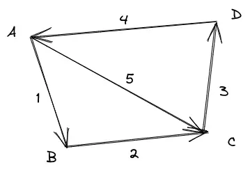
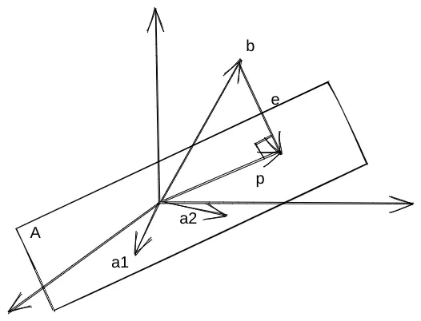
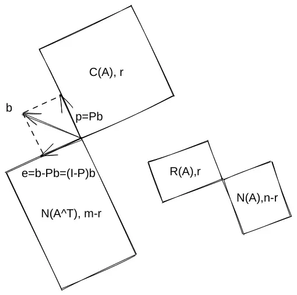
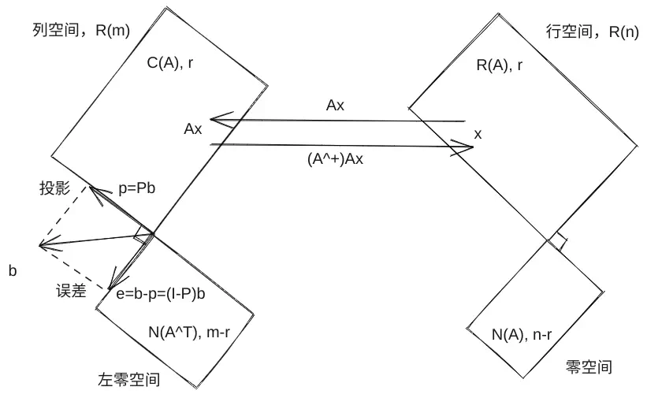

# 线性代数

[MIT线性代数](https://www.bilibili.com/video/BV1at411d79w)课程笔记，向所有想学好线代的同学推荐此课。听GS老爷子课，如饮醇醪。

> 注：文中的“零”、$\textbf{0}$多数是指零向量。

## 矩阵乘法的几种视角

矩阵A(m\*n)和B(n\*p)相乘，得到m\*p的矩阵C。

1.  单个元素

    > 很少用。

    $c_{ij}$的值是A中第$i$行与B中第$j$列点乘的结果，$c_{ij}=\sum_{k=1}^n{a_{ik}b_{kj}}$。

    $$
    \begin{bmatrix}
    \ & \ & \ & \ \\
    a_{i1} & a_{i2} & ... & a_{in} \\
    \ & \ & \ & \ \\
    \end{bmatrix}
    \begin{bmatrix}
    \ & b_{1j} & \ & \ \\
    \ & b_{2j} & \ & \ \\
    \ & ... & \ & \ \\
    \ & b_{nj} & \ \\
    \end{bmatrix}
    =
    \begin{bmatrix}
    \ & \ & \ & \ \\
    \ & c_{ij} & \ & \ \\
    \ & \ & \ & \ \\
    \end{bmatrix}
    $$

2.  **列的线性组合**

    将B看成是$p$个单独的列向量，C中各列是A中各列的线性组合（C中的每一列都由A乘B中对应列向量得到，B列向量即A中各列的组合方式）。

3.  **行的线性组合**

    与2同理，将A看成是$m$个单独的行向量，C中各行是B中各行的线性组合（C中的每一行都由A中对应行向量乘B得到）。

4.  单行乘单列

    与1相背，取A中一列（m\*1），B中一行（1\*p），相乘得到一个(m\*p)的矩阵。C实际上是A中各列与B中各行乘积之和（第一列乘第一行，加上第二列乘第二行……）。

5.  模块化的视角

    将A和B划成小块，乘法和上面的乘法一样。

    $$
    \begin{bmatrix}
    A_1 & A_2  \\
    A_3 & A_4  \\
    \end{bmatrix}
    \begin{bmatrix}
    B_1 & B_2  \\
    B_3 & B_4  \\
    \end{bmatrix}
    =

    \begin{bmatrix}
    A_1 B_1 + A_2 B_3 & A_1 B_2 + A_2 B_4 \\
    A_3 B_1 + A_4 B_3 & A_3 B_2 + A_4 B_4 \\
    \end{bmatrix}
    $$

## 矩阵有逆的几种理解

1.  （撒盐空中差可拟）奇异（不可逆矩阵）的行列式为0；

2.  （未若柳絮因风起）**奇异矩阵各列能够通过线性组合得到0**。即能够找到一个不为0的向量$x$，使得$Ax=0$。

## 高斯-若尔当消元

对于可逆矩阵A，$\begin{bmatrix} E \end{bmatrix}\begin{bmatrix} A & I\end{bmatrix}=\begin{bmatrix} I & ? \end{bmatrix}$，由于$EA=I$（模块化视角），知$EAA^{-1}=A^{-1}，E=A^{-1}$。故?部分就是A的逆：$\begin{bmatrix} E \end{bmatrix}\begin{bmatrix} A & I\end{bmatrix}=\begin{bmatrix} I & A^{-1} \end{bmatrix}$

### 为什么A=LU好于EA=U？

假设对于矩阵$A$，为了得到其主元，左边施加的三个消元矩阵分别是$E_{21}=\begin{bmatrix} 1 & 0 & 0 \\ -2 & 1 & 0 \\ 0 & 0 & 1 \end{bmatrix}$、$E_{31}=I$、$E_{32} = \begin{bmatrix} 1 & 0 & 0 \\ 0 & 1 & 0 \\ 0 & -5 & 1 \end{bmatrix}$，则$E=E_{32}E_{31}E_{21}=\begin{bmatrix} 1 & 0 & 0 \\ -2 & 1 & 0 \\ 10 & -5 & 1 \end{bmatrix}$。而如果求出$L$，有$L=E_{21}^{-1}E_{31}^{-1}E_{32}^{-1}=\begin{bmatrix} 1 & 0 & 0 \\ 2 & 1 & 0 \\ 0 & 5 & 1 \end{bmatrix}$。注意$E$左下角的10，它的出现实际上是$E_{21}$和$E_{32}$效应叠加的结果，在$E_{21}$中对第二行将第一行乘2相减，在$E_{32}$中又对第三行将第二行乘5相减，最终一共在第三行中加上了10倍的第一行，这很丑陋。而$L$中消元乘数都还在里面，或者说为了得到$L$，直接将消元乘数写进去就可以（前提是过程中**不发生行互换**）。在分解出$LU$的过程中，$LU$时刻保存了$A$的所有信息，甚至可以将$A$抛开。

## 转置矩阵

由$AA^{-1}=I$，两边取置换，$(A^{-1})^TA^T=I$，故知$(A^{-1})^T=(A^T)^{-1}$。转置矩阵的逆等于逆的转置。

对于置换矩阵P，有$P^{-1}=P^T$。

## 求解Ax=0

求解矩阵的零空间（nullspace），通过消元使矩阵成为rref格式，即可得到x的解。例：

$$
\begin{bmatrix}
1 & 2 & 3 \\
2 & 4 & 6 \\
2 & 6 & 8 \\
2 & 8 & 10 \\
\end{bmatrix}
\to
\begin{bmatrix}
1 & 2 & 3 \\
0 & 0 & 0 \\
0 & 2 & 2 \\
0 & 4 & 4 \\
\end{bmatrix}
\to
\begin{bmatrix}
1 & 2 & 3 \\
0 & 2 & 2 \\
0 & 0 & 0 \\
0 & 0 & 0 \\
\end{bmatrix}
$$

矩阵有两个主元，一个自由变元。此时可以写出消元后的方程：

$$
\begin{align}
x_1 + 2x_2 + 3x_3 &= 0 \\
2x_2 + 2x_3 &= 0
\end{align}
$$

令自由变元$x_3$为1,解出零空间的基向量$\begin{bmatrix} -1 \\ -1 \\ 1 \end{bmatrix}$，这是一个$\begin{bmatrix} -F \\ I \end{bmatrix}$格式。事实上如果将之前的矩阵进一步化简到rref：

$$
\begin{bmatrix}
1 & 2 & 3 \\
0 & 2 & 2 \\
0 & 0 & 0 \\
0 & 0 & 0 \\
\end{bmatrix}
\to
\begin{bmatrix}
1 & 0 & 1 \\
0 & 1 & 1 \\
0 & 0 & 0 \\
0 & 0 & 0
\end{bmatrix}
$$

该格式$R=\begin{bmatrix} I & F \\ 0 & 0\end{bmatrix}$，求解$Ax=0$相当于求解$Rx=0$，知$x=\begin{bmatrix} -F \\ I \end{bmatrix}$。若$A$有$n$列，式中$F$为$n-r$阶矩阵，$I$为$r$阶矩阵，$r$为$A$的秩（rank），即主元个数。matlab的`null`中正是通过rref化简来求矩阵的零基。

## 求解Ax=b

*   有解：有解意味着b必须在A的列空间中，即A中各列的线性组合能得到b。另一个等价的表述是：如果A中各行的线性组合得到零行，那么b中对应的线性组合结果要为0。

*   求解：知道了如何求解$Ax=0$，再求解$Ax=b$就简单了。因为$Ax=b$可以看成是$A(x_p + x_n)=b$，其中通解$x_n$即$Ax=0$解出的零空间向量，$x_p$称为$A$的特解，可以通过设自由变元为0解出。

    :::info
    特解有无数个，“令自由变元为0”只是因为方便，由$\begin{bmatrix}I&F\end{bmatrix}(x_n+x_p)=b'$，$\begin{bmatrix}I&F\end{bmatrix}x_n=0$，可以令$x_p=\begin{bmatrix} ...\\0\end{bmatrix}$，这里的$0$是$(n-r)×1$向量，从而消去$F$快速得到一个$x_p=b'$，其他的特解无非是这个解加上若干倍的$x_n$。
    :::

*   解的个数：如果矩阵列满秩$\textbf{r=n}$，矩阵又瘦又长，则自由变元的个数为0，此时零空间只有零向量。显然$Ax=Ax_p=b$只有一个解。更多的时候没有解。若行满秩$r=m$，则有$n-r=n-m$个自由变元，此时必定有多解。若$r=m=n$，此时矩阵为方阵且为可逆矩阵（因为可以消元为$R=I$的格式），有且只有一个解。

    | 秩 | $r=m=n$ | $r=n<m$ | $r=m<n$ | $r<m, r<n$ |
    | ---- | ---- | ---- | ---- | ---- |
    | 矩阵形状   | 方阵      | 瘦长 | 宽短| 不确定 |
    | rref格式 | $R=I$   | $R=\begin{bmatrix} I \\ 0 \end{bmatrix}$ | $R=\begin{bmatrix} I & F \end{bmatrix}$ | $R=\begin{bmatrix} I & F \\ 0 & 0 \end{bmatrix}$ |
    | 解的个数   | $1$     | $0$或$1$ | $\infty$ | 0或$\infty$ |

## 矩阵的四个子空间

|              | 属于    | 维度    | 基向量的构造                                                                                         |
| ------------ | ----- | ----- | ---------------------------------------------------------------------------------------------- |
| 列空间$C(A)$    | $R^m$ | $r$   | 主元所在的列                                                                                         |
| 零空间$N(A)$    | $R^m$ | $n-r$ | $x_n$，即$Ax=0$的解                                                                                |
| 行空间$R(A)$    | $R^n$ | $r$   | rref之后剩下的非0行，因为消元过程都是各行的线性组合，得到的结果依然在行空间中                                                      |
| 左零空间$N(A^T)$ | $R^n$ | $m-r$ | 即$A^Tx=0$的解，有$x^TA=0$，联想将A化简到R的过程，由于R下方是零行，矩阵乘法可以看成行的线性组合，则消元矩阵E的最后一行使得A中各行线性组合得到0行，该行即为$x^T$。 |

## 应用示例

考虑如下的有向图：

我们用矩阵$M=\begin{bmatrix} -1 & 1 & 0 & 0 \\ 0 & -1 & 1 & 0 \\ 0 & 0 & -1 & 1 \\ 1 & 0 & 0 & -1 \\ -1 & 0 & 1 & 0 \end{bmatrix}$来表达这个图，其中列代表4个顶点，行代表5条边，-1代表起点，1代表终点。可以得到一些初步结论：

1.  矩阵$M$的1、2、5行是线性相关的，实际上它们恰好构成了ABC这个回路；
2.  矩阵的维度和秩$dim(M)=rank=3$；
3.  矩阵的零空间是一维的，$dim(N(M))=n-r=1$。

考虑$Ax=0$，其中$x=\begin{bmatrix}x1 \\ x2 \\x3 \\ x4 \end{bmatrix}$，有：

$$
\begin{split}
-x_1 + x_2 &= 0 \\
-x_2 + x_3 &= 0 \\
-x_3 + x_4 &= 0 \\
x_1 - x_4 &= 0 \\
-x_1 + x_3 &= 0\\
\end{split}
$$

如果$x_1、x_2、x_3、x_4$代表结点上的电势，$Ax=0$的就是结点之间电势差为0的表述，如果没有电势差，就不会产生电流。$x$的一个解是$\begin{bmatrix} 1 \\ 1 \\ 1 \\ 1 \end{bmatrix}$，整个零空间可以用$c\begin{bmatrix} 1 \\ 1 \\ 1 \\ 1 \end{bmatrix}$表示。

:::info
C是如何与电导产生联系的？为什么这里可以说是欧姆定律的体现？
:::

考虑$A^Ty=0$，有：

$$
\begin{split}
-y_1 + y_4 - y_5 &= 0 \\
y_1 - y_2 &= 0 \\
y_2 - y_3 + y_5 &= 0 \\
y_3 - y_4 &= 0
\end{split}
$$

这个式子表述的是各个结点出入的电流相等，即基尔霍夫定律。$N(A^T)$的一组基是$\begin{bmatrix} 1 \\ 1 \\ 0 \\ 0 \\ -1 \end{bmatrix}$、$\begin{bmatrix} 0 \\ 0 \\ 1 \\ 1 \\ 1 \end{bmatrix}$。前者表达的是ABC这个回路的电流，后者表达的则是ACD这个回路的电流，并且可以很快得到关于ABCD回路的表达$\begin{bmatrix} 1 \\ 1 \\ 1 \\ 1 \\ 0 \end{bmatrix}$，必定与前两个线性相关。

回路就意味着线性相关，现在可进一步解释回路与秩的关系，$dim(N(A^T))=m-r=m-(n-1)$，线性无关的回路的数量=边的数量-顶点的数量+1，即欧拉定理的一种表述。

:::info
为什么是$dim(N(A^T))$？M的转置的零空间即是M各行线性组合为0的向量空间，M中各行代表的是图中的边，维度正是这些边线性相关性的刻画。
:::

整理上述步骤，把电势方程记为$e$，$e=Ax=0$，电导$c$使电势产生电流$y=Ce$，电流又满足一个平衡方程（基尔霍夫定律）$A^Ty=0$。当然这些都是无电源情况下的讨论，如果添加一个外部电源$b$，则电势方程变为$e=Ax=b$。总结一下就是$A^TCAx=b$，应用数学的一个常见框架。

## 正交矩阵和投影

### 正交向量

两个向量正交意味着$x^Ty=0$。对于两个向量$a=\begin{bmatrix} x_1\\ x_2 \end{bmatrix}$，$b=\begin{bmatrix} y_1\\ y_2 \end{bmatrix}$，勾股定理$a^2+b^2=c^2$也可以写成$a^Ta + b^Tb=(a+b)^T(a+b)$，两边化简得到$a^Tb+b^Ta=0$，由$a^Tb=b^Ta$（都是点乘的结果$x_1y_1+x_2y_2$），有$a^Tb=0$。两种表述是等价的，并且可以推广到n维。

### 投影矩阵

很多时候我们的$Ax=b$都是无解的，这种时候只能在$A$上寻找一个最接近的解，方法是通过找到向量$b$在$A$的列空间内的投影$p$，求近似解$A\hat{x}=p$。

下图中，$A$的列空间$\begin{bmatrix} a_1 & a_2 \end{bmatrix}$，欲求解$Ax=b$，而$b$是不在A的列空间（图中平面）内的。于是寻找$b$在列空间内的投影$p$，退而求$A\hat{x}=p$，误差向量$e=p-b$。

由于$e$与$A$的列空间正交，有$A^Te=A^T(p-b)=A^T(A\hat{x} - b)=0$，得$\hat{x}=(A^TA)^{-1}A^Tb$。则$p=A\hat{x}=A(A^TA)^{-1}A^Tb$。如果将其看作对向量$b$施加的一个效应，可总结出投影矩阵$P=A(A^TA)^{-1}A^T$，投影施加的效应与待投影的向量$b$无关，只与$A$有关。$b$在$A$的列空间中的投影$p=Pb$。

$P$有如下性质：

1.  $P^T=P$；
2.  $P^2=P$（一次投影来到列空间内，再次投影保持不动了）；
3.  当$A$是一维向量的时候，$A^TA$退化为一个数，因此$P$可以写成$\frac{AA^T}{A^TA}$；
4.  如果$b$在$A$的列空间中，有$Pb=b$（因为此时$b=Ax$，$Pb=A(A^TA)^{-1}A^TAx=Ax=b$）；如果$b\bot C(A)$，说明$b$在$N(A^T)$中，有$A^Tb=0$，得$Pb=0$。

#### 最小二乘法成立条件

在直线拟合问题中，列出误差$e$的计算式子再求偏导使误差最小化得到的方程正是方程$A^TA\hat{x}=A^Tb$。该方法成立有一个前提，**$\textbf{A}$的各列需要线性无关，因为只有这样$A^TA$才可逆**，方程才有解。$A$各列线性无关意味着$Ax=0$的解只有零向量（但是注意$A$不一定是方阵，未必可逆，尤其在线性拟合的问题中往往是“瘦长”的），左右两边同时乘上$A^T$有$A^TAx=0$，说明$A^TAx=0$也只有零解，而$A^TA$是方阵故可逆。

### 标准正交基

如果矩阵$Q$的每一列都满足$q_i^Tq_j=\begin{cases} 0 &\text{if} i\neq j \\ 1 &\text{if} i=j\end{cases}$，每一列都相互正交，称这样的矩阵为标准正交矩阵。$Q$有如下良好的性质：

1.  $Q^TQ=I$，若$Q$为方阵，$Q^T=Q^{-1}$；
2.  在投影矩阵的问题中，如果$A$是$Q$，那么有$P=A(A^TA)^{-1}A^T=QQ^T$（如果$Q$为方阵，进一步有$P=I$），此时$A^TA\hat{x}=A^Tb$变为$Q^TQ\hat{x}=\hat{x}=Q^Tb$，可以立即得到$\hat{x}$的解。

### 正交化方法与A=QR

（格拉姆-施密特正交化方法）对于线性无关的向量组，可以利用投影矩阵计算出对应的一组正交向量，如果这些向量组作为列向量构成矩阵$A$，则正交化之后的向量组$Q$使得$A=QR$，$R$将是一个上三角矩阵。

## 行列式

### 行列式的若干性质

1.  $det(I)=1$；
2.  如果交换矩阵的行（或列）一次，行列式的值变为其相反数；
3.  $\begin{vmatrix} ta & tb \\ c & d \end{vmatrix}=t\begin{vmatrix} a & b \\ c & d \end{vmatrix}$；$\begin{vmatrix} a+a' & b+b' \\ c & d \end{vmatrix}=\begin{vmatrix} a & b \\ c & d \end{vmatrix} + \begin{vmatrix} a' & b' \\ c & d \end{vmatrix}$。
4.  如果矩阵有相同行（或列），则行列式的值为0。可以利用性质2，交换后得到的相反数为自身推出；
5.  为第$k$行减去第$l$行的若干倍，不改变行列式的值（结合3和4可证）；
6.  若存在零行（列），行列式的值为0；
7.  三角矩阵或对角矩阵$\begin{bmatrix} d_1 & ... \\ 0 & d_2 & ... \\ 0 & 0 & d_3 & ... \\ ... \end{bmatrix}$的行列式等于主元的乘积（对于对角矩阵，可以通过消元变为I，乘数即是主元的积；对于三角矩阵，可以进一步消元得到对角矩阵，这一过程行列式的值不变）。这一性质提供了计算行列式的有效方法，以及$det(2A)=2^ndet(A)$等；
8.  奇异矩阵的行列式为0；
9.  $det(AB)=det(A)det(B)$，同时易知若$A$可逆，有$det(A^{-1})=1/det(A)$；
10. $det(A)=det(A^T)$。依然通过消元的思想证明，如果$A$是奇异矩阵显然成立；如果$A$可逆，$A$可以消元为$LU$的格式，其中$det(L)=1$（因为主元全为1），而$A^T$等于$U^TL^T$，同样的有$det(L^T)=1$，又因为$U$是上三角矩阵，有$det(U)=det(U^T)$，得证。

### 代数余子式和伴随矩阵

以一个$2*2$矩阵$\begin{bmatrix} a & b \\ c & d \end{bmatrix}$为例，其行列式可以根据上述性质3进行分解：

$$
\begin{split}
\begin{vmatrix} a & b \\ c & d \end{vmatrix} &=
\begin{vmatrix} a & 0 \\ c & d \end{vmatrix} + \begin{vmatrix} 0 & b \\ c & d \end{vmatrix} \\
&= \begin{vmatrix} a & 0 \\ c & 0 \end{vmatrix} + \begin{vmatrix} a & 0 \\ 0 & d \end{vmatrix} +
\begin{vmatrix} 0 & b \\ c & 0 \end{vmatrix} + \begin{vmatrix} 0 & b \\ 0 & d \end{vmatrix} \\
&= ad - bc
\end{split}
$$

类似的，3阶矩阵可以分解为6项，4阶矩阵可以分解为24项……其思路是固定第$i$行第$j$列，然后寻找那些不在第$i$行$j$列上的“主元”，对结果起作用的只有这些项。而同在$i$行或$j$列上的元素由于可以被（分解）消元为0不需要考虑，那些有零行和零列的项也不用考虑。对于$n$阶矩阵，显然分解后有$n!$项，并且第$i$行$j$列所对应的项的系数与$i+j$的值相关，奇数为负数，偶数为整数（考虑为行交换的次数）。

如果对矩阵$A$的每一元素，如果将该元素替换为$A$去掉该行该列剩余部分所组成矩阵的行列式（代数余子式），得到的矩阵称为$A$的伴随矩阵$C$。

### 行列式的若干应用

#### 矩阵的逆

$A^{-1}=\frac{1}{det(A)}C^T$，其中$C$是$A$的伴随矩阵。

即证$AC^T=det(A)I$，下面结果对角线元素$a_{ij}C_{ij}=det(A)$很好理解，重点在于理解为什么右边省略号部分为0，实际上会相当于求一个具有相同行（或列）的矩阵的行列式，而且正是上面分解过程中被我们省略的那种。以$\begin{bmatrix} a & b \\ c & d \end{bmatrix}$为例，其伴随矩阵为$\begin{bmatrix} d & -c \\ -b & a \end{bmatrix}$，转置后为$\begin{bmatrix} d & -b \\ -c & a \end{bmatrix}$，则结果第一行第二项为$a_{11}C_{21} + a_{12}C_{22} = a(-b) + ab = 0$。

$$
\begin{bmatrix} a_{11} & ... & a_{1n} \\ ... \\ a_{n1} & .. & a_{nn} \end{bmatrix}
\begin{bmatrix} C_{11} & ... & C_{n1} \\ ... \\ C_{1n} & ... & C_{nn} \end{bmatrix} =
\begin{bmatrix} det(A) & a_{11}C_{21} + a_{12}C_{22}  & ... \\ ... & det(A) & ... \\ ... & ... & det(A) \end{bmatrix}
$$

根据$AC^T=det(A)I$，两边再求行列式，$det(AC^T)=det(det(A)I)$，$det(A)det(C^T)=det(A)^n$，其中$n$是$A$的阶数（也是$C^T$的阶数），于是有$det(C^T)=det(A)^{n-1}$。

#### 面积和体积

行列式的值等于向量所确定的图形的面积或体积。例如$I$或者任何一个标准正交矩阵确定的立方体的体积为1。对于两向量$\overrightarrow{A}$和$\overrightarrow{B}$，先求$\overrightarrow{A}$在$\overrightarrow{B}$方向上的投影$\overrightarrow{E}$，随后$\overrightarrow{A}$减去$\overrightarrow{E}$得到“高”，底乘高可证。

## 特征值与特征向量

矩阵$A$施加于不为零的向量$x$上之后，如果得到的结果还能与$x$平行，可以用$Ax=\lambda x$刻画，这样的$x$称为特征向量，$\lambda$称为特征值。显然如果$A$是奇异矩阵，它可以将一个非零向量变为零向量，$\lambda = 0$是一个特征值，另一个可利用矩阵的迹等方法计算。

若$A$是一个平面，其投影矩阵$P$的特征值和特征向量由于$Px=x$，可以得到一个特征值$\lambda = 1$。对应的另一个特征向量是与$A$垂直的那个，即$N(A)$中的向量，有$Px=0$，此时特征值为0。

系统地求$Ax=\lambda x$，方程中$\lambda$和$x$都是未知数所以没法消元，但是$Ax - \lambda x=(A-\lambda I)x=0$，知$A-\lambda I$应该为奇异矩阵（否则$x$为零向量），可利用$det(A-\lambda I)=0$求解出$\lambda$。

以正交矩阵$Q=\begin{bmatrix} 0 & -1 \\ 1 & 0 \end{bmatrix}$为例，$det(Q-\lambda I)=det(\begin{bmatrix} -\lambda & -1 \\ 1 & \lambda \end{bmatrix})=\lambda^2 + 1=0$，知$\lambda_1 = i，\lambda_2 = -i$。可见特征值也可以为复数。

特征值也可以只有一个，例如$\begin{bmatrix} 1 & 3 \\ 0 & 1 \end{bmatrix}$，其特征值为$1$，特征向量可以是$\begin{bmatrix} 1 \\ 0 \end{bmatrix}$，没有其他线性独立的特征向量了。

总结了一些性质：

1.  由于$(A-\lambda I)^T=A^T-\lambda I$，知转置矩阵与原矩阵有相同的特征值。

2.  若矩阵可逆，等价于说矩阵的特征值均不为0，否则$Ax=0$有非零解，$N(A)$不只有零向量，还有该解对应的特征向量$x$了。

3.  特征值之和等于矩阵的迹，特征值之积等于矩阵的行列式。进一步可知矩阵逆的行列式等于该矩阵特征值之积的倒数。

### 对角化方法

若取$A$的线性独立特征向量$x_1, ..., x_n$构成矩阵$S=\begin{bmatrix} x_1 & ... & x_n\end{bmatrix}$，有$AS=\begin{bmatrix} \lambda_1 x_1 & ... \lambda_n x_n\end{bmatrix}=\begin{bmatrix} x_1 & ... & x_n \end{bmatrix}\begin{bmatrix} \lambda_1 & 0 & 0\\ ... & ... & ... \\ 0 & 0 & \lambda_n\end{bmatrix}$，若将$\begin{bmatrix} \lambda_1 & 0 & 0\\ ... \\ 0 & 0 & \lambda_n\end{bmatrix}$记作$\Lambda$，有$AS=S\Lambda$，或者写成$A=S\Lambda S^{-1}$（对角化），$\Lambda=S^{-1}AS$。

$A^2=S\Lambda S^{-1} S\Lambda S^{-1}=S\Lambda^2S^{-1}$，对比$A^2x=\lambda^2x$，可以发现它们说的是同一个东西。特征值给了我们一种计算矩阵幂的方法。例如若要$A^k$在$k\to\infty$时趋向于$\textbf{0}$，说明$|\lambda_i|<1$。

上述讨论的前提是$A$必须有$n$个不相同的特征值。需要注意的是有重复的特征值并不一定就意味着没有$n$个独立的特征向量，例如单位矩阵$I$。

#### 一阶线性差分方程与矩阵的幂

如果一个差分方程可以用矩阵表达成$u_{k+1}=Au_k$的形式，有$u_k=A^ku_0$。这给了我们利用特征值求解方程的思路，如果能将$u_0$表示成（仅对一阶差分方程）：$u_0=Sc=c_1x_1 + ... + c_nx_n$，那么$u_1=Au_0=c_1\lambda_1x_1 + ... + c_n\lambda_nx_n$，$u_k=A^ku_0=c_1\lambda_1^kx_1 + ... + c_n\lambda_n^kx_n$。以fibnacci数列为例：

$Fib(n+2) = Fib(n+1) + Fib(n)$，这是一个二阶线性差分方程，可以通过一些技巧将其表达成$u_{k+1}=Au_k$的形式，令$u_k=\begin{bmatrix} Fib(n+1)\\Fib(n)\end{bmatrix}$，有$u_{k+1}=\begin{bmatrix} Fib(n+2)\\Fib(n+1)\end{bmatrix}=\begin{bmatrix} 1 & 1\\1 & 0\end{bmatrix}u_k$，这里的$\begin{bmatrix} 1 & 1\\1 & 0\end{bmatrix}$即是我们要找的$A$。

随后解出$A$的特征值为$\lambda_1=\frac{1}{2}(1+\sqrt{5})$，$\lambda_2=\frac{1}{2}(1-\sqrt{5})$，由$A-\lambda I$是奇异矩阵解出其特征向量为$\begin{bmatrix} \lambda_1\\1\end{bmatrix}$和$\begin{bmatrix}\lambda_2\\1\end{bmatrix}$。利用对角化方法结合$u_0$可解出通式中的$c_1$和$c_2$，进一步求出$Fib(100)$的值。

#### 一阶线性微分方程与矩阵指数

对于微分方程，假设能够表达成$\frac{du}{dt}=Au$的格式，也可以用类似的思路进行求解。只是这时的核心思想是常系数线性微分方程的解是指数形式的，$u(t)=c_1e^{\lambda_1t}x_1+...+c_ne^{\lambda_nt}x_n$（根据这个式子，$\frac{du}{dt}=c_1\lambda_1e^{\lambda_1t}x_1 + ...$，而$Au$也等于右边，可知思考的方向是正确的）。

> 这里的$u(t)$和前面的$u_k$可看成对应的东西。

以一组相互影响的$u_1$和$u_2$为例：

$$
\begin{cases}
\frac{du_1}{dt} = -u_1+2u_2\\
\frac{du_2}{dt} = u_1-2u_2
\end{cases}
$$

令$u=\begin{bmatrix} u_1 \\ u_2 \end{bmatrix}$，显然我们需要的$A=\begin{bmatrix} -1 & 2\\ 1 & -2\end{bmatrix}$。可解出$A$的特征值为$\lambda_1=0$和$\lambda_2=-3$，特征向量为$x_1=\begin{bmatrix} 2\\1\end{bmatrix}$和$x_2=\begin{bmatrix} 1\\-1\end{bmatrix}$，则$u(t)=c_1\begin{bmatrix} 2\\1\end{bmatrix} + c_2e^{-3t}\begin{bmatrix} 1 \\ -1\end{bmatrix}$，题设$u_0=\begin{bmatrix} 1\\0\end{bmatrix}$，可知$c_1\begin{bmatrix} 2\\1\end{bmatrix} + c_2\begin{bmatrix} 1\\-1\end{bmatrix}=\begin{bmatrix} 1\\0\end{bmatrix}$。可以解出$c_1$和$c_2$的值。

针对这个问题的$u(t)$，会发现当$t\to\infty$的时候，系统趋向于$c_1x_1$的**稳定状态**。但我们并不总是能够得到稳态，有时会趋向于0，有时会趋向于无穷。

1.  想要$u(t)$收敛，需要式子中所有的$e^{\lambda t}\to 0$，则$\lambda$应该小于0。更进一步，如果$\lambda$是复数，根据欧拉公式，$e^{bit}$部分的模为1，则模$|e^{(a+bi)t}|=|e^{at}|$，需要$\lambda$的实数部分（后面记作$Re.\lambda$）小于0.
2.  如果$\lambda_1=0$，其他的$\lambda < 0$，则可以达到一个不为0的稳态；
3.  其他的情况$u(t)$“blow up”

:::info
后面的习题课上又补充了一个周期性的例子，假设矩阵$A=\begin{bmatrix} 1 & -1\\ 1 & 0\end{bmatrix}$，可求出特征值为$\frac{1\pm i\sqrt3}{2}$。
它们实际上是$e^{\pm i\frac{\pi}{3}}$，在复平面单位圆上旋转6周得到1。可知$\lambda^6=1$，$A^6$有两个特征值都是$1$，$A^6$为$I$。
:::

特别的，对于2\*2的矩阵，想要具有稳定性，要求矩阵的迹小于0（两个特征值相加，结果为负数），同时行列式大于0（两个特征值都为负数，不能一正一负）。

**可以看出，解中各个指数函数是互不相干的。原方程组有两个互相耦合的未知函数，而特征值和特征向量的作用是解耦，又称对角化**。将$u=Sv$带入$\frac{du}{dt}=Au$，有$S\frac{du}{dt}=ASv$，$\frac{du}{dt}=S^{-1}ASv=\Lambda v$。即**以特征向量为基，将$u$表示成$Sv$，得到关于$v$的对角化方程组，新的方程组不存在耦合**。

:::warning
这一段没看懂：

$\frac{dv_1}{dt}=\lambda_1v_1$，惯用的表示法是$v(t)=e^{\Lambda t}v(0)，u(t)=Se^{\Lambda t}S^{-1}u(0)$。这里的$e^{\Lambda t}=\begin{bmatrix} e^{\lambda_1 t} & 0 & 0\\ 0 & e^{\lambda_2t} & ...\\ ... & ... & e^{\lambda_n t}\end{bmatrix}$。
:::

这要求我们允许“矩阵指数”的定义，那么$\frac{du}{dt}=Au$可积，结果有$e^{At}=Se^{\Lambda t}S^{-1}$。

如何理解指数中有矩阵，也就是这里的$e^{At}$和$e^{\Lambda t}$呢？思路是将指数展开为幂级数。

由$e^x=\sum_{0}^{\infty}\frac{x^n}{n!}$有：

$$
e^{At}=I + At + \frac{(At)^2}{2} + ... + \frac{(At)^n}{n!} + ...
$$

:::info
另一个常见级数是几何级数。同样可以有矩阵的形式。由$(1-q)^{-1}=\sum_{0}^{\infty}q^n$有：

$$
(I-At)^{-1} = I + At + (At)^2 + ... + (At)^n + ...
$$

这实际上也是求逆矩阵的好方法，如果$t$很小且$At$的特征值小于0，逆近似等与$I+At$。
:::

由于$A=S\Lambda S^{-1}$，现在可利用$e^{At}$的展开式来理解$e^{At}=Se^{\Lambda t}S^{-1}$：$e^{At} = I + S\Lambda S^{-1}t + \frac{(S\Lambda S^{-1} t)^2}{2} + ...$，注意$I=SS^{-1}$，而$(S\Lambda S^{-1}t)^2=S\Lambda ^2S^{-1}t^2=S(\Lambda t)^2S^{-1}$。

对于二阶微分方程$my''+2ry'+ky=0$，和之前fibnacci的方法类似，令$u=\begin{bmatrix} y'\\ y\end{bmatrix}$，有$u'=\begin{bmatrix} -\frac{2r}{m} & -\frac{k}{m}\\ 1 & 0 \end{bmatrix}u$，求解特征值得到一个关于$\lambda、m、r、k$的方程$m\lambda^2+2r\lambda+k=0$，也就是我们在微积分（微分方程）课上学到的式子。

### 特征值与特征向量的应用举例

#### 一阶RC电路

一阶RC电路的电容满足$\frac{dQ}{dt}=\frac{V_0}{R}-\frac{Q}{RC}$，为了得到一个方程组，我们设$P=\frac{V_0}{R}$，则$\frac{dP}{dt}=0$。令$u(t)=\begin{bmatrix} Q\\P\end{bmatrix}$，所需的$A=\begin{bmatrix} -\frac{1}{RC} & 1\\0 & 0\end{bmatrix}$。

$A-\lambda I=\begin{bmatrix} -\frac{1}{RC}-\lambda & 1\\0 & -\lambda\end{bmatrix}$，可解出$\lambda_1=0, \lambda_2=-\frac{1}{RC}$，对应的$x_1=\begin{bmatrix}1\\\frac{1}{RC}\end{bmatrix}$，$x_2=\begin{bmatrix} 1\\ 0\end{bmatrix}$。

于是$u(t)$的通式为$u(t)=c_1x_1 + c_2e^{-\frac{t}{RC}}x_2$，由$u(0)=c_1x_1 + c_2x_2=\begin{bmatrix} Q_0\\\frac{V_0}{R}\end{bmatrix}$，可解出$c_1=CV_0$，$c_2=Q_0-CV_0$，则$u(t)=CV_0\begin{bmatrix} 1\\\frac{1}{RC}\end{bmatrix}+ (Q_0-CV_0)e^{-\frac{t}{RC}}\begin{bmatrix} 1\\0\end{bmatrix}=\begin{bmatrix} CV_0 + (Q_0-CV_0)e^{-\frac{t}{RC}}\\\frac{V_0}{R} \end{bmatrix}$，其第一行即$Q(t)$，而第二行显然是$P$。当$t\to\infty$时，$Q\to CV_0$，这是电路的一个稳定状态。

:::warning
一些疑惑，一开始我令$u=\begin{bmatrix} P\\Q\end{bmatrix}$，得到$A$的特征值一个为1一个为0，$u(t)$的通式里面会出现$e^t$就不是收敛的了。为什么不能这样设$u$，这样的$u$和上面的$u$有何关联？
:::

#### 逻辑斯蒂方程

对于简单逻辑斯蒂方程$\frac{dN}{dt}=rN-\frac{rN^2}{K}$，虽然是非线性的，却可以通过设$y=\frac{1}{N}$得到一个线性方程，最后可求出稳定状态为承载容量$K$。

#### 马尔可夫矩阵

马尔可夫矩阵是这样的一些矩阵：

1.  矩阵的所有项均大于等于0；
2.  矩阵各列（某些书上是各行）相加为1.

可以推理出马尔可夫矩阵的一些性质：

1.  有一个特征值为1。因为矩阵各列相加为1，而$A-1I$之后该列位于矩阵对角线上的元素为$x_i-1$，而其余项之和为$1-x_i$，该项与其余项之和为0，换句话说$\begin{bmatrix} 1\\1\\...\\1\end{bmatrix}$在其零空间里，$A-1I$为奇异矩阵；
2.  其他的特征值的绝对值均小于1。这使得最后得到的差分方程解的通式中，除了$\lambda_1=1$的那项之外，其他的项在$k$足够大时都趋向于0。

:::info
在一阶线性差分方程问题中，特征值为1使得$\lambda^k=1$得到稳态很重要；而在一阶线性微分方程的问题中，特征值为0使得$e^{\lambda t}=1$得到稳态很重要。
:::

马尔可夫矩阵的性质很容易和概率问题联系到一起。在一个人口迁徙模型中，假如每年有0.1的人口从A地迁徙到B地，有0.2的人口从B地迁徙到A地，则可以用这样一个矩阵刻画：$\begin{bmatrix} 0.9 & 0.2\\ 0.1 & 0.8\end{bmatrix}$，$u_0=\begin{bmatrix} u_{A0}\\ u_{B0}\end{bmatrix}$。

#### 傅里叶级数

##### 带有标准正交基的投影

假设向量$q_1, q_2, ..., q_n$是$n$维向量空间的一组标准正交基，则空间中的任意向量$V$都可以由它们构成：

$$
V=x_1q_1 + x_2q_2 + ... + x_nq_n
$$

这个过程可以理解为**将向量展开到正交基上面去**。为了求出$x_1$，可以通过对每一项于$q_1$求内积，得到$x_1=q_1^TV$（也可以整体应用矩阵的思想，$\begin{bmatrix} q_1 & q_2 & ... & q_n \end{bmatrix}\begin{bmatrix} x_1\\ x_2\\ ...\\ x_n \end{bmatrix}=V$，知$x=Q^{-1}V=Q^TV$）。

从本质上来说，**傅里叶级数是上述问题（离散情形）在连续情形下的拓延。傅里叶级数将向量的分解拓展到了函数空间，使用相互正交的$\sin x$、$\cos x$等作为“正交基”来分解函数**：

$$
f(x)=a_0+a_1\cos x+b_1\sin x + a_2\cos 2x + b_2\sin 2x + ...
$$

如何理解函数的“正交”，也就是点积为0呢？

对于向量来说，$v^Tw=v_1w_1+v_2w_2+...+v_nw_n$，在连续情形中对应的其实就是积分，两个函数的点积其实就是它们乘积的积分：

$$
f^Tg=\int f(x)g(x)dx
$$

对于$\cos x$和$\sin x$来说，由于以$2\pi$为周期，积分区域应取$0$到$2\pi$为上下限，会发现$\sin x\cos x$积出来的结果正是0。

与离散情形的$x_1=q_1^TV$类似，要求这里的$a_1$，对展开式的每一项求与第一项$\cos x$的内积，右边会有很多0，只有$\cos x$的那一项保留了下来：

$$
\int_0^{2\pi}f(x)\cos xdx=\int_0^{2\pi}a_1(\cos x)^2dx
$$

右边积出来为$\pi a_1$，则$a_1=\frac{1}{\pi}\int_0^{2\pi}f(x)\cos x dx$。

## 对称矩阵

对称矩阵：$A=A^T$，有一些良好的性质：

1.  所有的特征值都是实数。由$A=A^T$，$Ax=\lambda x$，$A\overline{x}=\overline{\lambda} \overline{x}$（$Ax=\lambda x$可推出$\overline{A}\overline{x}=\overline{\lambda}\overline{x}$，而$\overline{a+bi}=a-bi$，实矩阵$A=\overline{A}$），有$\overline{x}^TA=\overline{x}^T\overline{\lambda}$，则$\overline{x}^TAx=\overline{x}^T \overline{\lambda}x$， $\overline{x}^TAx=\overline{x}^T\lambda x$，从而$\lambda=\overline{\lambda}$。基于这个推理过程，若$A$是复数矩阵，则$A\ne \overline{A}$，可推出“对称”的条件是$A=\overline{A}^T$。

2.  特征值不同的特征向量之间相互正交，即$A=S\Lambda S^{-1}=Q\Lambda Q^{-1}=Q\Lambda Q^T=\lambda_1q_1q_1^T + \lambda_2q_2q_2^T + ...$，每个对称矩阵都是一些互相垂直的投影矩阵的组合。（主轴定理，特征向量说明主轴的方向，特征值说明主轴的长度。）

3.  主元的符号和特征值的符号一致。这给了我们计算矩阵特征值的良好方式（$A-\lambda I$的方法对高阶矩阵很困难）：首先用消元求出矩阵的主元，这个计算量很小。随后可以将矩阵平移若干个单位，比如7，则矩阵特征值也平移了7，根据新矩阵主元的变化可知原矩阵有多少特征值大于7或小于7。

:::info
习题课上的拓展：什么样的矩阵具有相互正交的特征向量？满足$AA^T=A^TA$的，典型的如对称矩阵、正交矩阵，还有“反对称矩阵”$A^T=-A$等。
:::

### 正定矩阵

正定矩阵是一些要求更严格的对称矩阵：

1.  所有主元大于0；
2.  所有特征值大于0；
3.  行列式大于0，但是这还不够，要求所有顺序子行列式均大于0。这样才有全正的主元和特征值。

#### 如何理解判别式 $x^TAx>0$？

以2\*2矩阵$A=\begin{bmatrix} 2 & 6\\ 6 & 18 \end{bmatrix}$为例，$\begin{bmatrix} x_1 & x_2 \end{bmatrix}A\begin{bmatrix} x_1\\x_2 \end{bmatrix}=2x_1^2 + 12x_1x_2 + 18x_2^2=2(x_1+3x_2)^2$必定大于等于0。如果将$A$右下角的项改一改，则配方后可能多出来正的或负的平方项，从而未必大于等于0。并且只有$A$是正定的才有$f(x_1, x_2)$配方之后大于等于0，图像有最小值。假如将$A$改为$\begin{bmatrix} 2 & 6\\ 6 & 20\end{bmatrix}$，则$f(x_1, x_2)=2x_1^2 + 12x_1x_2 + 20x_2^2=2(x_1+3x_2)^2+2x_2^2$，配方之后出现的数字2（主元）、3（消元乘数）、2（主元）其实都来自消元，配方法就是消元，配出来的平方项里面是消元乘上的因数，外面的系数是主元，这也是为什么正主元才能得到全部正的平方项，从而整个式子大于等于0。

:::info
通过这些性质，正主元、正特征值、正行列式、平方和、图像向上原点是最小值都联系在一起了。
:::

从微积分的角度说，关于$f(x,y)$的图像向上有最小值意味着对$x$和$y$的一阶导数为0，二阶导数大于0，用线性代数的语言就是说这么一个矩阵$\begin{bmatrix} f_{xx} & f_{xy}\\ f_{yx} & f_{yy}\end{bmatrix}$是正定矩阵（注意$f_{xy}=f_{yx}$）。

一些推论：

1.  若$A$是正定矩阵，则$A^{-1}$也是正定矩阵；
2.  若$A$、$B$是正定矩阵，则$A+B$是正定矩阵（利用判别式）；
3.  对于普通的长方形矩阵$A$，$A^TA$是正定矩阵。（依然利用判别式，$x^TA^TAx=|Ax|^2>=0$，为了排除等于0的情况，要求$N(A)$只有零向量，即各列线性无关，即列满秩$rank(A)=n$）。这个式子我们在最小二乘法那里已经见到了，其正是正定矩阵的出处。

## 相似矩阵

矩阵$A$和$B$相似，意味着存在一个可逆矩阵$M$，使得$B=M^{-1}AM$。我们之前学过的对角化就出现了一类相似矩阵。

相似矩阵具有相同的特征值。由$Ax=\lambda x$，有$M^{-1}AMM^{-1}x=BM^{-1}x=\lambda M^{-1}x$，可知$B$的特征值与$A$相同，$B$的特征向量为$M^{-1}x$。

比较值得注意的是特征值重复的情况，$A=\begin{bmatrix} 4 & 0\\ 0 & 4\end{bmatrix}$只和它自己相似，因为$M^{-1}AM=A$，而$\begin{bmatrix} 4 & 1\\ 0 & 4\end{bmatrix}$这类矩阵虽然也有两个重复的特征值4，但它们有很多个且互相相似。

## 奇异值分解（SVD）

SVD的思想在于将行空间的一组（标准）正交基$v_i$转换到列空间的一组（标准）正交基，从而有$Av_i=\sigma_i u_i$，可以看出这个式子和特征值式子非常相像。用矩阵形式表达：$A\begin{bmatrix} v_1 & v_2 & ... & v_r \end{bmatrix}=\begin{bmatrix} u_1 & u_2 & ... & u_r \end{bmatrix}\begin{bmatrix} \sigma_1 & 0 & ...\\ 0 & \sigma_2 & ...\\ ... \\ 0 & ... & \sigma_r\end{bmatrix}$，可记作$AV=U\Sigma$，或者$A=U\Sigma V^{-1}=U\Sigma V^T$。

重点是$V$和$U$的求取，由于$A^TA$的良好性质，我们有$A^TA=V\Sigma^TU^TU\Sigma V^T=V\begin{bmatrix} \sigma_1^2 & 0 & ...\\ 0 & \sigma_2^2 & ...\\ ... \\ 0 & ... & \sigma_r^2\end{bmatrix}V^T$，这正是对角化$Q\Lambda Q^{-1}$，从而求出$A^TA$的特征值和特征向量即可求出$V$，特征向量就是$v_i$，特征值就是$\sigma_i^2$。同理可以利用$AA^T$得到$U$。

## 伪逆

我们已经学过很多矩阵尤其是长方形矩阵是没有逆的，但在投影矩阵、特征值相关内容的学习中注意到了一些事实：对于列满秩m\*n矩阵$A$，$A^TA$为n\*n方阵，而$(A^TA)^{-1}A^TA=I$；行满秩矩阵同理，只不过等式变成了$AA^T(AA^T)^{-1}=I$。因此可以拓展矩阵“逆”的概念，得到左逆$A^{-1}_{left}=(A^TA)^{-1}A^T$和右逆$A^{-1}_{right}=A^T(AA^T)^{-1}$的定义。

:::info
如果将$A^{-1}_{left}$写在$A$的右边，正是（列空间）投影矩阵；而如果将$A^{-1}_{right}$写到$A$的左边，则得到（行空间）投影矩阵。
:::

### 行空间到列空间的映射

我们可以理解正是“零空间”破坏了矩阵的逆，因为如果一个矩阵施加到一个向量上为零，那么没有逆可以还原回去了。对于任意一个向量$x$，用$A$乘它$Ax$得到的是$A$中列向量的线性组合，因此$Ax$总是属于$C(A)$，而如果这个$x$属于行空间，那么$Ax$就可以被看成是从行空间往列空间的一次映射，假设有矩阵的逆能够映射回$x$，$A^+Ax=x$，则把$A^+$称为$A$的**伪逆**，这里不再局限于方阵了。SVD是求伪逆的好方法，它不限于可逆矩阵或列满秩矩阵（最小二乘法）。

行空间和列空间的向量是一一对应的。如果$x、y$属于$R(A)$且$x\ne y$，那么$Ax\ne Ay$。可以用反证法，如果$Ax=Ay$，有$A(x-y)=0$，说明$x-y$在零空间，而$x-y$又属于行空间，则$x-y$只能是零向量，则$x=y$，与已知$x\ne y$不符。

最后是一幅“Big Picture”：

