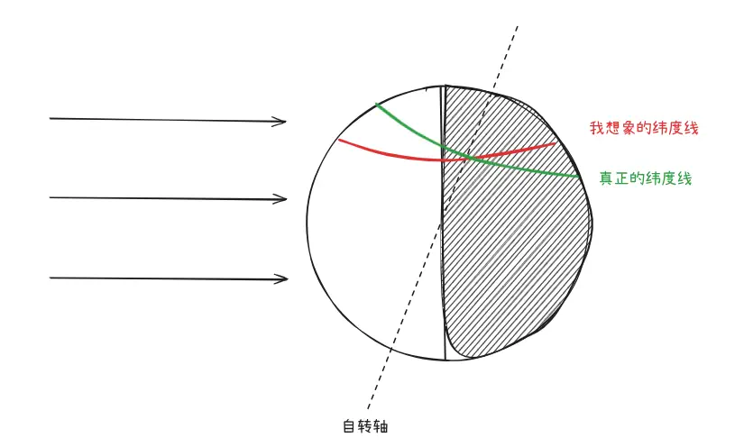

# 日地模型

说来惭愧，前段时间去大西北旅游了一趟，也算是见识到了什么叫做晚上9点天还是亮的，结果回来之后有一天，忽然对“为什么昼夜长短有变化”产生了疑问：既然地球近似球体，那球面上一个点无论当地球处在近日点，还是远日点，它虽自转划过的圆弧，其中受到光照的长度不是一样的吗？

需要说明的是，产生这个疑问时我明确知道地球自转轴和公转平面不是正交的，有一个倾角（黄赤交角），但或许是年纪大了，空间想象能力下滑，我在思考时总是下意识把纬度线想象成平行于太阳光直射方向的了，而且这个弯弯始终绕不过去，哪怕查资料看到示意图还一度想不通，只能是人心中的成见是一座大山……下图可以说明我的谬误：

真正的纬度线无疑应该正交于自转轴，因此可以明显看出北半球某一点处在阴影中的自转弧长将随着太阳所在位置变化，图中昼长小于夜长，假如因公转太阳变换到右侧，则会变成昼长大于夜长。极端情况是两级，分别处于极昼或极夜中。

另外值得一提的是，查资料的过程中还纠正了我长期以来的另一个谬误：（以北半球我们这纬度为例）公转会带来四季变化，但并不是近日点夏天最热，远日点冬天最冷。实际上，远/近日点日地距离的差异，相比起平均日地距离实在太小，因此带来的温度变化可能只有几摄氏度。四季变化更多的与昼长夜长变化、以及间接引起的各种气候活动有关。

下为一个用于演示 **昼夜交替** 与 **昼夜长短变化 / 四季成因** 的交互式日地模型。由 GLM-5.2 实现，基于 three.js。

<SunEarth />

## 操作说明

- **拖拽地球**（左右滑动）：手动改变地球在椭圆轨道上的位置，模拟**公转**。
- **拖拽太阳**：上下左右平移整个太阳系（视角平移）。
- **拖拽空白处**：旋转 3D 视角；**滚轮**：缩放。
- **暂停 / 播放**：暂停或继续全部动画（公转 + 自转）。
- **自转 开 / 关**：单独关闭自转，便于观察轨道与直射点。
- **重置**：回到近日点位置。
- 面板实时显示**太阳直射点**的当前纬度与对应节气。

## 核心概念（统一语言）

| 术语 | 含义 |
|------|------|
| 公转 | 地球绕太阳沿椭圆轨道运行，一圈为一年 |
| 自转 | 地球绕自身地轴旋转，一圈为一天，产生**昼夜交替** |
| 黄赤交角 | 地轴与公转面法线的夹角 ≈ 23.5°，方向在空间中恒定 |
| 近日点 / 远日点 | 椭圆轨道离太阳最近 / 最远的点 |
| 赤道 / 南北回归线 | 0°、±23.5° 纬线，太阳直射点活动的最北 / 最南界 |
| 太阳直射点 | 某时刻阳光垂直照射的地表点，一年内在南北回归线之间往返移动 |

### 为什么会有昼夜长短变化？

- **昼夜交替** = 自转 + 太阳单侧光照（地球材质接收点光源，背光面自然变暗为夜）。
- **昼夜长短变化 / 四季** = **黄赤交角 + 公转** 的几何结果。地轴恒定倾斜 23.5°，地球公转到不同位置时，太阳直射点纬度在 ±23.5° 之间移动，于是不同纬度的昼弧 / 夜弧比例发生变化（如北半球夏半年昼长夜短）。

> ⚠️ 常见误区：四季与昼夜长短变化**与日地距离无关**。事实上地球在 **1 月初** 经过近日点，恰是北半球的冬季。决定四季的是**地轴倾斜**，不是远近。本模型中近日点与远日点仅用于展示椭圆轨道形态。

## 实现要点

组件位于 `.vitepress/components/SunEarth/`：

| 文件 | 职责 |
|------|------|
| `scene.ts` | three.js 场景核心类，管理 3D 渲染、轨道几何、光照、交互与动画 |
| `index.vue` | Vue 组件，挂载画布并提供 UI 控件（暂停 / 自转 / 重置 / 直射点读数） |

关键实现：

- **椭圆轨道**：太阳置于椭圆**焦点**（原点），用偏近点角均匀采样绘制平滑椭圆；离心率视觉夸大到 `0.3`（真实约 `0.017`，肉眼难辨近日 / 远日点）。
- **公转运动**：以平近点角随时间线性推进，通过求解**开普勒方程**（牛顿迭代）得到偏近点角与真近点角，地球因此在近日点附近跑得更快——符合**开普勒第二定律**。
- **地轴恒定倾斜**：地轴方向固定为世界空间常量（`SEASON_AZIMUTH` 方位角上倾斜 23.5°），不随公转转向太阳，这是昼夜长短变化能被正确呈现的前提。
- **太阳直射点**：每帧由「地心 → 太阳」方向投影到地表得到，其纬度 = `asin(轴方向 · 太阳方向)`，年内往返于 ±23.5°。
- **节气标记**：在轨道上标注春分 / 夏至 / 秋分 / 冬至，对应直射点位于赤道 / 北回归线 / 赤道 / 南回归线的四个位置。
- **交互**：拖拽地球时通过射线检测命中地球并临时关闭 `OrbitControls`，从而区分「拖拽公转」与「拖拽旋转视角」。
