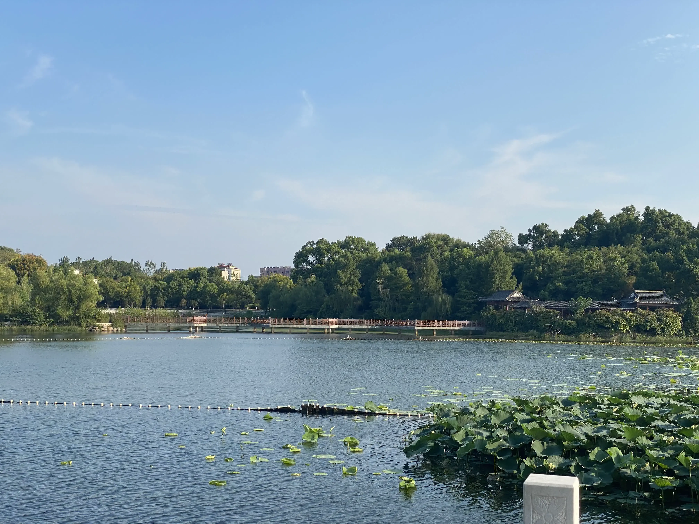
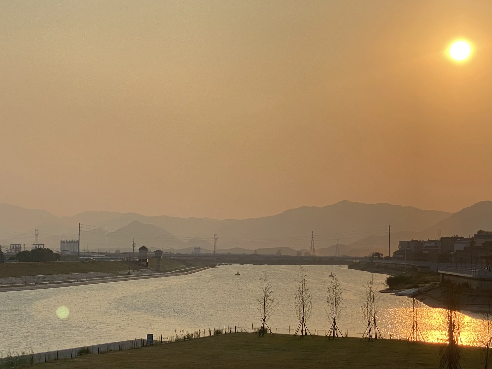

## 故乡

1.  一个颓败的角落

    

2.  烧火：一个很有记忆感的词汇

    

3. 兜兜转转，有时惊觉还是故乡的小镇好。人生偶需“猛回头”，只是注意不要闪了脖子。

    
    

4. 这群山苍茫的背影，承载了儿时诸多的梦想与野望。倘若年轻十岁，我或许可以用更加细腻伤感的口吻描述此刻的心境，只是如今已习惯了在种种论述性的文山书海里扑腾，因此，不写也罢。

    
