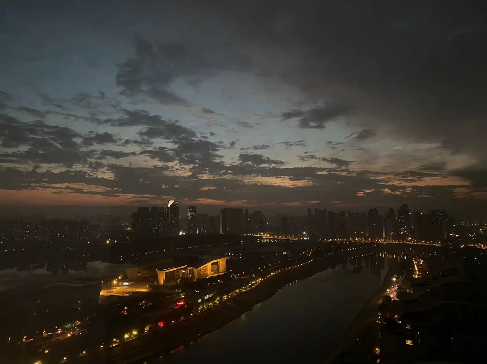

# 武汉

1.  后襄河公园

     

2.  新时代

     

3.  后官湖，因为遥远而觉得美

     
     
     

4.  无题

     

5. 前同事拍的，应该是晴川阁那里，盗了

     

## 武汉的桥

说来也怪，武汉的长江大桥几乎全部走过，拍下的照片筛了一张又一张，反而是汉江的照片留下来不少。

1.  汉江：江汉桥

    

2.  汉江：晴川桥

    

3.  二七长江大桥

     
